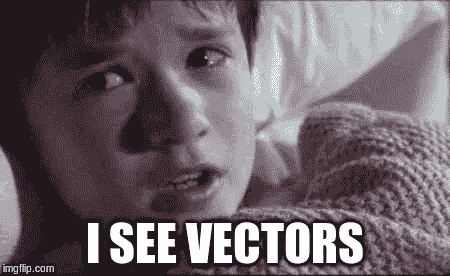
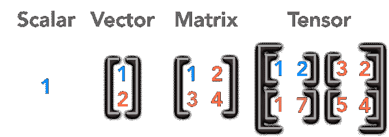

# 数据科学的线性代数基础

> 原文：<https://medium.com/nerd-for-tech/linear-algebra-fundamentals-for-data-science-28f2f1789044?source=collection_archive---------10----------------------->

## 线性代数入门…


来源:[梦想时间](https://www.dreamstime.com/linear-algebra-complex-like-puzzle-pictured-as-word-linear-algebra-puzzle-pieces-to-show-linear-algebra-can-be-image164220956)

本文的目标是为希望理解足够的线性代数以便熟悉某些数据科学概念的初学者提供内容。你可能会迷失在详细的数学和推导中，学习它们也没什么帮助！我自己经历了那段旅程，因此决定写这篇综合指南。所以热身，我们走吧！

来源:[吉菲](https://media.giphy.com/media/cPfjwUZtwArxyHVqjz/giphy.gif)

## 文章结构:

1.为什么要学线性代数？

2.标量、向量、矩阵和张量

3.线性代数中的一些术语

4.特征值和特征向量

# 1.为什么要学线性代数？

当您可以简单地用 Python 导入一个包并构建您的模型时，为什么要花时间学习线性代数呢？这是一个公平的问题。因此，如果你正在学习数据科学和机器学习，我想提出一个场景来展示为什么学习线性代数是重要的。

想想这个场景:


资料来源:g [信托基金](https://www.gettyimages.com/detail/photo/golden-retriever-puppy-portrait-royalty-free-image/512366437?utm_medium=organic&utm_source=google&utm_campaign=iptcurl)

当你看上面的图片时，你看到了什么？你很可能说是一只狗——不太难。但是，如果我让你编写这样的逻辑，让计算机为你做同样的事情，这将是一个非常困难的任务(至少可以这么说)。现在，计算机是如何存储这张图片的呢？你可能知道，今天的计算机只能处理 0 和 1。那么，像上面这样具有颜色等多种属性的图像是如何存储在计算机中的呢？这是通过将像素亮度存储在一个名为**矩阵的结构中实现的。**

整体数据(图像)可视为矩阵。所以你想在这个图像上执行的任何操作，都可能在后端使用矩阵，这是线性代数的一部分。

此外，随着对线性代数的理解，你也将能够从头开始编写算法，并对它们做出你自己的变化。现在，这应该是足够的动力去浏览下面的材料，让你开始学习线性代数。

# **2。标量、向量、矩阵和张量**

线性代数的研究涉及几种类型的数学对象:

**标量:**标量只是一个单一的数字，我们从代数中知道的所有数字在线性代数中都称为标量。例如，数字[12]是一个标量。

这在 python 中是什么样子，我们将使用 NumPy 功能，因为它们针对这样的操作进行了优化:

```
#declare a scalar as an int
s = 3
print(s)#or as an array
import numpy as np
s_array = np.array(3)
print(s_array)
```



来源: [imgflip](http://imgflip.com)

**向量:**向量是一个数字数组。向量在科学中被用来描述任何既有大小又有方向的事物。它们通常被画成箭头，长度代表矢量的大小。


来源:[鸭子](https://www.ducksters.com/science/physics/scalars_and_vectors.php)

如果你只有大小，没有方向，那么你说的就是*标量*。一旦给标量一个方向，它就变成了矢量。

有两种类型的向量**行向量**如【2，3，4】和**列向量**如下图所示。通常，我们感兴趣的是一个向量包含的元素的数量。我们称这个数字为向量的长度。我们刚刚作为例子使用的行向量的长度为 3。同样，图像中的列向量的长度为？…你猜对了，2。



来源:[数据科学中心](https://www.datasciencecentral.com/profiles/blogs/boost-your-data-science-skills-learn-linear-algebra)

python 中的实现:

```
#create a vector
v = np.array([3,-5,6,1])
print(v)
```

**矩阵:**矩阵是按行和列排序的数字的集合。就像上图中的这个。这个矩阵包含数字 1，2，3，4。每个值都是矩阵的一个**元素**。所以我们的矩阵总共有 4 个元素。通常，行用“I”表示，列用“j”表示。这些元素由第 **i** 行和第 **j** 列索引。

作为一名数据科学家，你一直在使用矩阵，但你可能还不知道(只是还不知道)。你过去使用过的任何数据集都可以被认为是一个矩阵——一个数字的矩形阵列— **行和列**更确切地说。

python 中的实现:

```
#Create a matrix
m = np.array([[2,3,1], [5,6,3]])
print(m)#or
M = np.arange(6).reshape(2,3)
print(M)
```

**张量:**张量只是我们目前所见概念的概括。张量可以被认为是矩阵的集合，很容易理解为多维数组。

这是 python 中的样子:

```
#create a tensor
m1 = np.array([[2,3,1], [5,6,3]])m2 = np.array([[3,-1,5], [9,2,4]])#tensor: m1+m2t = np.array([m1,m2])
print(t)
print(t.shape)
```

这个张量的形状是 a (2，2，3)。这意味着张量包含 2 个矩阵，每个矩阵 2×3。现在让我们手动创建一个张量:

```
T = np.array([[[1,2,3], [4,5,6], [7,8,9]], [[11,12,13], [14,15,16], [17,18,19]]])print(T)
print(T.shape)
```

上面的例子将 2x3x3 张量定义为 NumPy ndarray。这意味着张量包含两个矩阵，每个 3x3。现在我们已经看到张量是矩阵的推广，用 n 维数组表示。张量甚至出现在谷歌旗舰机器学习库的名称中:“ *TensorFlow* ”。

# 3.线性代数中的一些术语

*   **矩阵的顺序** —如果矩阵有 2 行 3 列，矩阵的顺序是 2×3，即行×列。
*   **矩阵的秩** —矩阵的秩等于矩阵中线性无关的行向量的最大数量。如果我们能把一组向量中的至少一个向量表示为该组中其余向量的线性组合，则该组向量是线性相关的。
*   **跨度** —向量集的跨度是原始向量的线性组合所能得到的所有点的集合。
*   **列空间—** 列空间是 span 的矩阵版本。列空间是通过对给定矩阵进行线性组合可以创建的所有可能的向量。
*   **单位向量—** 单位向量的长度(大小)为 1。它也被称为*方向向量。*根据上下文，你很可能不想/不需要幅度信息——只需要方向本身。
*   **转置** —矩阵转置简单地说就是交换行和列的索引。
*   **对称矩阵—** 对称矩阵是任何等于其自身转置的矩阵。对于对称矩阵，对角线一边的东西也在对角线的另一边。

# 特征值和特征向量

*Eigen* 在德语中有一些不同的意思。最简单的意思是特征。所以当我们谈论矩阵的特征值和特征向量时，我们谈论的是找到矩阵的特征。

## 它们有什么用处？

还记得本文开头的萌狗图吗？当你看着图片识别出它是一只狗的时候，你用来叫出它是一只狗的一些关键信息(**主成分**)是什么？不就是身体，脸，腿等信息吗？这些主分量可以被看作是特征向量，其中每一个都有自己的元素。

特征向量和特征值是主成分分析算法的主干，该算法用于在训练机器学习模型时降低维度。

# 结论

这就是数据科学线性代数的一些基本要素，如果你已经做到了这一步，给自己一个鼓励。

资料来源:[吉菲](https://media.giphy.com/media/kBZBlLVlfECvOQAVno/giphy.gif)

# 参考

[1][https://www . deep learning book . org/contents/linear _ algebra . html](https://www.deeplearningbook.org/contents/linear_algebra.html)

[2][https://OCW . MIT . edu/resources/RES-18-010-a-2020-vision-of-linear-algebra-spring-2020/videos/index . htm](https://ocw.mit.edu/resources/res-18-010-a-2020-vision-of-linear-algebra-spring-2020/videos/index.htm)