# 使用 NumPy 和 SciPy 的线性代数

> 原文：<https://medium.com/nerd-for-tech/linear-algebra-using-numpy-and-scipy-390be43d1cb0?source=collection_archive---------14----------------------->

# NumPy

```
import numpy as np
```

# 两个向量的点积

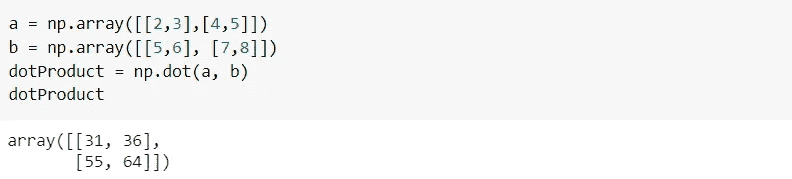

点积也可以用“@”来计算

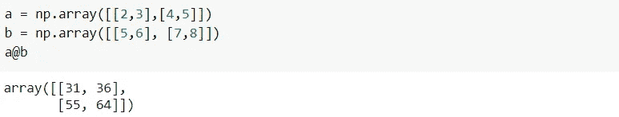

# 交叉乘积

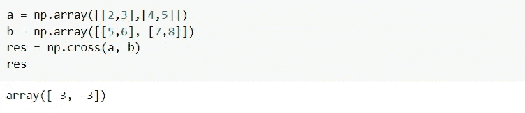

# 纯量乘法

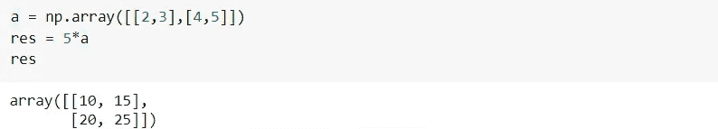

# 矩阵乘法

numpy.matmul()函数用于返回两个矩阵的乘积。如果两个矩阵的形状没有对齐进行乘法运算，就会产生错误。

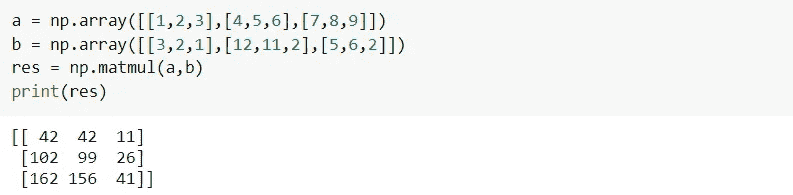

# 决定因素

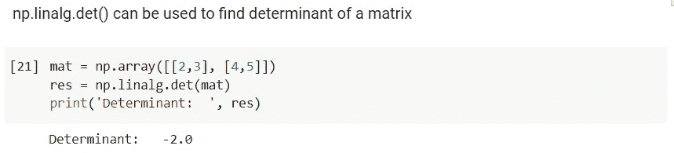

# 解线性方程

x + 6y + 15z = 11

3x + 9y + 5z = 9

x + 4y + 7z = 6

可以使用 numpy.linalg.solve()求解上述线性方程的 x、y 和 z 值

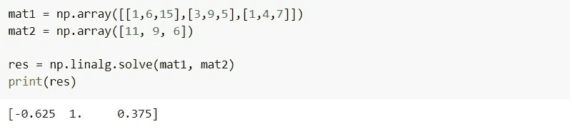

# 矩阵的逆

此函数用于计算矩阵的乘法逆运算

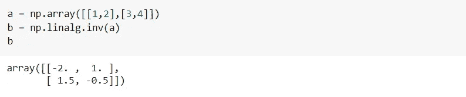

# 添加

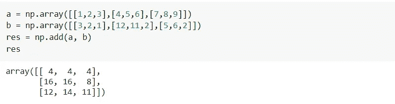

# 减法

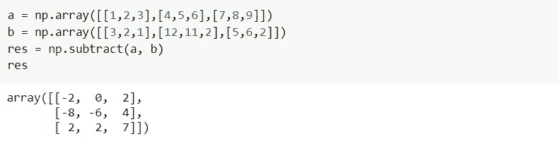

# 增加

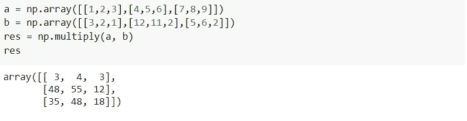

# 标量除法

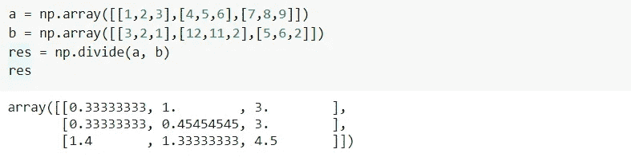

# 矩阵的转置

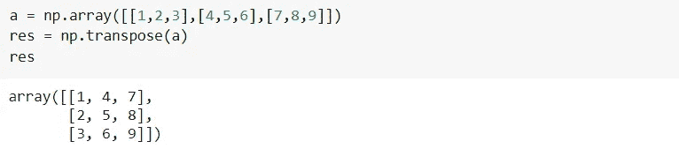

# 使用 SciPy 的线性代数

scipy.linalg 模块包含了线性代数的所有函数。它包含了 numpy.linalg 中的所有功能，但也有一些 numpy.linalg 中没有的高级功能

```
from scipy import linalg
```

# 解线性方程

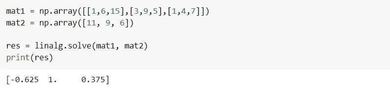

# 寻找行列式

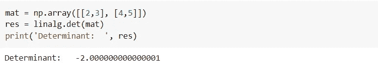

# 使用 linalg.inv()求矩阵的逆矩阵

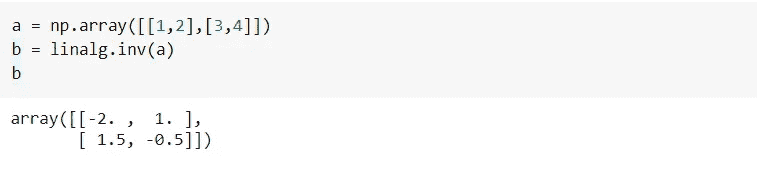

# 特征值和特征向量

我们可以使用 linalg.eig()函数找到特征值和特征向量。

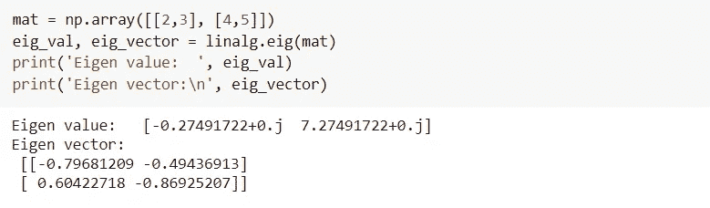

想了解更多线性代数的函数，可以参考 [numpy](https://numpy.org/) 和 [scipy](https://www.scipy.org/) 的官方文档。

快乐学习！