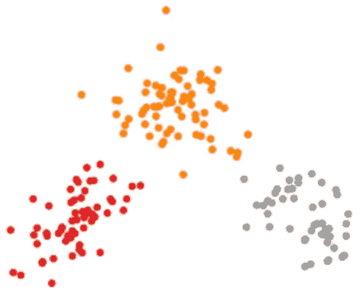
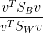
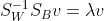
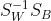
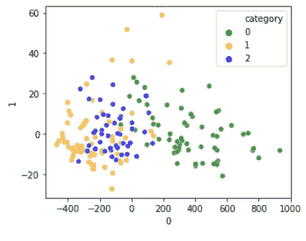
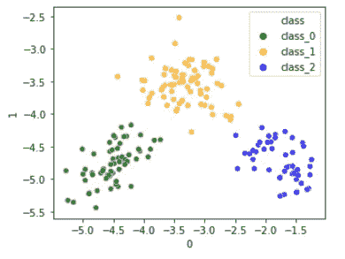

# 线性判别分析

> 原文：<https://medium.com/nerd-for-tech/linear-discriminant-analysis-c24d9729d3d2?source=collection_archive---------7----------------------->

## 减少维度并增加类别分离

# 介绍

线性判别分析(LDA)是一种相当简单的方法，用于寻找特征的线性组合，这些特征区别性地表征相同类别中的成员，同时分离不同类别([来源](https://en.wikipedia.org/wiki/Linear_discriminant_analysis))。本教程简要介绍了使用 LDA 的动机，展示了如何计算 LDA 的步骤，并用 python 实现了计算。此处提供了示例。

# 皱胃向左移

简而言之，LDA 试图同时实现两件事:

*   尽可能将同一类别的样本分组(减少类别内差异)
*   尽可能将不同类别的样本分开(增加类别间方差)

该属性非常有用，因为它能够对数据进行聚类、对样本进行分类和/或降低样本的维数。另一种流行的降维算法主成分分析(PCA)只关心解释整个数据的尽可能多的方差，而不考虑任何关于类成员和类之间/类内方差的信息。

[来源](https://sebastianraschka.com/Articles/2014_python_lda.html)

从上图可以看出，PCA 是以较低维度表示整个数据的一个很好的选择(例如，为了节省内存，找到大多数方差描述特征)，另一方面，LDA 是有用的聚类/分类。

## 参数学习

LDA 模型由一个矩阵`v`组成，该矩阵将数据投影到具有最大类间分离和最小类内分离的低维空间中。为了计算`v`，我们需要([来源](https://sebastianraschka.com/Articles/2014_python_lda.html)):

*   **计算类内和类间** [**散布矩阵**](https://en.wikipedia.org/wiki/Scatter_matrix) 。示例实现使用`pandas DataFrame`。类内散布矩阵捕获关于每个类内数据散布的信息。

类间散布矩阵旨在收集类之间如何散布的信息。它有类似于类内散布矩阵的 python 实现。

*   **计算散布矩阵的特征向量和特征值。**由于我们有关于类之间和类内部数据分布的信息，我们可以用它来找到一个矩阵`v`，使类之间分布最大化，类内分布最小化。我们需要最大化以下标准([来源](https://arxiv.org/pdf/1903.11240.pdf)):

为了找到这样的`v`,我们可以以下面的形式解决广义特征值问题([源](https://www.sjsu.edu/faculty/guangliang.chen/Math253S20/lec11lda.pdf)和[源](https://www.csd.uwo.ca/~oveksler/Courses/CS434a_541a/Lecture8.pdf)用于更详细的推导):

其中:

*   v 包含特征向量
*   λ包含特征值

因此，寻找这些值简化为寻找以下矩阵的特征向量和特征值([源](https://www.csd.uwo.ca/~oveksler/Courses/CS434a_541a/Lecture8.pdf)):

通过寻找特征向量，我们将找到新的子空间的轴，在那里我们的生活变得更简单:类更加分离，类内的数据具有更低的方差。

python 中的计算非常简单:

*   **对特征值排序，选择前 n 个**。我们将只保留信息最丰富的轴(可以作为模型的参数给出)。特征值对于寻找最具信息性的轴很方便:

注意，特征值的数量取决于类别的数量和特征的数量。最多 n 可以是 min(n_classes -1，n_features) ( [来源](https://scikit-learn.org/stable/modules/generated/sklearn.discriminant_analysis.LinearDiscriminantAnalysis.html))。

*   **创建一个包含映射到 n 个特征值的特征向量的新矩阵** `**v**` **。**这样我们就可以创建一个矩阵来改变数据的基础。
*   **取数据与** `**v**` **矩阵的点积，得到新的特征。**这种方式将数据转换到空间中，使得类内和类间的分离具有所需的属性。

执行 LDA 的简单实现:

更详细的教程可以在这里找到[。一旦我们训练了矩阵`v`，我们就可以用它将测试数据转换到更低维度的空间。](https://github.com/RRisto/learning/blob/master/linear_algebra_learn/linear_discriminant_analysis/linear%20discriminant%20analysis.ipynb)

# 例子

为了展示 LDA 的有用性，让我们使用 wine [数据集](https://archive.ics.uci.edu/ml/datasets/wine)。完整的例子可见[这里](https://github.com/RRisto/learning/blob/master/linear_algebra_learn/linear_discriminant_analysis/linear%20discriminant%20analysis.ipynb)。

在读取数据后，我使用主成分分析(PCA)来绘制使用 2 个成分的数据。

二维葡萄酒数据主成分分析

从图中我们可以看出，PCA 关心的是总方差。成分 0 比成分 1 解释了更多的差异。它不考虑类成员的信息，甚至不考虑类的数量。它适用于表示大部分数据差异。对于 LDA，我们有一个不同的画面。

二维葡萄酒数据 LDA

LDA 使用关于类的信息，并做它应该做的事情:减少类内部的差异，增加类之间的距离。现在很容易将不同类的例子分成不同的组。这对于从整体上表示数据差异可能不是很有用。

我们可以从分类中看出 LDA 的有用性。如果我们使用用于训练-测试分割的多个种子来训练具有和不具有 LDA 的模型，我们可以评估 LDA 平均来说是否增加了准确性。为了比较，我将在一个例子中使用 PCA 来转换特征。完整示例可在[这里](https://github.com/RRisto/learning/blob/master/linear_algebra_learn/linear_discriminant_analysis/linear%20discriminant%20analysis.ipynb)找到。

f1-无 LDA 时的平均得分为 0.978，有 LDA 时为 0.985。这不是一个巨大的增长，但平均来说仍然提高了分类的准确性。使用 PCA，我们的 F1 分数非常低，只有 0.660。

# 结论

LDA 有助于通过增加不同类别之间的分离来降低数据维度。算法背后的计算并不复杂。尽管如此，它仍然是数据科学中使用的有用方法，并且可以用于例如分类管道中。

# 参考

*   特征值和广义特征值问题:教程， [ArXiv](https://arxiv.org/pdf/1903.11240.pdf)
*   [线性判别分析，维基百科](https://en.wikipedia.org/wiki/Linear_discriminant_analysis)
*   线性判别分析–一点一点， [sebastianraschka](https://sebastianraschka.com/)
*   线性判别分析[圣何塞州立大学](https://www.sjsu.edu/faculty/guangliang.chen/Math253S20/lec11lda.pdf)
*   模式识别-第八讲，[奥尔加·维克斯列尔教授](https://www.csd.uwo.ca/~oveksler/Courses/CS434a_541a/Lecture8.pdf)
*   散布矩阵，[维基百科](https://en.wikipedia.org/wiki/Scatter_matrix)
*   sklearn.discriminant _ analysis。线性判别分析，[skict-learn](https://scikit-learn.org/stable/modules/generated/sklearn.discriminant_analysis.LinearDiscriminantAnalysis.html)
*   葡萄酒数据集， [UCI 机器学习知识库](https://archive.ics.uci.edu/ml/datasets/wine)