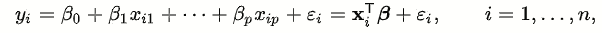
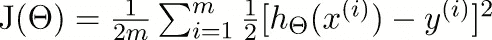

# 线性回归并不是什么奇怪的假设

> 原文：<https://medium.com/nerd-for-tech/linear-regression-and-its-not-so-weird-assumptions-9ae419b7ccf6?source=collection_archive---------20----------------------->

# **什么是线性回归？**

不想让背景看起来全是白色:P

它是一种统计模型，试图找到输入变量和给定输出变量之间的线性关系，如果这种关系存在的话。

# **线性回归的类型**

大体上我们可以说有两类，简单和多元线性回归。

简单线性回归涉及使用单个输入变量来预测输出变量。例如:-给定身高预测体重(但这可能不是完美的方法)

多元线性回归涉及使用多个输入变量来预测输出变量。例如:- [预测贷款违约](https://www.kaggle.com/kmldas/loan-default-prediction)，[预测房价](https://www.kaggle.com/c/house-prices-advanced-regression-techniques)

# **型号**

线性回归的一般方程包括

线性回归方程

其中 I 表示数据点的实例，1，…，p 表示我们用来预测 y 的 p 个不同的值。

当我们使用基本矩阵标量乘法的矩阵表示时，我们可以把它写成 x ^ T *B

# **解决方案**

现在我们已经有了模型，我们需要找出 betas(权重)的值。

我们用于线性回归的成本函数通常是 SSE(误差平方和)。其他选择是 RMSE，湄(成本函数的使用主要取决于我们的目标是什么)。

我们知道，我们最终想要的是能够降低成本函数的 betas 值。

> 最小化就是求梯度，等于 0

成本函数

如前所述，我们可以将它表示为线性方程和矩阵乘积的形式，因此，我们可以根据我们决定如何描述模型，以多种方式求解它。

1.  **法线方程**

当我们在模型的矩阵形式中求导并使其等于零时，我们最终得到β为(x^T*x)^-1(x^T*y).

我知道这看起来有点模糊，不要担心，我会在最后给你一些好的资源。

2.**梯度下降**

梯度下降的基本思想包括在每一步中寻找梯度，并向与之相反的方向移动，以便找到最小值点。

梯度下降有不同的变体，如随机梯度下降和批量梯度下降。

# **指标**

我们如何知道我们的模型表现得有多好？

我们可以使用原始 RMSE 值本身，但问题是它是没有界限的。所以我们利用 R 值。

够好吗？

这可能不是最好的，假设您有一个问题，其中您有大约 100 个输入特征，因此如果我们决定进行增量特征添加来改进我们的模型，R 值将继续增加，尽管添加的特征对预测输出变量没有贡献。

Tadaa，我们有调整过的 R 值来处理它。

## 等等！什么时候可以用线性回归？

## 当然，需要满足一系列条件。但那将是另一个帖子！

# **睡觉用的东西**

1.  线性回归中偏倚的重要性是什么？
2.  我们什么时候才能找到解决方案？
3.  得到的解会一直是最优的吗？

# **资源(你可能觉得超出你能力范围的东西)**

 [## 线性回归中的正规方程

### 正规方程是一种使用最小二乘成本函数进行线性回归的分析方法。我们可以直接找到…

www.geeksforgeeks.org](https://www.geeksforgeeks.org/ml-normal-equation-in-linear-regression/)  [## 梯度下降:机器学习最流行的算法之一介绍

### 梯度下降是迄今为止在机器学习和深度学习中使用的最流行的优化策略

builtin.com](https://builtin.com/data-science/gradient-descent)