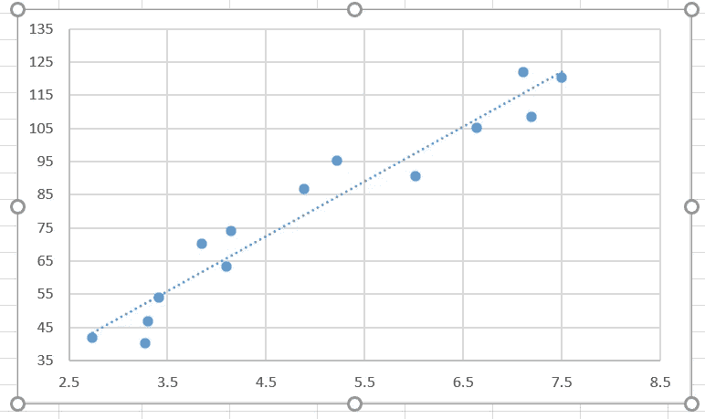
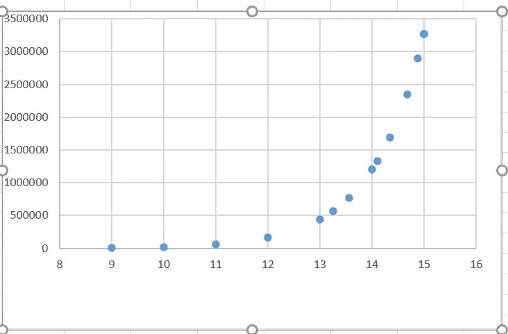

# 线性回归假设

> 原文：<https://medium.com/nerd-for-tech/linear-regression-assumptions-eb7a760e4434?source=collection_archive---------7----------------------->

图片来源于 [Pexels](https://www.pexels.com/photo/serious-adult-lady-doing-paperwork-in-modern-office-4491455/?utm_content=attributionCopyText&utm_medium=referral&utm_source=pexels) 的[卡罗琳娜·格拉博斯卡](https://www.pexels.com/@karolina-grabowska?utm_content=attributionCopyText&utm_medium=referral&utm_source=pexels)

**当数据集具有线性相关性时，使用线性回归**。在建立线性回归模型**之前，假设**要经过**验证**。如果违反了这些假设，就必须使用不同的方法。

**简单线性回归**有一个自变量(预测值)和一个因变量(响应值),而**多元线性回归**有多个预测值来预测响应值。

简单的线性回归方程表示为

## Y = β0 + β1 (X1 )+ε

多元线性回归方程表示为

## y =β0+β1(X1)+β2(x2)+β3(X3)+β4(X4)+ε

线性回归分析的假设是:

1.  线性
2.  没有异方差
3.  无遗漏可变偏差
4.  误差正态性
5.  无自相关
6.  无多重共线性

**1。线性度**

对于线性回归分析，预测值和反应之间必须有线性关系。线性关系可以通过使用**散点图**绘制数据点来可视化。在多元回归的情况下，要为每对变量绘制散点图。

下图 1 显示了线性关系数据集在散点图中的样子。

图表 1

但是如果我们得到一个像图 2 一样的图，它有一条**指数曲线**，那么对数变换可以用来将其转换成线性曲线。

图表 2

如果数据点之间没有线性关系，或者如果数据不能转换成线性关系，则必须进行非线性回归分析。

**2。没有异性**

对于线性关系，如果**方差不是常数**并且随着预测值(X)的增加而增加，则称为**异方差**。在这种情况下，不能依赖输出中的标准误差，但系数仍然是无偏的。

检测异方差的最佳方法是使用残差与 X 值的散点图。异方差可以通过执行对数转换或调查遗漏的变量偏差或识别异常值并尝试消除它们来避免。

# 3.无遗漏可变偏差

预测值不应与误差项相关。它可以用下面的等式来表示。

𝜎𝑋𝜀= 0: ∀𝑥,𝜀

如果预测值相关，则称为**省略变量偏差**。当一个预测因子被排除时，就会发生这种情况，并反映在误差项中，从而导致有偏差和违反直觉的估计。它可以通过检查预测值之间的相关性来检测。

当只根据受教育年限估算工资时，就会出现遗漏变量偏差。因为薪水取决于许多其他预测因素，比如教育类型、社会经济地位等等。但是，它仍然可以用于预测。

**4。误差的正态性**

我们假设误差 **ε正态分布**，即平均值等于零(所有误差之和将等于零(0)或几乎等于零)并且误差项的方差𝜎2 相等。

ε~ N(0,𝜎2)

当误差的方差在观测值之间不一致时，如当使用线性回归模型将保险赔付表示为客户年龄的函数时，则违反了正态性。并非所有选择投保的个人都会要求投保。因此，大量的零保险赔付将伴随着一些非常高的保险赔付额。

如果样本量非常大，那么**中心极限定理**将适用，并且误差的方差将在观测中保持一致。但是对于小样本，输出的标准误差会受到影响。

这可以很容易地通过绘制残差直方图来检测。

**5。无自相关**

误差项值不应有任何可识别的关系。

𝜎𝜀𝑖𝜀𝑗= 0: ∀𝑖≠𝑗

如果误差项的值之间存在任何关系，那么自相关就会出现。**自相关**也称为**序列相关**，它影响标准误差，但不影响无偏系数。这在横截面数据中看不到，但在时间序列数据(如股票价格)中可以看到。对于股票价格分析，一周中的一天效应现象表明，在星期五会有高回报，在星期一会有低回报。周一的误差会向下偏，周五的误差会向上偏。

自相关的主要原因是由于遗漏的变量或不正确的函数形式。

检测自相关的常用方法是绘制一个包含所有残差的散点图，并寻找模式。如果没有模式，则意味着没有自相关。**德宾-沃森**测试方法也可用于寻找自相关。

如果有一个模式，自相关存在，最好避免线性回归模型，去寻找一个自回归模型或移动平均模型或自回归移动平均模型，或自回归综合移动平均模型。

**6。无多重共线性**

如果多元线性回归表示为

## y =β0+β1(X1)+β2(x2)+β3(X3)+β4(X4)+ε

那么理想情况下，没有一个预测因子应该被另一个预测因子所解释。

**多重共线性**发生在预测值本身相关时。为了确定预测值之间是否存在多重共线性，需要检查所有预测值对之间的相关性。在相关系数非常高的情况下，这清楚地表明该预测因子是由另一个预测因子解释的。

多重共线性也可以通过使用**方差膨胀因子** (VIF)来检测。为了找到 VIF，将对所有预测值进行辅助回归。

对于上述方程，X1 的辅助回归方程为

## x1 =β0 *+β2 *(x2)+β3 *(X3)+β4 *(X4)+ε*

这将有助于理解其他预测因子对 X1 的解释程度。如果该模型的 R 平方是 RX1，那么方差膨胀因子，

## VIF = 1/(1-R 平方 X1)

这意味着 R 平方越高，VIF 也越高。

VIF 的较高值表明 X1 由其他预测因子解释。

同样，必须计算所有其他预测器的 VIF，以检查该预测器是否由另一个预测器解释。

为了克服这一点，我们将不得不找出两个预测器是否给出相同的信息，在这种情况下，移除其中一个。在排除捕食者时，必须注意遗漏的可变偏差。另一种方法是将相关预测器转换成**预测器。**