# 5 岁儿童的线性回归

> 原文：<https://medium.com/nerd-for-tech/linear-regression-for-5-year-olds-1a854c88bbb5?source=collection_archive---------16----------------------->

## 第 2/3 部分:算法背后的数学

> 第 1/3 部分的链接:[直觉](/@mohitpatil246/linear-regression-for-5-year-olds-2e8d83e9a680)
> 第 3/3 部分的链接:[从头开始用 Python 实现](https://mohitpatil246.medium.com/linear-regression-for-5-year-olds-1bdc5d0badc4)

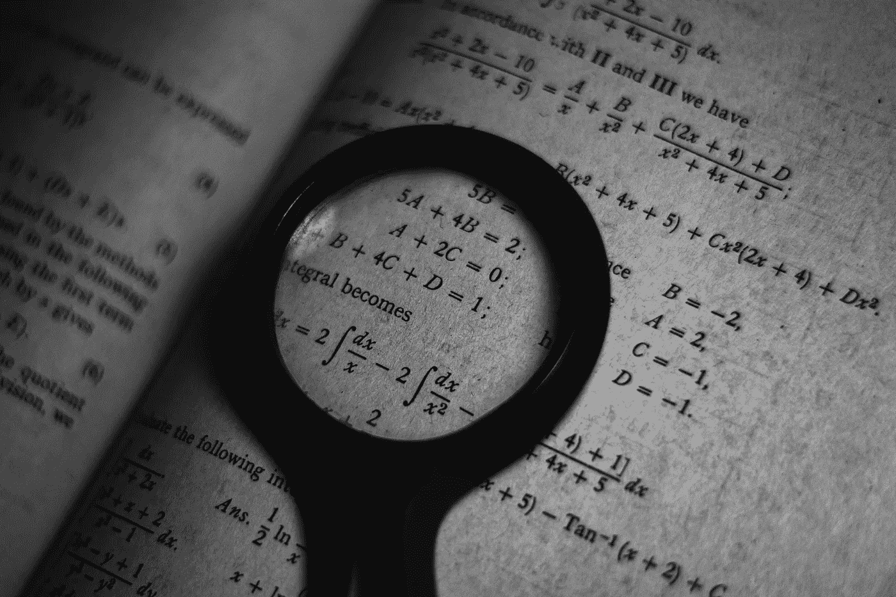

照片由[前方什么都没有](https://www.pexels.com/@ian-panelo?utm_content=attributionCopyText&utm_medium=referral&utm_source=pexels)从[像素](https://www.pexels.com/photo/monochrome-photo-of-math-formulas-3729557/?utm_content=attributionCopyText&utm_medium=referral&utm_source=pexels)拍摄

大家好！这是面向 5 岁儿童的线性回归的第二部分，涵盖了线性回归背后的数学知识，这将带您进入第三部分，从头开始讲述用 python 实现线性回归。

*这部分会有些冗长，所以请耐心等待！*

**线性回归的公式是-**

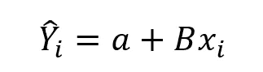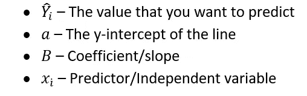

# **现在，让我们试着找出系数(B)和截距(a)是如何计算的-**

1.如上所示，我们将最佳拟合线**定义为-**

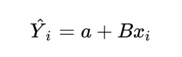

2.对于线性回归，我们有我们的成本函数(无非是 **SSE** 即误差平方和)

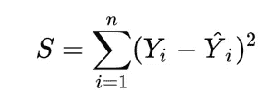

3.让我们把最佳拟合线放入成本函数-

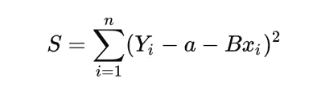

4.为了最小化我们的成本函数， **S** ，我们必须找到 S 相对于 **a** 和**B**的导数等于或接近 0 的点， **a** 和 **B** 越接近 0，每个点的总误差越小。

# **5。找一个**

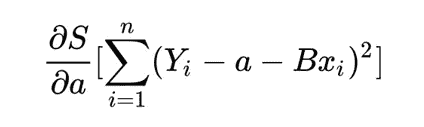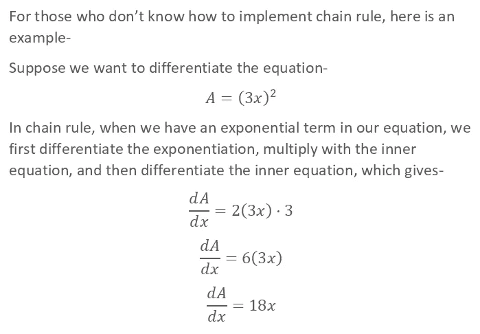

6.类似地，在我们的等式中，我们从指数开始，然后是括号之间的等式。*(括号内方程的导数出来就是-1)。*

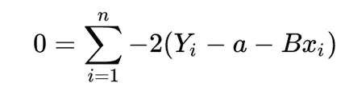

7.现在，因为 2 是一个常数值，我们将把它从求和中取出，移到 L.H.S-

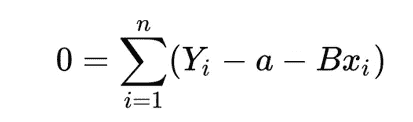

8.简化，

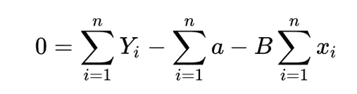

可以说 **a** 到 **n** 之和为-

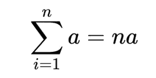

9.将这个值代入等式-

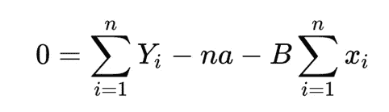

9.为了得到 **a** 的值，让我们重新排列-

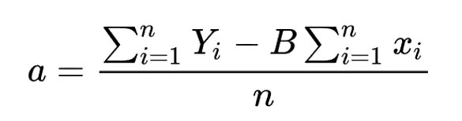

如果你注意到， **Y** 的总和除以观察次数， **x** 的总和除以观察次数就是平均值，因此 **a** 的值-

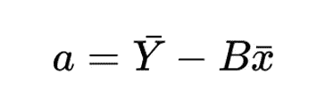

# **10。调查结果 B**

类似地，最小化关于**B**-
T5 的成本函数 **S** (这里，括号之间的等式的导数为-x)

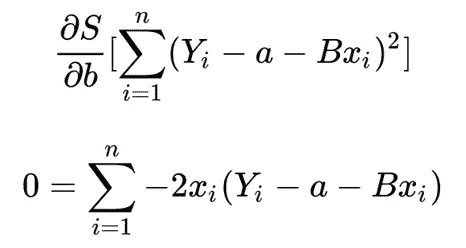

11.排除 2，

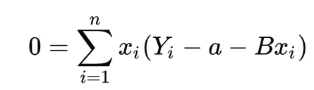

12.分发 **x** ，

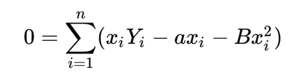

13.还记得我们上面推导的 **a** 的值吗？让我们把它代入我们的方程-

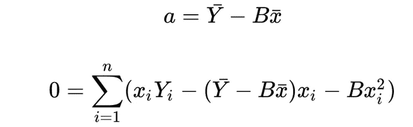

14.打开内部支架，

15.把总数分成两部分-

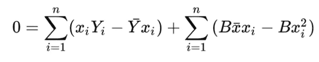

16.从求和中取出常数 **B**

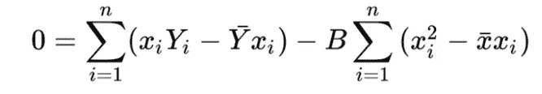

为了得到 **B** 的值，让我们重新排列-

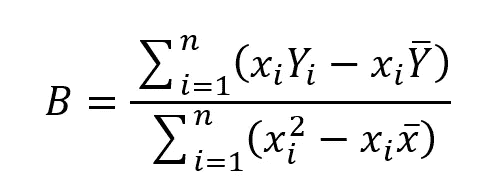

17.所以，最后一个等式-

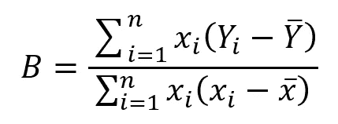

18.上面的等式也可以写成-

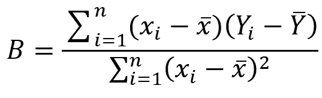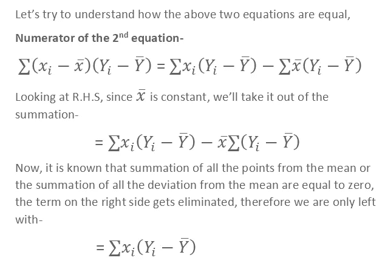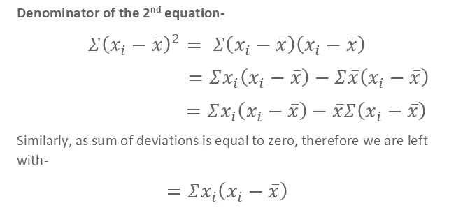

因此，这两个方程是相同的，

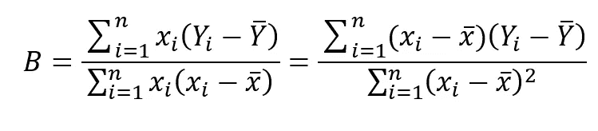

# 总而言之-

如果数据集只有一个独立变量，可以通过计算 **B、**找到最佳拟合线

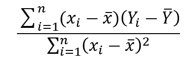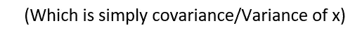

然后将 **B** 代入 **a** ，

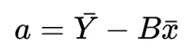

最后将 **B** 和 **a** 代入线性回归方程-

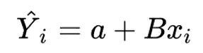