# 5 岁儿童的线性回归

> 原文：<https://medium.com/nerd-for-tech/linear-regression-for-5-year-olds-1bdc5d0badc4?source=collection_archive---------14----------------------->

## 第 3/3 部分:从头开始用 python 实现

> 1/3 部分链接:[直觉](/@mohitpatil246/linear-regression-for-5-year-olds-2e8d83e9a680)
> 2/3 部分链接:[算法背后的数学](https://mohitpatil246.medium.com/linear-regression-for-5-year-olds-1a854c88bbb5)


照片由[负空间](https://www.pexels.com/@negativespace?utm_content=attributionCopyText&utm_medium=referral&utm_source=pexels)从[像素](https://www.pexels.com/photo/computer-keyboard-34153/?utm_content=attributionCopyText&utm_medium=referral&utm_source=pexels)拍摄

大家好！这是《5 岁儿童线性回归》的第三部分，从头开始讲述 python 中算法的实现。到目前为止，我们已经了解了什么是线性回归，它是如何工作的，以及如何计算系数来找到最佳拟合线。

*现在理论够多了，让我们开始编码吧！*

我们将要处理的数据集是- **联合循环发电厂数据集。**

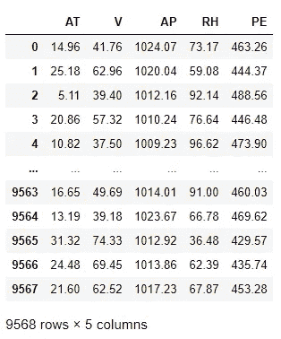

*其中，* **→平均温度* ***E****→排气真空* ***AP****→环境压力* ***RH****→相对湿度* ***PE****

*这里，我们有兴趣预测的因变量/值是 **PE** ( *电厂每小时的电能输出*)。我们试图建立的模型是只需要一个独立变量的线性回归。
从下图可以看出，唯一与我们的因变量有线性关系的预测量/自变量是**在 *(*** *平均温度)*。*

*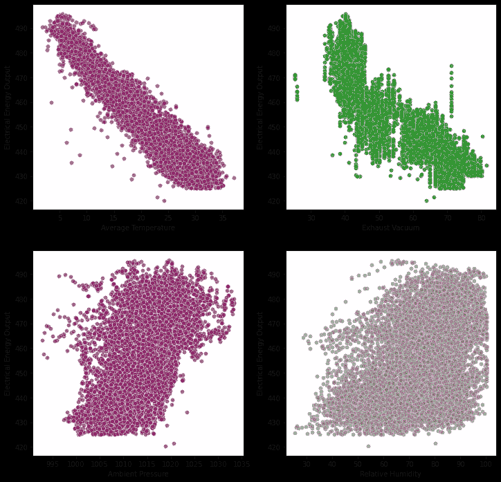*

*因此，我们将尝试找出**平均温度**和**电能输出之间的关系。为了更好地可视化，我们将只从总数据集中提取 3000 个值来构建我们的模型。***

> *概述-
> 1。[基本预处理](https://medium.com/p/1bdc5d0badc4/8e7f)
> 2。分割数据
> 3。计算参数(或训练我们的模型)
> 4。做一些预测。可视化结果
> 6。评估我们的模型*

# *预处理-*

*在训练我们的数据之前，我们应该总是预处理我们的数据，这通常包括处理缺失值、去除异常值等。*

*   ***缺失值-***

```
*df1.isnull().sum()*
```

> *AT- 0
> PE- 0*

*我们的数据集中没有缺失值。*

*   ***离群值-**
    这里，z-score 用于查找我们数据集中的任何离群值-*

```
*z_scores = stats.zscore(df1)abs_z_scores = np.abs(z_scores)
filtered_entries = (abs_z_scores < 3).all(axis=1)
new_df = df1[filtered_entries]print('Length of dataset before removing outliers: %.0f' % (len(df1)))
print('Length of dataset after removing outliers: %.0f' % (len(new_df)))*
```

> *剔除异常值前的数据集长度:3000
> 剔除异常值后的数据集长度:3000*

*未检测到异常值。*

# *分割数据-*

```
*# Shuffle the dataset 
shuffle_df = new_df.sample(frac=1)# Define a size for the train set 
train_size = int(0.7 * len(new_df))# Split the dataset 
x_train = list((shuffle_df[:train_size]).iloc[:,0])
y_train = list((shuffle_df[:train_size]).iloc[:,1])
x_test = list((shuffle_df[train_size:]).iloc[:,0])
y_test = list((shuffle_df[train_size:]).iloc[:,1])*
```

*   *首先，我们使我们的数据随机，所以没有连续的值被选择。参数“frac”指定在随机样本中返回的行的分数，因此“frac=1”意味着返回所有行(按随机顺序)。*
*   *此外，我们将 70%的数据用于训练，其余的(30%)用于测试。*
*   *然后，我们将数据分成训练集和测试集。*

# *计算参数-*

## *1.计算 B(系数/斜率)*

> *为了计算方差和协方差，我们需要均值-*

*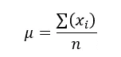*

```
*def mean(values):
    return sum(values) / float(len(values))mean_x = mean(x_train)
print('Mean of x: %.3f' % (mean_x))mean_y = mean(y_train)
print('Mean of y: %.3f' % (mean_y))*
```

> ***x 的平均值:19.659
> y 的平均值:454.441***

> *然后计算方差*

*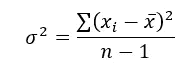*

```
*def variance(values, mean):
    return sum([(x-mean)**2 for x in values])/(len(values)-1)var_x = variance(x_train, mean_x)
print('Variance of x: %.3f' % (var_x))var_y = variance(y_train, mean_y)
print('Variance of y: %.3f' % (var_y))*
```

> *x 的方差:54.993
> y 的方差:291.298*

> *求 x 和 y 的协方差*

*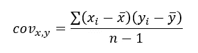*

```
*def covariance(x_train, mean_x, y_train, mean_y):
    covar = 0.0
    for i in range(len(x_train)):
        covar += ((x_train[i] - mean_x) * (y_train[i] - mean_y))/(len(x_train)-1)
    return covarcovar = covariance(x_train, mean_x, y_train, mean_y)
print('Covariance of x and y: %.3f' % (covar))*
```

> *x 和 y 的协方差:-120.357*

> *寻找参数-*

*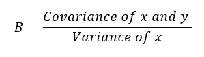**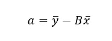*

```
*B = covar/var_x
print('Value of coefficient (B): %.3f' % (B))a = mean_y - B*mean_x
print('Value of intercept (a) : %.3f' % (a))*
```

> *系数(B)值:-2.189
> 截距(a)值:497.465*

# *现在，让我们做一些预测-*

```
*y_pred=[]
for i in range(len(x_test)):
    temp = a + B*x_test[i]
    y_pred.append(temp)pred_df = pd.DataFrame({'Actual': y_test, 'Predicted': y_pred})  
pred_df*
```

*比较实际值和预测值*

*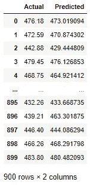*

# *可视化训练集结果-*

*(要在我们的训练数据集上绘制回归线，我们还必须预测训练数据的 y 值)*

```
*train=[]
for i in range(len(x_train)):
    temp = a + B*x_train[i]
    train.append(temp)plt.scatter(x_train,y_train, color = "red", edgecolors = "white", linewidths = 0.4, alpha = 0.7)
plt.plot(x_train, train, color='blue')
plt.title('Average Temperature Vs. Electrical Energy Output (Training set)')
plt.xlabel('Average Temperature')
plt.ylabel('Electrical Energy Output')
plt.show()*
```

**

# *可视化测试集结果-*

```
*plt.scatter(x_test,y_test, color = "red", edgecolors = "white", linewidths = 0.4, alpha = 0.7)
plt.plot(x_test, y_pred, color='blue')
plt.title('Average Temperature Vs. Electrical Energy Output (Test set)')
plt.xlabel('Average Temperature')
plt.ylabel('Electrical Energy Output')
plt.show()*
```

*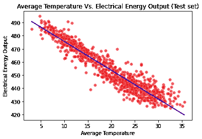*

*从上面的图中，我们可以看到预测值非常接近回归线，这意味着我们的预测值是好的。*

> *在回归中，有一个假设，即残差应该是同方差的，也就是说，给定因变量的自变量的方差应该是恒定的，或者我们可以说，随着预测值的增加，预测值的方差应该保持恒定。*
> 
> *在绘制残差图之后，如果残差随着预测值的增加而呈扇形散开，那么我们就有了所谓的异方差，这是不希望的。*

```
*a = sns.residplot(x=x_test, y=y_test, lowess=True).set_title("Residual plot (Predictor vs. Residuals)")
plt.xlabel('Average Temperature')
plt.ylabel('Residuals')
plt.show()*
```

*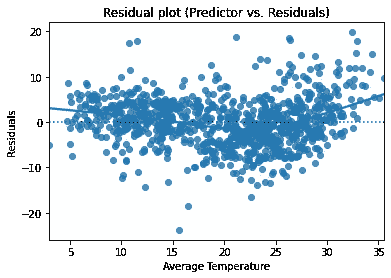*

*从上图可以看出，残差近似呈正态分布。*

> *同样，在线性回归中，误差应该是不相关的*

*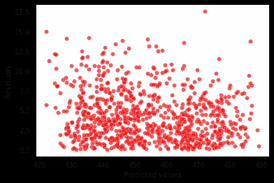*

*可以观察到残差之间不存在相关性，或者我们可以说数据中不存在自相关。*

# *评估-*

*现在，让我们评估我们的模型。RMSE 是完成这项任务的好办法。RMSE 是残差的标准差，也就是说，它说明了残差在最佳拟合线周围的分布情况。值越接近零，我们的模型越好。*

```
*rmse = 0
for i in range(len(y_test)):
    rmse += (y_test[i] - y_pred[i]) ** 2rmse = np.sqrt(rmse/len(y_test))print('Root Mean Squared Error: %.3f' % (rmse))*
```

> *均方根误差:5.501*

*RMSE 的值非常接近零，这意味着预测是好的。*

## *同样，让我们看看 R 的平方值*

```
*SSt = 0
SSr = 0for i in range(len(y_test)):
    SSt += (y_test[i] - mean_y) ** 2
    SSr += (y_test[i] - y_pred[i]) ** 2R2 = 1 - (SSr/SSt)
print('R-square: %.3f'%R2)*
```

> *r 平方:0.905*

*我们有一个很好的 R 平方值，也称为决定系数。它告诉我们自变量解释了因变量的多少变化。*

# *摘要*

*这是线性回归系列的最后一部分。我希望这篇文章对你有用！
代码链接-[5 岁儿童线性回归](https://github.com/Mohit246/Medium-code/tree/main/Linear%20regression)*