# 5 岁儿童的线性回归

> 原文：<https://medium.com/nerd-for-tech/linear-regression-for-5-year-olds-2e8d83e9a680?source=collection_archive---------12----------------------->

## 1/3 部分:直觉

> 第 2/3 部分的链接:[算法背后的数学](https://mohitpatil246.medium.com/linear-regression-for-5-year-olds-1a854c88bbb5)
> 第 3/3 部分的链接:[从头开始用 Python 实现](https://mohitpatil246.medium.com/linear-regression-for-5-year-olds-1bdc5d0badc4)

图片来自 [Pexels](https://www.pexels.com/photo/light-sea-city-road-8355939/?utm_content=attributionCopyText&utm_medium=referral&utm_source=pexels) 的 [Mikhail Nilov](https://www.pexels.com/@mikhail-nilov?utm_content=attributionCopyText&utm_medium=referral&utm_source=pexels)

大家好！这是 5 岁儿童线性回归的第一部分，涵盖了线性回归的基础知识，这将带你进入第二部分，包括线性回归背后的一些推导和数学。所以…让我们开始吧！

回归就是寻找一个依赖特性和一个或多个独立特性之间的关系。现在，当我们谈论线性回归时，我们评估/找到一个从属特征和一个独立特征之间的关系，并试图找出如何绘制一条最适合我们数据的线。

有多种方法可以拟合这条线，但在这里我们将看看**普通最小二乘法(OLS)** 的工作原理。在这种方法中，我们试图通过**最小二乘法**的原理来估计参数*(系数& y 截距)*:最小化给定数据集中观察到的从属特征与由独立特征的线性函数预测的特征之间的差的平方和。

在数学术语中，我们将简单的线性回归方程表示为(标量形式)

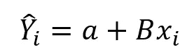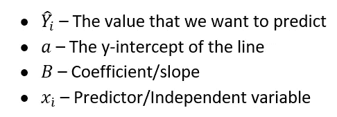

简单来说， **B** 表示直线指向哪个方向， **a** 表示 y 轴截距，表示直线在 y 轴*上的交点(即 x 为零时 y 的值是多少)。*

这个方程也可以用矩阵形式表示为

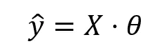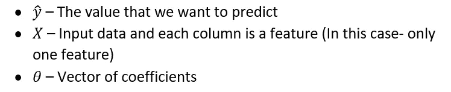

让我们举一个非常普通的例子-

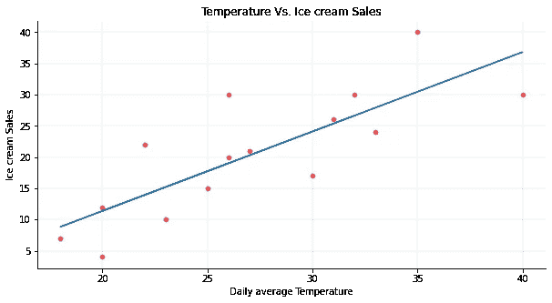

作者图片

假设我们有一家冰淇淋店，我们记录了每天的平均温度和每天售出的冰淇淋数量。我们注意到，温度和冰淇淋销售额之间存在正线性关系，也就是说，随着温度的升高，销售额也会增加。

我们通过计算实际值和预测值之间的平方差之和来估计参数并找到最佳拟合线，即，我们记录每个数据点的实际值和预测值之间的差异(d1、d2、d3…)，对它们求平方并相加(d1 +d2 +d3 +…)。主要目标是估计使该值最小的参数。这是线性回归的成本函数。

> 成本/损失函数是衡量机器学习模型性能的东西。它告诉我们，在估计我们的独立特征和从属特征之间的关系时，我们的模型有多好。

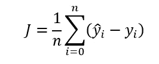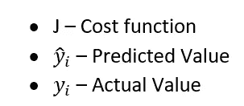

## **但在使用该算法之前，需要考虑一些假设**:

> **注:**如果违反了这些假设中的任何一个，并不意味着我们的线性回归模型就行不通，只是我们的参数可能不准确(或者我们可以说，我们的预测可能不准确)。

*   **线性-** 线性回归假设从属特征和独立特征之间的关系是线性的。这可以通过查看散点图来检查。请注意，异常值也会影响数据的线性，因此在分析数据之前处理异常值非常重要。

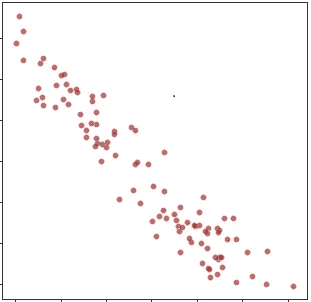

通过观察散点图，我们可以说数据遵循线性分布。

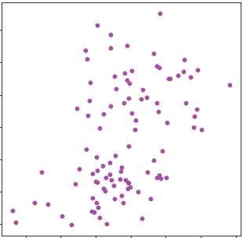

从这个散点图中，我们可以说数据不遵循线性分布。

> 注意:如果数据不是线性分布的，可以使用其他一些非线性估计，如多项式回归，它也可以拟合曲线数据！

*   **独立残差-** 拟合模型后，残差(实际值-预测值)应该是独立的，即连续的残差之间应该没有相关性。这个概念也被称为**自相关**。*指同一变量*的值之间的相关程度。我们可以借助残差图(独立变量对残差)来检测自相关。

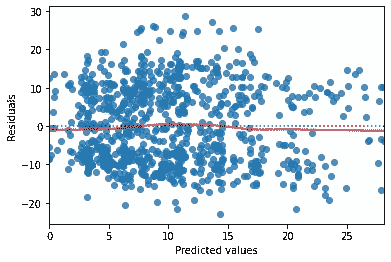

从这个图中，我们可以说残差是独立的，并且是随机分布的。

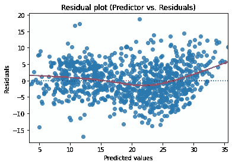

通过看曲线，我们可以说残差不是相互独立的，不是随机分布的。

> 自相关也可以使用 Durbin-Watson 测试来检测，其值范围为 0-4。
> 接近 2 的值= >更少的自相关
> 接近 0 或 4 的值= >高+ve /高-ve 自相关

*   **同异方差——**异方差(同异方差的反义词)发生在 Y 给定 X 的方差(V(Y|X))不是常数的时候。这些是同方差和异方差数据的残差对拟合值图

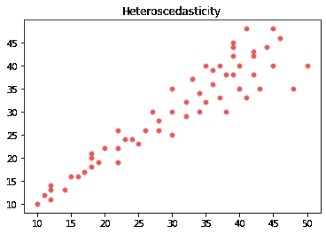

作者图片

在第二个图中，我们可以看到残差类似于漏斗形状，这在线性回归中是不期望的。为了处理这种情况，我们可以取因变量的对数，这在这种情况下很有用。

*   **正态性(可选)-** OLS 不要求误差项遵循正态分布来产生无偏估计。然而，如果误差项遵循正态分布，我们可以执行统计假设检验，并生成可靠的置信区间。我们可以借助 Q-Q 图(分位数-分位数图)来检验正态性

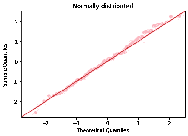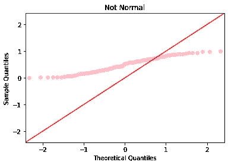

作者图片

*   **多重共线性-** 当我们处理多个独立特征时，我们必须考虑这个假设。当两个特征具有+1 或-1 的**皮尔逊相关系数**时，完美相关发生。当变量完全相关时，普通的最小二乘法无法区分它们。所以，这样的特征应该从模型中移除。

# 摘要

总之，我们看了什么是线性回归，线性回归的数学方程，成本函数，以及线性回归的各种假设。不要忘记查看该系列的下一部分。