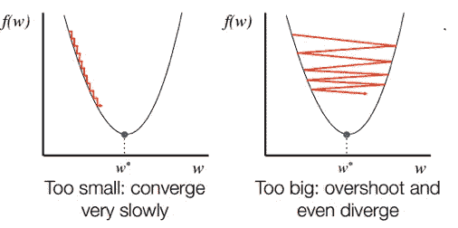
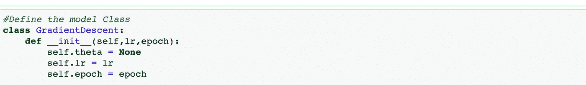
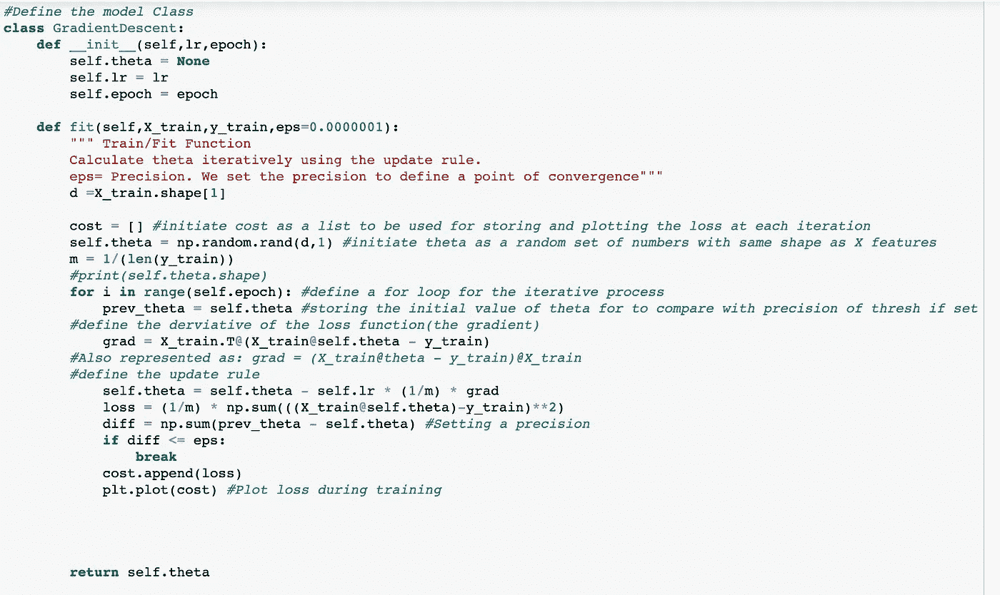
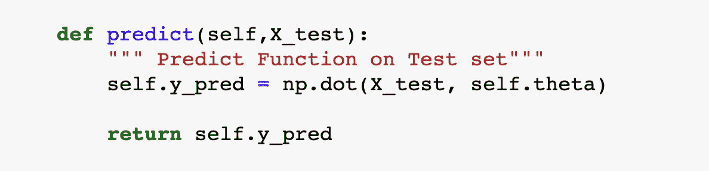
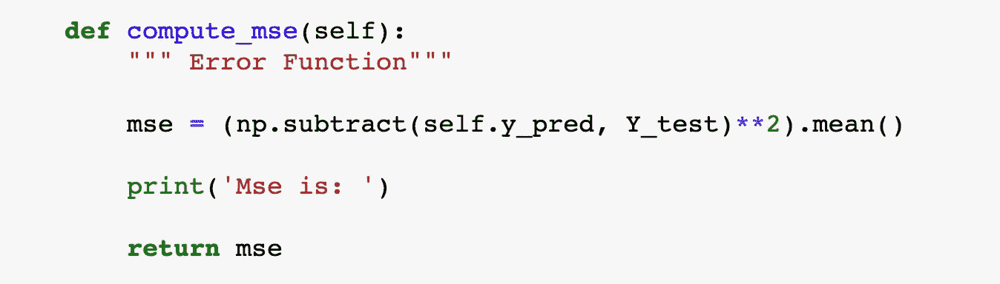
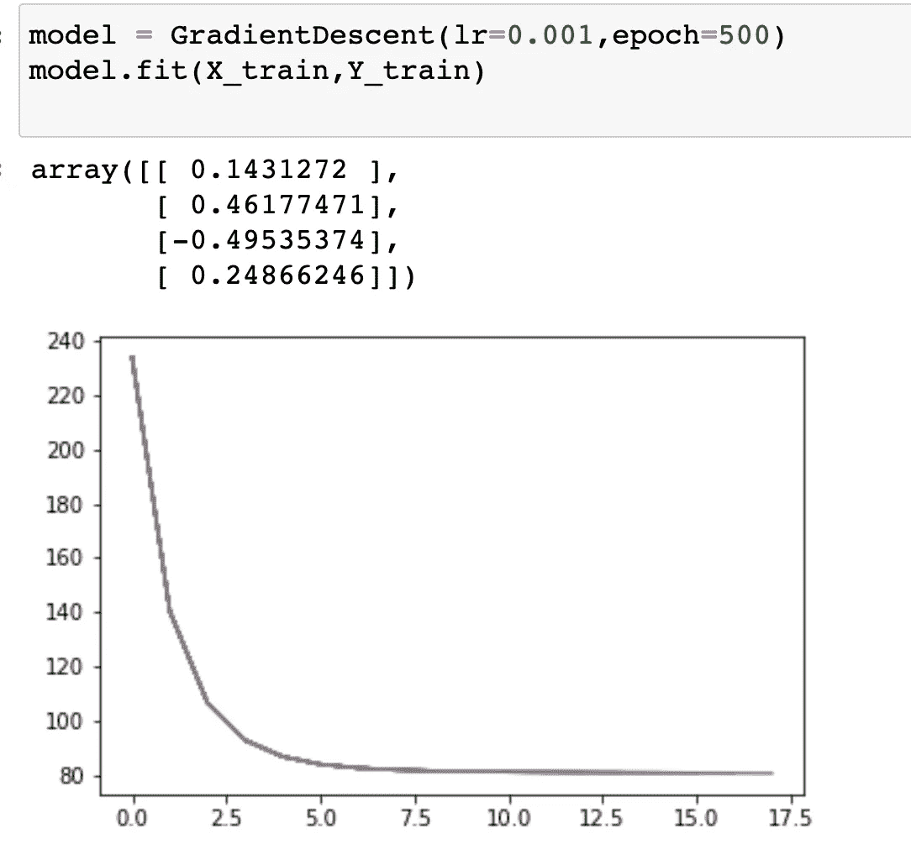
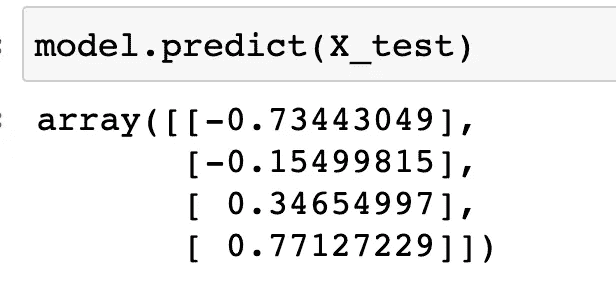
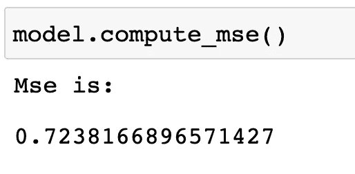

# 从头开始线性回归 PT2:梯度下降算法

> 原文：<https://medium.com/nerd-for-tech/linear-regression-from-scratch-pt2-the-gradient-descent-algorithm-f30d42fea40c?source=collection_archive---------6----------------------->

在我上一篇关于线性回归的[文章](https://mardiyyah.medium.com/linear-regression-from-scratch-pt1-484ff41e5a3)中，我简要介绍了线性回归、直觉、假设以及两种最常用的解决线性回归问题的方法。前一篇文章关注其中一种方法；“封闭形式的解决方案(分析方法)”。在本文中，重点将放在第二种方法:“数值方法”，具体来说，一种类型的数值方法称为“**梯度下降(GD 算法)**”。

# 用数值方法求解线性回归

在现实生活中，大多数问题(或者至少是我们对机器学习感兴趣的问题)没有封闭形式解决方案所提出的精确解决方案。除此之外，使用封闭形式的公式可能会导致一些复杂情况(如下图所示)。其中一个问题是当 X 是大样本时，计算的复杂性和求逆矩阵(X.T.X)的费用。另一个关注点是矩阵不可逆或不存在的可能情况(*是的，这种情况会发生！！参考下面的材料，了解为什么*

封闭形式的方程。来源:[此处](https://cdn-images-1.medium.com/max/498/1*Bt1LjOBnr9vkwPTotwM2yA.png)

因此，与“封闭形式的解决方案”不同，数值方法有一个权重的更新规则(θ⍬).它使用迭代过程来寻找使成本函数最小化的最佳θ值，或者损失最小的最佳θ值。我们可以称之为“优化”。

> “优化是机器学习的核心”。寻找给定问题的最佳/最优解决方案。

有几种数值方法用于线性回归。然而，我将把重点放在优化技术的“梯度下降”类。在本文中，我们将只探讨一种变体(批量梯度下降(BGD))，并在后续文章中更多地讨论其他变体。

**梯度下降作为优化算法**

梯度下降是一种迭代一阶优化技术，用于最小化函数。它寻找凸函数的全局最小值(*哎呀！！行话。请参考资料以了解这些术语*。它假设函数是凸的。

> 如果一个函数的二阶导数大于或等于零(0)，则称该函数是“凸的”。即 f ⎖⎖( x) ≥ 0。如果-f ⎖⎖( x) ≥ 0，那么它是一个凹函数(上升)

这是机器学习中使用的最流行的优化技术之一(尤其是在深度学习领域)。已经发表了几篇研究论文，证明这种算法对大多数问题都是最好的(至少就我们目前所知)。

它被认为是一种自然算法，在成本函数的最陡下降方向上重复采取步骤

它是如何工作的？

如前所述，对于数值方法，使用迭代过程，使得模型的权重(θ)在每次迭代时递增地(逐步地)更新，试图找到损失最小的最佳值。

对于梯度下降，假设凸函数，损失函数相对于权重被微分以计算梯度。这个梯度乘以一个参数(⍺-学习率或步数)并从先前的权重值中减去。(*毕竟是下降*)。在每一步(迭代)计算损失。这个过程重复迭代直到收敛。

来源:[图片](https://i.ytimg.com/vi/b4Vyma9wPHo/maxresdefault.jpg)

其中，等式右侧的 w 是新的θ值，左侧是先前/旧的θ值。

学习 rate(⍶)确定沿着斜坡要采取的步骤以实现目标。过大的步长会导致跳过或错过全局最小值点(也称为过冲)，而过小的步长会导致实现目标的过程非常缓慢。这是一个需要调整的超参数。在实践中，人们往往从 0.01 开始，并相应地减少或增加。

> 所有问题的学习速度并不一致。一个值可能对一组问题有效，但对另一组问题无效。寻找最佳学习速率是机器学习中的一场持久战。

图片来源:Github

**梯度下降的变体**

梯度下降算法通常有三(3)种变体；

*   批量梯度下降
*   随机梯度下降
*   小批量梯度下降

在批量梯度下降(这将是本文的代码实现用例)中，所有样本(X)在每次迭代中用于计算梯度和更新权重。对于大型数据集，这往往计算量很大，而且非常慢。这实际上是它的缺点之一(对于较大的样本量，计算速度(时间复杂度))。

这个算法的伪代码是:

*   初始化权重的随机猜测(从θ的随机猜测开始)
*   使用所有样本计算梯度(x)
*   使用更新规则更新权重
*   重复直到收敛

来源:[此处](https://medium.datadriveninvestor.com/the-math-and-intuition-behind-gradient-descent-13c45f367a11)

太好了！现在让我们通过代码来看看这一点。

**批量梯度下降算法的代码实现**

我们将使用本系列第一部分中使用的相同数据(在这里找到链接( [*将鼠标悬停在这里*](https://mardiyyah.medium.com/linear-regression-from-scratch-pt1-484ff41e5a3) )。

因此，将跳过数据导入、预处理等基本步骤。我们将直接构建批量梯度下降(BGD)模型。

步骤:

1.  定义模型类和它将采用的超参数(纪元和学习率)

> **时期**是将整个数据传递一次所需的时间。这与**迭代**不同。在这里，这并不重要，因为我们在每一步都要考虑所有的数据样本。然而，当我们谈到梯度下降算法的其他变体时，我们会注意到两个术语(时期和迭代)之间的差异

2.定义训练方法及其将采用的参数(X 和 Y)

3.I)使用 X 特征形状的随机变量和偏差初始化θ(其原因是θ和 X 之间的矩阵乘法。记住矩阵乘法需要 *nxm - > mxn* 条件。

> 也请记住这一点，在可能出现“ **matmul** ”错误的情况下，请检查正在执行矩阵乘法的变量的形状。手动计算将帮助你更快地调试，因为有时你可能需要转置一个矩阵，以便乘法是可能的。还要记住表示/矩阵的放置方式决定了乘法的计算方式。

ii)计算梯度

iii)定义更新规则并更新 theta

iv)计算培训期间的损失

您会注意到上面代码中的一些事情。名为“precision”的变量被添加到拟合函数将采用的参数集中。这是可选的，它有点像阈值，当我们想要设置收敛点并跳出循环时使用(注意设置阈值条件的代码行)。

***提示:尝试使用带精度和不带精度的模型，查看差异***

4.定义预测方法(与之前相同)。

预测函数

5.根据测试数据计算 MSE

6.用超参数初始化模型(设置学习率和选择的历元大小)并拟合数据。

6.根据测试数据进行预测。

根据测试数据进行预测

7.获得 MSE(测试损失)

太好了！您刚刚从头开始构建了一个批量梯度下降模型。恭喜你！！

希望你喜欢读这篇文章，并有所收获。下一次，我们将使用相同的数据，但使用梯度下降算法的另一种变体-“**随机梯度下降**”。到时候见！感谢您的阅读！

找到下面代码的 GitHub 库链接；

# GITHUB 资源库链接

 [## amina h92/机器学习基础

### 在 GitHub 上创建一个帐户，为 amina h92/机器学习基础开发做贡献。

github.com](https://github.com/Aminah92/Foundations-of-Machine-Learning/blob/main/Linear-Models/LINEAR%20REGRESSION%20FROM%20SCRATCH%20PT%202-%20Gradient%20Descent.ipynb) 

# **上一篇文章(从零开始线性回归 PT1)**

 [## 从头开始线性回归 PT1

### 线性回归被认为是建模数据的最自然的学习算法，主要是因为它很容易…

mardiyyah.medium.com](https://mardiyyah.medium.com/linear-regression-from-scratch-pt1-484ff41e5a3) 

# 在社交媒体上与我联系

推特:@diyyah92

领英:【https://www.linkedin.com/in/aminah-mardiyyah-rufa-i/ 

资源和参考资料

 [## 当封闭形式的数学解可用时，为什么使用梯度下降进行线性回归？

### 感谢您为交叉验证提供答案！请务必回答问题。提供详细信息并分享…

stats.stackexchange.com](https://stats.stackexchange.com/questions/278755/why-use-gradient-descent-for-linear-regression-when-a-closed-form-math-solution)  [## 通过闭合形式方程拟合模型，梯度下降法，随机梯度下降法…

### 为了解释估计模型参数的不同方法之间的差异，让我们以…

sebastianraschka.com](https://sebastianraschka.com/faq/docs/closed-form-vs-gd.html)  [## 为什么凸性是最优化的关键

### 使用凸成本函数是很容易的

towardsdatascience.com](https://towardsdatascience.com/understand-convexity-in-optimization-db87653bf920)  [## 举例说明局部和全局最小值-数据分析

### 在这篇文章中，你将通过插图和例子学习局部和全局最小值的概念…

vitalflux.com](https://vitalflux.com/local-global-maxima-minima-explained-examples/)