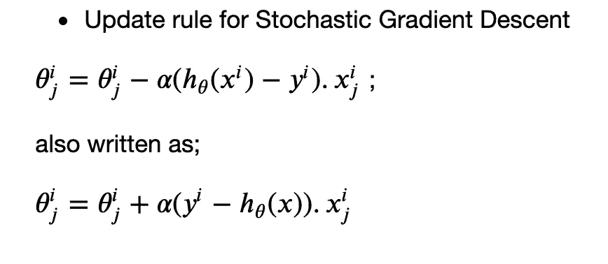
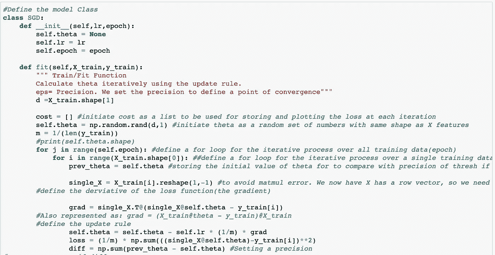
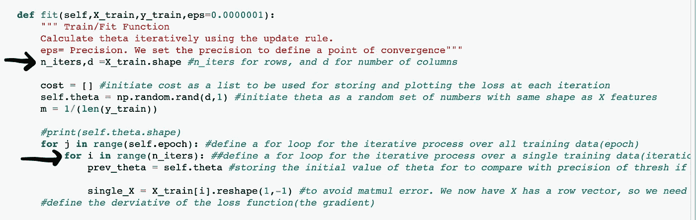
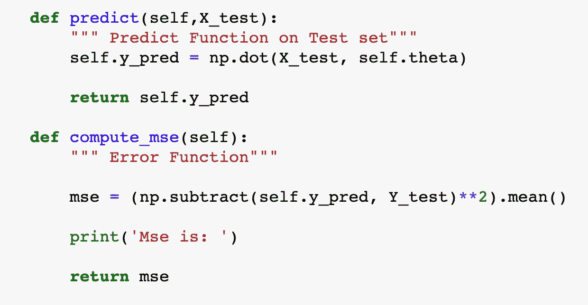
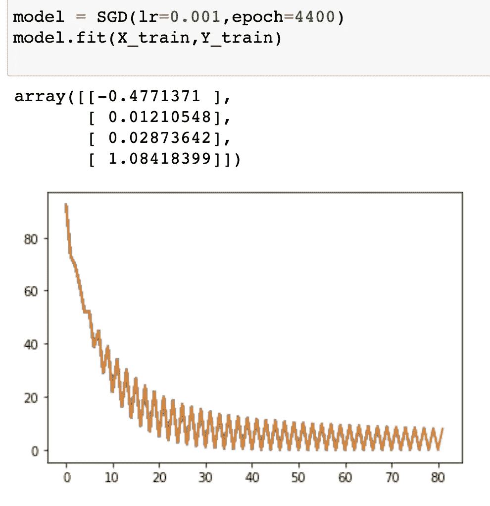

# 从头开始线性回归 PT3:随机梯度下降

> 原文：<https://medium.com/nerd-for-tech/linear-regression-from-scratch-pt3-stochastic-gradient-descent-7def4378f729?source=collection_archive---------11----------------------->

> 欢迎回来！这是线性回归模型的第 3 部分。在本文中，我们将探索著名的“随机梯度下降(SGD)”算法。我将尝试解释这种非常流行的算法如何工作的直觉，以及它与上一系列文章中探讨的简单批量梯度下降算法的不同之处。如果你没有看过之前关于这个主题的文章，可以在这里找到嵌入的链接: [**Part1**](https://mardiyyah.medium.com/linear-regression-from-scratch-pt1-484ff41e5a3) 和 [**Part 2**](/nerd-for-tech/linear-regression-from-scratch-pt2-the-gradient-descent-algorithm-f30d42fea40c) 。请务必阅读它们，因为本文是建立在前面讨论的基础上的。

在上一篇文章中，我们讨论了在解决线性回归问题时，使用数值方法而不是分析方法(封闭形式的解决方案)。我们特别探索了一类流行的数值方法；“梯度下降”。正如所解释的，它是机器学习(包括像深度学习这样的子领域)中使用的最流行的优化技术，它有三种变体；

*   批量梯度下降(BGD)
*   随机梯度下降(SGD)
*   小批量梯度下降，也称为小批量随机梯度下降。(百万新元)

本文的重点将是“随机梯度下降(SGD)”。

> ****

# 随机梯度下降:直觉

回想一下，在批量梯度下降(BGD)中，所有训练样本(X)都用于计算梯度，并在迭代的单个步骤中更新权重。

对于随机梯度下降(SGD)，区别在于梯度计算是如何进行的。SGD 不是同时使用所有的训练样本，而是随机选择一个训练样本进行梯度计算。我什么意思？

还记得梯度下降的伪代码吗？

*   初始化权重的随机猜测(从θ的随机猜测开始)
*   使用“**所有样本(x)”**计算梯度
*   使用更新规则更新权重
*   重复直到收敛

对于 SGD，这变成了；

1.  初始化权重的随机猜测(从θ的随机猜测开始)。
2.  从训练数据集中随机选择一个样本(x(i))。
3.  计算其梯度(即仅 x(i)的梯度)。
4.  使用更新规则更新权重。
5.  对所有训练样本(从 x(i)到 x(n))重复步骤(2–4)，直到收敛。

更新 SGD 的规则

其中:x(i)这里是单个训练观察/样本，y(i)是映射到 x(i)的标签/目标。

> 有趣的事实:随机==随机。训练样本是随机选择的。

SGD 的优点是速度快，需要的内存少。然而，它从来没有像我们期望的那样真正收敛，而是达到了最优解的一个近似值。你会注意到它有一个更嘈杂的下坡运动，并在全球最小值附近振荡(但从未真正击中要害)。其计算复杂度为常数时间 O(1)。

来源:[研究门](https://www.researchgate.net/figure/Stochastic-gradient-descent-compared-with-gradient-descent_fig3_328106221)

> “SGD 的随机性质意味着一些噪声将被引入到权重设置中，但该技术总体上仍然非常有效，并被广泛使用。”— **研究之门(链接到下面的出版物)**

SGD 也被称为“无偏估计量”，因为梯度的期望与 BGD 相同，但方差较小。

> “估计量是一种函数，它试图在给定样本数据的情况下估计总体数据的一些有用质量。偏差是机器学习中估计器的一个非常重要的性质。SGD 是无偏的，因为对梯度的期望与对 BGD 的期望相同。
> 
> 我知道这些术语可能听起来有点复杂，我建议你参考下面的链接，我已经将链接附在了解释这些概念的博客帖子上。"

**随机梯度下降优于批量梯度下降**

*   批次梯度下降缓慢。它需要在每次迭代中计算整个训练样本的梯度。另一方面，随机梯度下降更快，因为它一次只使用一个样本。
*   随机梯度下降是一种无偏估计量。
*   它的复杂度是常数时间 O(1)，BDG 的复杂度是 O(N)。

# 随机梯度下降的代码实现

如前所述，对于上一篇文章中用于批量梯度下降的代码，唯一需要做的细微区别是迭代要素(X)，一次获取一个观测值(行)(更像水平分割数据)，并将其用于梯度计算，而不是整个数据集。

让我们看看它是如何工作的。

我们将跳过数据预处理步骤，直接进入模型类。

在此之前，让我们快速了解一下关于 SGD 的两个重要术语:

这些是；

*   世
*   迭代次数(n_iters)

因此**历元**被定义为对整个数据集(所有训练数据)的一次遍历。而迭代是对一个训练数据的传递。对于批量梯度下降，这两个术语有时可以互换使用，因为所有训练数据都在一个步骤中考虑。然而，对于 SGD，这些术语是不同的(正如您在许多深度学习应用程序中也会看到的)，Epoch 覆盖整个数据集，而 iterations 考虑我们在水平分割数据时采取的步骤(一次进行一次观察)。

你会对代码有更好的直觉。

反映该变化的唯一功能是体能/训练功能。

训练功能

如上面的代码片段所示，启动了第二个循环，指示数据的水平切片(X _ train . shape[0]= = row/observation)。注意到这个切片被改变形状的那一行了吗？*你能猜到为什么吗？*

没错。现在，我们有了一个向量，“行向量”，而不是一个矩阵。没有整形，代码返回一个错误(*记住矩阵乘法的规则*)。修改后的“X”仅替换训练功能中的首字母 X。

还有，“ *X_train.shape[0]* 的值就是这里的迭代次数(n_iters)。所以你也可以将 *n_iters* 定义为一个变量，见下图。

注意到切片也是为“Y”实现的(如公式中所示)。

其他所有功能保持不变；"预测和均方误差函数."

通过初始化模型来运行代码，看看损失图与 BGD 有什么不同。

> 你有没有注意到和 BGD 相比使用了更小的学习率？你能看到振荡和嘈杂的运动吗？

一般来说，建议对 SGD 使用较小的学习速率，因为它每次都依赖于单个数据进行计算。它非常嘈杂(如上面的损耗图所示，并且更倾向于过冲，因为它在全局最小值附近振荡。

# *干得好！*

# 结论

我希望你喜欢阅读这篇文章，并对 SGD 的工作原理有所了解。SGD 在机器学习的子领域——“深度学习”中的应用更为普及。它是最常用的优化器。

在下一个系列中，我们将讨论小批量随机梯度体面(*最酷的一批)😄*)。

> “只要我们努力，我们就会随着成长而不断进步。随着我们的前进，我们不断取得进步。继续前进！!"

# 社交媒体连接:

领英:[https://www.linkedin.com/in/aminah-mardiyyah-rufa-i/](https://www.linkedin.com/in/aminah-mardiyyah-rufa-i/)

推特:@diyyah92

# 代码库

 [## amina h92/机器学习基础

### 在 GitHub 上创建一个帐户，为 amina h92/机器学习基础开发做贡献。

github.com](https://github.com/Aminah92/Foundations-of-Machine-Learning/blob/main/Linear-Models/LINEAR%20REGRESSION%20FROM%20SCRATCH%20PT%203-%20SGD.ipynb) 

# 链接到以前关于这个主题的文章

第一部分:[https://mardiyyah . medium . com/linear-regression-from-scratch-pt1-484 ff 41e 5a 3](https://mardiyyah.medium.com/linear-regression-from-scratch-pt1-484ff41e5a3)

第二部分:[https://medium . com/nerd-for-tech/linear-regression-from scratch-pt2-the-gradient-descent-algorithm-f 30d 42 FEA 40 c](/nerd-for-tech/linear-regression-from-scratch-pt2-the-gradient-descent-algorithm-f30d42fea40c)

# 参考资料和资源

[https://www . research gate . net/publication/328106221 _ Deep _ learning _ and _ virtual _ drug _ screening # pf6](https://www.researchgate.net/publication/328106221_Deep_learning_and_virtual_drug_screening#pf6)

[https://florian.github.io/estimators/](https://florian.github.io/estimators/)

[https://www . quora . com/what-what-the-difference-when-training-a-Perceptron](https://www.quora.com/Whats-the-difference-between-epoch-and-iteration-when-training-a-Perceptron)