# 线性回归——机器学习算法的破冰船。

> 原文：<https://medium.com/nerd-for-tech/linear-regression-icebreaker-to-machine-learning-algorithms-b5f680d19d4d?source=collection_archive---------24----------------------->

线性回归是爬机器学习算法阶梯的第一步。线性回归属于监督学习，我们必须训练线性回归模型来预测数据。

## **简介**:

*   19 世纪，弗朗西斯·高尔顿正在研究父母和孩子之间的关系
*   他说父母和孩子之间有关联和因果关系。

目标是通过最小化垂直距离，即预测值和实际值之间的误差，找到最佳拟合线。

线性回归用于寻找目标和一个或多个预测值之间的线性关系。有两种类型的线性回归-简单和多重。

→输入、预测值或独立变量 X

→输出、响应或因变量 y。

要确定最佳拟合线:

*   它必须通过质心(X 的平均值= Y 的平均值)
*   它应该有更少的误差。
*   然后我们应该找到斜率(m)和截距(b)。

## 简单线性回归:

简单线性回归对于寻找两个连续变量之间的关系很有用。一个是预测变量或自变量，另一个是响应变量或因变量。如果一个变量可以被另一个精确地表达，那么两个变量之间的关系就是确定的。例如，使用摄氏温度可以准确预测华氏温度。统计关系在确定两个变量之间的关系时并不准确。比如身高和体重的关系。

核心思想是获得最适合数据的线。最佳拟合线是总预测误差(所有数据点)尽可能小的线。误差是点到回归线的距离。

图 1:简单的线性回归

***实时示例:***

我们有一个数据集，其中包含有关“学习小时数”和“获得分数”之间关系的信息。已经观察了许多学生，记录了他们的学习时间和成绩。这将是我们的训练数据。目标是设计一个模型，如果给定学习的小时数，它可以预测分数。使用训练数据，获得将给出最小误差的回归线。这个线性方程然后被用于任何新的数据。也就是说，如果我们给出一个学生学习的小时数作为输入，我们的模型应该以最小的误差预测他们的分数。

简单线性回归方程 Y (Pred) = m (x) + b

其中 m =斜率，x =预测值，b =截距。

得出斜率(m):

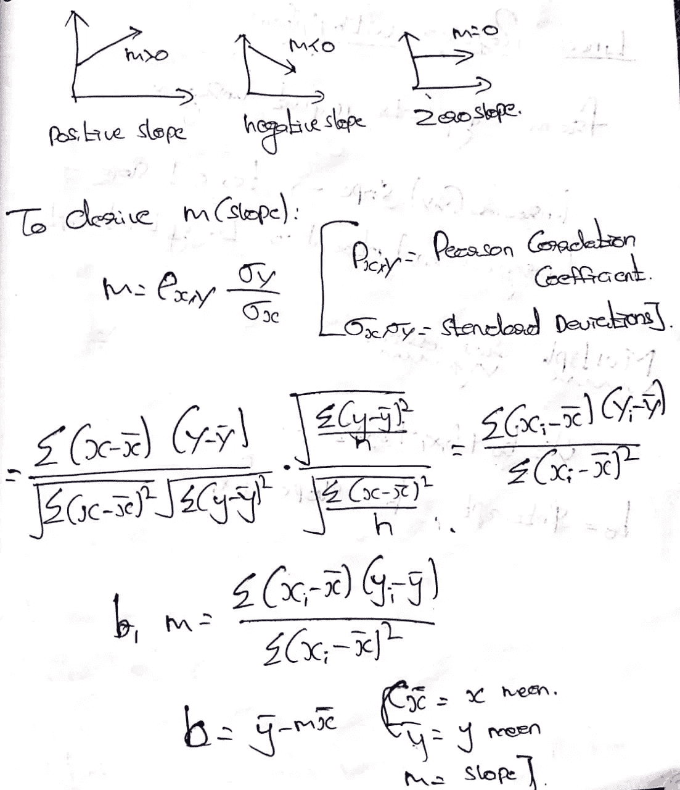

图 2:计算简单线性回归的斜率(m)和截距(b)的步骤。

图 3:截距计算

图 4:斜率计算

***探坡(‘B1’或‘m’):***

*   如果斜率> 0，则 X(预测值)和 y(目标值)具有正相关关系。也就是 X 的增加会增加 y
*   如果斜率< 0, then X (predictor) and y (target) have a negative relationship. That is increase in X decreases y.
*   If slope = 0, then X (predictor) and y (target) have no relationship.

***探索 y 轴截距(‘B0’或‘c’):***

*   如果模型不包括 x=0，那么预测将变得没有意义，只有 b0。例如，我们有一个关于身高(x)和体重(y)的数据集。取 x=0(即身高为 0)，将使方程只有 b0 值，这是完全没有意义的，因为在实时身高和体重永远不会为零。这是由于考虑了超出其范围的模型值。
*   如果模型包括值 0，那么“b0”将是 x=0 时所有预测值的平均值。但是，将所有预测变量设置为零通常是不可能的。
*   b0 值保证剩余具有平均值零。如果没有' b0 '项，那么回归将被强制越过原点。回归系数和预测都会有偏差。

## 多元线性回归:

多元线性回归对于找出 n 个自变量和一个因变量之间的关系很有用。以便找到优化的斜率和截距，即实际值和预测值之间误差较小的值。为了找到优化的斜率和截距值，使用线性回归算法的梯度下降心。

图 5:多元线性回归公式。

***渐变下降:***

梯度下降是一种寻找函数最小值的一阶迭代优化算法。它采用递归方法来寻找最佳斜率(m)和截距(b)。成本函数(误差)应该减少。

图 6:成本函数(误差)

*   现在，我们要用偏导数得出最佳斜率和截距。
*   偏导数是一种在将其他变量视为常数的同时，对一个独立变量的函数进行微分的方法。它被表示为

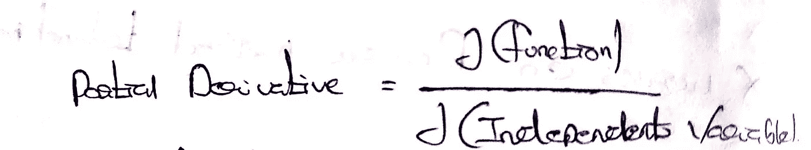

图 7:偏导数公式。

*   当我们在斜率和成本函数之间绘制图形时，梯度下降曲线就出现了。

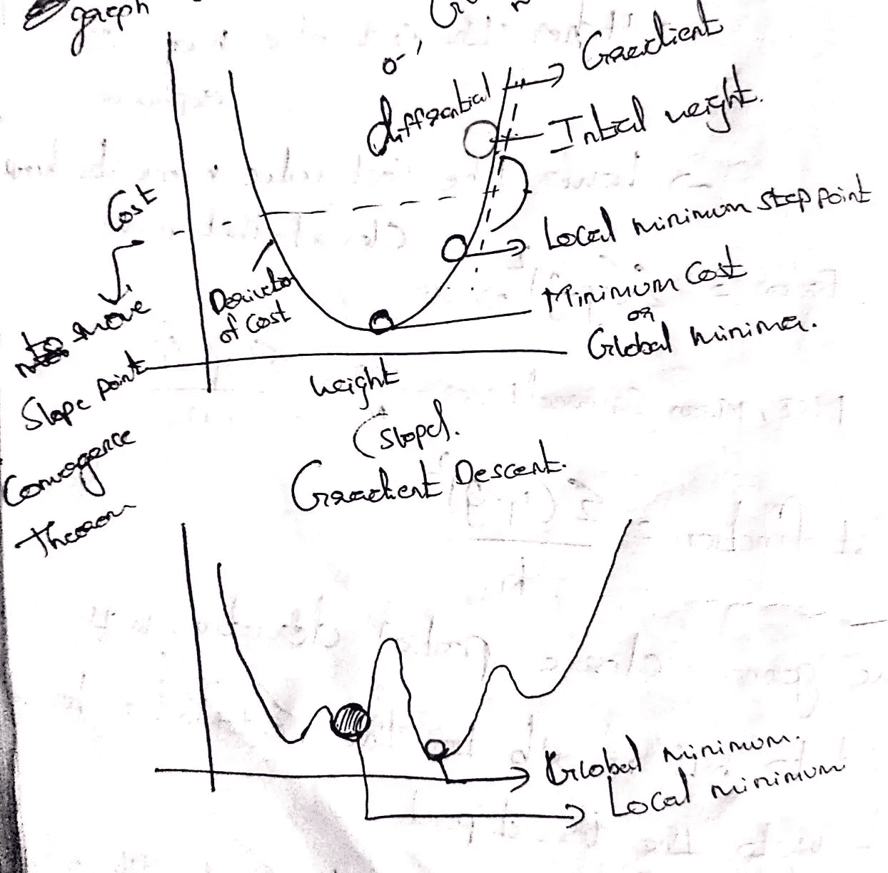

图 8:梯度下降。

*   偏导数方程 w.r.t 斜率和截距。

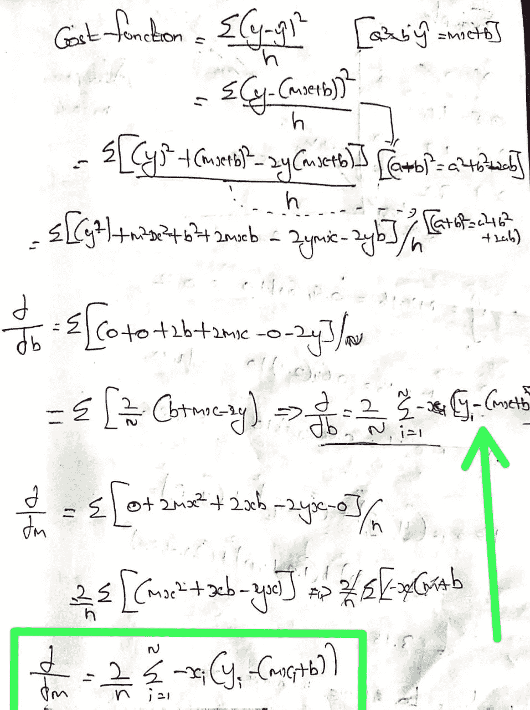

图 9:偏导数

*   使用梯度下降计算最小误差的示例。

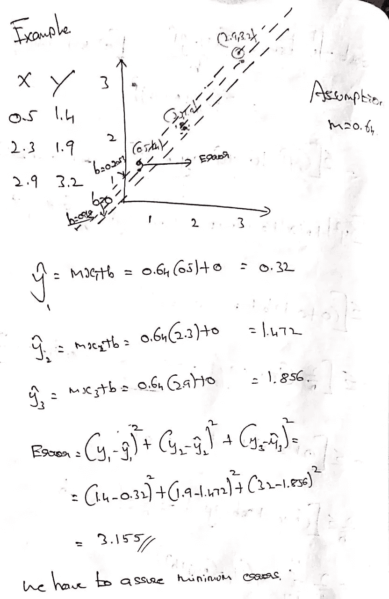

图 10:示例问题。

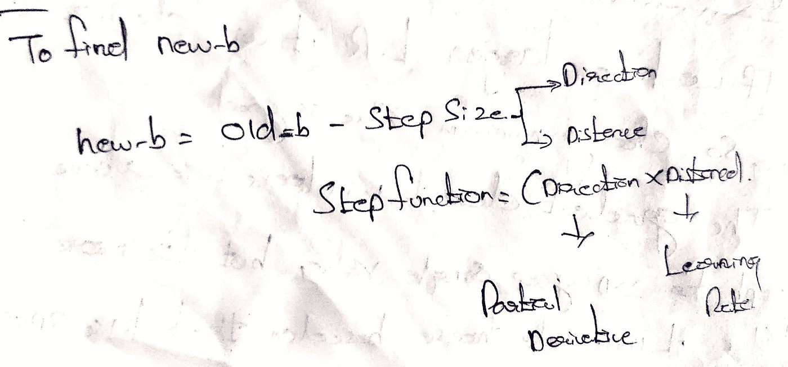

图 11:计算新截距的公式。

*   为了计算新的截距值，必须从步长中减去 old_b。

→步长=偏导数*学习率

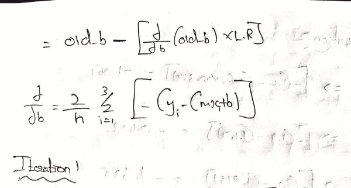

图 12:扩展的公式。

*   学习率意味着移动的距离，偏导数意味着移动的方向。
*   如果我们有更大的学习率值，它将偏离更多，所以选择最小值是好的。

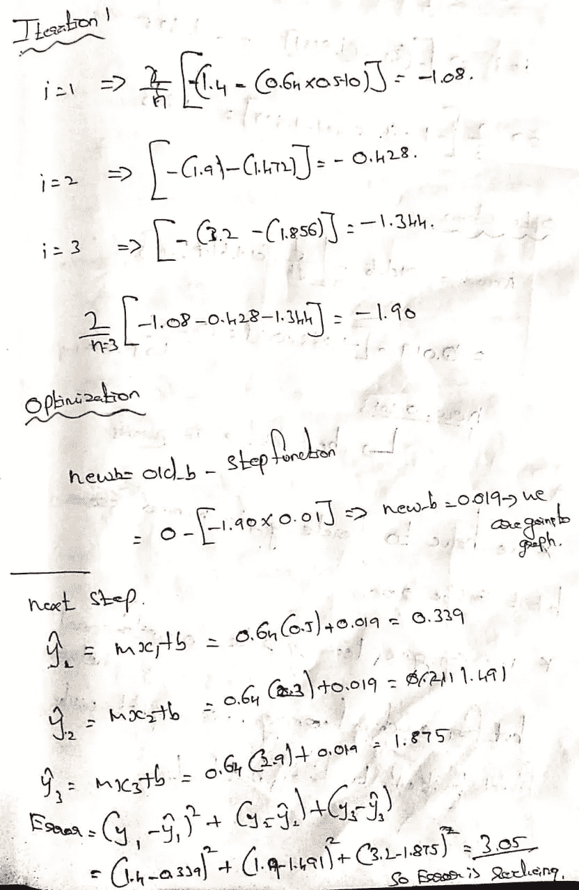

图 13:计算优化截距的步骤。

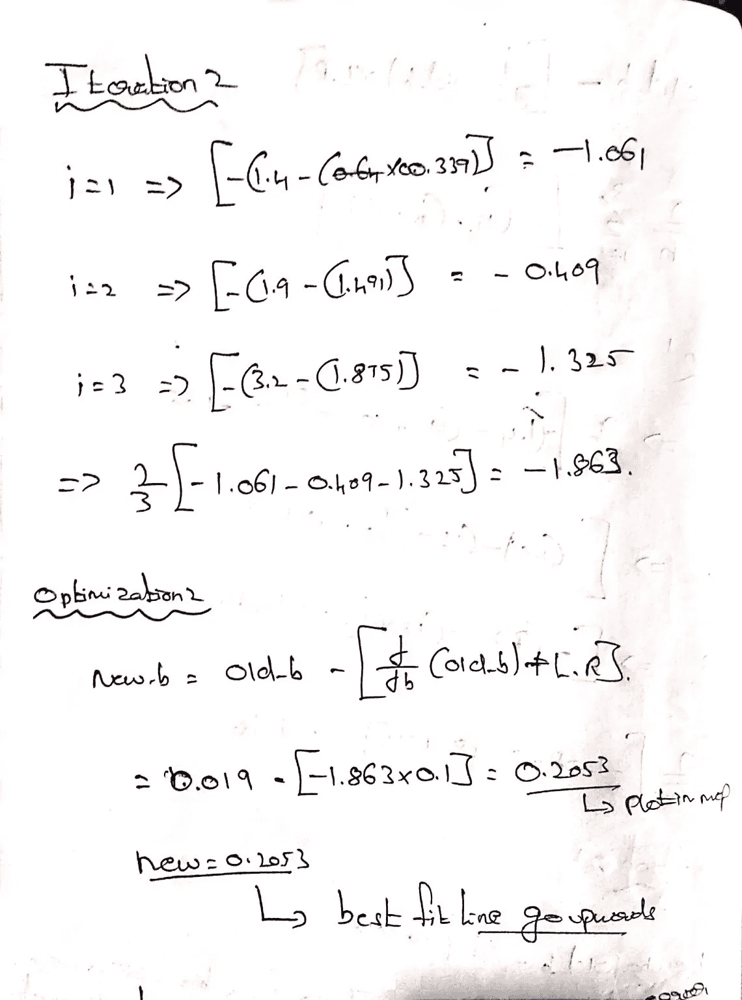

图 14:优化的截距值。

*   我们必须迭代这个过程，直到具有低误差的全局最小点，但是误差不会为零。

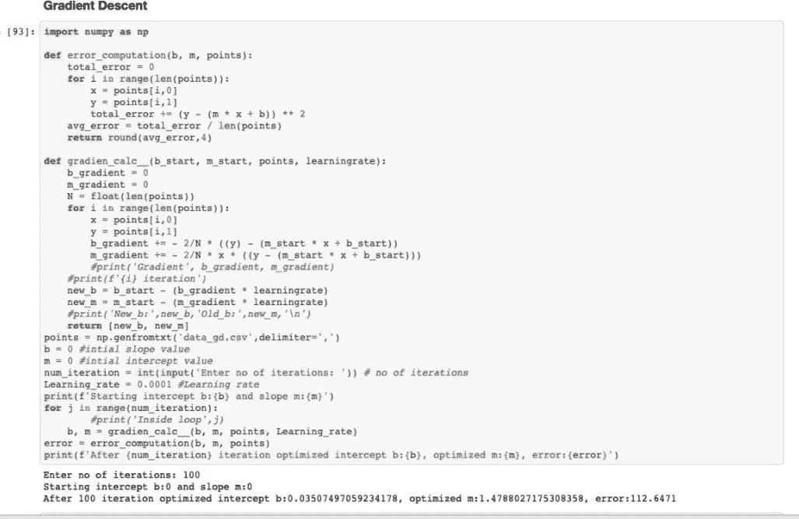

图 15:寻找梯度下降的程序。

梯度下降代码:[https://github . com/rishikumar 04/Data-Science-Training/blob/main/Linear _ Regression/01 _ Gradient % 20 decusing . ipynb](https://github.com/Rishikumar04/Data-Science-Training/blob/main/Linear_Regression/01_Gradient%20Descent.ipynb)

线性回归的假设:

*   线性关系
*   没有或很少多重共线性
*   同方差性
*   残差的正态性。

***线性关系:***

→X 和 y 之间应该有关系，要么是正关系，要么是负关系。

→线性回归对异常值敏感。

图 16:散点图。

*   自变量(X)和因变量(y)之间的正线性关系。

***多重共线性:***

*   多重共线性表示两个独立变量之间有很强的关系。
*   如果有关系，那么系数会有一些变化，方差会增加。因此，在将数据输入模型之前，必须从数据集中移除多重共线性。

*Homo =相同，Scedasticity =方差*

*   *残差(误差)应该具有相同的方差。*
*   *分布在数据上是一样的。*
*   *散点图是要绘制预测值及其误差，结果图应具有相同的误差方差。*

*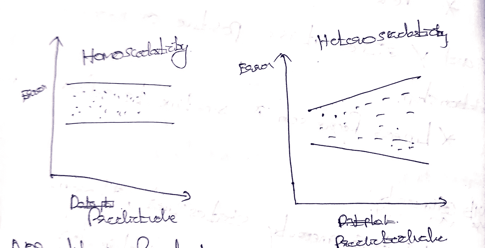*

*图 17:同方差和异方差*

****残差中的正态:****

*   *误差应该服从正态分布。*

*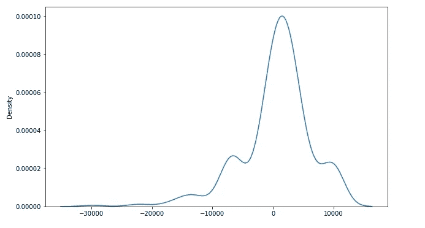*

*图 18:说明残差正态性的 KDE 图。*

*线性回归的其他求解实例:[https://github . com/rishikumar 04/Data-Science-Training/tree/main/Linear _ Regression](https://github.com/Rishikumar04/Data-Science-Training/tree/main/Linear_Regression)。*

*这是一个由资料汇编而成的教育帖(如何塞·波尔蒂利亚的 Udemy 课程，我的导师穆罕默德·伊姆兰([https://www.linkedin.com/in/imohamedimran/](https://www.linkedin.com/in/imohamedimran/))等)..)在我的旅途中帮助了我。*

*感谢阅读。*