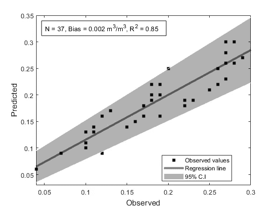

# MATLAB 中带置信区间的线性回归图

> 原文：<https://medium.com/nerd-for-tech/linear-regression-plot-with-confidence-intervals-in-matlab-f90ff0825e94?source=collection_archive---------0----------------------->

代码的最终输出。

在本文中，我们将讨论绘制线性回归(LR)曲线的简单代码。代码是用 MATLAB 写的，可以从 [**我的 MATLAB 资源库**](https://in.mathworks.com/matlabcentral/fileexchange/78703-linear-regression-plot-with-confidence-intervals-in-matlab) **下载。你可以写信给我(abhilash.singh@ieee.org)如果你有任何问题或访问我的网页**了解更多更新。****

**在 LR 中，我们的主要目标是通过观察值找到最佳拟合直线。最佳拟合线称为回归线。LR 的公式为**

**y = m *x + c**

**其中 y 是预测值，m 是直线的斜率，c 是截距。**

**在 MATLAB 中，我们使用了以下给出的回归命令**

**`[[b](https://in.mathworks.com/help/stats/regress.html#d120e604326),[bint](https://in.mathworks.com/help/stats/regress.html#d120e604364)] = regress(y,x)`**

**其中，b 是包含系数估计的向量(仅针对多个 LR)，bint 是包含系数估计的 95%置信区间的矩阵(仅针对多个 LR)。**

**您可以参考代码来源的 [**出版物**](https://www.mdpi.com/2072-4292/12/14/2266/pdf) 。**