# 线性回归——历史、理论和数学

> 原文：<https://medium.com/nerd-for-tech/linear-regression-the-history-the-theory-and-the-maths-e8333924b8a2?source=collection_archive---------2----------------------->

安迪·凯利在 [Unsplash](https://unsplash.com?utm_source=medium&utm_medium=referral) 上的照片

LR(线性回归)算法，每个人都说他们理解，但很少有人真正做到。

虽然大多数与 LR 相关的文章都专注于最小理论和方程，这样你就可以通过一轮 ML(机器学习)面试，但我在这里的目的是从头开始，带你探索统计学和基本 ML 中最常见的算法

# **一点历史**

LR 来自一个被称为**回归分析**的统计过程家族，其历史可以追溯到 1805 年。回归分析只是一种对因变量和一个或多个自变量之间的关系进行建模的方法。回归分析最常见的形式当然是线性回归，但它不是第一种，最小二乘法[仍然适用。](https://en.wikipedia.org/wiki/Least_squares)

最小二乘不是线性回归的一部分吗，是也不是。

最小二乘法通常有两种类型，线性和非线性，线性最小二乘法或普通最小二乘法是用于估计线性回归中的参数

# **什么是线性回归？**

线性回归算法试图通过拟合直线来模拟因变量和自变量之间的关系。这条线用下面的等式表示，即

其中 *y* 是因变量(例如:-房价)

*x* 是独立变量(例如:-卧室数量)

β0 是截距

β1 是斜率

u 是随机误差分量

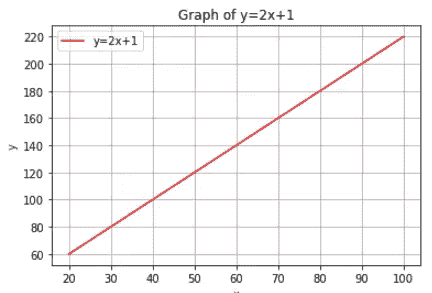

如你所见，β1 或**斜率**为 **2** ，这意味着 *x* 的每一个单位变化，都会增加 **2** 个单位。

但是我们是怎么得到这条线的，我们怎么知道这是捕捉到 *x* 和 *y* 之间关系的最佳线(也就是最佳拟合线)

让我们从一个例子开始:

假设你是一名学生，你想根据你学习的小时数/天数找出你这学期的平均绩点。所以你要做的是在两个变量之间建立一些关系。

首先，你去收集数据，从你所有的前辈在同一个。所以这里的 *y* 是 GPA， *x* 是平均每天学习的小时数

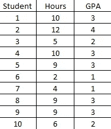

10 名学生的数据样本

让我们把它画在散点图上

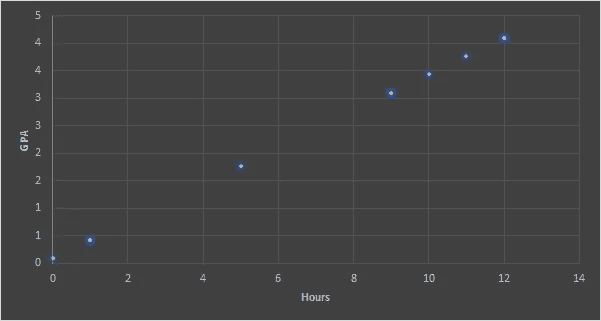

你可以清楚地看到，这两个变量之间存在某种线性关系，我们的工作是找出解释这种关系的最佳拟合线，并可用于根据平均小时数/天预测未来的平均绩点

为此，我们需要定义一个**成本函数**并将其最小化。所以基本上在线性回归中，我们的成本函数是均方误差

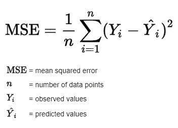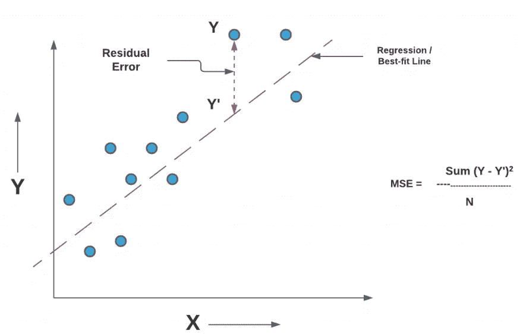

【https://tinyurl.com/es8xcdaj 号

因此，我们可以看到我们选择的线有误差(原始点与线/预测点的垂直距离)，我们的工作是选择一条最小化误差平方和的线(为什么是正方形？平方是必要的，以消除任何负号。它也给予较大的差异更多的权重)

一种非常天真的方法是尝试β0 和β1 的所有排列和组合，但这可能会花费大量时间，并且不是计算上合理的方法。

**我们将尝试两种最广泛使用的方法:**

1.  **普通最小二乘法(OLS 法)**

为了计算β0(截距)和β1(斜率)的值，使我们的成本函数最小化并给出最佳拟合线，我们使用以下公式

截距=因变量平均值-斜率*自变量平均值

斜率=((因变量-因变量的均值)*(自变量-自变量的均值))/(因变量-因变量的均值)

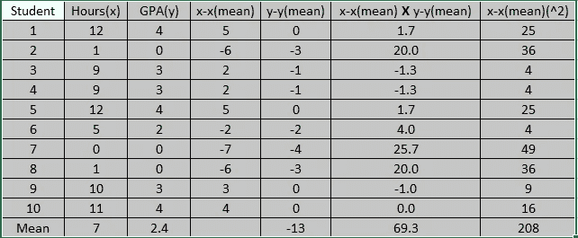

我用上述公式计算截距和斜率的 excel 表格

β1(斜率)将是 69.3/208= 0.3

β0(截距)将是 2.4–0.3 = 2.1

所以我们得到的等式是 ***y = 0.3x+2.1***

最重要的问题:-我们如何推导截距和斜率的公式？这就是我们现在要做的，推导这两个公式。让我们开始吧

我们的目标是**最小化我们的成本函数:**

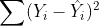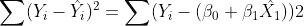

**所以我们要做的是下面的**:

1.  根据β1 和β0 计算上式的偏导数
2.  将偏导数设置为 0 以获得最小值(我们不会覆盖二阶导数来确定它是最小值)
3.  求解β1 和β0

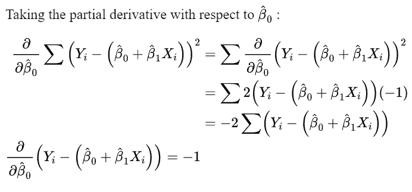

**第一步**-基本上在第一步中，我们得到了总和的导数(总和的导数就是导数的总和)

**第二步** -使用幂法则，我们得到 2

第三步——使用链式法则，我们计算括号内任何东西的导数，导数是-1

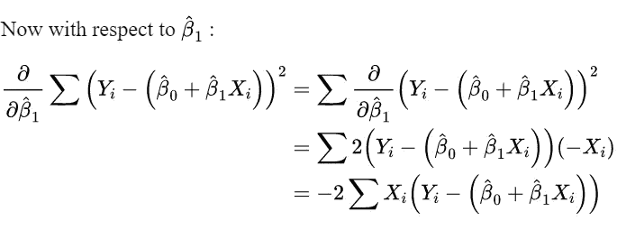

**第一步** -基本上，在第一步中，我们得到了总和的导数(总和的导数就是导数的总和)

**第二步**——使用幂法则，我们得到 2

第三步 -使用链式法则，我们计算括号内任何东西的导数，导数是 Xᵢ

因此最终将偏导数(**等式 1 和等式 2** )设置为等于 0:

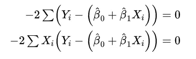

将两个等式除以-2，然后使用**等式 1** :

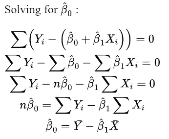

第一步:我们对每个单独的值求和

**第二步**:因为β0 和β1 是常数，我们把它们从求和中取出来(假设 n 个样本值)

**步骤 3** :分离出β0 变量，如果我们将 *Y 的所有值的总和除以* n 个样本，我们得到平均值，同样适用于 *X*

我们刚刚导出了等式的第一部分

现在求解β1:

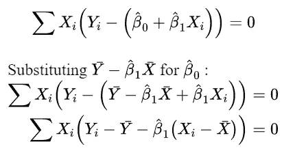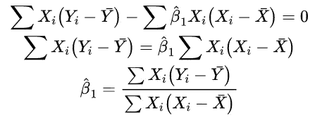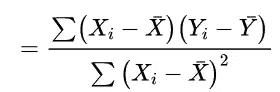

步骤 1:我们已经计算了β0，所以让我们把它代入**等式 2**

第二步:让 x 和 y 术语一起出现

第三步:分离β1 并求解

瞧啊。我们刚刚推导了普通最小二乘法中一直使用的截距和斜率的公式

# 2.梯度下降

梯度下降是迄今为止机器学习和深度学习中最常用的优化策略。这是一种优化算法，用于训练机器学习模型。它基于凸函数并反复调整其参数，以最小化给定函数(主要是损失函数/成本函数)至其局部最小值。

让我们先用一个例子来讨论梯度下降的主要步骤，然后我们将继续讨论 MSE 函数

## 单变量函数示例

**衍生**

假设我们的函数是 J(θ)= θ，我们想找到使 J(θ)最小的θ值。所以我们要做的第一件事是，我们要找到函数的导数。

为什么衍生？从几何学上讲，函数的导数可以解释为**函数的图形的斜率，或者更准确地说，解释为一点处切线的斜率。**为什么我们需要一个斜率，我们必须知道我们的函数是否向最小值移动，其次，如果斜率足够大，我们需要移动得更快，反之亦然，如果斜率很小。

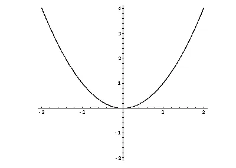

图中表示的 J(θ)= θ函数

我们可以清楚地看到，最小值在 x=0 处，随着越来越接近最小值，斜率越来越小。假设我们在 x=-3，y=9，这意味着我们要向左移动，迈出大步

# 学习率—α

假设坡度很大，就像我们的例子一样，我们必须快速移动，我们该怎么做呢？我们使用学习率，学习率基本上告诉我们应该采取多大或多小的步骤来达到局部最小值。

# 趋同；聚集

取决于函数和学习速率，梯度下降可能收敛或不收敛。通常所做的是定义梯度下降在停止之前向局部最小值移动的最大迭代次数。

# **数学**

θ的导数就是 2θ。使用 *a* 作为学习速率，这就是梯度下降如何在每次迭代后持续更新θ

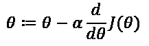

θ和 *a* 的初始值分别为 2 和 0.1

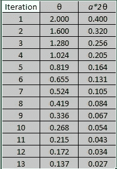

运行了 13 次迭代

如你所见，算法向 0 移动，但它不会收敛于 0，但我们会找到一些局部最小值

# MSE 的梯度下降

MSE 的上述等式是我们的成本函数，我们想要找到将最小化我们的成本函数的参数β1(斜率)和β0(截距)。现在，假设我们的函数中有多个变量需要最小化，我们要做的是使用β1(斜率)和β0(截距)计算偏导数，就像我们在 OLS 部分所做的那样。这是我们之前计算的偏导数

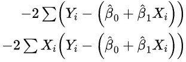

最终更新规则:

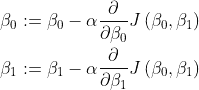

因此，像前面的单变量过程一样，我们将从更新一个变量开始，然后继续计算下一个变量，直到我们达到局部最小值

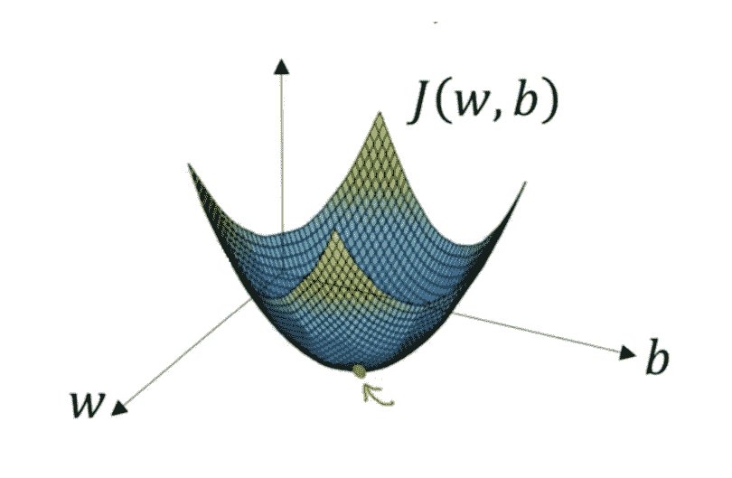

梯度下降法如何处理两个未知数

在这种情况下，普通的最小二乘法有封闭形式的解，为什么我们还需要梯度下降？

我将引用我读过的关于这个问题的最佳答案

“将梯度下降用于线性回归的主要原因是计算的复杂性:在某些情况下，使用梯度下降找到解在计算上更便宜(更快)。

公式(OLS)看起来非常简单，甚至在计算上，因为它只适用于单变量的情况，即当你只有一个变量。在多变量的情况下，当你有许多变量时，理论上的公式稍微复杂一些，当你在软件中实现时，需要更多的计算

# **线性回归的类型**

1.  **简单线性回归**:一个解释变量和一个因变量的线性回归的最简单情况。例句:体重和健康
2.  **多元线性回归**:现实生活中通常有多个解释变量来解释一个因变量。例句:健康的体重和身高
3.  **多元线性回归**:这是人们最容易与多元线性回归混淆的地方，MVR 是具有多个解释变量和**多个因变量的 LR 的特例。**例如:预测两个科目的 GPA，使用的因素包括学习总时数、这两个科目的以往成绩等。

# **线性回归的假设:**

1.  **线性:**因变量 *y* 会与任何一个自变量有线性关系。为什么？这是准确的假设，它帮助我们拟合直线，如果关系是非线性的，你怎么拟合直线
2.  **同方差:**假设残差(拟合的实际值)具有恒定的方差。

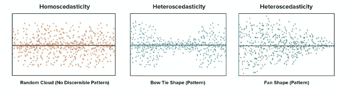

[https://tinyurl.com/ks4a983s](https://tinyurl.com/ks4a983s)(所有的点都是拟合的残差)

因此，如果你对拟合值绘制残差图，并查看其均值的方差，它应该是常数。如果这个假设不成立，我们为什么要费心呢？经典 LR 可以预测数据平均值附近某处发生的常见情况，但当数据变得更加发散时，它就明显不足了。

3.**独立性**:线性回归模型假设误差项是独立的。这意味着一个观测值的误差项不受另一个观测值的误差项的影响。如果不是这样，则称为**自相关。**

我们为什么要烦恼呢？估计的标准误差往往低估了真实的标准误差。因此相关的 p 值较低。这导致一个结论，即一个变量是重要的，即使它不是。置信区间和预测区间比它们应有的范围要窄。

4.**多重共线性**:出现在两个或两个以上解释变量密切相关的多元回归模型中。很难解释什么解释是由哪个变量引起的，我们也有解释因变量中相同方差的变量

5.**正态分布**:残差应服从均值为 0 的正态分布。置信区间和变量显著性的计算就是基于这个假设。

# **当线性回归不起作用时:**

当然，一个非常简单的答案可能是——当这些假设不成立时，但大多数线性回归不起作用有一个原因，那就是所谓的交互效应。

在回归中，当一个自变量对一个因变量的影响基于其他自变量的值不断变化时，我们说存在交互作用效应。假设你在优步工作，你试图使用需求和供给作为变量来预测地理上哪些地方更适合消费者。很明显，这两个变量本身是高度相互作用的，我们的 LR 模型不能捕捉这种相互作用。这就是我们选择基于树的模型的时候。

# 更多资源和引用:

1.  [https://towards data science . com/linear-regression-simplified-plastic-least-square-vs-gradient-descent-48145 de 2cf 76](https://towardsdatascience.com/linear-regression-simplified-ordinary-least-square-vs-gradient-descent-48145de2cf76)
2.  [https://medium . com/analytics-vid hya/gradient-正派-线性回归-ec2308439478](/analytics-vidhya/gradient-decent-in-linear-regression-ec2308439478)
3.  [https://mccormickml . com/2014/03/04/gradient-descent-derivation/](https://mccormickml.com/2014/03/04/gradient-descent-derivation/)
4.  [https://www . research gate . net/post/The-difference-between-least-square-fitting-and-gradient-descent](https://www.researchgate.net/post/The-difference-between-least-square-fitting-and-gradient-descent)
5.  [https://medium . com/analytics-vid hya/gradient-decorate-in-linear-regression-EC 2308439478](/analytics-vidhya/gradient-decent-in-linear-regression-ec2308439478)
6.  [https://www.youtube.com/watch?v=ewnc1cXJmGA](https://www.youtube.com/watch?v=ewnc1cXJmGA)
7.  [https://www.coursera.org/learn/machine-learning](https://www.coursera.org/learn/machine-learning)

# 摘要

我在这里试图做的是涵盖一个模型的每一个方面，因为它是如此的基础，以至于我们有时都会低估它。线性回归是一个非常强大的模型，在生物技术领域仍然被广泛使用。虽然本文在某些方面可能会更详细，但如果读者喜欢，我会将该任务留给他们去更深入地研究。

如果你想让我在下一篇文章中强调什么，请在评论中告诉我，也请随时通过 LinkedIn 联系我。如果你还有任何问题，我会尽力回复。

阅读我的其他文章:

1.  [https://medium . com/nerd-for-tech/a-primer-to-time-series-forecasting-58 bbd 91 CB 3 BD](/nerd-for-tech/a-primer-to-time-series-forecasting-58bbd91cb3bd)
2.  [https://medium . com/nerd-for-tech/从商业分析师到数据科学家-4720f536888d](/nerd-for-tech/from-a-business-analyst-to-a-data-scientist-4720f536888d)
3.  https://faun . pub/a-primer-to-区块链和-the-crypto-world-964 e 48 ed 96 af