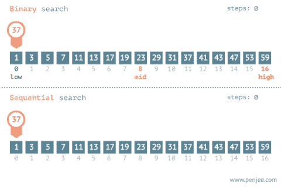
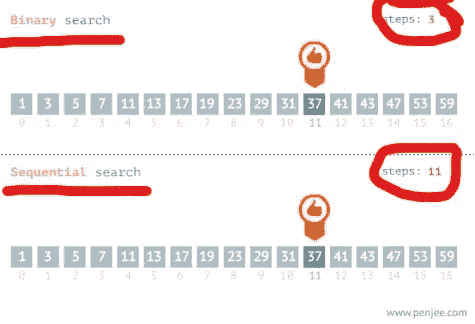

# 线性搜索 vs 二分搜索法

> 原文：<https://medium.com/nerd-for-tech/linear-search-vs-binary-search-1e55be4e2565?source=collection_archive---------10----------------------->

**TLDR—****线性搜索从头到尾循环遍历一个数组，而二分搜索法将数组分成两半，进行半区间搜索。如果找不到变量，它会根据其相对于搜索主题的位置过高或过低，将数组分成另一半，如下所示。在 T4，一般来说，二分搜索法对于大型阵列来说要快得多。**

**看看下面这张 gif:**

****

**[来源](https://www.interviewbit.com/courses/programming/topics/binary-search/)**

# **线性搜索**

**线性搜索在特定情况下更有意义:**

*   **如果你的数组保证很小。为长度为 3 的数组设计一个花哨的二分搜索法没有多大意义。[“萨博”、“沃尔沃”、“宝马”]**
*   **如果您只是实现最简单的解决方案，并且不关心速度，那么线性搜索将是一个不错的选择。**

# **二进位检索**

**二分搜索法是:**

*   **比线性搜索更大数组要快得多。**
*   **实现起来相对简单的算法。**

**最大的优势是二分搜索法的工作速度，这可以通过大 O 符号来衡量——如果你没有更新大 O 符号，你可以在这里看到我的帖子[并在完成后返回。](https://medium.com/r?url=https%3A%2F%2Fdanleitch.medium.com%2Fbig-o-notation-basics-for-web-developers-af02ec3b89f)**

# **大 O 符号**

**让我们比较一下这两个搜索，以便正确理解二进制能给我们带来的性能提升。**

**使用**线性**搜索，时间复杂度将总是 O(n ),这是因为随着阵列的增加，迭代次数也随之增加。例如，一个包含 100 项的数组可能意味着 100 次迭代，因为我们需要的项可能是数组中的最后一项。**

****二进制**搜索有点混合了 **O(log n)** 和 **O(n)** ，但通常会更接近于 **O(log n)** 。这使得二分搜索法方法成为一种更有效的搜索算法，因为它可以更好地适应数组的大小。**

**回到页面顶部的 gif，您会发现查找“37”的总迭代次数是**

*   **3 为二进制 **O(3)****
*   **11 顺序 **O(11)****

**在我们的例子中，使**二进制的效率提高了 3.6 倍。****

****

****脚注:****

**它实际上会是 max 值/ 2。例如，如果你从 1-100 中随机抽取 100 万个数字，很明显 50 是平均值。**

****使用的资源****

*   **[Quora](https://qr.ae/pNzzm5)**
*   **I [nterviewbit.com](https://www.interviewbit.com/courses/programming/topics/binary-search/)**