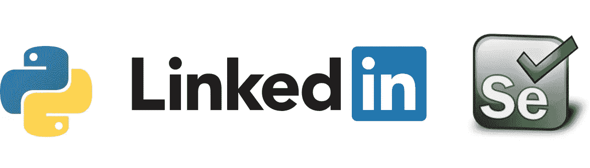
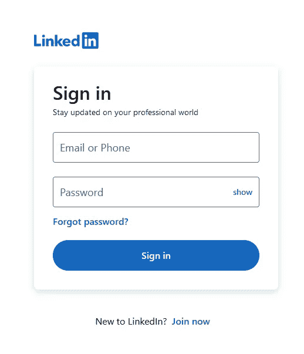
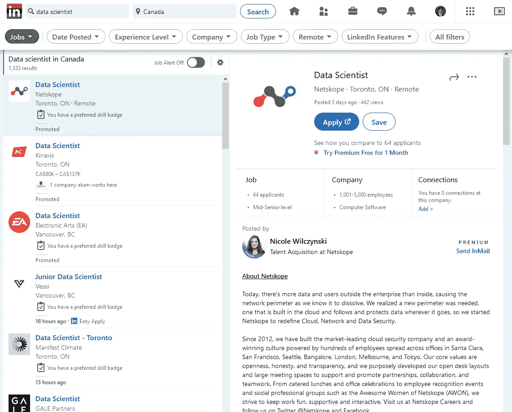

# 开始用 Python 和 Selenium 抓取 LinkedIn

> 原文：<https://medium.com/nerd-for-tech/linked-in-web-scraper-using-selenium-15189959b3ba?source=collection_archive---------2----------------------->



# **简介**

网络抓取是数据科学项目中的一项常见任务，我最近想要 LinkedIn 上的工作列表数据。这是一个更大的 NLP 项目的一部分，所以我想要每个帖子的文本描述。在这篇文章中，我展示了如何创建一个 Python 类来抓取 LinkedIn 上的招聘信息。这篇文章的结尾将包括 LinkedInBot 类和演示其用法的脚本。

如果您只是想要代码— [这里是 GitHub 存储库](https://github.com/MatanFreedman/LinkedInBot)，它有一个 LinkedInBot 类和一个使用 sqlite3 存储数据的 DBCommunicator 类。

**免责声明:**本文介绍了在某些情况下可能违反 LinkedIn 条款和条件的做法。在以任何方式继续之前，读者有责任检查 LinkedIn 政策。

# **LinkedIn 网页抓取**

网络抓取是在线数据收集的自动化。对于静态网站，一个简单的带有适当参数的 HTTP 请求就可以获得您需要的所有信息，然后您必须在存储之前对这些信息进行解析和清理。LinkedIn 使用了大量的动态异步加载(即，除非你点击或滚动查看数据，否则不会加载数据)。因此，您需要使用 Python 的 [Selenium](https://selenium-python.readthedocs.io/) web 驱动程序。

# 硒入门

要使用 Selenium，您需要安装 Python 包并下载您选择的 [web 驱动程序](https://selenium-python.readthedocs.io/installation.html)(我使用 Firefox):

```
pip install selenium
```

硒比较好用。首先你必须启动 webdriver，然后你可以像任何普通的 web scraper 一样请求页面。

```
from selenium import webdriverdriver_path = "geckodriver.exe"
driver = webdriver.Firefox(executable_path=driver_path)
```

# LinkedIn 抓取

要登录 LinkedIn，您需要将浏览器定向到 LinkedIn，并使用凭据登录。



LinkedIn 的登录页面。

我使用 Selenium 的 *find_element_by_name* 方法来查找登录信息的输入。

```
from selenium import webdriver
import time
from selenium.webdriver.common.keys import Keys# direct the webdriver to where the browser file is:
driver_path = "geckodriver.exe"
driver = webdriver.Firefox(executable_path=driver_path)# your secret credentials:
email = "your@email.com"
password = "123456"# Go to linkedin and login
driver.get('https://www.linkedin.com/login')
time.sleep(3)
driver.find_element_by_id('username').send_keys(email)
driver.find_element_by_id('password').send_keys(password)
driver.find_element_by_id('password').send_keys(Keys.RETURN)
```

这会将浏览器驱动到 LinkedIn 的登录页面，并使用 Seleniums "*find _ element _ by _ id*"函数向适当的输入发送电子邮件和密码。Selenium 有一些这样的函数，可以根据类名、id、css 选择器和 xpath 查找元素。注意，我实现了一个 time.sleep 方法，让浏览器暂停三秒钟。等待允许浏览器在您的脚本移动到下一个任务之前加载页面元素。

接下来，该机器人将转到 LinkedIn 工作页面，并根据一些关键字和位置搜索列表:

```
driver.get("https://www.linkedin.com/jobs/")
time.sleep(3)# find the keywords/location search bars:
search_bars = driver.find_elements_by_class_name('jobs-search-box__text-input')search_keywords = search_bars[0]
search_keywords.send_keys(keywords)

search_location = search_bars[2]
search_location.send_keys(location)
search_location.send_keys(Keys.RETURN)
```

这里的搜索栏很难找到，所以我使用了它们的类名。

LinkedIn 使用左侧的侧边栏和右侧的主容器来显示列表及其各自的信息，如下所示:



LinkedIn 工作列表布局。

在机器人需要移动到下一页之前，列表每页最多有 25 个结果。因此，机器人需要能够点击每个列表，记录信息，然后滚动并点击下一个列表。

```
# get a list of all the listings elements's in the side bar
list_items = driver.find_elements_by_class_name("occludable-update")# scrolls a single page:
for each job in list_item:
    # executes JavaScript to scroll the div into view
    driver.execute_script("arguments[0].scrollIntoView();", job)
    job.click()
    time.sleep(3) # get info:
    [position, company, location] = job.text.split('\n')[:3]
    details = driver.find_element_by_id("job-details").text # do what you want with that info...
```

请注意，我获取的唯一信息是职位、公司、地点和描述。我的潜在用例是一个 NLP 项目，因此我只对描述文本感兴趣。您可以修改它来收集您喜欢的任何其他信息，例如发布日期、申请人、技能等。

# **Python Selenium Bot 类**

我已经介绍了基本的函数，但是为了把所有的东西联系在一起，我写了一个更完整的类对象，并在底部的 main 函数中展示了一个例子。

感谢您的阅读！

这是我的第一篇媒体文章，请在评论中告诉我我的表现。