# 链表-数据结构

> 原文：<https://medium.com/nerd-for-tech/linked-list-data-structure-d89115b896df?source=collection_archive---------10----------------------->

*在这篇博客中，我们将讨论另一种数据结构，即链表*

# **什么是链表？**

> 链表是一种用于存储数据集合的数据结构。链表具有以下属性:

●连续的元素由指针连接。

●在程序执行过程中，大小可以增大或缩小。

●可根据需要设定时间长度(直到系统内存耗尽)。

●不会浪费内存空间(但会为指针占用一些额外的内存)。它随着列表的增长分配内存。

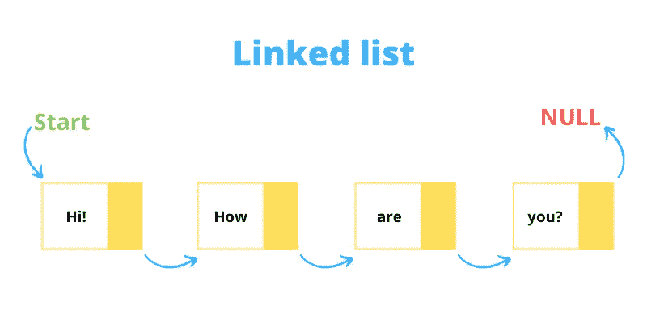

# **链表的基本属性:**

●列表的每个元素或节点由两项组成:

> ○数据
> 
> 指向下一个节点的指针(引用)。

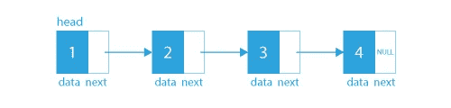

●在链表中，元素不是存储在连续的内存位置。

●链表的第一个节点称为 Head。

●链表的最后一个节点称为 Tail。

●最后一个节点引用了 null。

# **链表的表示**

链表的这种表示描述了每个节点由两个字段组成。第一个字段由数据组成，第二个字段由指向另一个节点的指针组成。

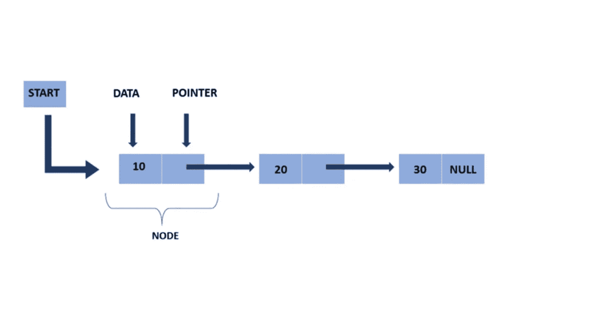

> 在这里，开始指针存储第一个节点的地址，在结尾，有一个空指针表示链表的结尾。

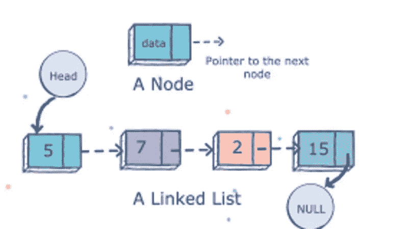

# **节点的创建和链表的声明**

**(JAVA)**

> 公共类节点 <t>{</t>
> 
> 测试数据；
> 
> 节点<t>下一个；</t>
> 
> 节点(测试数据){
> 
> this.data = data
> 
> next = null
> 
> }
> 
> }

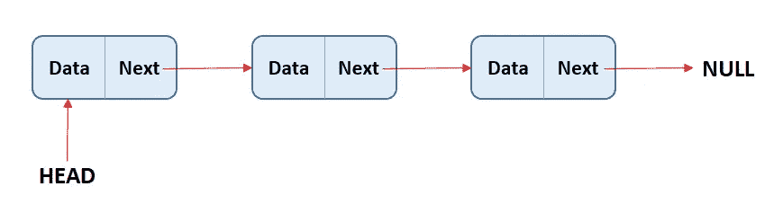

# **链表的类型**

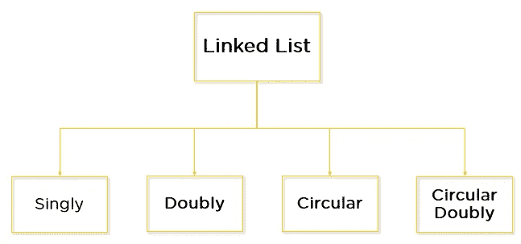

●单链表:通常“链表”是指单链表。每个节点只包含一个指向列表中后续节点的链接。

●双向链表:这是一个双向链表，因为每个节点不仅指向下一个指针，还指向上一个指针。

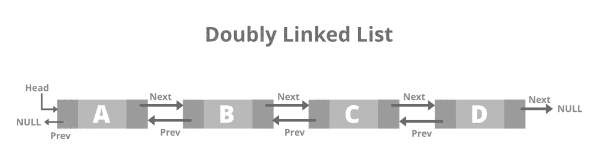

●循环链表:没有尾节点，即下一个字段从不为空，最后一个节点的下一个字段指向头节点。

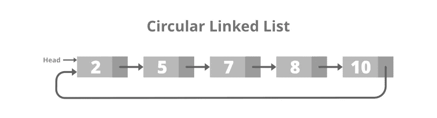

●循环双向链表:双向链表和循环链表的组合。

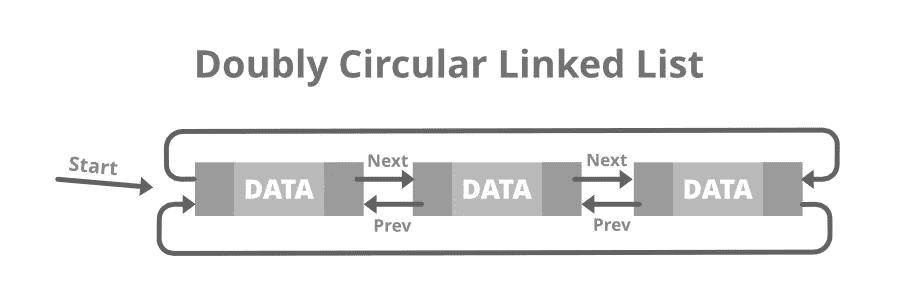

# **链表上的基本操作**

*   遍历:逐个遍历所有节点。
*   插入:在特定位置插入新节点。
*   删除:从特定位置删除节点。
*   搜索:从链表中搜索元素

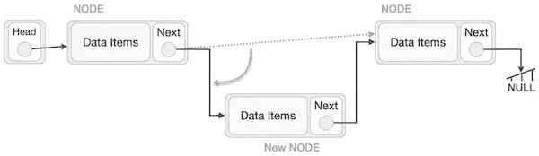

**A .在链表中插入节点(迭代地)**

**(JAVA)**

> 公共静态节点 <integer>insert(节点 <integer>head，int data，int pos){</integer></integer>
> 
> 节点 <integer>newNode =新节点<integer>(数据)；</integer></integer>
> 
> if(pos == 0){
> 
> newNode.next = head
> 
> 返回 newNode
> 
> }
> 
> int I = 0；
> 
> 节点<integer>temp = head；</integer>
> 
> while(i < pos — 1){
> 
> temp = temp.next;
> 
> i++;
> 
> }
> 
> newNode.next = temp.next;
> 
> temp.next = newNode;
> 
> return head;
> 
> }

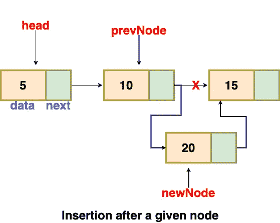

**B .链表中节点的插入(递归)**

**(JAVA)**

> public static linked listnode<integer>insert(linked listnode<integer>head，int pos，int elem){</integer></integer>
> 
> if (pos==0){
> 
> linked listnode<integer>new node = new linked listnode<integer>(elem)；</integer></integer>
> 
> newNode.next = head
> 
> 返回 newNode
> 
> }
> 
> if (head==null){
> 
> 回程头；
> 
> }
> 
> head.next=insert(head.next，pos-1，elem)；
> 
> 回程头；
> 
> }

**C .删除链表中的一个节点**

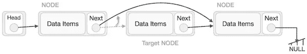

**(JAVA)**

> 公共静态 linked listnode<integer>delete noderec(linked listnode<integer>head，int pos) {</integer></integer>
> 
> if (head==null){
> 
> 回程头；
> 
> }
> 
> if (pos==0){
> 
> head = head.next
> 
> 回程头；
> 
> }
> 
> linked listnode<integer>ans = deleteNodeRec(head . next，pos-1)；</integer>
> 
> head.next = ans
> 
> 回程头；
> 
> }

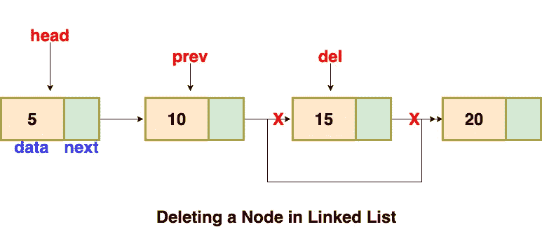

# **为什么使用链表而不是数组？**

到目前为止，我们一直使用数组数据结构来组织要单独存储在内存中的一组元素。然而，为了决定在整个程序中使用的数据结构，数组有几个必须知道的优点和缺点。

数组包含以下限制:

1.  在程序中使用数组之前，必须预先知道它的大小。
2.  增加阵列的大小是一个耗时的过程。几乎不可能在运行时扩展数组的大小。
3.  数组中的所有元素都需要连续存储在内存中。在数组中插入任何元素都需要移动它所有的前一个元素。

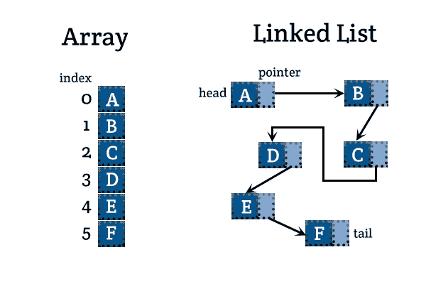

链表是一种可以克服数组所有限制的数据结构。使用链表很有用，因为，

1.  它动态分配内存。链表的所有节点都不连续地存储在内存中，并借助指针链接在一起。
2.  大小不再是一个问题，因为我们不需要在声明时定义它的大小。列表根据程序的需求增长，并受限于可用的内存空间。

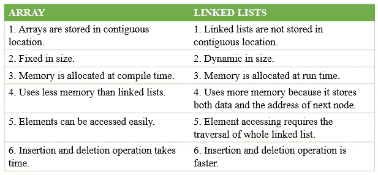

> 我希望这篇博客能让你对数据结构中的链表有一个清晰的了解。如果这个博客有助于你理解这个概念，那么请与你的朋友分享，并随时分享你的观点和对博客的反馈。如果你喜欢这个博客，请停止鼓掌。
> 
> 点击“关注”按钮获取更多此类内容，并保持联系以了解更多数据结构。