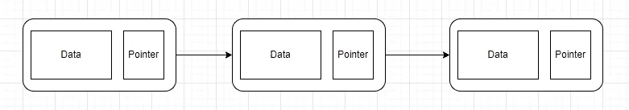
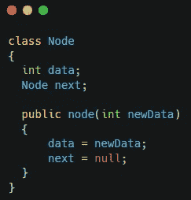

# 链表

> 原文：<https://medium.com/nerd-for-tech/linked-list-ef44811b635f?source=collection_archive---------2----------------------->

链表是通过指针在内存中连接的数据节点的线性集合。每个节点都存储有数据值和指向另一个节点的指针或引用。当一个节点的指针指向另一个节点时，就创建了一个链表。

与数组或列表不同，链表元素不存储在连续的内存位置。指针或引用允许节点分散在内存中，并且在链表中仍然保持连接。这允许您在不重新分配整个结构的情况下添加或移除列表元素，因为元素不需要连续存储在内存中。

上图显示了节点类的基本定义。链表只是指向字符串中下一个节点的这些节点的集合。