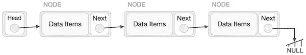
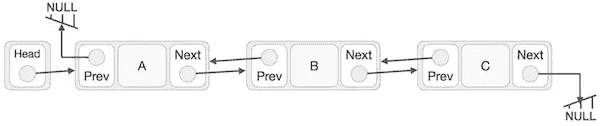
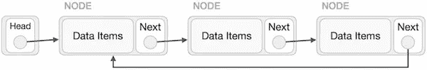
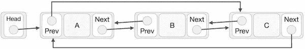
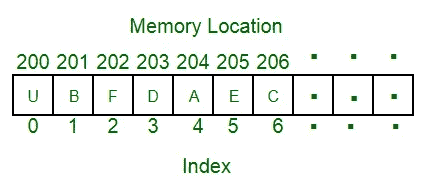
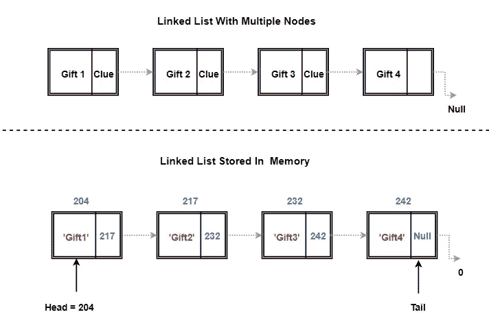
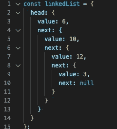
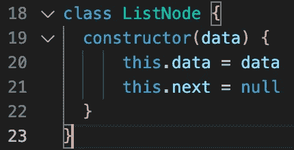
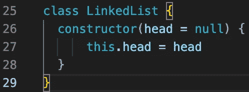
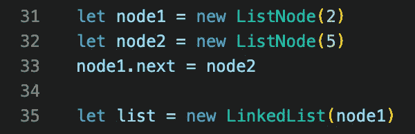

# 链表快速浏览数据结构

> 原文：<https://medium.com/nerd-for-tech/linked-lists-a-quick-look-into-data-structures-c858b87f9b9b?source=collection_archive---------18----------------------->

作为一个渴求知识和理解的初级开发者，好奇心成了潜入最深兔子洞的最佳资产。这些深坑中的一个就是数据结构。在 Javascript 和 web 开发的世界中，我们已经了解了一些表面上的结构，对象、数组，甚至二叉树。然而，再深入一点，似乎会出现一种数据结构，它声称是计算机科学领域中一些更抽象的数据结构的构建块。这个简单的数据结构是一个链表。

**概述**

那么什么是链表呢？链表是数据元素的线性有序集合，这些数据元素不是存储在连续的内存位置，而是包含数据字段和对集合中下一个节点的引用的节点。好吧，那是什么？在高级语言中，我们不直接处理内存分配，听起来像数组，不是吗？

这是部分正确的，链表和数组可以解决类似的任务，但是有一些关键的区别，根据它们的使用情况，使它们的效率或高或低。在我们深入研究了链表的结构之后，我们会有更多的介绍。

一个链表可以直观的表示出来，如下所示。它是一个节点链，有一个头指针指示列表中的第一个节点，每个节点都有一个指向链中下一个节点的指针。如果它是链的最后一个节点，下一个指针将指向 null，表示它是列表的结尾。这种类型的链表称为简单链表或单向链表。在单链表中，数据结构的遍历是线性的，从开始到结束，不能像在数组中那样被索引随机访问。从头部开始并从一个节点到下一个节点连续访问每个节点。

单链表图片[https://www . tutorialspoint . com/data _ structures _ algorithms/images/linked _ list . jpg](https://www.tutorialspoint.com/data_structures_algorithms/images/linked_list.jpg)

还有一些其他类型的链表，如下所示:

**双向链表**

双向链表图片[https://www . tutorialspoint . com/data _ structures _ algorithms/images/double _ linked _ list . jpg](https://www.tutorialspoint.com/data_structures_algorithms/images/doubly_linked_list.jpg)

在双向链表中，每个节点都有一个指向下一个节点和上一个节点的指针，如图所示，头节点的上一个指针指向空，尾节点的下一个指针指向空。这允许在两个方向上遍历。

**循环链表**

作为循环图像的单链表[https://www . tutorialspoint . com/data _ structures _ algorithms/images/singly _ Circular _ Linked _ List . jpg](https://www.tutorialspoint.com/data_structures_algorithms/images/singly_circular_linked_list.jpg)

作为循环图像的双向链表[https://www . tutorialspoint . com/data _ structures _ algorithms/images/double _ Circular _ Linked _ List . jpg](https://www.tutorialspoint.com/data_structures_algorithms/images/doubly_circular_linked_list.jpg)

循环链表可以是单向链表，也可以是双向链表。在这两种情况下，尾节点的下一个指针指向头节点，而不是 null。在循环双向链表的情况下，头节点的前一个指针指向尾节点，而不是 null。

可以在链表上执行的一些基本操作有:

**插入:**

*   在标题前插入一个新节点
*   在尾部后插入一个新节点
*   在列表中间插入新节点

**删除:**

*   删除头节点
*   删除尾节点
*   从列表中间删除节点

**遍历:**

*   需要遍历链表来访问不在列表头部或尾部的任何值(例如:在列表中间插入或删除，搜索。

对什么是链表有了基本的理解，我们现在可以把它与更熟悉的数组数据结构进行比较。在 JavaScript 中，下面列出的一些优势并不明显，除非处理大型数据集，否则操作的实时复杂性并不明显。尽管如此，这里还是列出了链表的优点和缺点。

**链表的优点**

*   没有内存浪费:链表可以有效地使用内存，因为它是一个动态的数据结构。内存不是在编译时分配的，而是在运行时按需分配的。这是因为它不是一组连续分配的内存地址。指针只需要改变。相反，数组是预先分配的，并且必须是连续的。在接受未知数量元素的固定大小数组的情况下，任何未使用的分配大小都会被浪费。因此，为了避免这种情况，可以使用动态大小的数组。然而，这也是有代价的。
*   插入和删除操作:链表头和尾的插入和删除的时间复杂度为 O(1)。相比之下，动态调整大小的数组必须仍然具有连续的内存分配。这导致任何改变数组大小的操作的时间复杂度增加。例如，如果扩展一个数组，则分配一个新的内存段，并且必须将整个数组一次一个元素地复制到这个新的更长的地址集中。链表只需要指针被改变到新的下一个(或者在双向链接的情况下是前一个)。
*   实现其他结构:实现其他线性数据结构，如队列或堆栈，很容易通过链表实现，因为在插入或删除元素后，不需要执行像 shift 或 unshift 这样的操作。在堆栈数据结构的情况下，添加到堆栈或从堆栈弹出的主要操作只需要改变指针，而不需要在使用数组的情况下完全重新分配列表。

**链表的缺点**

*   内存使用:与存储相同数据点的数组相比，链表使用更多的内存，因为每个节点都必须存储指向下一个元素的指针。
*   遍历:遍历一个链表开销很大，但等于数组 O(n)的遍历时间复杂度。然而，不能像在数组中那样通过索引直接访问元素。要访问 n 位置的节点，必须遍历它之前的所有节点。遍历链表的第二点是反向遍历在单链表中是不可能的。需要一个双向链表通过前一个指针返回到头部。这也增加了存储器使用的问题，因为每个节点现在需要存储第二个指针。
*   访问元素:如遍历缺点中所述。通过常数时间 O(1)的随机访问是不可能的。这是由于它在运行时的动态内存分配。在数组的实例中，数组被赋给一个引用一组连续内存地址的变量，因此所有这些地址都是已知的，并且可以通过数组变量引用和索引直接访问。举个简单的例子，假设一个数组的长度为 6，并被赋给变量 x。变量 x 将引用一组连续的内存地址，从 200 开始，到 205 结束。因此，访问 x[0]指的是 200，x[1]访问的是 200 +3 = 203，我们不需要一个接一个地遍历每个索引。在链表的情况下，地址不是连续的，可以在任何地方。如下例所示，必须访问每个节点才能通过其 next 指针知道下一个节点地址。

内存镜像中的数组[https://media . geeks forgeeks . org/WP-content/uploads/array-2 . png](https://media.geeksforgeeks.org/wp-content/uploads/array-2.png)

内存镜像中的链表[https://tools QA . com/WP-content/uploads/sites/1/ng gallery/data-structures/linked-list-in-Memory-1 . png](https://toolsqa.com/wp-content/uploads/sites/1/nggallery/data-structures/linked-list-in-memory-1.png)

关于内存分配，应该注意一条重要的信息。在像 C 这样的低级语言中，内存必须手动管理。然而，JavaScript 为我们分配内存，并在不再使用时通过垃圾收集来释放内存。尽管我们不需要编写代码来直接管理这一点，但在幕后这种情况正在发生，并且确实增加了代码执行的时间。这对你意味着什么？这意味着即使您可能分析您的代码并发现两种不同数据结构的使用具有相似的时间复杂度，但实际的效率可能会有很大的不同。

**什么？我如何使用这个？**

好了，现在我们有了一些关于链表的信息。至少足够危险的信息。JavaScript 中的链表实际上是什么样子的？JavaScript 中的单链表如下所示:

那么我们如何实现一个链表呢？我们需要一些包含数据和指针的节点，还需要列表。节点可以定义为一个类，它的构造函数有两项，数据和指针。我们还需要 LinkedList 的一个类，它有一个初始化第一个节点并指向 null 的构造函数。

为了创建实际的链表，我们必须创建节点并分配指针，最后创建一个以第一个节点作为参数的链表。

如需更多类似上面列出的代码示例以及如何创建帮助器方法来对链表执行操作，请查看[www . freecodecamp . org/news/implementing-a-linked-list-in-JavaScript](http://www.freecodecamp.org/news/implementing-a-linked-list-in-javascript)。

**最终想法**

你现在可能会问。好的，那么我应该在哪里使用链表而不是数组呢？就像编程中的大多数问题一样，答案是视情况而定。您必须能够权衡您希望使用的数据结构的成本和收益，以确定哪种工具最适合这项工作。如果你试图解决的问题需要在列表的头部添加和删除元素，那么更有效的数据结构可能是链表。然而，如果您需要随机访问数据元素，遍历链表可能会被证明是缓慢和昂贵的。如果您需要一个未知大小的数据集合，那么使用动态大小的数组会更好，因为重新分配整个连续内存集的成本很高，还是应该以遍历时间为代价？或者可能有另一种数据结构更适合您的需要。问这些问题，并有好奇心去进一步挖掘，似乎是了解并成为更好的开发者的唯一途径。

链接列表的一些可能的真实世界用例可能是:
一个类似蛇的游戏，其中每当头部到达目标时，蛇身体位置列表的尾部被添加到蛇的尾部。

或者像 Christopher Webb 在本文中建议的那样，使用双向链表来创建音乐播放列表。[https://medium . com/journey-of-1000-apps/data-structures-in-the-real-world-508 f 5968545 a](/journey-of-one-thousand-apps/data-structures-in-the-real-world-508f5968545a)

参考资料/资源

[www.geeksforgeeks.org](http://www.geeksforgeeks.org)链表 Dat 结构。2018 年 8 月 31 日

[www.tutorialspoint.com](http://www.tutorialspoint.com)链表表示法

[https://developer . Mozilla . org/en-US/docs/Web/JavaScript/Memory _ Management](https://developer.mozilla.org/en-US/docs/Web/JavaScript/Memory_Management)

[https://www . tools QA . com/data-structures/linked-list-in-data-structures/](https://www.toolsqa.com/data-structures/linked-list-in-data-structures/)

[https://code burst . io/linked-lists-in-JavaScript-es6-code-part-1-6dd 349 C3 DCC 3](https://codeburst.io/linked-lists-in-javascript-es6-code-part-1-6dd349c3dcc3)

[https://www . freecodecamp . org/news/implementing-a-linked-list-in-JavaScript/](https://www.freecodecamp.org/news/implementing-a-linked-list-in-javascript/)