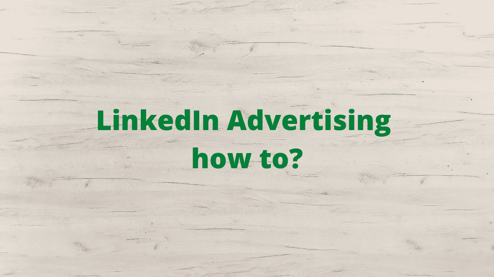

# LinkedIn 广告怎么做？

> 原文：<https://medium.com/nerd-for-tech/linkedin-advertising-how-to-3f851f9cffb5?source=collection_archive---------29----------------------->

在这份 LinkedIn 广告指南中，你可以了解为什么 LinkedIn 广告，LinkedIn 中不同类型的广告，如何创建你的 LinkedIn 广告，以及在创建你的 LinkedIn 广告活动时要记住的技巧和诀窍。

# 为什么是 LinkedIn 广告？

LinkedIn ads 为您提供了一个绝佳的机会来推广您的品牌、提高网站流量、产生新的销售线索并转化更多的销售额。

# LinkedIn 中的广告类型

LinkedIn 中有四种不同类型的广告。

**1。赞助内容**

**2。信息广告**

**3。动态广告**

**4。文字广告**

# 1.LinkedIn 赞助的内容

赞助内容使您能够在销售漏斗的每个阶段产生销售线索、提高品牌知名度并建立关系。

赞助广告显示在您的潜在客户 LinkedIn feed 上，您希望锁定他们。这种广告形式被贴上了推广的标签，以区别于 LinkedIn 平台上的其他内容。

有 4 种不同形式的赞助内容广告。

# 1.LinkedIn 单一图像广告

单一图像广告显示在 LinkedIn 的主页上，看起来类似于常规内容帖子，但它被标记为由 LinkedIn 推广，以区别于常规内容，并且它是一个付费帖子。

**单一图像广告的目标:**提高品牌认知度，推动网站访问量，增加参与度，推动网站转化，提高销售线索生成，吸引求职者。

# 2.LinkedIn 视频广告

LinkedIn 视频广告允许你向你的观众展示你的品牌故事，而不是讲述。这种广告形式有利于推出新产品、提升思想领导力、分享客户体验等。,

**视频广告的目标** —增加视频浏览量

# 3.LinkedIn 轮播广告

Carousel Ads 为您提供了一个机会，通过一系列可刷卡的卡片来讲述您的品牌故事。

**轮播广告的目标** —提高品牌认知度，推动网站访问量，增加参与度，提高网站转化率，并增加潜在客户。

# 2.LinkedIn 赞助的内容

信息广告可以让你通过 LinkedIn 信息直接接触到你的潜在客户，LinkedIn 信息会将你的信息发送到他们的收件箱，以前被称为赞助商邮件。

# 3.LinkedIn 动态广告

动态广告利用 LinkedIn 个人资料数据(如照片、公司名称和职位)来个性化广告

有 3 种不同类型的 LinkedIn 动态广告。

# 1.追随者广告

它允许您推广您的 LinkedIn 公司页面或展示页面，以促使您的观众只需从他们的桌面应用程序中单击一下，即可在 LinkedIn 上关注您的公司页面。

# 2.聚光灯广告

它可以让你提高网站流量，产生活动注册或突出一个新产品。

# 3.招聘广告

它允许您通过个性化的广告吸引相关的求职者，以便在他们的移动和桌面设备上接触到顶尖人才。

# 4.LinkedIn 文字广告

文字广告简单且易于制作，但其引人注目的每次点击付费(ppc)或每次展示成本(CPM)广告。

# 如何创建 LinkedIn 广告？

请按照以下步骤创建您的第一个 LinkedIn 广告。

# 第一步:如果你还没有 LinkedIn 页面，就建立一个

LinkedIn 页面必须创建赞助内容和赞助消息广告。如果你在创建 LinkedIn 页面时需要帮助，请阅读我们关于如何为你的企业创建 LinkedIn 页面的指南。

# 第二步:进入活动管理器或创建一个帐户。

进入 Campaign Manager platform(也称为 LinkedIn 的广告管理器)来创建您的 LinkedIn 广告活动，您还可以跟踪您的所有广告活动，例如启动您的活动、分析报告和管理您的广告活动预算。

# 第三步:定义你的 LinkedIn 广告活动目标

确定你想通过 LinkedIn 广告达到什么目的。

LinkedIn 有三种不同营销目标。

1.  认知广告
2.  对价广告
3.  转换广告

# 第四步:选择你的目标受众

LinkedIn 广告，让你通过选择位置来选择你的目标受众，包括职位、公司名称、行业类型和个人或职业兴趣。

对于你的第一次 LinkedIn 广告活动， [LinkedIn 推荐](https://business.linkedin.com/marketing-solutions/success/best-practices/create-your-first-campaign)至少 50，000 名赞助内容和文字广告的目标受众。对于消息广告，LinkedIn 建议受众规模为 15，000 名成员。

**利用匹配的受众，** LinkedIn 让你与过去已经认识的人联系。你也可以上传一份电子邮件联系人列表，在 LinkedIn 上重新定位，以转化你的老网站访客。

# 第五步:选择广告形式

根据您在上述部分中选择的目标，您可以选择赞助内容选项(单一图像、轮播或视频广告)、文本广告或消息广告。

# 第六步:确定你的预算和时间表

默认情况下，Campaign Manager 将根据您的目标受众的其他竞争投标显示预算范围。

最初的 2-4 周被认为是一个学习的经历，以确定什么可行，什么不可行。LinkedIn 建议每天至少 100 美元的预算或每月 5000 美元的预算来测试你的第一次 LinkedIn add 活动。

# 第七步:测试你的广告

如果您选择了赞助内容或文本广告，活动管理器将显示预览，以便您可以一瞥广告的最终外观。如果您选择了消息广告，您可以向自己发送一条测试消息。在此基础上，如果需要，您可以进行必要的更改。

# 第 8 步:输入付款信息

在向潜在客户投放广告之前，您需要分享您的付款信息。一旦你输入了付款信息，你就可以投放广告了。这一步是启动广告活动的必备步骤。

# 第九步:跟踪表现

衡量你的 LinkedIn 广告活动的表现通过登录 Campaign Manager，你首先会注意到的是你的 LinkedIn 广告的报告仪表板。审查和分析您的广告业绩指标，访问图表和人口统计数据，或者您也可以导出 CSV 报告，以了解您的广告活动表现如何。根据这份报告，通过创建过去对你最有效的类似活动来改进你未来的广告活动。

# 结论

LinkedIn 广告是一种非常有效的方式，可以提高品牌知名度，增加网站流量，产生潜在客户，增加销售额。

*原载于 2021 年 7 月 9 日*[*【http://digitalthoughtz.com】*](https://digitalthoughtz.com/2021/07/09/linkedin-advertising-how-to/)*。*