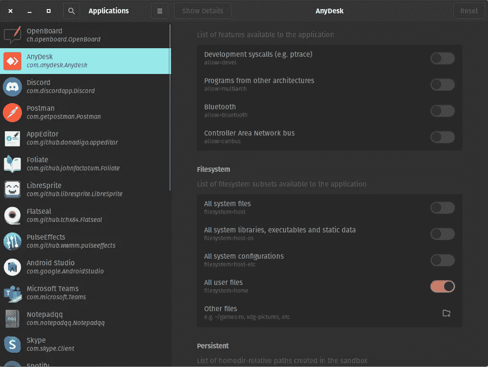
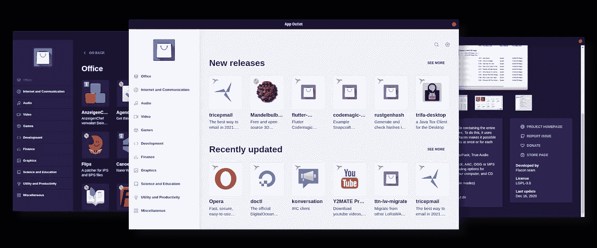

# Linux FlatPak 应用程序权限简易模式

> 原文：<https://medium.com/nerd-for-tech/linux-flatpak-permissions-easy-mode-826602463d80?source=collection_archive---------4----------------------->

因此，在 Linux 领域，Flatpak 正在与 Snap 或 AppImages 争夺更多地盘。主要目标与所有目标相似:

> 让 Linux 用户更容易获得他们桌面应用程序的最新版本。

此外，Flatpak 为软件开发人员提供了一种更顺畅的方式来发布和共享他们的应用程序。我在这里不是讨论哪个更好…这是一个遍布互联网的公开讨论…👮

在的众多应用中，这是传统应用商店的经验法则:Snap > Flatpak > AppImages

与“沙箱”行为相关的问题是应用程序的权限，这对于它们良好的工作流以及它们如何在操作系统中工作至关重要。

由于权限问题，我对 Flatpak 应用程序的最初体验是一种复杂的感觉。我需要挖掘一些命令行特性来配置更好的权限，因为一些应用程序没有很好地预先配置来满足我的需求。
与其他 Linux 用户交谈，他们也有同样的感觉……并试图避免为 Snap 或其他( *AppImages，Deb，Rpm…* )使用 Flatpak。

过一段时间，你会熟悉命令行，你的体验会更好…但对于临时/初学者 Linux 用户来说，这是一个下降。

这是为 Flatpak World 的新用户或 Linux 初学者准备的，Linux 专家将使用命令行方式。
对于他们，我发现了一个很棒的图形工具，可以轻松地管理你所有应用的权限，而且只需要几秒钟(一个图形工具)。

# 我给你介绍:平印

Flatseal 是一个图形工具，用于查看和修改 Flatpak 应用程序的权限。

**Github:**[https://github.com/tchx84/flatseal](https://github.com/tchx84/flatseal)
**FlatHub:**[https://flathub.org/apps/details/com.github.tchx84.Flatseal](https://flathub.org/apps/details/com.github.tchx84.Flatseal)
***注:*** *你应该在你的分销店找到，搜索一下…*

使用 Flatseal，您可以轻松地根据应用程序基础更改权限，例如，以快速简便的方式访问某些特定的自定义驱动器文件夹，或者阻止/解除阻止应用程序使用中的某些硬件…以及更多控制。试试吧😃

我希望这个图形应用程序能够帮助其他正在与 Flatpak 权限问题作斗争的 Linux 用户，Flatpak 背后的想法非常有趣，缩小这个入口点对于最终用户来说将是一个更好的体验。

如同😍另外，我想推荐一个支持所有源类型的应用程序商店:Snap、Flatpak 和 AppImages。的确是个很酷的项目。

> App Outlet 是一个通用的应用商店。它允许您轻松地搜索和下载在大多数 Linux 发行版上运行的应用程序。它目前支持 AppImages、Flatpaks 和 Snaps 包。

应用程序出口

**GitHub:**
https://app-outlet.github.io/

