# 黑客的 Linux 第 2 集

> 原文：<https://medium.com/nerd-for-tech/linux-for-hackers-ep02-start-using-terminal-bace039b0d2a?source=collection_archive---------6----------------------->

## 开始使用终端

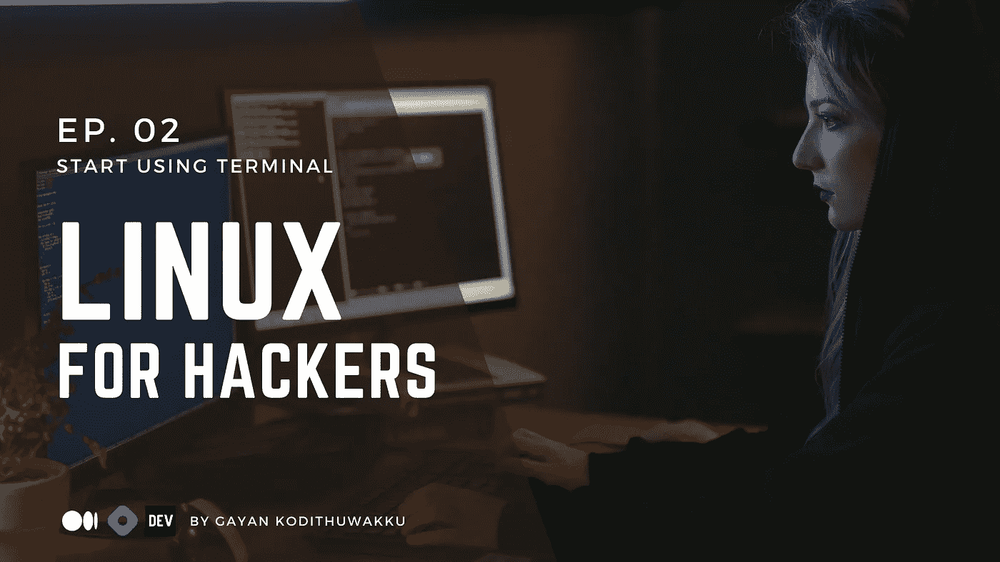

美丽的人们，你们好！时隔许久，这里我带来了黑客 Linux 系列的第 2 集。事实上，我真的很抱歉耽搁了你，这些天我一直忙于大学的事情。就是这个原因，反正我尽量尽快带新文章…

说到终端，它是 Linux 真正的轮式力量。所以请不要在 Linux 中使用 GUI。你应该用终端代替它。

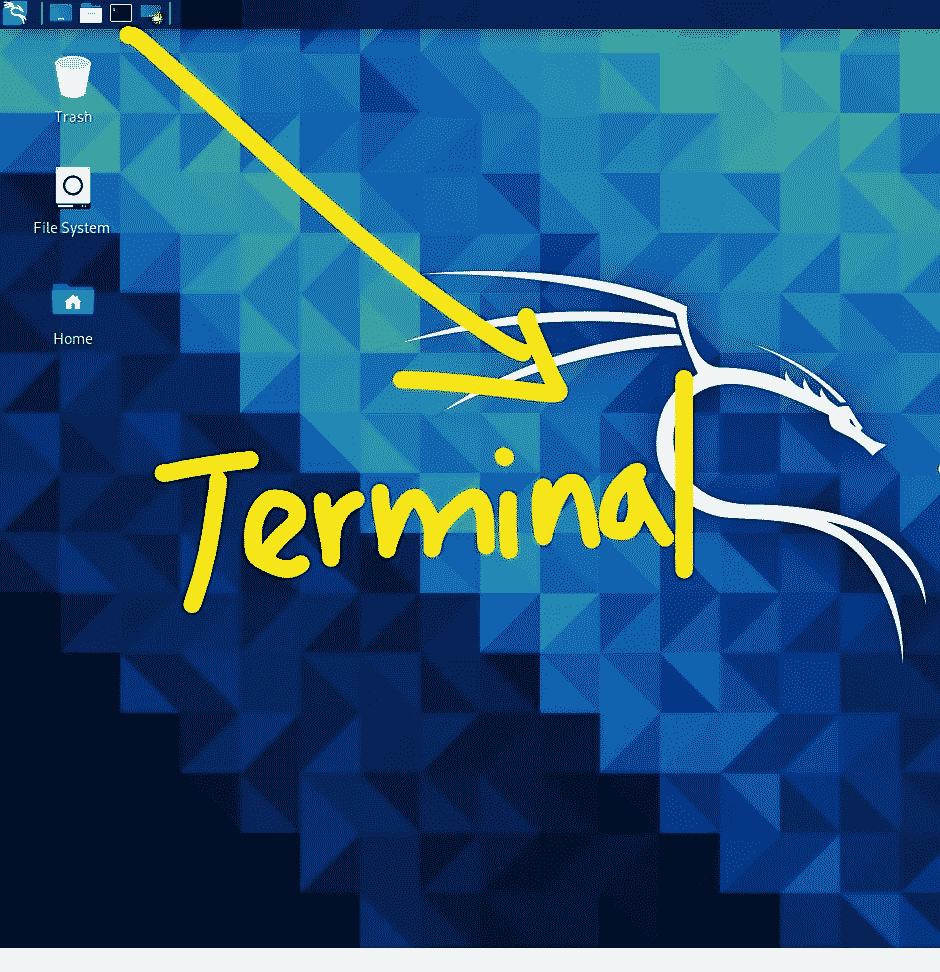

您可以在 Kali Linux 中访问终端

这就是 Kali Linux 中终端的位置。继续点击它…

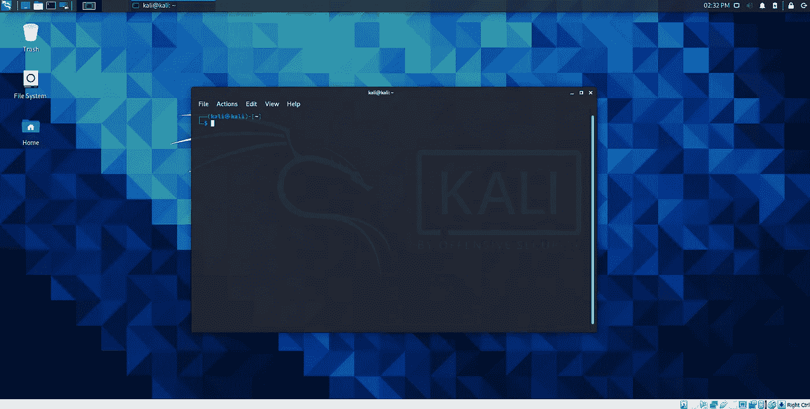

末端的

你可以看到，终端打开了！

这是 Linux 终端，这是你应该如何使用 Linux。现在，如果你来自一个只有图形用户界面的世界，在那里你只使用图形用户界面…对！！！


没错，这看起来有点可怕。我完全明白了！！！
不过不用担心！！！

我们将演练一下，我们将在这里教您几个命令…

我要慢慢地让你离开图形用户界面。

我会把它并排放上去…

实际上，看这里。我会教你最初的几个 Linux 命令…

所以来吧，跟我一起走…

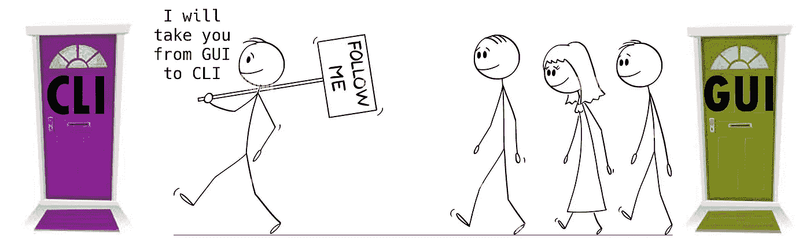

因此，请打开您的 Linux 终端，同时双击并打开您的主目录。

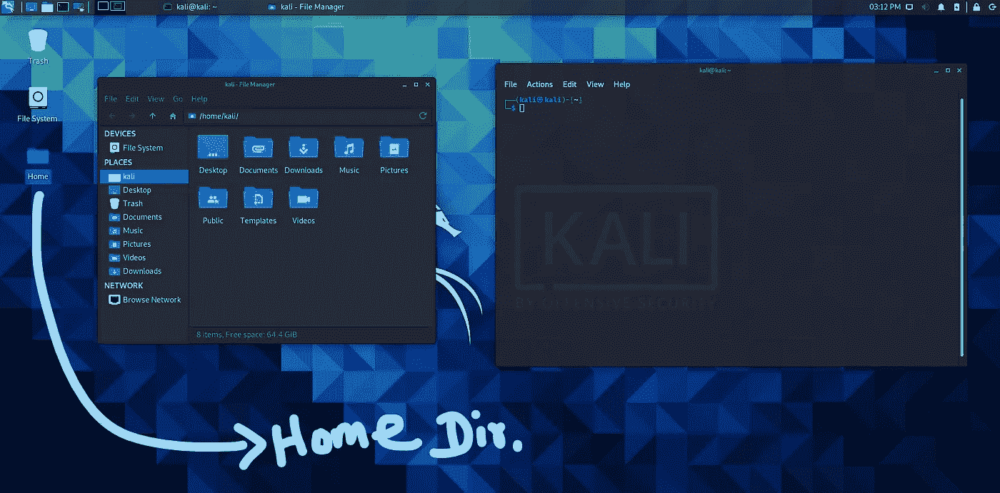

打开主目录和终端

我将通过在 GUI 中做一些事情，然后在 Linux 终端中做同样的事情，来教您前几个命令。

首先，我喜欢图形用户界面的一点是，你总能知道自己在哪里！因为你看得见！！！

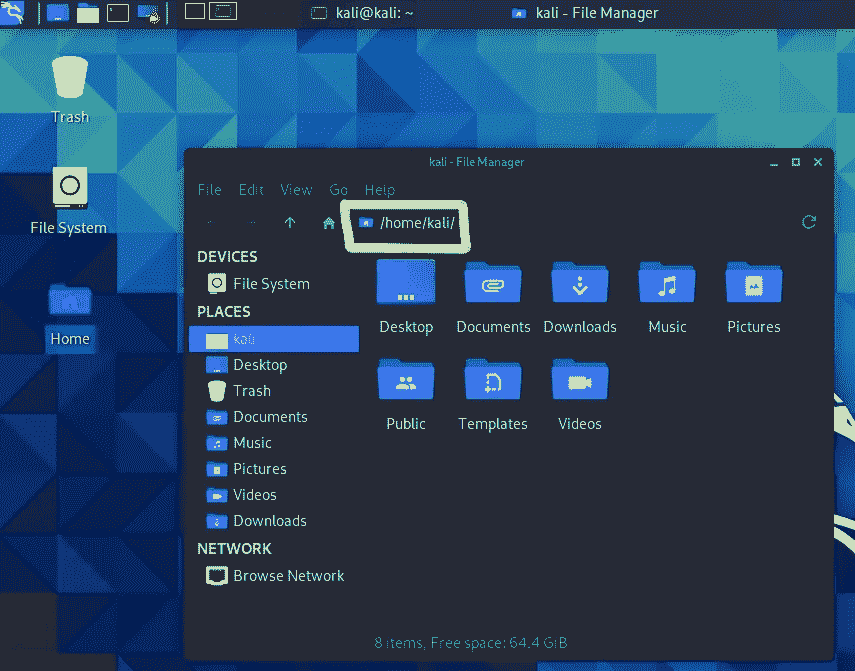

你可以看到你在哪'/home/kali/'

所以这里我在我的用户目录(主目录)。你可以看到这是我的东西。

现在，让我们看看 Linux 终端的 CLI。

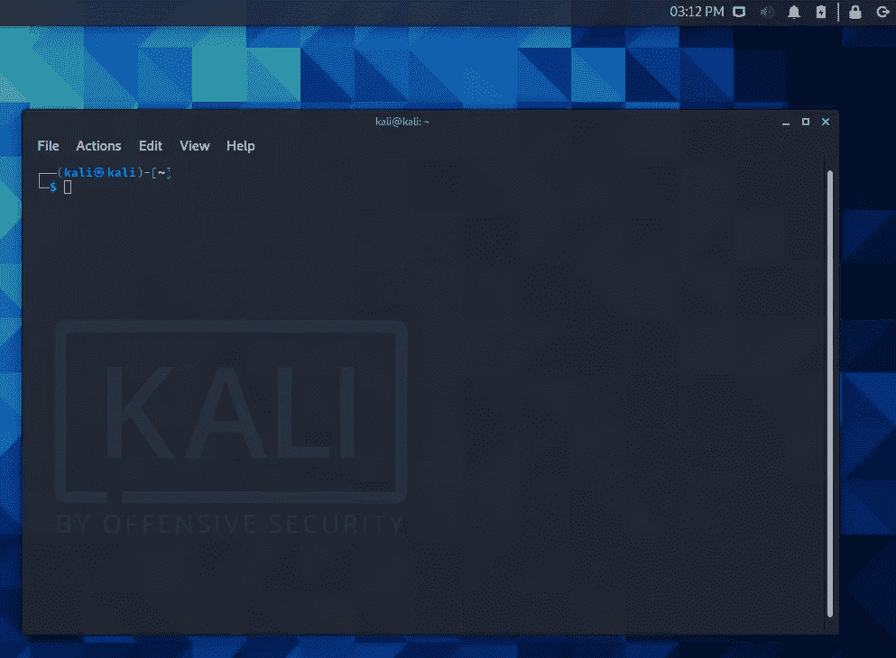

末端的

我在这里什么也没看到…我怎么知道我是，我们会解决的…

这是我们的第一个命令！和我一起打字吧！！！

**01。pwd(打印工作目录)**

它基本上做了我们在 GUI 地址栏中看到的事情(/home/kali/)。
简单来说，它告诉我们我们在哪里……
嘿，我在哪里？哦！我就在这里！！！
让我们来试试吧！键入 pwd，然后按 enter 键！

```
**pwd** /home/kali/
```

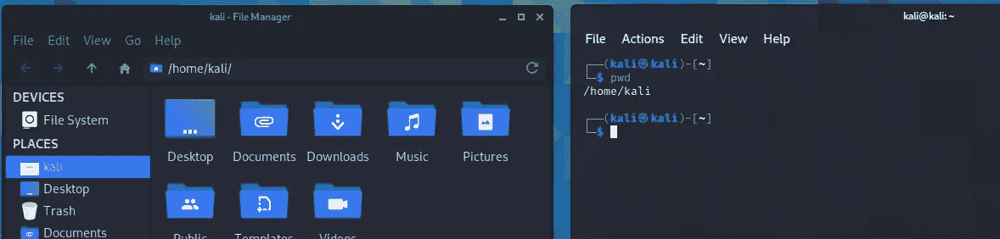

比较终端结果和我们在 GUI 地址栏中看到的内容

嘭！！！它向我们展示了我们现在所处位置的完整路径！！！…您可以看到它与 GUI 地址栏完全一样。

但有一点，我可以在 GUI 中实际看到我的桌面、文档文件夹、下载文件夹、音乐文件夹、图片文件夹、公共文件夹、模板文件夹和视频文件夹。

我在 CLI/ Terminal 中看不到这些！！！

我如何在终端中看到这些…？？？

下一个命令！
跟我打，是 ls 命令！

**02。ls(列表)**

它做的事情很简单。它将简单地列出你当前工作目录的内容！
它将列出我们在 GUI 中看到的内容…桌面、文件夹…等等。你想看吗？
动手吧！

```
**ls**
Desktop  Documents  Downloads  Music  Pictures  Public  Templates  Videos
```

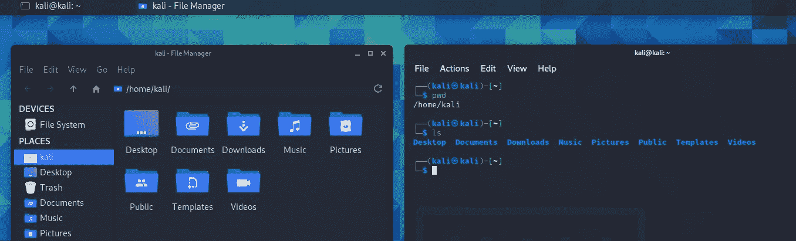

嘣！！！它什么都做了！
我们可以看到桌面文档……终端里也有各种各样的东西。

看吧看吧！！！你可以在终端里做任何事情！！！
而且更快！！！


我会说服你的，别担心！让我们继续前进！！！

比方说，我们想看一眼我们的桌面文件夹。我先在 GUI 里展示一下。我进入桌面文件夹。

我知道你们都知道如何在 GUI 中做到这一点。

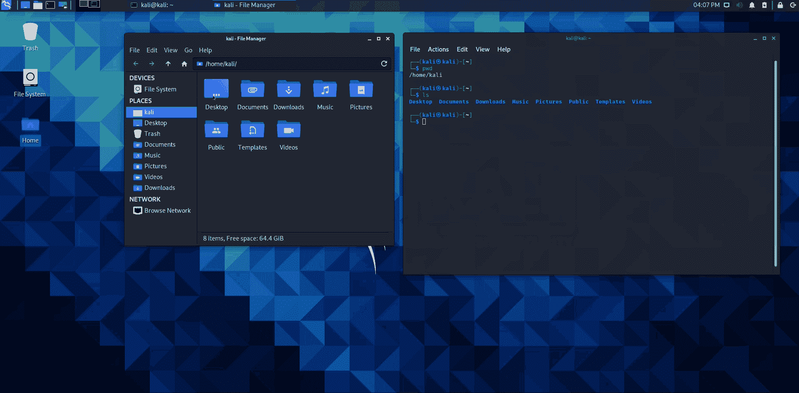

转到 GUI 中的桌面文件夹内部

我只是双击了桌面文件夹，然后就跳到了那里…

那么，如何在终端做到呢！

我们的下一个命令！开始了。

**03。cd(更改目录)**

它将执行我们刚刚在 GUI 中执行的操作。
观看《让我们马上行动起来》!！！

就在 cd 之后，
我会点击空格键并告诉它
我想去哪个目录…

```
**cd Desktop**
```

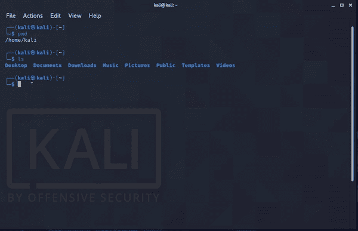

嘿！成功了吗？？？
不知道！让我们看看…
让我们打印我们的工作目录！

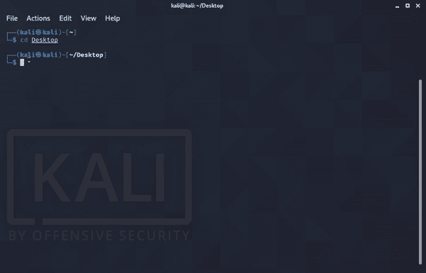

我们做到了。！！
在这里你可以看到当前的工作目录被改变了！！！

我们确实深入查看了桌面文件夹，然后查看了桌面上的内容，就像我们在 GUI 中看到的那样。但是目前，我的桌面是空的！让我们看看会发生什么！！！

我们可以简单地输入 ls 命令来列出内容！！！

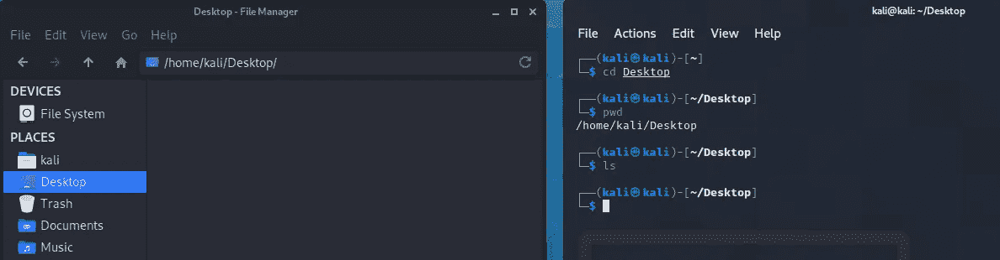

什么都没有！！！在 GUI 和 CLI 中！！！挺好的。因为实际上，我的桌面什么都没有！！！酷！！！

现在！！！今天我们要多学一个命令！和我在一起！！！

但到目前为止，我们已经做了很多工作，
pwd 命令→查看我们的位置
ls 命令→查看我们周围的东西，我们的目录中有什么
CD 命令→更改我们的位置

可是现在，
我们怎么回去！！！？？？

因为我们可以在 GUI 中使用左上角的 back 图标轻松完成！

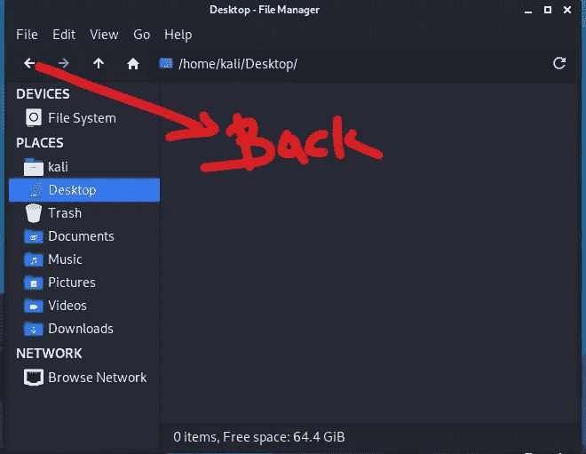

我们如何在终端中实现它？！

其实超级简单！！！
所以我们再次输入 **cd**

因为后退意味着我们将再次改变我们的目录！！！

键入 cd，我就按空格键，键入双点，然后按回车键！

```
**cd ..**
```

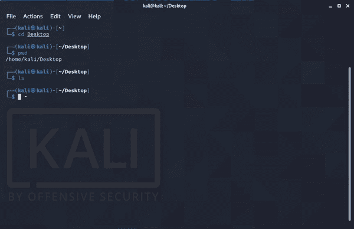

倒退

嘣！有用！！！我们又回到了我们的主目录！

现在只是为了好玩！我想知道如果我们继续倒退会发生什么？？？
如果我们输入 cd..一次又一次？？？会发生什么？？

好的，让我们开始检查吧！

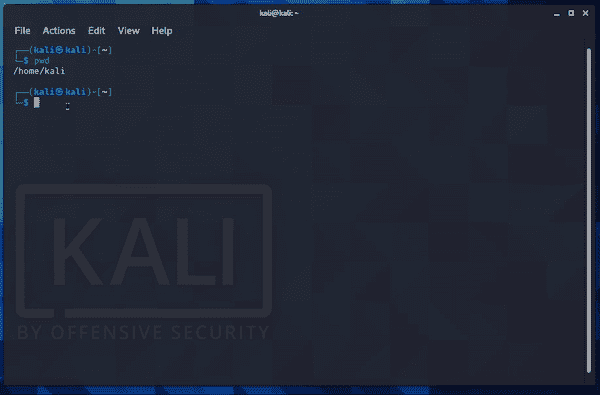

继续向后走

哦，你可以看到，我只是在/
而不是在家，这是什么？
实际上是**文件系统的根**。

结束了。我们到达了终点！

我们稍后会详细讨论这一点！在即将播出的剧集中！

但是，只是为了好玩…只是为了好玩，对吧！现在让我们输入 ls 命令吧！！！在根… (/)

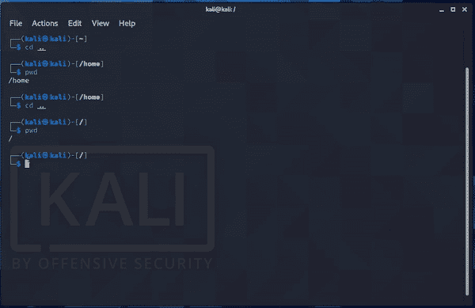

在根目录中尝试 ls 命令

嘣！您现在可以看到根目录的内容列表…

哼！这里有很多有趣的文件…
这些文件我们以后再全部说！

现在给你一个快速测验，


让我们看看你的想法是否正确！
***问:假设你在 Linux 终端的根目录下。您会在/home/kali/目录中输入什么命令？***

真的有 02 个选项…
你可以用一个命令做也可以用 02 个命令做…
**请在你的答案下面评论！！！**

我将在本系列的下一集讨论答案！

现在我们只是触及了表面。
我们正在深入研究 Linux。
我们将做好准备，成为一名黑客。但是这不能抹杀你今天用这篇文章做了很多的事实！

我们正在从 GUI 转向 CLI…特别是像 CLI 这样的黑客！我们爱它的权利！
我们做到了，pwd，cd，ls…更多即将推出！！！

所以，如果你想破解中型平台算法，只需点击掌声和点击关注按钮，也把你的意见！它在伦理上黑了 Medium 的算法:D.
！！！是的。！！

## 摘要

pwd 命令→查看我们在哪里
ls 命令→查看我们周围的东西，我们的目录中有什么
cd 命令→更改我们在哪里
cd..命令→后退