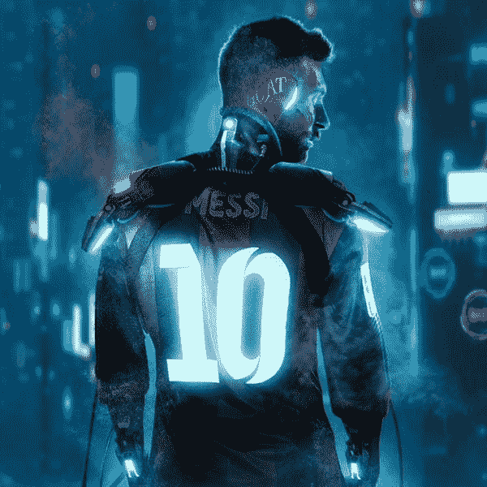
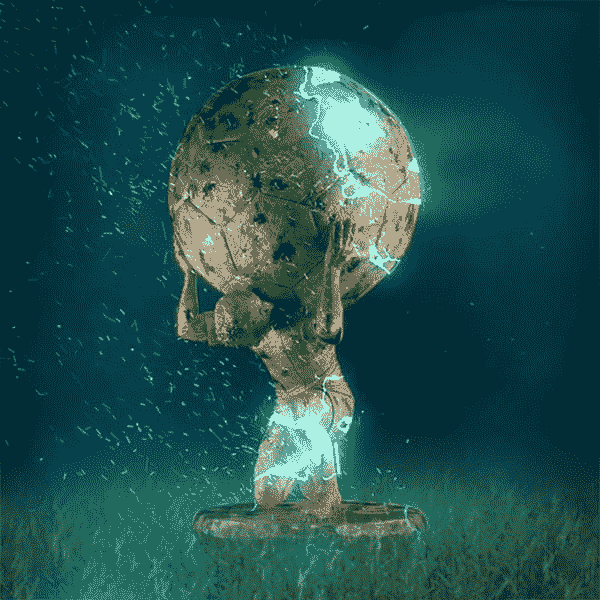
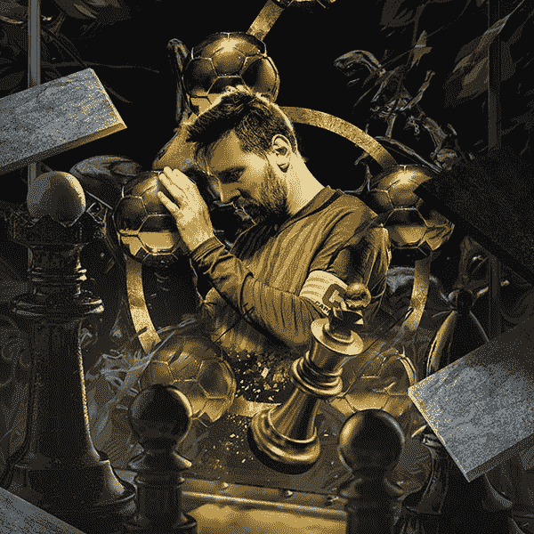

# 莱昂内尔·梅西的“梅西维”NFT 系列即将推出！

> 原文：<https://medium.com/nerd-for-tech/lionel-messis-the-messiverse-nft-collection-are-rolling-out-60e39d1e413f?source=collection_archive---------9----------------------->

莱昂内尔·梅西被认为是体育生态系统中的山羊(有史以来最伟大的)。仅在社交媒体上，他就拥有近 2.4 亿粉丝，在全球拥有无数粉丝。他一直是轰动一时的人物。他最近在 21 年后从巴萨队获释，这是过去几天网络上最热门的话题之一。莱昂内尔·梅西宣布他的 NFT 将在以太网上发布；了解 NFT 的潜力。梅西对 NFT 采取了行动，这篇文章将谈论 NFT 的真正潜力，甚至吸引了世界闻名的山羊球员。

**梅西+ NFT =人气**

当两个最大、最流行的线程合并成一行时会发生什么。这是梅西于 2021 年 8 月 20 日在《宁静》中宣布他的 NFT 启示后，大多数密码分析师和金融策略师提出的问题。一边是梅西，一个有无数追随者的空前传奇，另一边是 NFT，一个让数十亿刚刚流入并仍在大规模影响密码行业的优秀平台。

梅西携手澳大利亚数字设计艺术家“Bosslogic”创作了他的 NFT。Bosslogic 是为《漫威》和《复仇者联盟》工作的艺术家。将 NFT、梅西和博斯罗吉斯放在一个页面上，让网络和社交媒体不再关注接下来会发生什么？。

 [## NFT 创作服务| NFT 发展解决方案公司

### 不可替代的代币是目前的数字热点。这是商业平台的绝佳机会…

www.infiniteblocktech.com](https://www.infiniteblocktech.com/nft-development-solutions?utm_source=medium&utm_medium=messiverse&utm_campaign=calwin) 

**梅西维**

8 月 4 日，莱昂内尔·梅西在他的 Instagram 视频帖子中宣布了他的梅西维 NFT 系列，以“足球就像艺术”开始。他的新闻稿完全揭示了 NFT 的描述，以及粉丝们可以从他的 Messiverse 收藏中期待什么；这甚至炒作了局势。

**来自未来的人**

bosslogic 设计的 Messiverse 的第一个 NFT，有一个蓝色背景的莱昂内尔·梅西本人的仿生画像。Bosslogic 表示，它以赛博朋克风格复制了莱昂内尔·梅西的遗产。

**抵得上重量**

第二个 NFT 把莱昂内尔·梅西描绘成一个巨人阿特拉斯。它传达的信息是，阿特拉斯带着地球，带着它的快乐和悲伤。梅西极其小心地经营着体育产业。

**王片**

国王的作品是梅西世界的第三个 NFT，莱昂内尔·梅西被认为是足球产业的国王。

最终的第四名 NFT 没有公布，他们一直保密，因为这是给梅西球迷的一个惊喜。

为什么 NFT 变得如此受欢迎？

没有人，甚至在最初阶段，NFT 的创造者，曾经想象过 NFT 有这么大的影响力。他们的特点是他们大受欢迎和成长的原因之一。NFT 的区块链终结了人类一直困扰的许多问题。其中之一是没有中介的金融交易自动化。所有这些加在一起使得 NFT 如此受欢迎。

它提供了真实性和匿名性，可以作为附加功能添加到列表中。不可替代的符号 并不是到处都有，各种其他的“诗”还在 NFT 诗中出现。

**梅西维诗系列——NFT 系列**

你有没有想象过为什么名人、公司或商人如此喜欢快餐？原因是它只用一颗子弹就能干掉很多目标。对于 NFT 系列，稀有物品收藏家对其独特性和真实性感到满意。名人使用它作为一个域名来保持他们的知名度，同时将他们的知名度货币化。MNC 显然是以推广为目的。

Messiverse 就是一个很好的例子。为什么足球行业的山羊和传奇人物需要推出 NFT，而许多品牌都愿意接受他作为品牌大使。原因是 NFT 给予的独立和它返还给造物主的财富。

**NFT 的值**

当谈到不可替代代币的价值时，预测或猜测不是一个选项，因为它每天都在显示其增长的巨大差异。仅在 2021 年，NFT 的销售额就突破了 25 亿美元。市场以各种可能的方式保持着巨大的增长。

NFT 正在把它看到的一切都标记出来，并制作价值数百万的标记。这就是 NFT 诗中发生的事情。

**NFT 喜欢梅西维**

*杰克·多西*

推特创始人杰克·多西的第一个推特以 NFT 的名字卖了 290 万美元。杰克·多西将他的第一条推文转换成了 NFT，并在 NFT 市场的一次拍卖中发布。那是 290 万美元。

[**杰克·多西推文**](https://twitter.com/jack/status/20)

比尔

迈克·温克尔曼只是一个普通人，在他的《来自比尔的 NFT》卖到了 6900 万美元之前。NFT 彻底改变了温克尔曼的生活，从数字设计师变成了最有价值的三大艺术家之一。

NFT 照亮了许多企业，也让许多人发了财。仍然出色地继续工作。

**NFT 发展**

NFT 开发需要与区块链技术、钱包集成、智能合约和各种 API 协议集成的集成。开发一个 NFT 需要大量的技术知识和像 NFT 发展服务公司这样的人来完全协助这个过程。

*   选择一项 NFT 发展所需的资产。
*   对您的资产进行分类
*   铸造你的 NFT
*   设置付款方式

**NFT 发展公司**

NFT 开发公司是一组人，他们将协助您从开发 NFT 到提供支持 NFT 过程的各种其他服务。在选择你想要的 [**NFT 发展公司**](https://www.infiniteblocktech.com/nft-development-solutions/?utm_source=guestblog&utm_medium=blog&utm_campaign=calwin) 之前，有一些事实需要考虑。开发公司应该有丰富的市场经验。他们应该拥有装备精良的专业人员和市场分析师。和各种其他开发人员，如安全分析师，来减轻过程中的任何问题。NFT 开发公司应向用户提供技术援助和客户支持。

**包装**

NFT 正在成为下一代资产，它们有可能在任何可能的情况下采用和标记任何东西。如果你喜欢 NFT，那就掷骰子，像莱昂内尔·梅西(Lionel Messi)一样选择单个奇数，探索实时机会的世界。