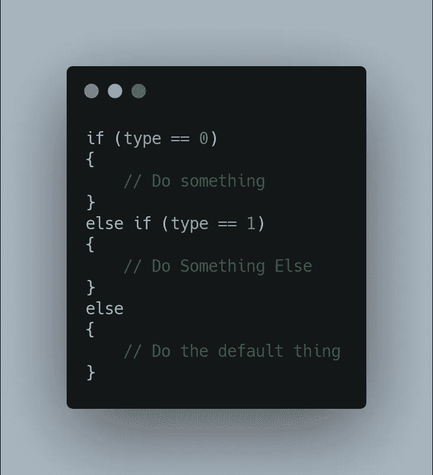
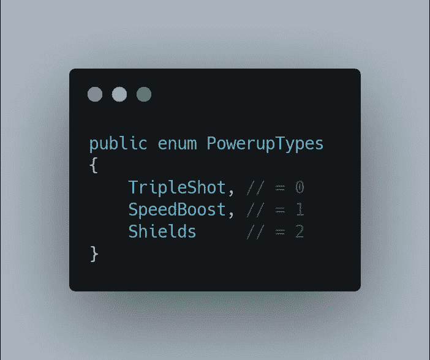
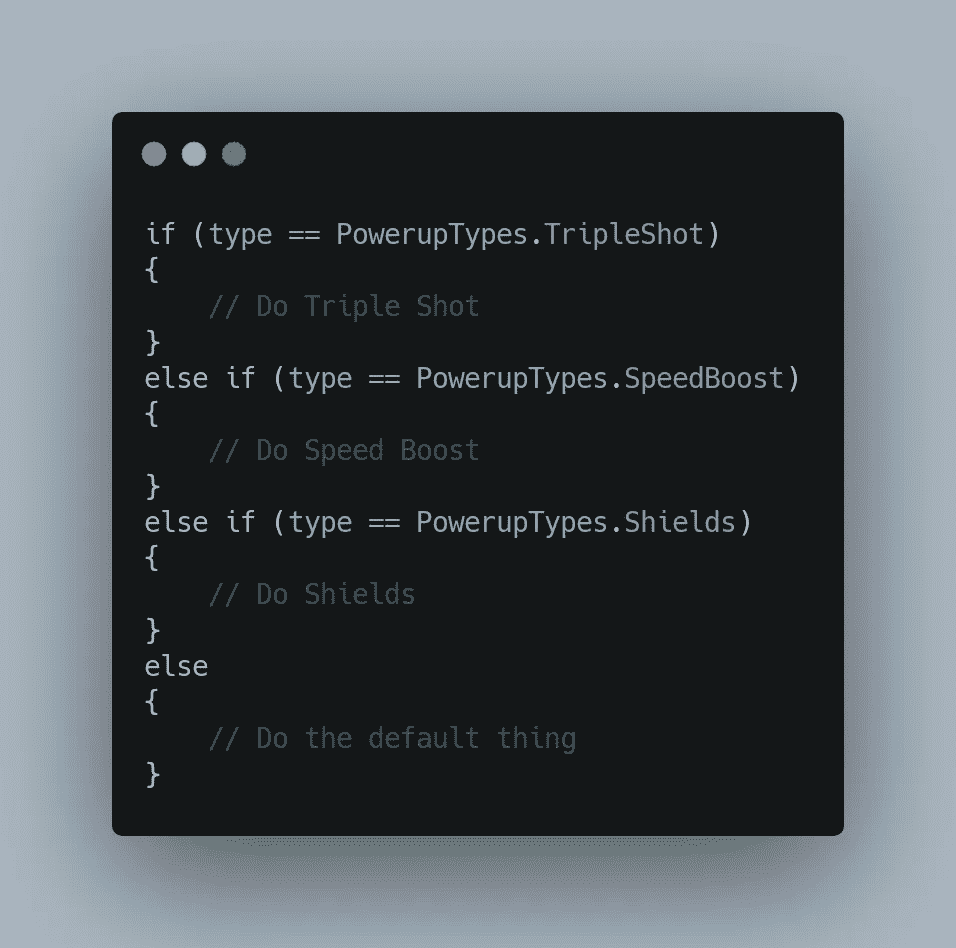
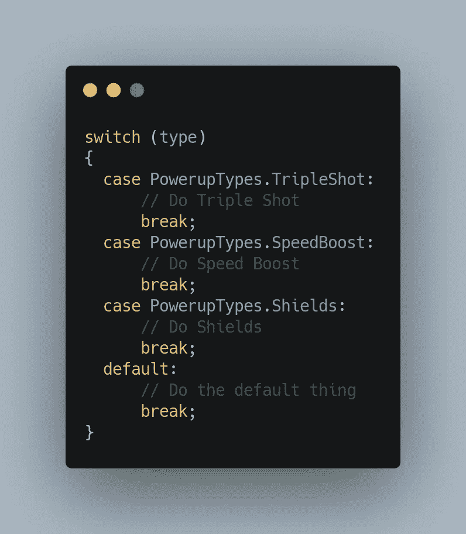

# 狮子，老虎，还有……神奇的数字！？

> 原文：<https://medium.com/nerd-for-tech/lions-and-tigers-and-magic-numbers-95f1b3eea8bb?source=collection_archive---------14----------------------->

## 枚举、switch 语句和避免幻数

朱利叶斯·德罗斯特在 [Unsplash](https://unsplash.com?utm_source=medium&utm_medium=referral) 上的照片

昨天，我们了解了如何扩展我们的动力提升系统，以包括一个新的动力提升，即速度动力提升。今天我们增加了另一个能量，护盾能量。由于添加另一个电源的许多过程是相同的，我将讨论一些相关的东西，而不是一步一步地添加我们的第三个电源。那就是避免幻数。

使用幻数的 If-Else 语句示例

编程中的幻数是一个原始值，在没有任何明确指示该值代表什么的情况下使用。在上面的例子中，不清楚 0 和 1 代表什么。我们可以推断它们与类型有关，但不是每个值代表什么。当你的代码中充满了神奇的数字时，调试甚至只是阅读代码都会变得非常困难。因此，作为良好的编程实践，建议尽可能避免使用幻数。有几种方法可以做到这一点，包括将数字分配给一个描述性变量，使用常量变量(如果值不变)，使用静态类(使用描述性名称返回神奇的值)，或者在整数标识符的情况下，有时可以像我们在上一篇文章中那样使用枚举。

PoweupTypes 枚举

因为我们最初选择通过递增的整数 id (0、1、2 等)来标识我们的电源。)我们可以很容易地将它转换成一个 Enum，为我们提供相同的行为，并为可读性提供一个容易访问的名称。

在这种情况下使用枚举的另一个优点是，它与我们的 switch 语句很好地协同工作，使得它更容易阅读和理解！

使用枚举的 Switch 语句

扩展我们的 switch 语句和枚举就像向枚举添加一个新值和向 switch 语句添加枚举的一个新 case 一样简单。现在，我们可以把注意力集中在激活的护盾加电的行为上，而不是增加新的收集品，这应该很简单，并且在很大程度上与增加其他加电收集品相同。

## 下次吧！

今天我们看了一下幻数以及在代码中避免它们的一种方法。明天我们将在游戏中添加一些用户界面，这样用户就有了一些反馈！如果你喜欢这篇文章，或者想在我的旅程中与我同行，请在 gamedevchris.medium.com[跟随我。](#https://gamedevchris.medium.com)