# 我在工作中使用的 CSS 伪类列表。

> 原文：<https://medium.com/nerd-for-tech/list-of-css-pseudo-classes-that-i-use-in-my-work-f1193b528e12?source=collection_archive---------2----------------------->

CSS 有很多伪类。在这篇文章中，我将展示我可以在前端的伪类。伪类列表小+>[]~:root:focus:hover:active:n-child:is:not:has::after::before。

:root —将样式应用于文档的根元素。这意味着我们可以设置整个页面的样式。比如我们可以全局设置字体。

+ > [] ~

你可能不会经常用到这些类，但是你可能会看到它们。因此，我需要解释他们在做什么。

[]-按属性或属性值应用样式。

~ —仅当元素具有相同的父元素时应用样式。

+ —如果元素位于他的正后方，则对元素应用样式。

>—将样式应用于子元素。

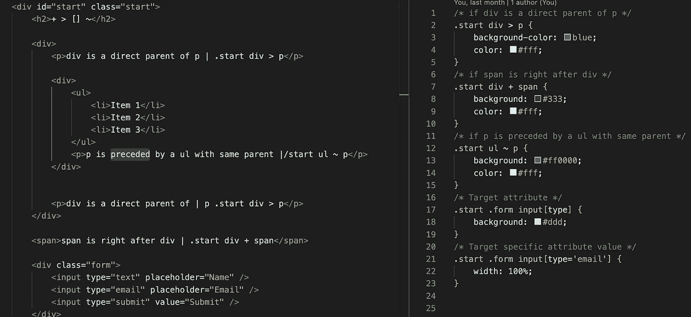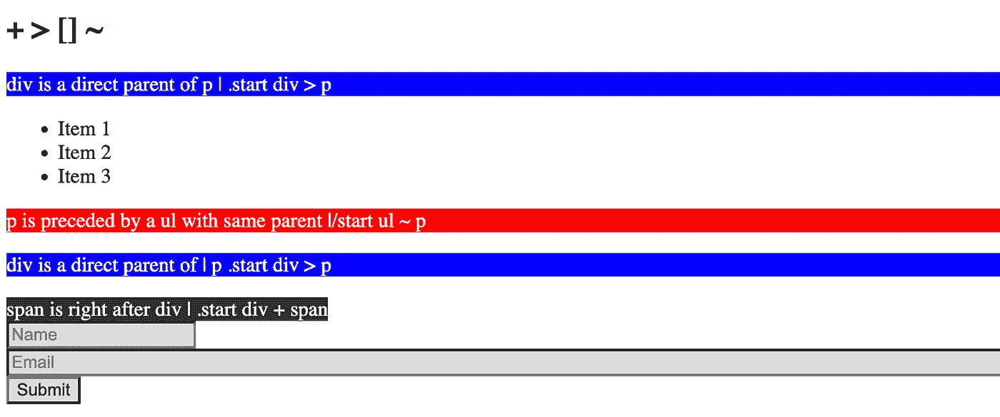

:focus —如果元素聚焦，则对元素应用样式。

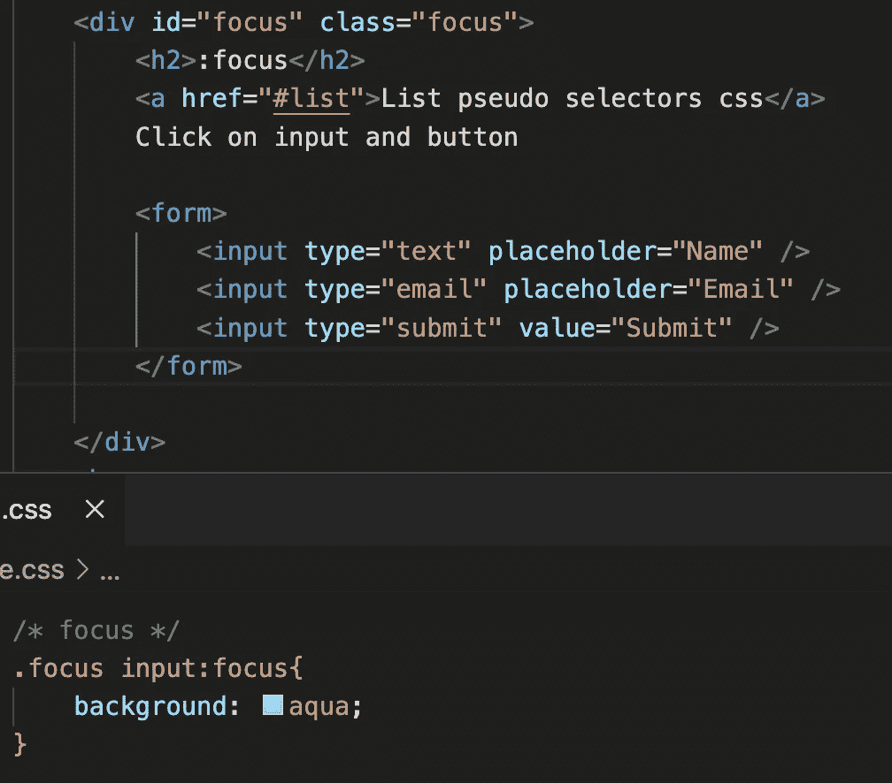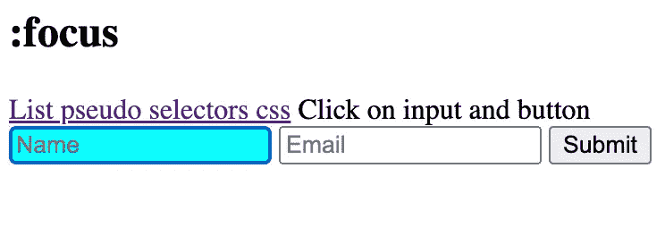

:悬停—将样式应用于鼠标悬停时的元素。

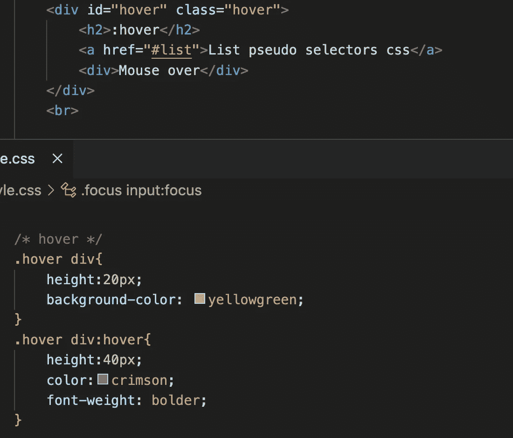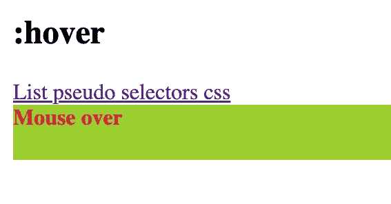

:活动—当用户单击元素时将样式应用于元素。

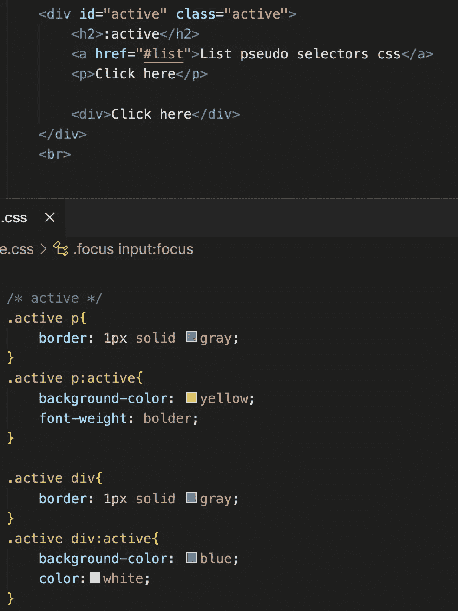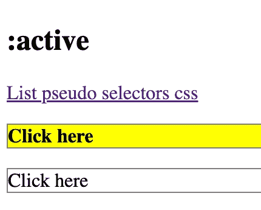

:n-child(number)—按编号将样式应用于元素。我们可以将样式设置为奇数或偶数元素，或者每 3 个元素，或者只有 2 个元素。

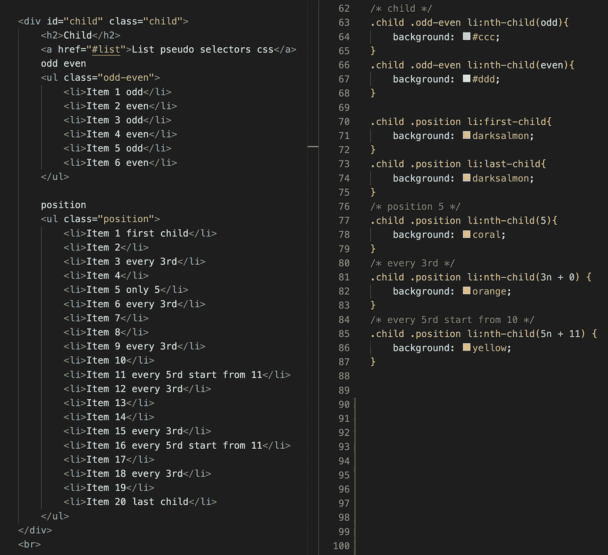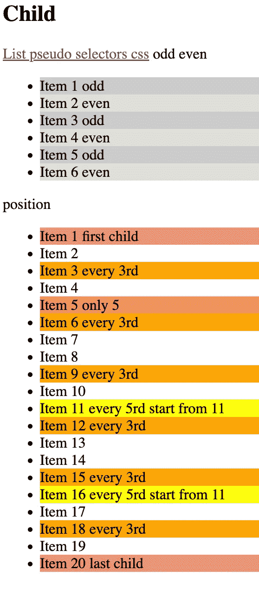

:is( css 选择器)—仅当元素等于 css 选择器时，才对元素应用样式。

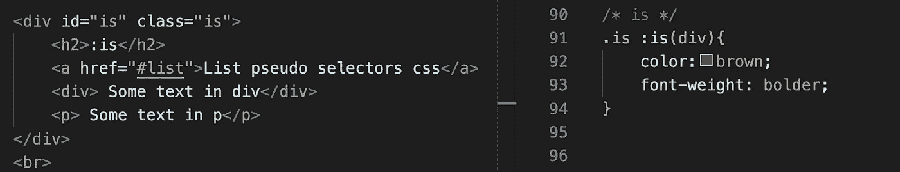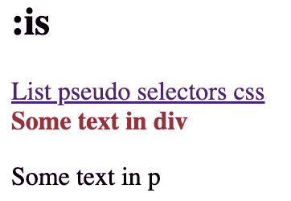

:has( css 选择器)-仅当元素有 css 选择器时，才对元素应用样式。

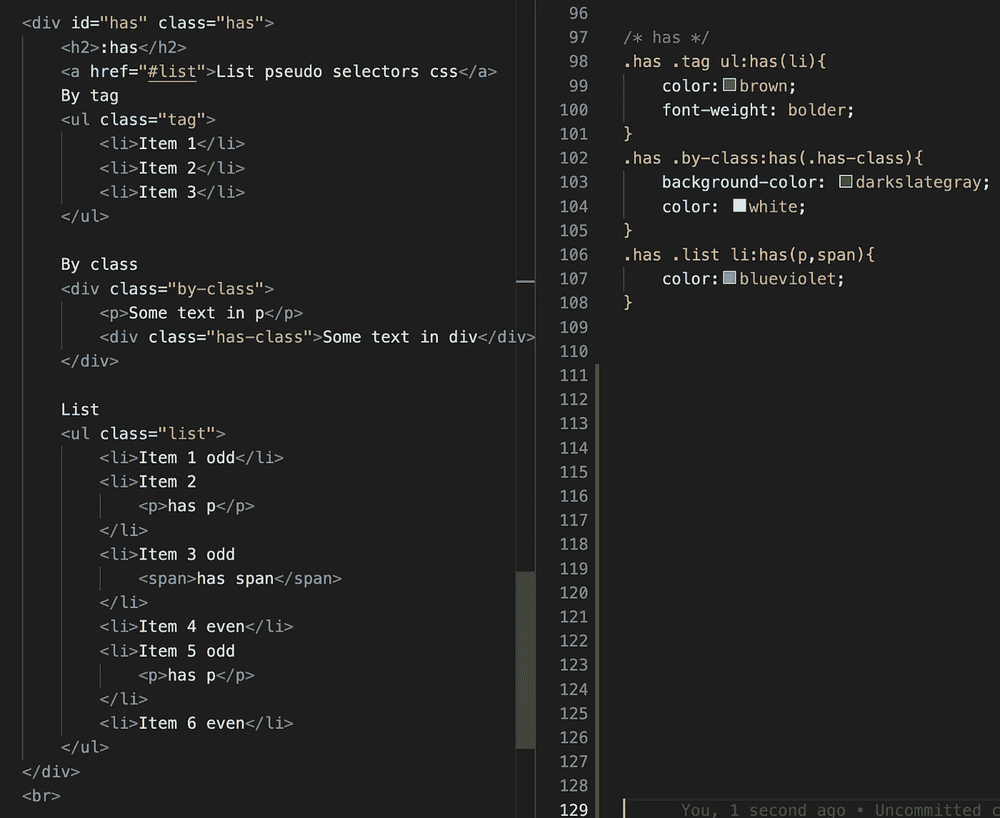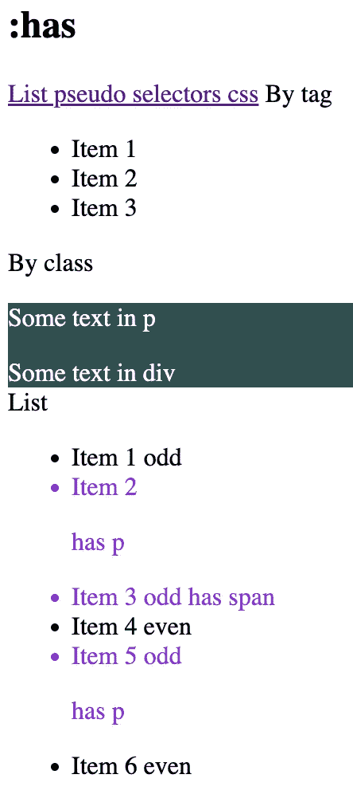

:not (css 选择器)—将样式应用于不是 css 选择器元素的每个元素。

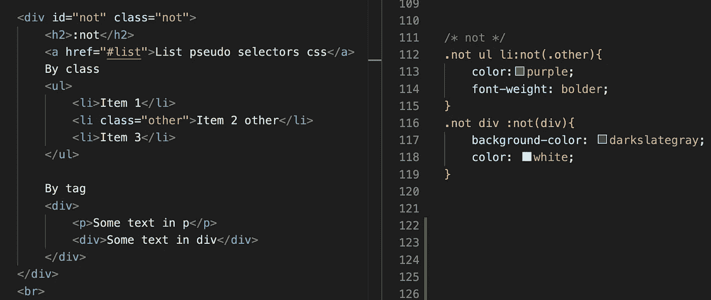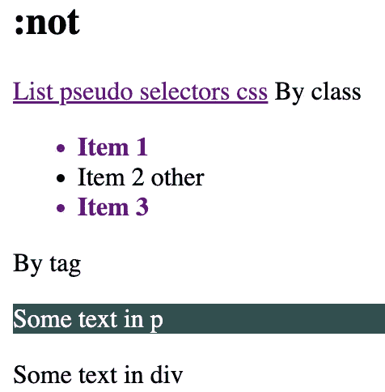

* after-在元素后插入内容。

* before—在元素前插入内容。

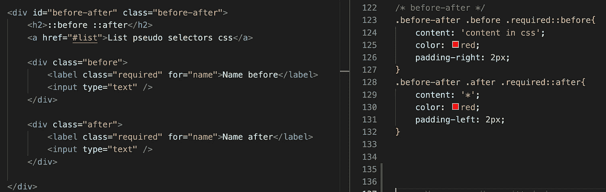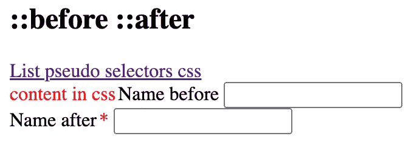

如果你需要仔细看看这个项目[，这里是链接](https://github.com/8Tesla8/pseudo-selectors-css)。

*原载于 2022 年 12 月 1 日***。**