# Python 中的列表、范围和元组

> 原文：<https://medium.com/nerd-for-tech/lists-ranges-and-tuples-in-python-d7bb7a267c99?source=collection_archive---------0----------------------->

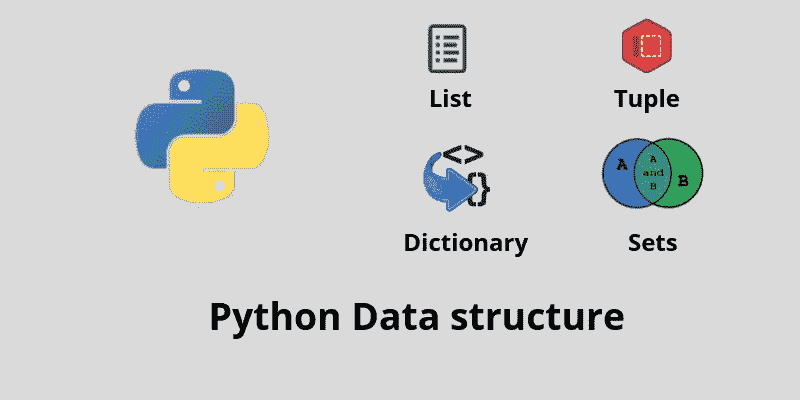

让我们看看 python 中的数据结构列表、范围和元组。下面提到的方法和风格是目前 python 开发者遵循的一些常见实践。

# 列表

列表是有序且可改变的集合。在 Python 中，列表是用方括号写的。

我们可以通过在列表中提及它的索引来访问列表项，也可以通过向后调用列表(-1，-2)来用 python 打印列表项。

在 python 中也可以打印范围内的列表。[开始索引:结束索引]

在 python 列表[起始索引:]和[:结束索引]中，也可以从所需的索引打印列表，并打印到所需的索引。

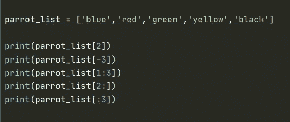

通过列出元素来访问列表元素。

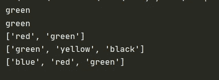

代码片段的输出

为了使你的任务简单有效，你可以在列表中看到更多重要的方法。

Append 方法:将另一个元素加入到列表中。

Len 方法:显示列表的长度。

Remove 方法:删除要删除的元素。

Pop 方法:移除指定的项，如果没有指定元素，则移除列表的最后一项。

清除方法:清空整个列表。

复制方法:复制一个列表。

排序方法:对列表进行排序。

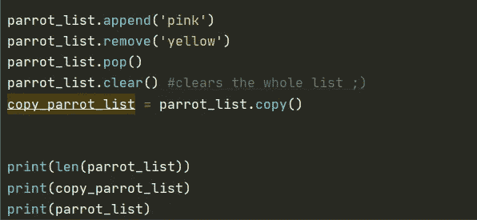

列表中其他常用的方法

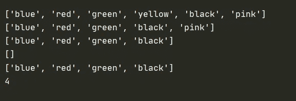

代码片段的输出

我们也可以加入两个列表。在 Python 中，有几种方法可以连接两个或多个列表。

最简单的方法之一是使用`+`操作符。在下图中，我描述了两种简单的列表排序和打印方式。还有一种以向后方式打印列表的方法。

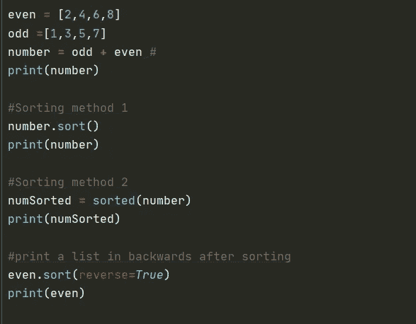

将两个列表连接起来，并以反向打印的方式进行排序。

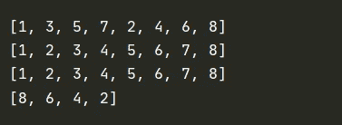

代码片段的输出

# 范围

range()函数返回一个数字序列，默认情况下从 0 开始，按用户定义的值递增，并在指定的数字前停止。**范围(开始、停止、步进)**

**起始**:用户定义的起始整数。

**stop** 返回整数序列之前的整数。
整数范围止于 stop — 1。

**步骤:**整数值，决定序列中每个整数之间的增量。

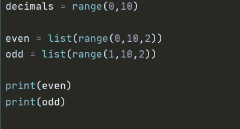

距离函数

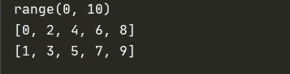

上述代码片段的输出

# **元组**

元组是由逗号分隔的 Python 对象的集合。在某些方面，元组在索引、嵌套对象和重复方面类似于列表。一旦创建了元组，就不能更改其值。元组是不可改变的。

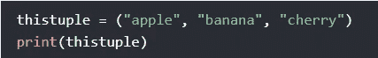

打印元组

打印一个范围内的元组。

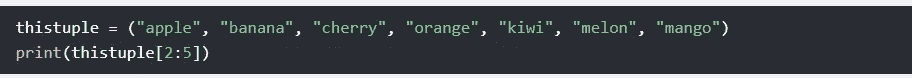

打印一个范围内的元组

我们不能改变一个元组，但有一个变通办法。您可以将元组转换为列表，更改列表，然后将列表转换回元组。

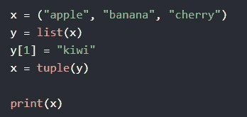

向元组中添加元素

通过使用 len()方法，我们可以找到元组的长度。

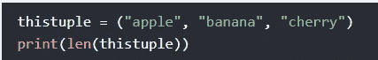

寻找元组的长度

要删除一个项目，请使用 **del** 关键字删除元组。

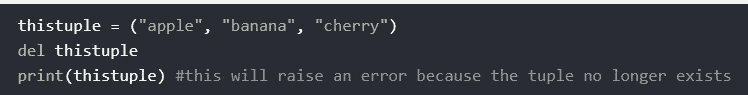

移除元组。

要创建一个元组，你必须在条目后添加一个逗号，否则 Python 不会把它识别为元组。

创建元组

我们也可以用下面的方法连接一个元组。

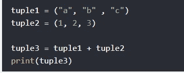

连接两个元组

我们还可以用其他方法来使我们的生活变得更容易。

count()-返回指定值在元组中出现的次数。

Index() —在元组中搜索指定的值，并返回找到该值的位置。

我希望这篇文章到此为止。让我们在另一篇文章中讨论 Python 字典和集合！，直到那时干杯。！！！