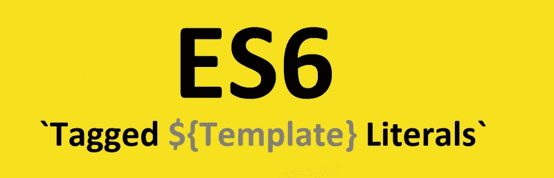
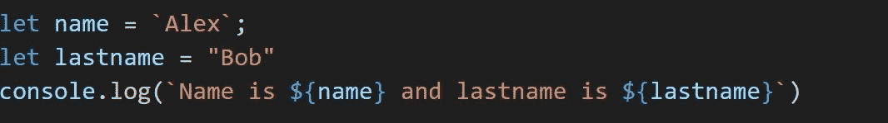
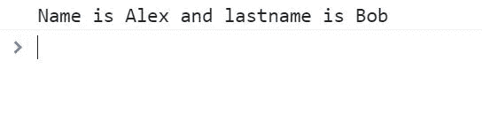
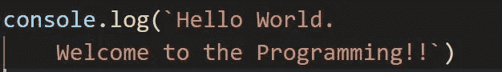
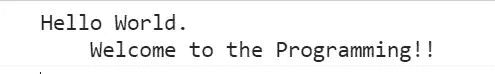
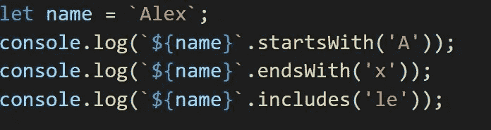

# 文字！模板文字！

> 原文：<https://medium.com/nerd-for-tech/literals-template-literals-f6903132e007?source=collection_archive---------20----------------------->

关于 ES6 中模板文字的所有内容



[https://www . freecodecamp . org/news/es6-tagged-template-literals-48 a 70 ef 3 ed 4d/](https://www.freecodecamp.org/news/es6-tagged-template-literals-48a70ef3ed4d/)

模板文字也称为字符串文字，它使处理字符串变得容易。
模板文字使用反斜线(``)代替单引号或双引号，模板文字可以写成
let name = ` Alex `；
可以使用${}访问字符串，这也称为插值，演示文字的简单程序如下所示。



程序的输出如下所示，



要在新行中打印输出，我们通常使用\n 但是使用这些模板文字，我们可以通过简单地在反勾号(```)内书写来简单地打印输出，



上述程序的输出将是，



在 ES6 中，我们还可以使用 string 的其他函数，这些在下面的程序中进行了说明，



这里，如果名称以括号()中的字符开头，startsWith('A ')将返回 true，与 endsWith 类似，即如果名称以' x '结尾，它将返回 true，includes('le ')检查特定字符串是否在名称中。
所有这些函数都区分大小写，即“A”和“A”是不同的。

关于模板文字的更多信息可以在这些[站点](https://developer.mozilla.org/en-US/docs/Web/JavaScript/Reference/Template_literals)找到。