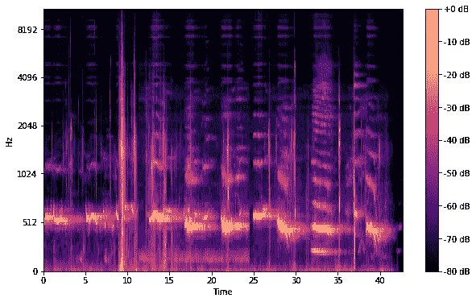
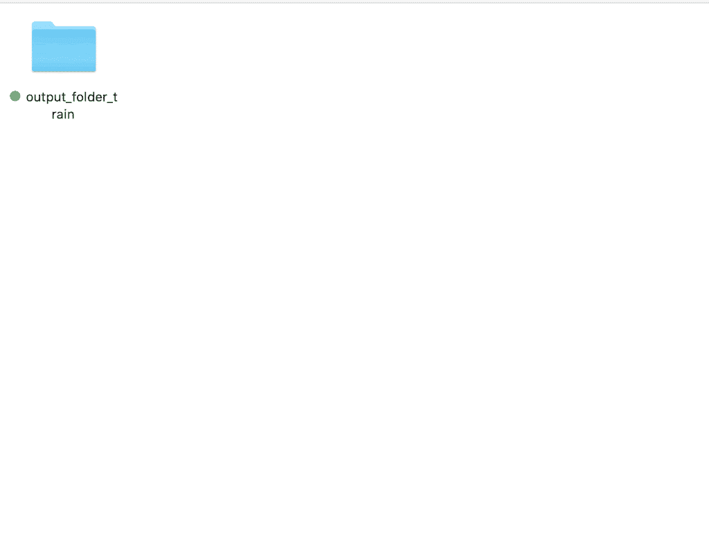
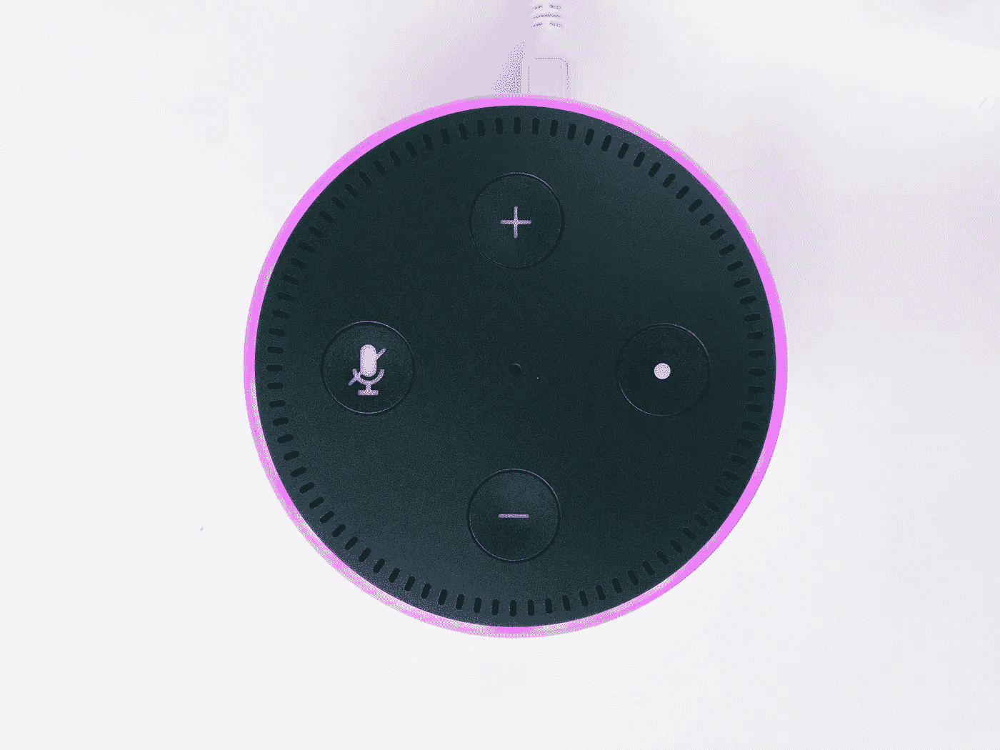

# 现场语音情感识别

> 原文：<https://medium.com/nerd-for-tech/live-speech-emotion-categorization-7692933037ba?source=collection_archive---------4----------------------->

如果你在对话中听到以下句子，你可能会知道它们属于哪种情绪类别——平静、快乐、悲伤、愤怒、恐惧、惊讶和厌恶。

> “哎！生日快乐！”
> 
> “我刚刚失业了。我不知道该怎么办。”
> 
> “哇！我没想到会有惊喜派对。”

计算机能以同样的方式对声音进行分类吗？我和[德文德·萨莱](https://www.linkedin.com/in/devinder-sarai/)都想知道，仅在美国就有超过 **32 00 万**的人因**自闭症**或一种叫做**述情障碍**的状况而难以识别他人的感受。

有这些情况的人知道如何对不同的情绪做出反应；然而，他们不能解读视觉肢体语言信号来理解与他们互动的人的情绪。

我们开始建立一个模型，可以对情绪进行分类，如平静、快乐、悲伤、愤怒、恐惧、惊讶和厌恶。Devinder 负责该项目的实时面部表情识别部分——你可以在这里阅读他的文章——我负责实时音频情感分类部分。

因此，我开始研究如何为这个项目执行现场音频情感分类，并发现文本情感分析通常在第一天学习任何介绍性的 NLP 课程时教授。然而，**通过音频进行情感分类**并不常见，尤其是实时音频情感分类。

我不得不自己想出如何执行现场音频情感分类，因为我是一个机器学习初学者，在模型工作之前花了几个漫长的夜晚。我想我会分享我是如何让实时音频情感分析发挥作用的，以及我下一步要做的是让这个模型更加准确。

# 使用的库和数据集

## **模型库**

*   [**Librosa**](https://librosa.org/) :用于音乐和音频分析的 Python 包。
*   [**Matplotlib**](https://matplotlib.org/) :这允许我们绘制**光谱图。**
*   [**scipy . io . WAV file**](https://docs.scipy.org/doc/scipy-0.14.0/reference/generated/scipy.io.wavfile.read.html):从 WAV 文件中返回采样率(以采样/秒为单位)和数据。
*   [**Glob**](https://docs.python.org/3/library/glob.html) :用于返回所有符合特定模式的文件路径。
*   [**Numpy**](https://numpy.org/) :用于处理数组。
*   [**Fastai**](https://www.fast.ai/) : Fastai 是一个深度学习库，为从业者提供高级组件，可以快速轻松地**在标准深度学习领域提供**最先进的结果。我们将使用 fastai.vision。

## **用于使其实时工作的库**

*   [**Struct**](https://docs.python.org/3/library/struct.html) :用于将音频数据解包成整数
*   [**Tkinter**](https://docs.python.org/3/library/tkinter.html):Tkinter 是 Python 的标准 GUI 库。Python 与 Tkinter 相结合，提供了一种快速而简单的方法来创建 GUI 应用程序。
*   [**Sounddevice**](https://python-sounddevice.readthedocs.io/en/0.4.1/) :这个 [Python](https://www.python.org/) 模块提供了对 [PortAudio](http://www.portaudio.com/) 库的绑定和一些方便的函数来播放和录制包含音频信号的 [NumPy](https://numpy.org/) 数组。

## **数据集—** RAVDESS **数据集**

使用[瑞尔森情感语音和歌曲视听数据库(RAVDESS](https://zenodo.org/record/1188976#.YGtIDEhKgY0) )数据集来训练该模型。该数据库包含 24 名职业演员——12 名女性和 12 名男性——用中性北美口音发出两个词汇匹配的语句。

该数据集包括标记为平静、快乐、悲伤、愤怒、恐惧、惊讶和厌恶的语音。每个表情都带有正常的、强烈的情绪强度，外加一个中性的表情。

# 训练模型如何工作

链接到[代码](https://colab.research.google.com/drive/17JebI-YhfJHjBaLN9Y_aJss8SK0o_eyD?usp=sharing)。

## **处理数据:**

我们要做的第一件事是使用 [librosa](https://librosa.org/) 库将声音剪辑转换成**图形声谱图**。这样，它们可以用来训练卷积神经网络(CNN)。

我们用 [**梅尔标度**](https://en.wikipedia.org/wiki/Mel_scale) 将声音数据转换成声谱图。这种比例是为了使音频的图像表现更容易理解，以便让 CNN 在数据中找到模式。

虽然我们正在分析音频，但我们将使用**计算机视觉**对情绪进行分类。我们将这样做，因为模型将被训练来从音频的声谱图表示中识别和解释与情感类别相关的模式。

MEL 标度的光谱图

光谱图将被放入你电脑上的目录系统，分类在一个子目录下，该子目录的名称为情绪— *愤怒、厌恶、恐惧、快乐、惊讶、悲伤和中性。*

如何构建目录

请注意，您必须手动创建目录和子目录。然后代码将把相应的光谱图放在相应的目录中。

## **训练卷积神经网络:**

现在我们可以开始训练 CNN 通过观察声音片段产生的频谱图来识别情绪。我们将使用 **fastai 库**来训练 CNN 通过查看声音片段生成的频谱图来识别情绪。

预训练的 CNN (resnet34)将在我们刚刚生成并标记的声谱图图像上进行训练。

## **让模型在现场音频上工作**

首先以 [pickle 文件](https://docs.python.org/3/library/pickle.html)的形式加载模型。然后，我们将在变量*秒*的时间范围内录制音频，在本例中设置为 3 秒。然后，音频将作为 wav 文件导出到您计算机上的一个目录中。

完成后，我们将使用 wav 文件，并将其转换成光谱图图像，然后输出到您计算机上的另一个目录中。这一步是可选的，但是如果您想稍后分析光谱图中的差异，我建议您这样做。最后，使用 *model.predict(img)* 预测图像的情感。

恭喜你！如果你按照本教程，你现在可以执行现场音频情感分类！如果你的最终目标是帮助美国 32，000，000 人，他们在用 ML 识别他人的感受方面有困难，那么你就离你的目标更近了一步！

然而，如果这不是你的最终目标，有一个现场音频情感分类的广泛的其他应用。下面我只谈了其中的几个。

# 音频情感检测还能用来做什么？

早在 2008 年，在亚马逊的 Alexa AI 部门，一个团队就用机器学习来检测快乐、悲伤和愤怒等情绪。他们这样做是为了帮助保护患有 PTSD 的退伍军人，通过人工智能从他们的声音中理解退伍军人的**心理健康**。

**医院里的情感识别**

医疗保健行业正在利用这项技术。人工智能识别软件可以帮助医疗保健工作者决定患者何时需要药物，或者帮助医生决定先帮助哪个患者。

**营销**

情绪识别已经被不同的公司广泛用于评估消费者对他们产品或品牌的情绪。有几家语音情感分析公司可以处理包含人类语音的音频文件，并解释音频中描绘的人类情感。然后这些公司根据这些信息提供分析报告或者其他服务。这里只是这类公司的几个例子:[audering](https://www.audeering.com)、 [Beyond Verbal](http://www.beyondverbal.com) 和 [Affectiva](https://www.affectiva.com) 。

# 后续步骤

从事这个项目非常有趣，并且教会了我很多关于自然语言处理的知识！我很高兴在这个项目上迭代，因为这个模型的训练方式有几个错误。

首先，训练模型的数据集在**范围内受到**限制。它只包含几个相同的句子，由不同的演员一遍又一遍地重复。

这让我不得不说*“孩子们在门边说话”*凌晨 2 点，模型终于起作用了。我可以向你保证，我的演技受到了考验。

因此，找到一个具有广泛种族和短语范围的数据集将是提高该模型准确性的关键。此外，我将在*的情感分析中添加*正在说什么，而不是*如何说*，以进一步提高其准确性。

对情感进行分类的下一步将是实现[自我关注网络(SANet)](https://www.aclweb.org/anthology/W18-5429.pdf) ，这是一种灵活且可解释的文本分类架构。

最后，为了提高情感分类中的模型准确性，我将把这个实时音频情感检测模型与 Devinder 的实时面部情感检测模型合并。

如果您对如何改进该模型有任何想法，请随时联系: )