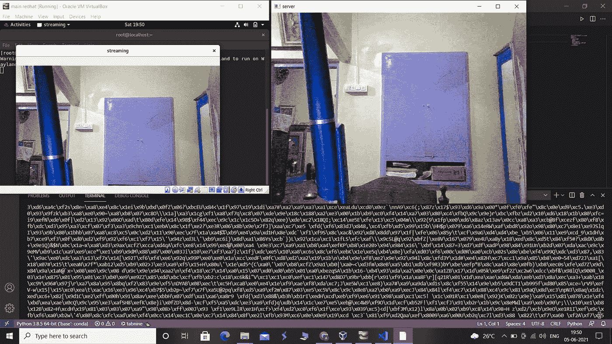

# 使用 OpenCV 进行直播

> 原文：<https://medium.com/nerd-for-tech/live-streaming-using-opencv-c0ef28a5e497?source=collection_archive---------0----------------------->

至少有一次我们使用了直播，但却想知道如何通过编程来实现。

大家好，我在这里给你们带来了一些使用 OpenCV 和 python 套接字编程的乐趣

今天，我们将在 OpenCV 和 socket 编程的帮助下创建一个直播应用程序，我们将从头开始为服务器和客户端开发代码。


**Opencv 是什么？**

Opencv 是一个计算机视觉库。这个库具有多种功能，因此我们可以使用网络摄像头和编程来处理我们的图像和视频。

**什么是套接字编程？**

简单地说，套接字编程意味着一个端口上的两台或多台服务器之间使用 TCP 或 UDP 等互联网协议进行通信。更多关于 socket 和 OpenCV 的内容我们将在代码中讨论

## 让我们开发一个服务器

在服务器上，当客户端连接到服务器时，应用程序将使用端口号和 IP 地址运行，然后服务器接收数据并将其转换为流。

在运行代码之前，确保您已经下载了 python 中的以下库

```
**pip install packagename**
```

opencv-python，numpy，pickle

```
**import cv2, socket, numpy, pickle****s=socket.socket(socket.AF_INET , socket.SOCK_DGRAM)****ip="192.168.1.5"****port=6666****s.bind((ip,port))**
```

在上面的代码中，我们已经导入了任务所需的库。变量将存储 socket 和 socket 的地址。AF_INET 代表我们使用 ipv4 作为套接字。socket.sock_DGRAM 用于 UDP 协议，代表用户数据报协议。有时使用它是有风险的，因为假设我们的数据包没有到达用户，它不会告诉我们，所以我们有数据丢失的风险，而不是它很容易使用。我们也可以使用 TCP，但是它会使我们的代码有点复杂，所以对于 basic 我们使用 UDP

“ip”变量包含您计算机的 IP 地址,“port”号包含您运行进程的端口。您可以根据自己的选择给出任何端口号，因为它只是一个正在运行并向外界公开的进程

s.bind()函数会绑定我们的“ip”和“port”号并转换成 socket。简单来说就是元组。现在我们已经完成了 socket。

```
**while True:** **x=s.recvfrom(1000000)** **clientip = x[1][0]** **data=x[0]** **print(data)** **data=pickle.loads(data)** **print(type(data))** **data = cv2.imdecode(data, cv2.IMREAD_COLOR)** **cv2.imshow('server', data) #to open image** **if cv2.waitKey(10) == 13:** **break****cv2.destroyAllWindows()**
```

上述函数将从客户端接收的数据暂时存储到' x '变量中。在“clientip”中，我们使用切片数组和数据变量存储了客户端的 ip 地址。现在，我们将使用函数 imdecode 对数据变量中接收的数据进行解码，imshow 函数将显示一个流窗口。cv2.waitkey(10)将每 10 毫秒点击/收集一次数据，直到您按下 enter 并输入 has number 13。当你按回车键时，destroyAllWindows()将关闭应用程序。

## **我们来配置客户端**

现在，当我们在给定的服务器 IP 和端口号上连接客户端时，它们之间的通信就开始了。

```
**import cv2, socket, pickle, os** **s=socket.socket(socket.AF_INET,socket.SOCK_DGRAM)****s.setsockopt(socket.SOL_SOCKET, socket.SO_SNDBUF, 10000000)****serverip="192.168.1.5"****serverport=6666**
```

在这里，我们首先导入了 socket 和 OpenCV 所需的库，并且“s”存储了 **socket 的地址。AF_INET** 代表 IP 家族 v4 和**套接字。SOCK_DGRAM** 这个关键字是针对 UDP 协议的，第三行将创建一个缓冲区大小，这样我们就可以存储一个数据的缓冲区来连续传输它。“serveip”和“serverport”保存服务器的 ip 地址和端口号。

```
**cap = cv2.VideoCapture(0)
while True:    
    ret,photo = cap.read()    

    cv2.imshow('streaming', photo)    

    ret, buffer = cv2.imencode(".jpg", photo,[int(cv2.IMWRITE_JPEG_QUALITY),30])** **x_as_bytes = pickle.dumps(buffer)    

    s.sendto(x_as_bytes,(serverip , serverport))    

    if cv2.waitKey(10) == 13:        

          break** **cv2.destroyAllWindows()****cap.release()**
```

**VedioCapture(0)** 存储功能地址和用于存储网络摄像头的‘0’。ret 存储返回值和照片，并存储 **cap.read(** )的输出。该函数将读取图像。imshow 将显示流窗口。缓冲变量将存储你的数据流，并提供给服务器。 **pickle.dumps(buffer)** 该函数将数据转储到一个变量中。发送到一个函数将数据与 IP 和端口号绑定，这样我们就可以发送它。**等待键**将每 10 毫秒收集一次数据，直到我们按下 enter 键，输入的代码为 13。 **destroyAllWindows()** 会销毁 Windows， **cap.release()** 会关闭我们的摄像头。



**在这里，您可以清楚地看到接收到的数据和两端发生的数据流。**

在这里，我将第二台机器用作虚拟机，这样您可以看到两个相同的映像。

你会发现完整的代码 [**GITHUB**](https://github.com/abhikesare9/live-streaming-with-opencv)