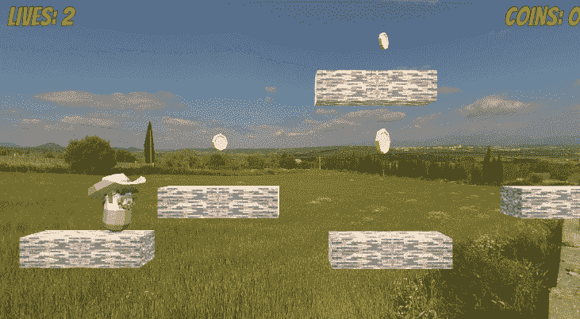
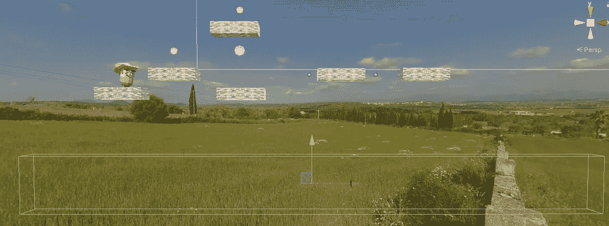
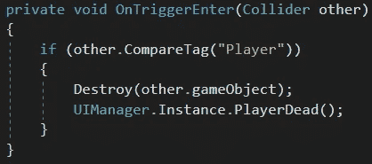
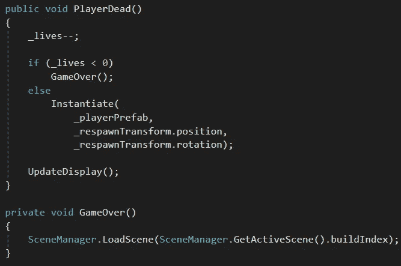

# 生命和重生

> 原文：<https://medium.com/nerd-for-tech/lives-and-respawning-313a9e838dbb?source=collection_archive---------21----------------------->

目标:允许我们的玩家以生命为代价重生。

"我唯一遗憾的是，我只有三次生命可以献给我的祖国。"

当玩家死亡时，我们会想减去一条生命。我们将在关卡底部创建一个不可见的边界，将*碰撞*设置为*触发*。

我们将在这个边界上附加一个*死亡地带*脚本。如果它检测到播放器，它将销毁播放器，并通过调用其 *PlayerDead* 方法告诉 *UIManager* 实例。

*UIManager 的**player read*方法将生命计数减 1。如果现在没有更多的生命剩余，它调用 *GameOver* 方法，重新开始游戏。

如果至少还有一次生命，它会在重生点以适当的旋转让玩家预设重生。

我们的 *UIManager* 开始变得有点杂乱——它现在处理硬币计数和生命。如果我们再给它增加一个功能，我们应该把这些功能分解到一个游戏管理器中，让游戏管理器*来处理用户界面。*