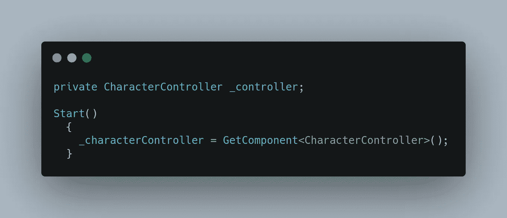
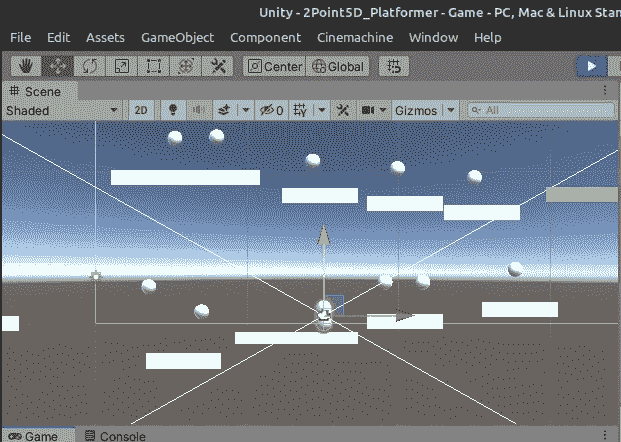
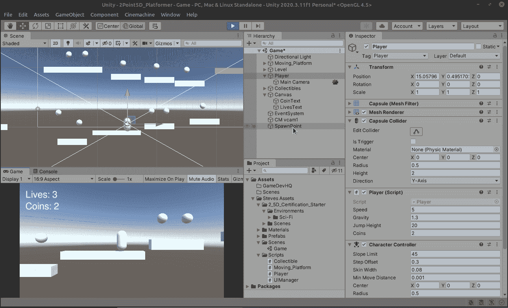
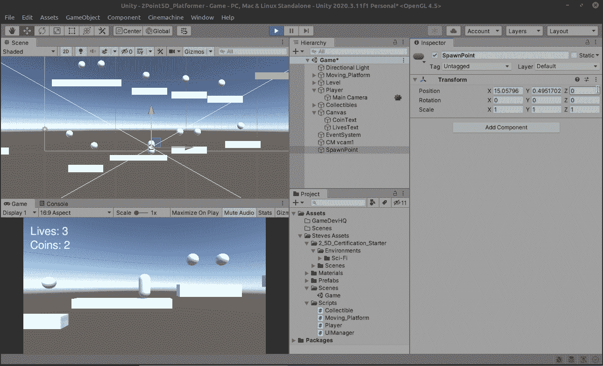
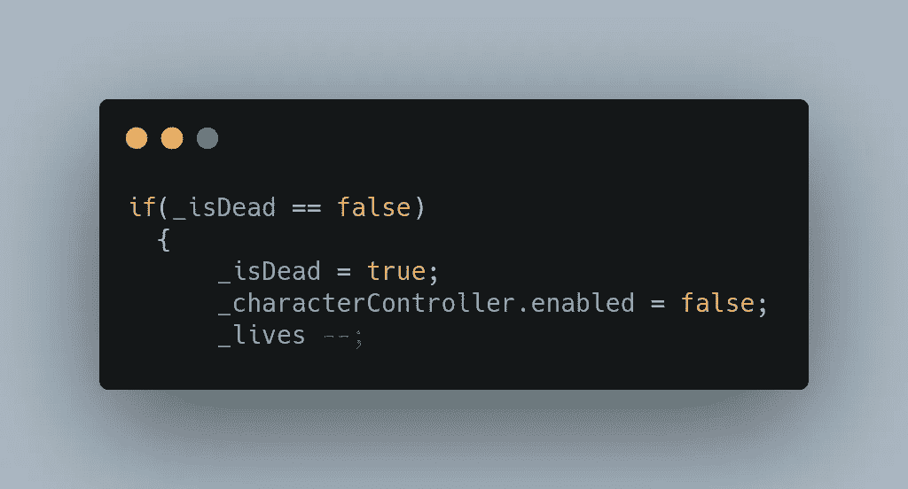
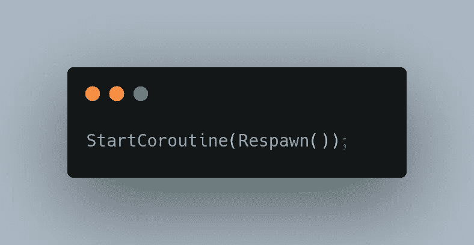
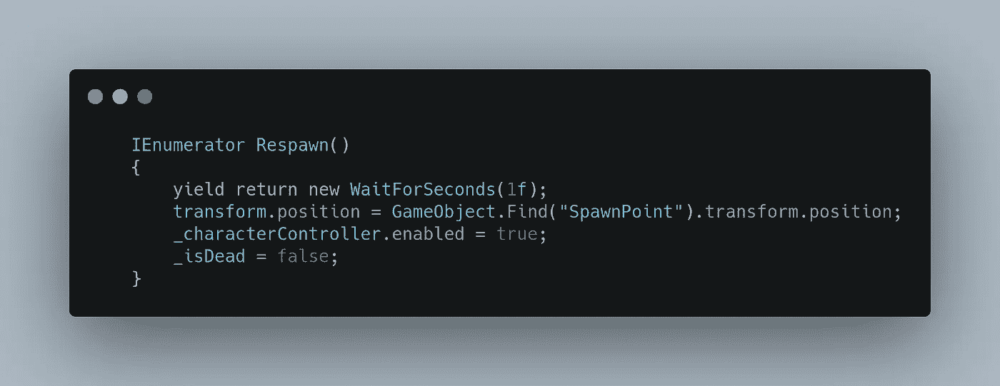
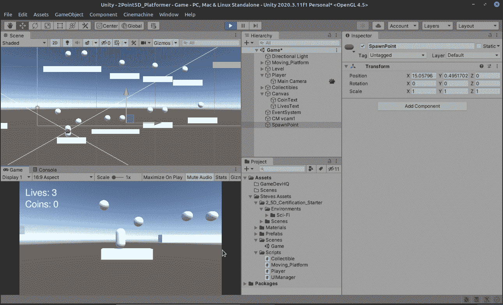
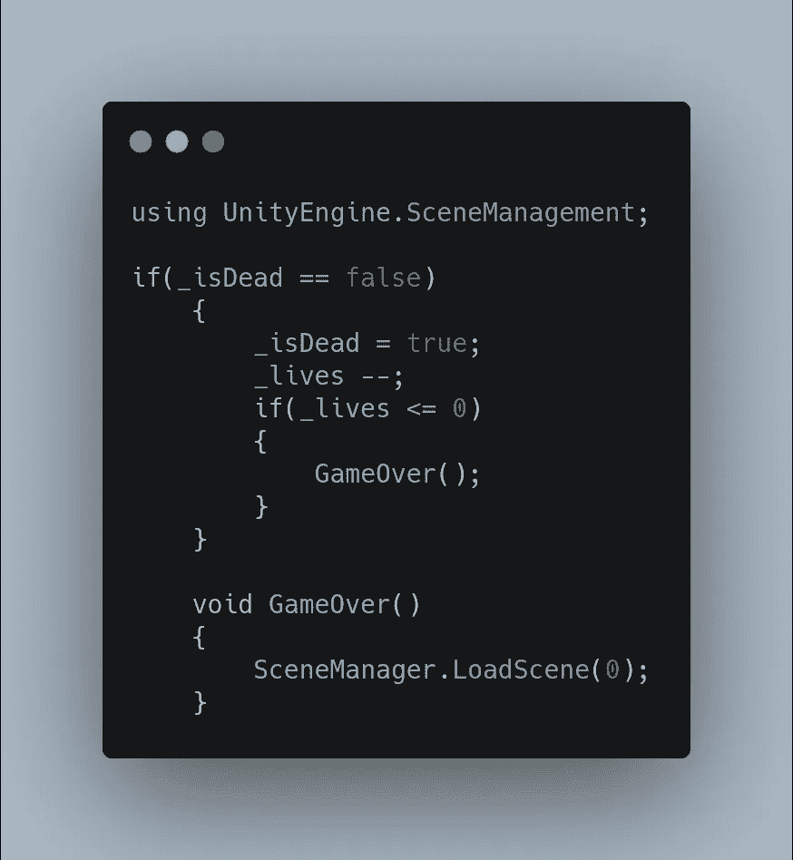
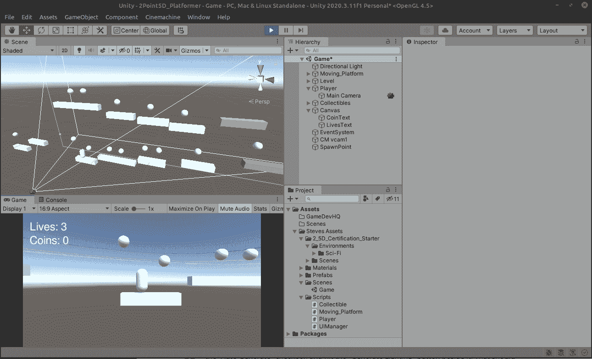

# 生命和重生——重生的片段

> 原文：<https://medium.com/nerd-for-tech/lives-and-respawning-the-respawning-bits-8b5e2559aa00?source=collection_archive---------19----------------------->

所以现在，当我们的玩家死亡时，他们会立即重生，但是我们想给玩家多一点时间来意识到在那一刻，他们没有犯错，为了做到这一点，我们会做一些准备来防止任何意外的生命减少。让我们为角色控制器创建一个支架。

我们将在玩家死亡时关闭角色控制器，这将有助于防止 unity 不断减少生命，我们将在重生时再次打开它。

因此，为了确保当玩家出现时，他们需要在地面上，以防止在打开和关闭角色控制器时出现一些奇怪的问题。我将打开播放，并将播放器移动到我想要重生的地方。

当游戏还在玩的时候，移动种子点到玩家里面，0 出来。然后将种子点移出玩家，它将显示玩家当前的坐标。单击检查器中的 3 个小点，然后选择“复制组件”来复制种子点信息。

停止游戏，仍然选择产卵点，再次点击三个点，选择“粘贴组件值”。

好了，一切准备就绪！在减去生命的部分，我们现在关闭角色控制器:

接下来，我们将把它转换成一个协程，而不是调用 respawn:

然后我们用 IEnumerator 替换 void 来进行重生:

然后在《重生》中，我们重新打开了角色控制器以及我们所做的其他事情，但是我们也添加了一个收益返回来等待 1 秒钟，以使它感觉更像一个游戏。

好了，应该可以了！我们去看看吧！

这才是电子游戏死亡的感觉！最重要的是，让我们以 3 人丧生的场景来结束:

很明显，一个场景中的灯光变暗是因为我们在 Unitys 编辑器中加载了一个场景，这不会发生在实际构建的游戏中。明天我们将开始拼图！