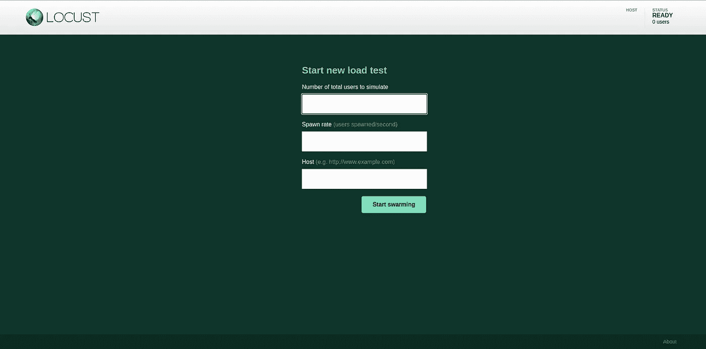
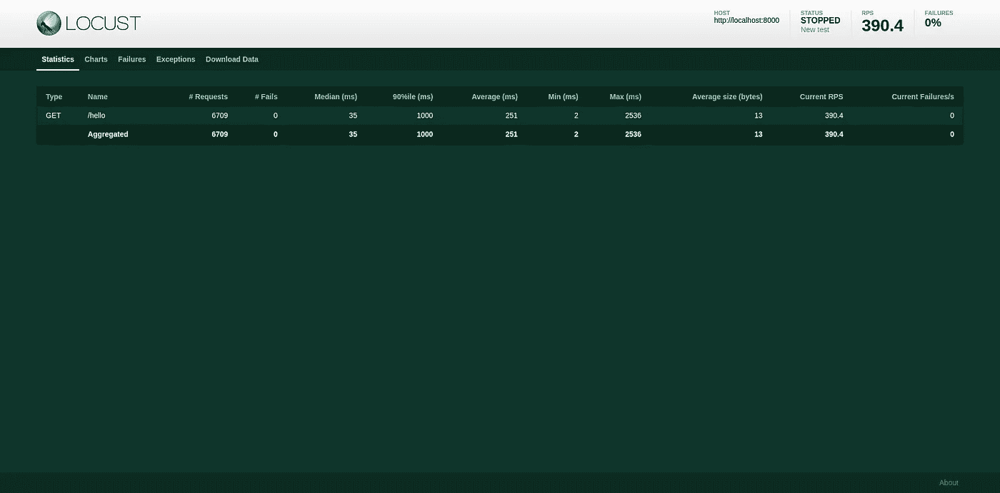
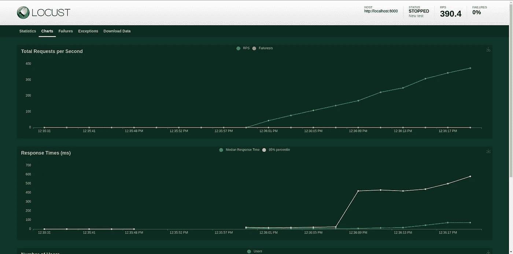

# 使用 Locust.io 进行负载测试

> 原文：<https://medium.com/nerd-for-tech/load-testing-using-locust-io-f3e6e247c74e?source=collection_archive---------0----------------------->


照片由[廷杰伤害律师事务所](https://unsplash.com/@tingeyinjurylawfirm?utm_source=medium&utm_medium=referral)在 [Unsplash](https://unsplash.com?utm_source=medium&utm_medium=referral) 上拍摄

在我们的应用程序或服务运行之后，有一段时间我们想知道我们的服务可以处理的性能和负载。在一定数量的用户尝试访问我们的服务后，服务的性能会下降吗？我们的服务会变得不稳定吗？使用负载测试可以回答所有这些问题。因此，作为开发人员，了解负载测试对我们来说很方便，我们将在这里学习。

但是我们必须记住的重要一点是，性能调整通常应该在系统启动并运行之后进行。就像唐纳德·克努特说的:

> “过早优化是万恶之源”

所以请确保您没有过早地优化您的应用程序。

在本文中，我们将学习如何在 Python 中使用 Locust.io 进行负载测试。我们开始吧。

# Locust.io 简介

直接取自官方文件。

Locust 是一个易于使用、可脚本化和可扩展的性能测试工具。

## 特征

*   用普通的 Python 编写测试场景
*   分布式和可扩展—支持成千上万的并发用户
*   基于网络的用户界面
*   可以测试任何系统
*   可破解的

有了这些特性，Locust 给了我们一些自由来编写测试。我们可以通过编写自定义用户/客户端来对 HTTP、XLM-RPC 和 gRPC 服务进行负载测试。此外，最棒的是我们可以直接在 web UI 上看到测试的统计数据。如果我们必须向非技术人员展示我们的发现，这可能会很方便。

# 装置

注意:我们需要 Python 3.6 或更高版本才能使用 Locust.io

很可能，您需要首先在本地机器上设置一个虚拟环境。隔离我们的工作空间并且不使用全局环境是一个很好的实践。

使用 pip 安装 Locust。

```
pip install locust
```

(或`pip3 install locust`)

我们可以通过在终端上运行命令`locust -v`来验证我们已经正确安装了 Locust。它会给我们成功安装的蝗虫版本号。

# 从一个简单的例子开始

对于我们要测试的 API，我是用 FastAPI 写的。不过不懂 FastAPI 也没关系。我将解释 API 是做什么的。

让我们从一个 hello world 的例子开始。FastAPI 应用程序和蝗虫测试脚本都是如此。

上面的代码所做的基本上是当我们到达终点`/hello`时给我们`Hello World`响应。短小精悍！

现在，蝗虫测试脚本。

用`locustfile.py`编写上面的代码，你可以在你的终端上运行`locust`命令来运行测试。

可以在 [http://0.0.0.0:8089/](http://0.0.0.0:8089/) 上打开 web UI(默认)。然后，你会看到这个。



作者形象

在这里，您必须指定要模拟的用户数量、其生成率和您的服务 API 主机 URL(因为我使用的是 FastAPI，所以默认为 [http://localhost:8000/](http://localhost:8000/.) )。测试运行一段时间后，您将会看到类似这样的内容。



作者形象



作者形象

看起来很整洁，对吗？现在，对测试脚本的解释。

我们的测试脚本也非常简单。我们在上面有进口声明。然后，我们定义测试运行时将被模拟的用户类。`HelloWorldUser`类扩展了`HttpUser`类，因为我们的应用程序使用 HTTP 调用进行交互。`wait_time`用于指定模拟用户在执行任务之间应该等待多长时间，装饰器`task`用于指定`hello_world`方法是一个应该由模拟用户执行的任务。

# 一个有点超前的例子

在这一节中，我们将修改 FastAPI 应用程序和蝗虫测试脚本。让我们来看看 Locust.io 更高级的用法。

FastAPI 应用程序:

当然比我们之前的 11 行代码要长。这段代码是做什么的？

*   `/login`:用户必须指定他的用户名和密码来获得令牌(这里我使用了一个虚拟的例子)，因为所有的端点都受到验证过程的保护(不包括`/hello`端点)。因此，要访问所有其他端点，用户必须在其请求头中指定`login_token`。
*   `/logout`:这里我们基本上通过给出一些虚拟响应让用户注销。
*   `/fast`和 `/slow`:我放`time.sleep`是为了模拟一些昂贵的工艺。
*   `/double-me`:该端点获取路径参数`num`，然后返回`num`的双精度值。
*   `/square-me`:这是一个后方法请求。用户必须指定`num`和`nums`。`num`是数字，`nums`是数字列表。这个端点返回`num`和`nums`的平方值。

蝗虫测试脚本:

哇！这是一段相当长的代码。让我们一点一点地分析这段代码。

*   `TestUser`是在测试运行时运行的一类模拟用户。像这个简单的例子一样，它扩展了`HttpUser`。而且，它拥有`wait_time`的财产。
*   在这个简单的例子中，我们使用`task` decorator 定义了任务。上面的代码为我们提供了一种不同的方式来定义模拟用户必须完成的任务。我们可以像`fast_task`和`slow_task`一样定义函数。注意，这两个函数都可以访问模拟用户(包括属性`TestUser`拥有的属性)。
*   除了将功能定义为任务。我们也可以使用一个类来编写任务。`ProcessNumberTask`扩展了`TaskSet`，然后我们可以像往常一样使用`task`装饰器编写任务。区别在于我们不能直接从`self`访问`client`或模拟用户的属性。我们通过`self.user`访问它们。然后我们可以把`ProcessNumberTask`类放到`TestUser`类的`tasks`属性中。
*   就像任何其他常见的应用程序一样，在我们可以访问应用程序提供的功能之前，我们需要登录。请看`on_start`函数定义的第 36 行。这个函数为每个模拟用户运行。通过提供用户名和密码来请求登录令牌。然后，如果请求成功，我们保存登录令牌，供以后访问其他端点使用。
*   在`on_start`函数定义中，我们称端点`/login`为上下文管理器。但是您可以将它用作普通的函数调用。
*   在`on_stop`功能定义中，当测试停止时，我们可以为每个模拟用户做一些事情。例如，注销或清除一些会话。
*   蝗虫为我们提供了事件挂钩。在上面的代码中，我们使用了几个事件挂钩，但是让我们从`init`事件挂钩开始。`init`事件是在每个蝗虫过程开始时触发的。这在分布式模式下尤其有用，在这种模式下，每个工作进程(而不是每个用户)都需要一个机会来进行一些初始化。我们可以生成一个检查器，检查请求的数量是否超过 5000，如果超过，测试就停止。注意，我们可以通过`environment`变量访问测试的统计数据。
*   其他事件挂钩是`test_start`和`test_stop`。`test_start`当新的负载测试开始时触发。如果用户数量在测试过程中发生变化，它不会再次触发。同时，`test_stop`在负载测试停止时触发。

# 跑步蝗虫分布

一旦应用程序变大，测试也要变大。一段时间后，单机无法模拟出你期望的使用你 app 的用户数量。因此，我们需要将负载测试分布在多台机器上。

假设您已经有了您的测试脚本。您可以用这个命令在主节点上启动 Locust(Locust 文件名是`my_locustfile.py`)。

```
locust -f my_locustfile.py --master
```

然后使用以下命令启动工作节点:

```
locust -f my_locustfile.py --worker --master-host=192.168.0.14
```

用主节点的 IP 地址替换`192.168.0.14`。

另一种分发 Locust 进程的方法是使用 docker。

您可以使用这个命令来运行使用 docker(非分布式)的测试。

```
docker run -p 8089:8089 -v $PWD:/mnt/locust locustio/locust -f /mnt/locust/locustfile.py
```

此外，您可以使用 docker-compose。这是一个如何使用它的例子。

要运行多个 worker，您可以使用这个命令(在本例中是 4 个 worker 节点)。

```
docker-compose up --scale worker=4
```

# **检索 CSV 格式的测试统计数据**

以 CSV 格式检索我们测试的测试统计数据非常容易。我们要做的就是执行这个命令(假设我们在`locustfile.py`中有我们的负载测试脚本)

```
locust --csv=result
```

我们将有 4 个 CSV 文件: `result_exceptions.csv`、`result_failures.csv`、`result_stats.csv`和`result_stats_history.csv`。

# 结论

在本文中，我们讨论了几个基本的蝗虫用例，从简单的到稍微高级一点的。Locust 给了我们一些灵活性，让我们可以根据自己的用例编写自己的测试。不仅为我们提供了我们需要的统计数据，还为我们提供了一个好看的 web UI 来监控负载测试。尽管我们已经涵盖了相当多的方面，但仍有一些东西被忽略了。例如其他命令行选项、使用配置文件配置、自定义客户端等。所以，你可以在[官方文档](https://locust.io/)中找到其余部分。我认为文档写得很好，易于浏览。

你可以在这里获得本文使用的完整代码:[https://github . com/agusrichard/python-workbook/tree/master/locust-article-material](https://github.com/agusrichard/python-workbook/tree/master/locust-article-material)

作为补充知识，我还有一个蝗虫负载测试的例子:[https://github . com/agusrichard/python-workbook/tree/master/load-test-Locust](https://github.com/agusrichard/python-workbook/tree/master/load-test-locust)。这个测试的 API 服务的代码在这里:[https://github . com/agusrichard/go-workbook/tree/master/load-test-experiment](https://github.com/agusrichard/go-workbook/tree/master/load-test-experiment)

感谢您的阅读，如果您认为这篇文章对您有所帮助，请不要犹豫，给这篇文章一些掌声。下次见！

# 参考资料:

*   【https://docs.locust.io/en/stable/ 