# 使用 Apache JMeter 进行负载测试

> 原文：<https://medium.com/nerd-for-tech/load-testing-with-apache-jmeter-9ce263824210?source=collection_archive---------1----------------------->

由[马尔辛·西蒙尼德斯](https://unsplash.com/@cinusek?utm_source=medium&utm_medium=referral)在 [Unsplash](https://unsplash.com?utm_source=medium&utm_medium=referral) 上拍摄的照片

向所有人致敬。在这篇短文中，我们将学习如何对 web 应用程序进行负载测试。我们将使用 Apache JMeter 进行负载测试。简单地说:负载测试意味着:“一种性能测试，它决定了系统在真实负载条件下的性能。”

1.  下载并安装 Apache Jmeter。
2.  从[https://DLC dn . Apache . org//jmeter/binaries/Apache-jmeter-5.5 . zip](https://dlcdn.apache.org/jmeter/binaries/apache-jmeter-5.5.zip)下载设置

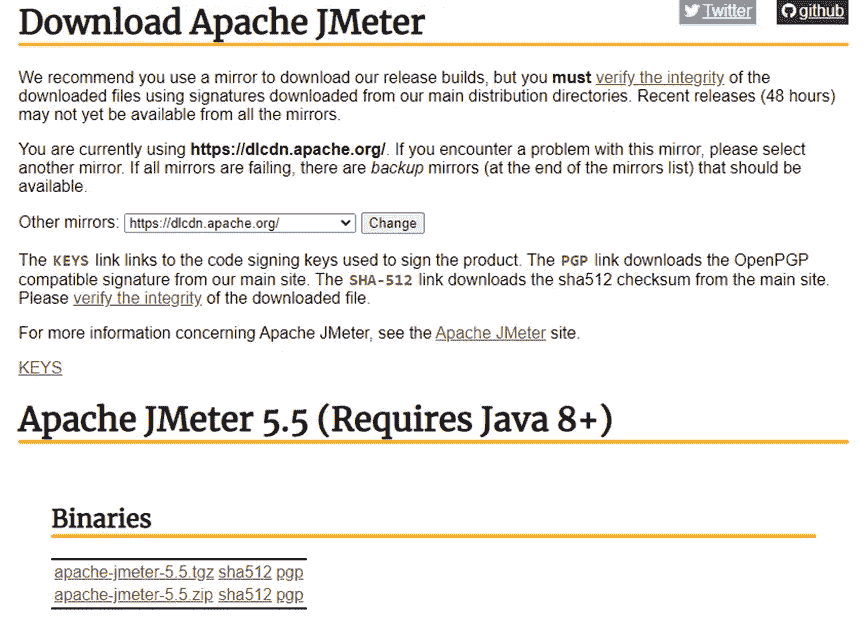

3.解压 apache-jmeter-5.5.zip，进入***Apache-jmeter-5.5->bin***文件夹。

4.点击**ApacheJMeter.exe**文件启动 Jmeter。(需要 Java 8+版本)

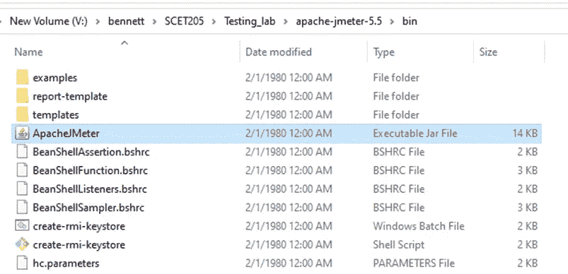

5.您将出现在 Jmeter 的主屏幕上。

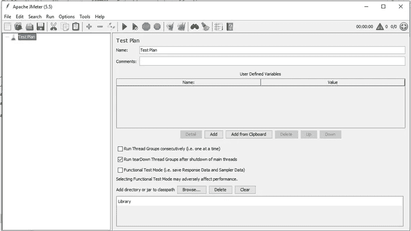

如果双击无法执行 Jmeter。尝试命令行，如下所示:

打开终端/ CMD，转到***Apache-jmeter-5.5->bin***并键入以下命令:java -jar ApacheJMeter.jar

6.将会自动为您创建一个默认的测试计划。现在，更新您的测试计划的名称。

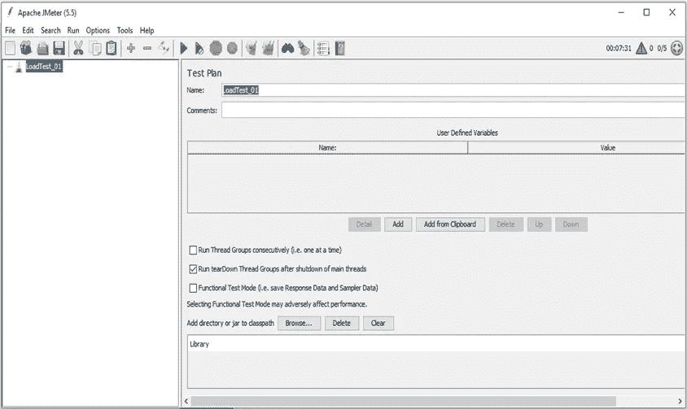

7.将您的测试计划保存在辅助存储器中。(按 ctrl+S 或按保存图标)。

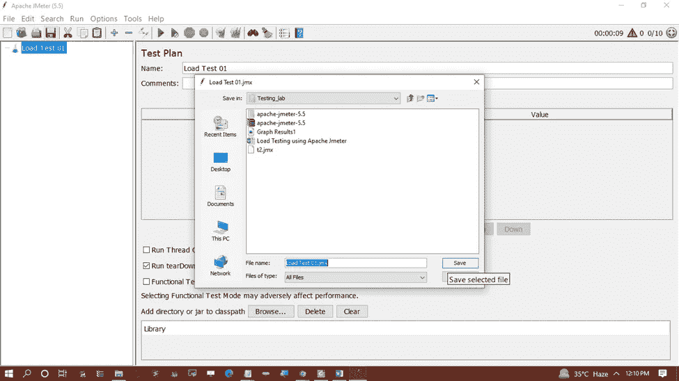

8.右键点击**-*->添加- >线程(用户)- >线程组*-**并重命名线程组。

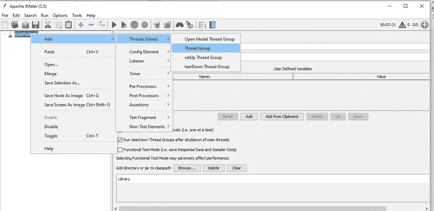

9.您将位于线程组详细信息页面。重命名线程组。

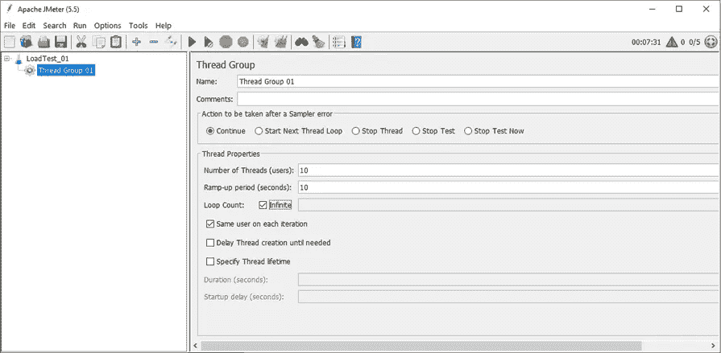

10.右键点击线程组，进入 ***- >添加- >采样器- > HTTP 请求***

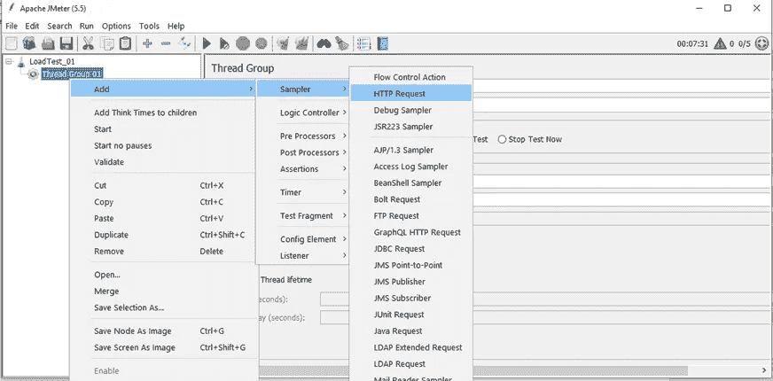

11.更新 HTTP 请求的详细信息，如下所示:

11.1 重命名 HTTP 请求。

11.2 按照屏幕截图中给出的内容，填写以下 URL 的基本信息。

a.[https://www . Bennett . edu . in/schools/school-of-computer-science-engineering-and-technology/](https://www.bennett.edu.in/schools/school-of-computer-science-engineering-and-technology/)

b.保持请求类型为 **GET** 。

11.3 保存更新。

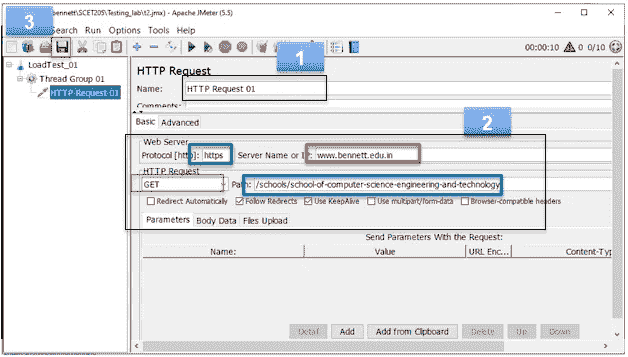

12.右键点击线程组，进入 ***- >添加- >监听器- >图形结果*-**

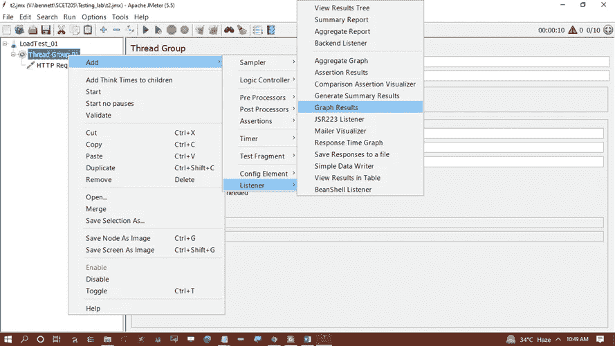

13.更新图形结果的名称

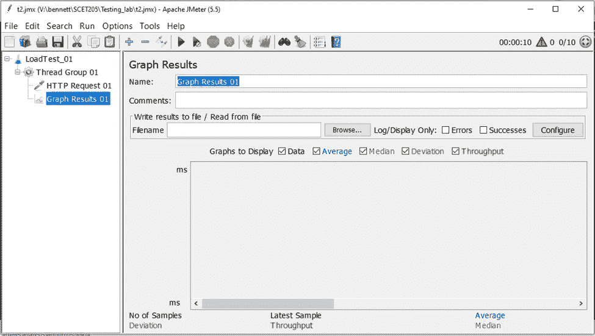

14.右键点击线程组，进入 ***- >添加- >监听器- >查看结果树*-**

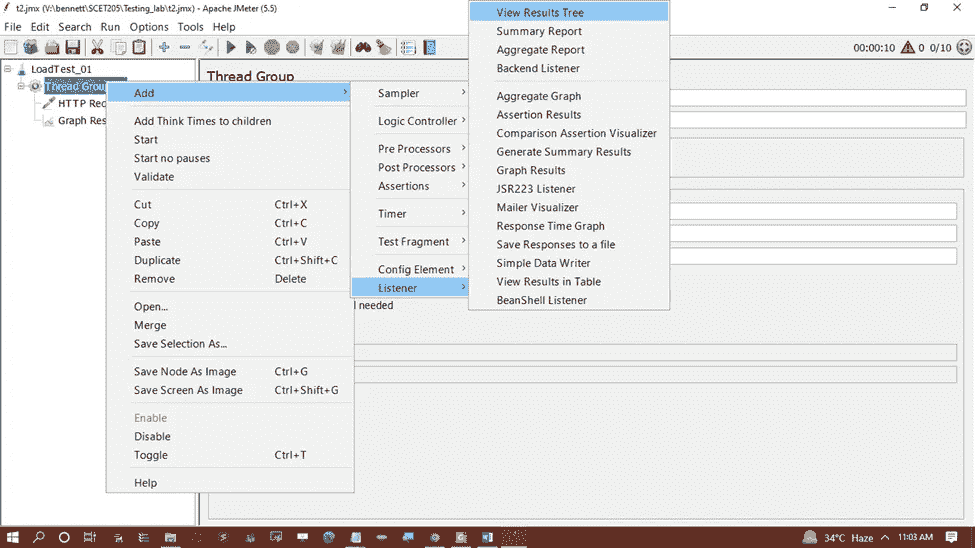

15.重命名结果树。

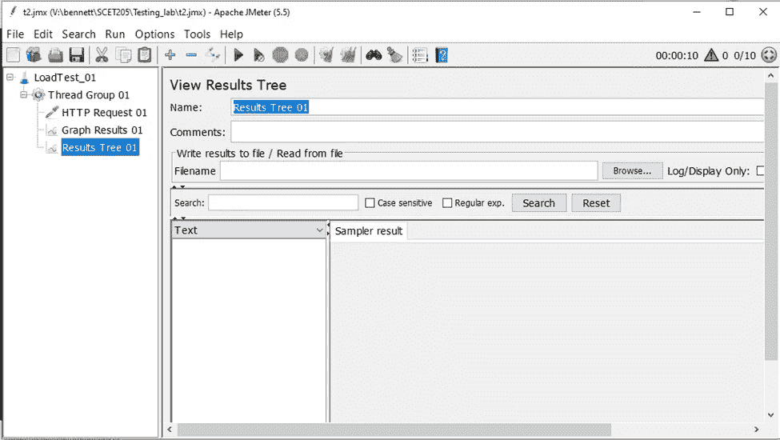

16.单击 Run 按钮并执行负载测试。您将看到如下执行细节:

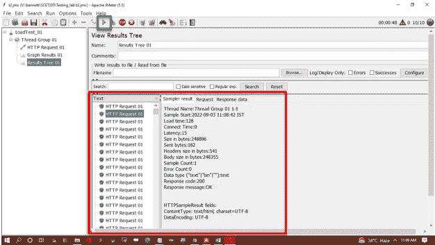

17.单击图表结果部分。您将能够以图形格式看到执行结果。

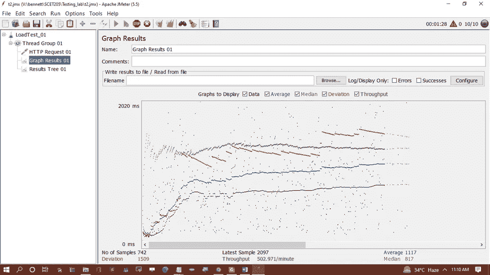

18.将图形结果作为图像保存在辅助存储器中。( ***点击图形结果- >将节点另存为图像*** )

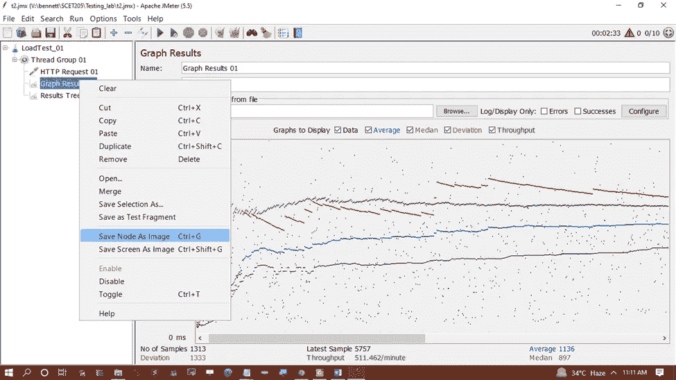

感谢您阅读帖子。虽然没什么可读的。如果您已经执行了上面提到的所有步骤，那么您已经成功地对给定的 URL 执行了负载测试。尝试 JMeter 的其他特性和不同的 URL，以便进一步探索。谢谢你。