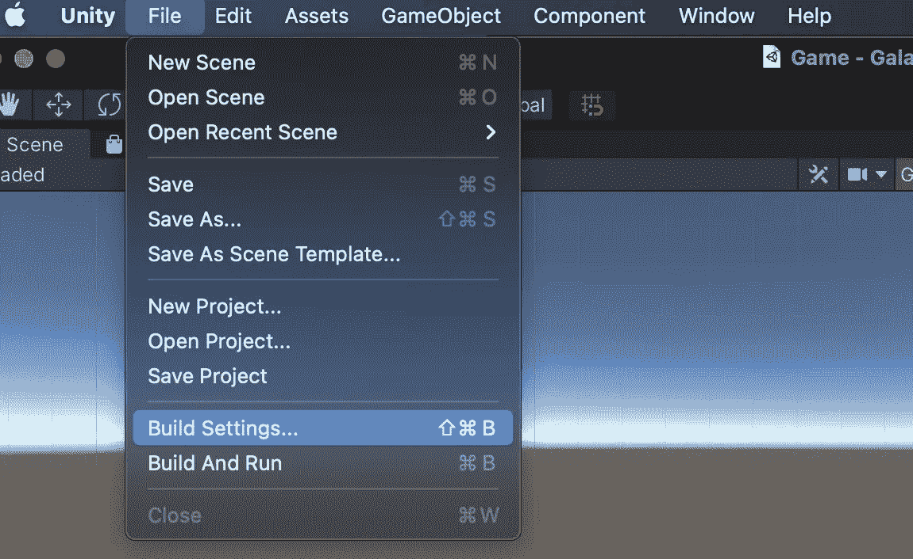
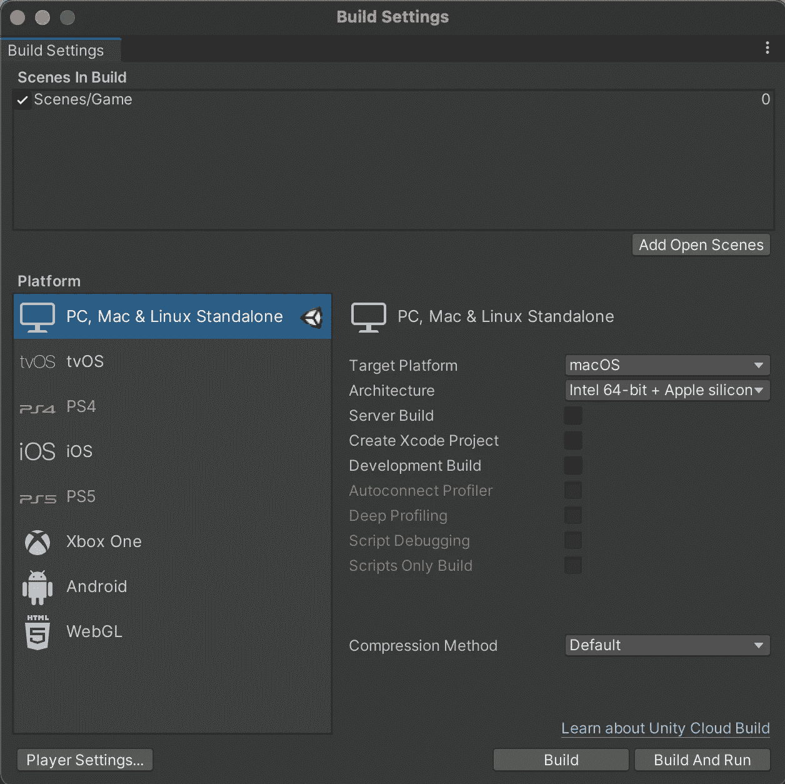
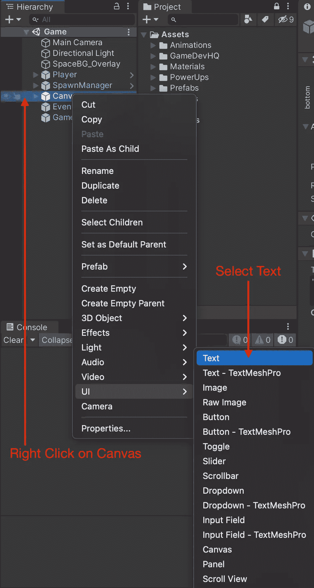
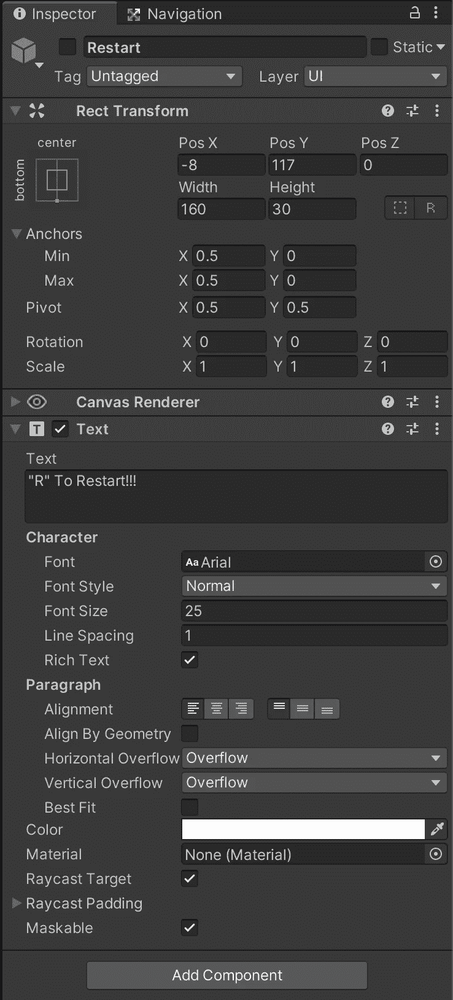
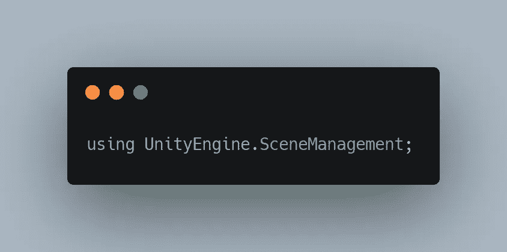
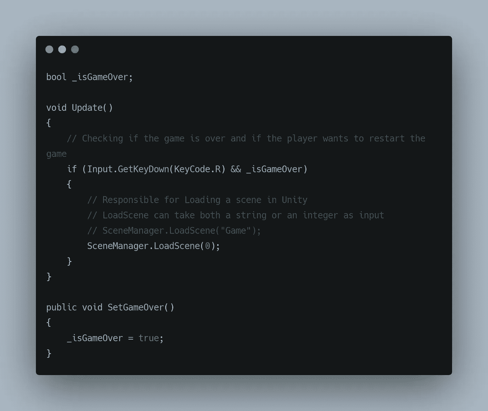
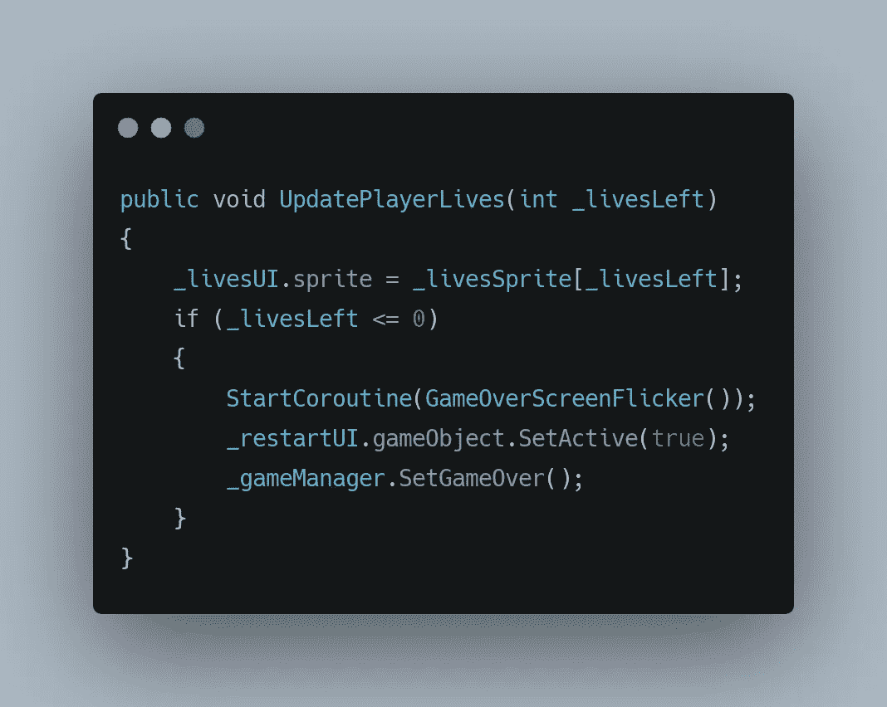
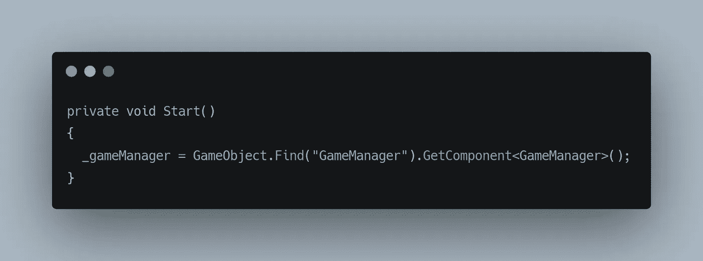
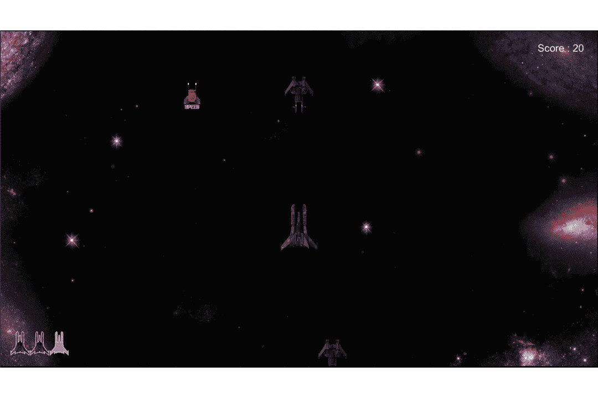

# 在 Unity 中加载场景

> 原文：<https://medium.com/nerd-for-tech/loading-scenes-in-unity-5d86a33e8ebb?source=collection_archive---------6----------------------->

建立在之前关于一个屏幕上的游戏的文章之上，我们增加一旦玩家失去所有生命就重启游戏的能力怎么样？这可以通过简单地重新加载我们给定的场景来完成。

什么是场景？

你在 Unity 中工作的地方叫做场景，你可以在一个游戏中有多个场景。场景基本上是资产，默认情况下，一个场景会在**样本场景**上。您可以通过执行以下操作来创建新场景，

您可以双击新创建的场景切换到该场景。

接下来要做的是将我们的场景添加到我们的项目构建中，这可以通过执行以下操作来完成:

您可以将场景放到 Build 中的场景中。记录相对于场景显示的数字。

现在让我们创建一个 UI 文本，它会提示我们做什么来重启游戏，

完成后，您可以编辑新创建的文本对象，以获得您想要的结果。

按 R 重新启动

现在这里，因为我们希望加载一个场景，让 UI 重新加载一个新的场景是没有意义的，让玩家加载场景也是没有意义的。因此，让我们创建一个游戏管理器，它将管理与我们的游戏相关的一切，不属于任何其他类别，就像在这种情况下加载场景。

这里的 GameManager 是一个空的游戏对象，它包含一个 GameManager 行为脚本。

游戏管理器的行为如下，

加载一个场景可以通过一个名为 scene manager 的 Unity 包来实现，所以将这个包导入到游戏管理器中对我们来说很重要。这将使我们能够使用 SceneManagement 包中可用的方法。

这使我们能够使用 LoadScene 方法来加载给定的场景。

最好使用场景编号，而不是场景名称。

其中 **SetGameOver()** 在 **UIManager** 脚本中的 UpdatePlayerLives 方法中被调用。

其中 **_restartUI** 是我们创建的**文本**游戏对象变量，目的是让玩家知道当他按下所需的键时，他可以选择重新开始游戏。 **_gameManager** 是存储游戏管理器脚本引用的变量。

这给了我们以下结果，

感谢您的阅读，更多内容敬请期待！！！