# 在 Unity 中加载场景

> 原文：<https://medium.com/nerd-for-tech/loading-scenes-in-unity-5d8bedc0a55?source=collection_archive---------12----------------------->

## 统一指南

## 关于如何在 Unity 中加载场景的快速指南

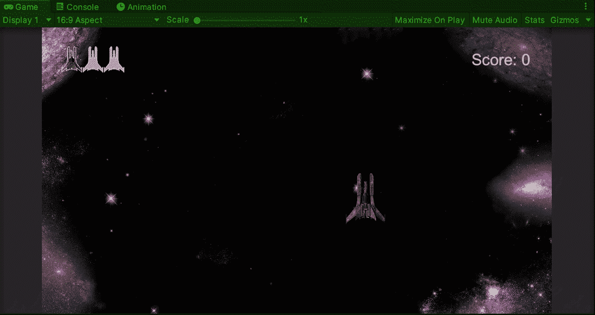

**目标**:在 Unity 中加载一个太空射击游戏的场景，重启游戏。

现在我们已经[在太空射击游戏中实现了一个复古游戏行为](/nerd-for-tech/implementing-a-retro-game-over-behavior-in-unity-fb126c76c4bf)，让我们添加一个当玩家被摧毁时重启游戏的功能。

为了增加这个功能，让我们[创建一个新的 UI 元素](/nerd-for-tech/creating-ui-elements-in-unity-a778929eacfa)，让玩家知道游戏结束后如何重启关卡。重启游戏的一种方法是加载相同的游戏场景，我们可以在玩家按下一个键时触发它:

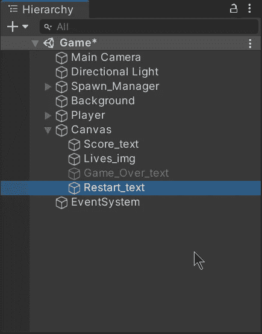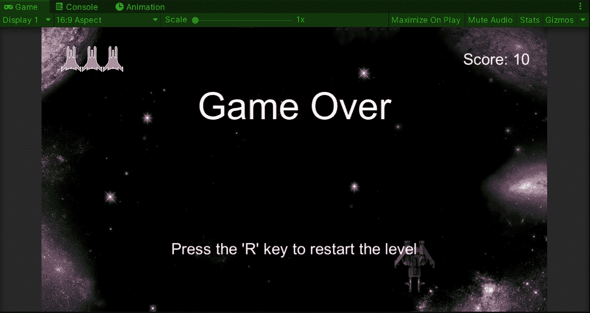

在画布中使用文本元素让玩家知道如何重新开始游戏。

现在，为了实现重启特性，我们需要创建一个新的脚本来控制游戏流程。让我们创建一个空的游戏对象，并附上新的脚本:

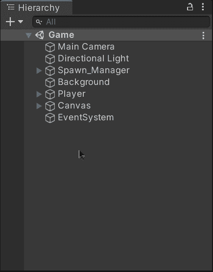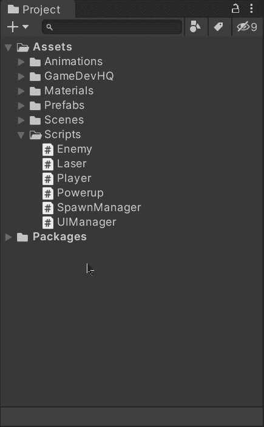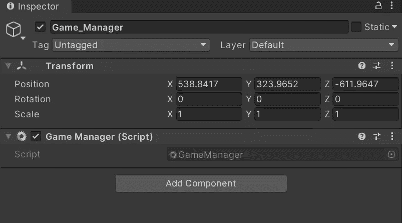

在 Unity 中，游戏管理器通常用于控制游戏流程。正如你所看到的，当我们创建一个名为 GameManager 的脚本时，一个齿轮图标出现了，因为它是 Unity 中的一个特殊名称。

# 加载场景

打开**游戏管理器**脚本，在脚本顶部添加**场景管理**类。我们需要这个类在运行时处理场景管理。

然后，让我们创建一个新的 bool 来知道游戏是否已经结束:

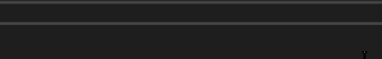

然后，为了在游戏结束时更改 bool 值，让我们创建一个公共函数:

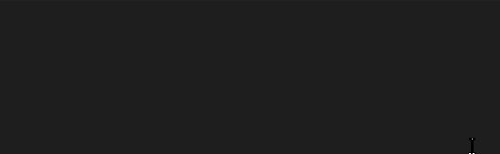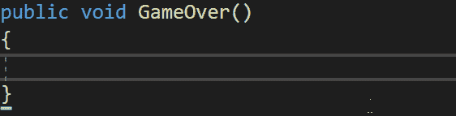

现在，为了处理来自玩家的输入，让我们在 **Update** 函数中添加一个条件，该条件将检查 R 键是否被按下以及游戏是否已经结束:

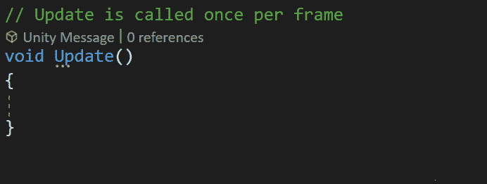

为了重新加载场景，我们可以使用来自 **SceneManager** 类的 **LoadScene** 方法，但是我们需要指定正确的参数来加载所需的场景。我们可以通过以下方式选择场景:

*   发送场景的名称或路径。
*   发送场景的构建索引(在构建设置中找到)。

> *注意:我们也可以使用****LoadSceneAsync****方法来避免加载场景时的性能问题，但我可能会在另一篇文章中讨论它。*

## 按名称加载场景

要使用名称加载场景，我们需要在 Unity 中标识名称，并在 **LoadScene** 方法中发送一个字符串:

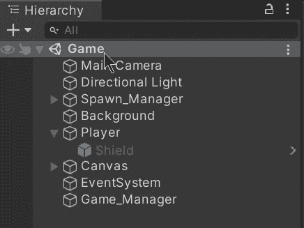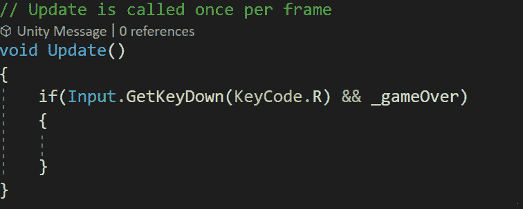

场景名称是 ***游戏*** *。*

## 通过构建索引加载场景

要通过构建索引加载场景，我们需要确保场景包含在构建设置中。我们可以选择用右边的按钮添加当前打开的场景，或者我们可以将它从文件中拖到构建设置中。一旦我们添加了场景，我们将在右边看到构建索引，我们需要在 **LoadScene** 方法中发送它:

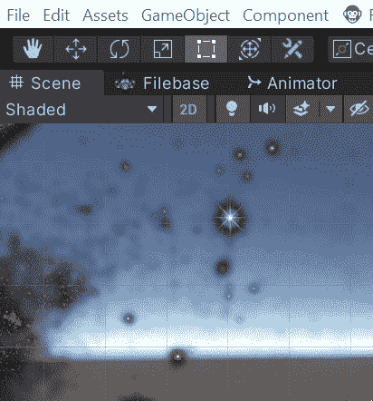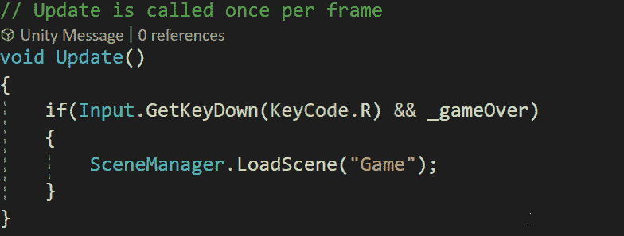

场景的建造指数为 **0** 。

# 执行场景加载

现在，为了触发场景加载，我们可以打开 **UI 管理器**脚本并创建一个新变量来存储对附加到游戏管理器游戏对象的**游戏管理器**脚本组件的引用:

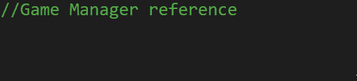

让我们找到 **Start** 函数中的脚本组件引用，并将其分配给变量，检查它是否为空，以打印一条错误消息，这是一个好的做法:

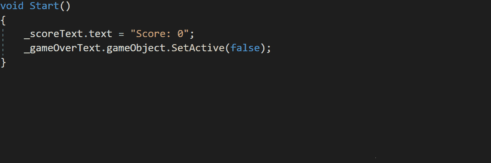

最后，在显示游戏结束警告的函数中，让我们从**游戏管理器**脚本中调用 **GameOver** 函数来指示游戏结束:

现在，如果我们在 Unity 中运行游戏，我们会看到当玩家被摧毁后按下 R 键时，我们可以重新加载游戏场景:

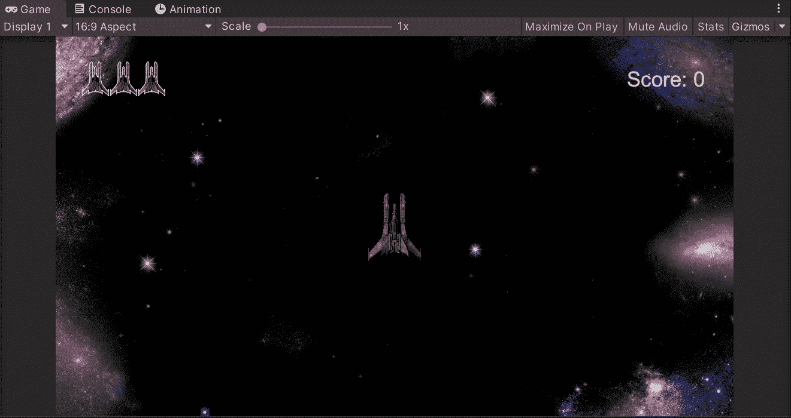

就是这样，你可以在 Unity 中加载你的场景！:d .我会在下一篇文章中看到你，在那里我将展示如何用 Unity 在太空射击游戏中制造敌人爆炸。

> *如果你想了解我更多，欢迎登陆*[***LinkedIn***](https://www.linkedin.com/in/fas444/)**或访问我的* [***网站***](http://fernandoalcasan.com/) *:D**