# 在 Unity 中加载场景

> 原文：<https://medium.com/nerd-for-tech/loading-scenes-in-unity-c1ec791fa9d9?source=collection_archive---------27----------------------->

这一次，我们将看看如何重新启动我们当前的场景，并创建一个主菜单。首先，我们必须创建一个 GameManager 组件来运行我们的逻辑。我们将它作为一个独立的组件，这样我们就有了一个中心位置来运行逻辑，它与我们当前的任何脚本都没有关系。

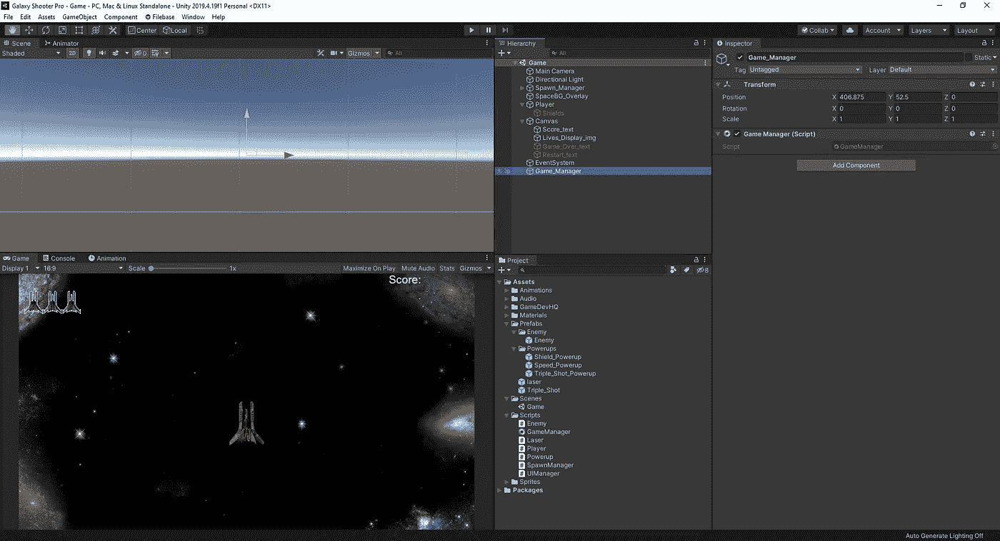

从这里，我们可以进入我们的 GameManager 脚本并为 GameOver 设置代码。我们必须确保我们的脚本正在使用 unity engine . scene manager。从这里，我们可以设置我们的 R 键作为重新启动键，并且也可以让它只有在游戏结束时才能被按下。

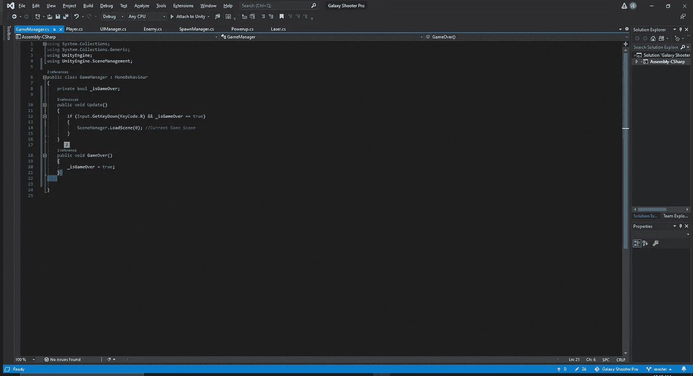

至于 LoadScene(0)，我们必须在编辑器中设置我们的场景:

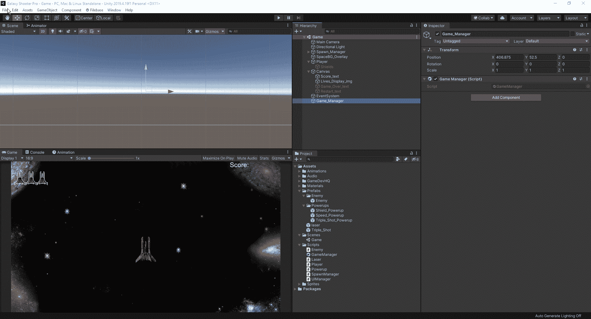

一旦我们设置好了，我们就可以转到游戏管理器脚本，将 GameOver()代码添加到我们创建的 GameOverSequence void 中。这样做是为了让我们可以清理 if 语句，如果我们有任何错误，可以更容易地在空白中找到它:

最后，我们可以运行我们的游戏，看看它是否如预期的那样工作:

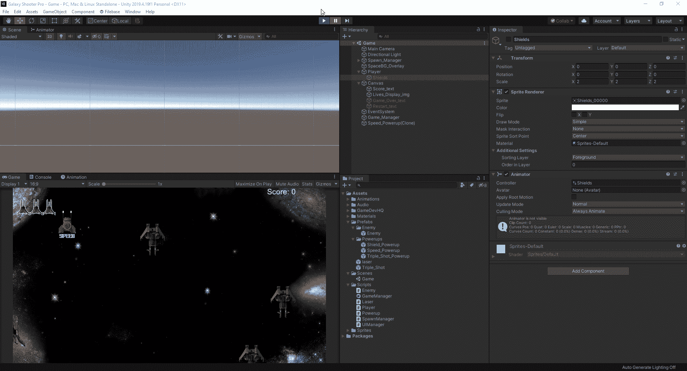

现在我们有了一个可以正常工作的重启按钮，我们可以开始创建一个新的主菜单场景了。首先，让我们为自己创造一个新的场景:

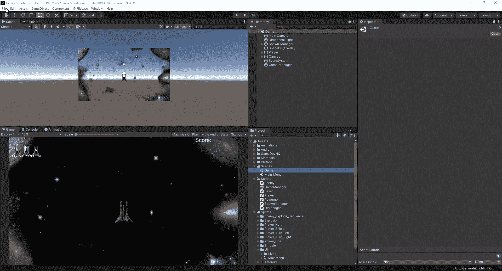

一旦我们有了新的场景，我们可以把它作为主菜单保存在我们的场景文件夹中。从这里，我们可以创建一个 UI 图像组件，并拖动我们必须使用的主菜单图像:

一旦我们有了它，我们现在可以调整它的大小，在这种情况下是 512x512。同样，我们可以将主摄像头换成纯色和黑色:

从这里开始，让我们在主游戏中添加 spaceBG，因为它比纯黑背景更具视觉吸引力，同时调整图像大小，使其正好适合我们的游戏区域:

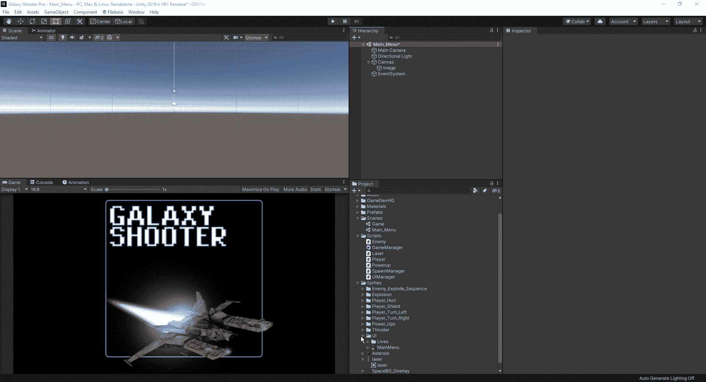

现在我们已经有了我们想要的主菜单屏幕，让我们添加一个玩家可以与之交互的按钮来开始一个新游戏:

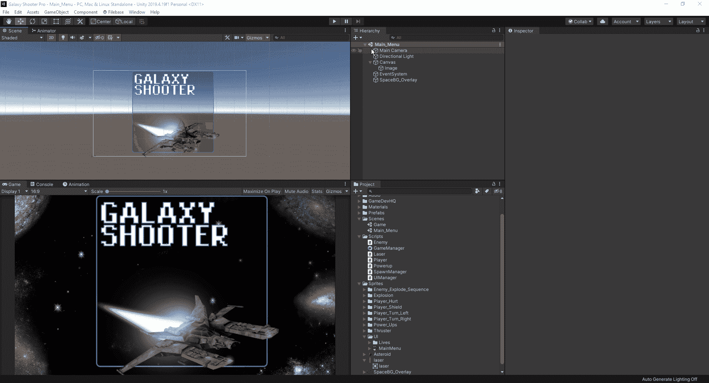

现在我们已经设置了按钮，我们可以重命名它，并根据我们的需要调整周围的颜色。有了 Unity，我们可以改变很多与按钮互动的方式，但现在我们只是让它在点击时改变颜色:

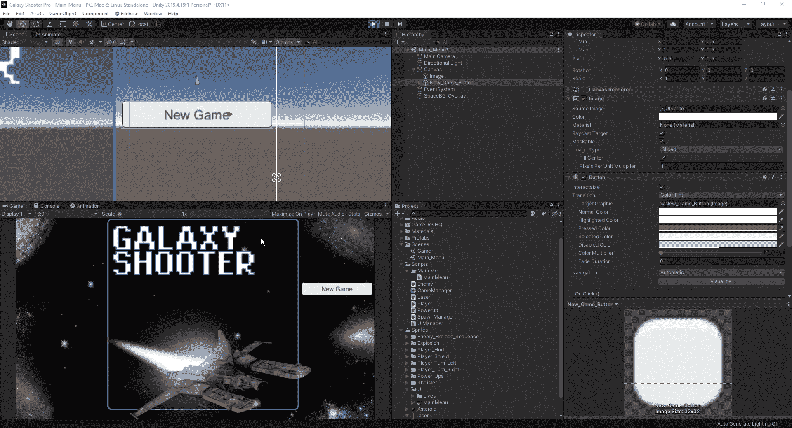

接下来，我们将在构建设置中调整场景编号，这样当我们加载游戏时，它会在我们的主菜单上开始:

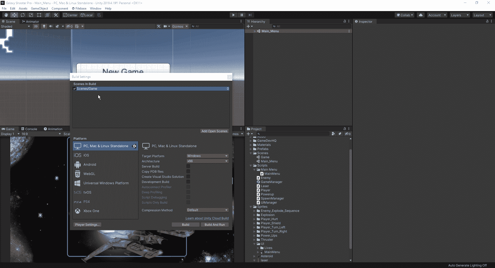

由于我们已经更改了游戏屏幕的数字，我们必须记住返回到我们的游戏管理器脚本，并更改我们的重置按钮按下的数字:

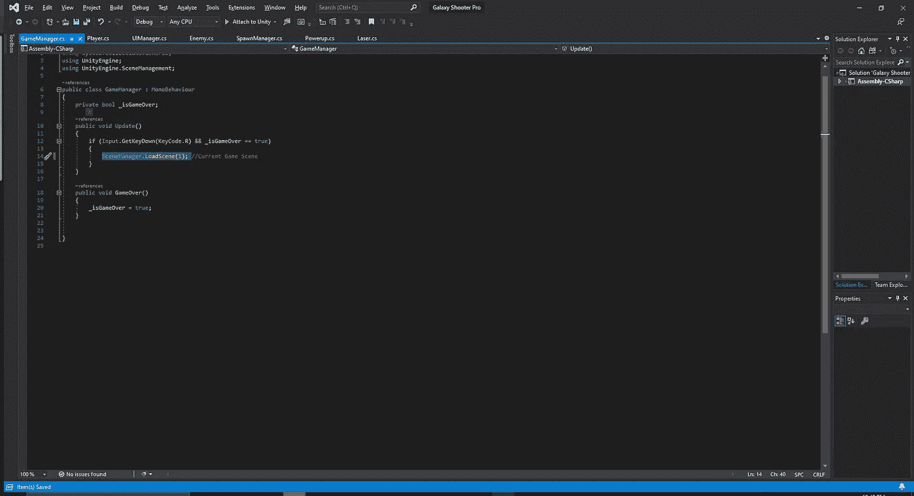

接下来，我们需要让按钮有一个功能，而不是在按下时改变颜色。我们将在脚本下创建一个名为“主菜单”的新文件夹，这样我们就可以在该文件夹中保存与主菜单相关的所有内容。接下来，我们将创建一个主菜单脚本并将其附加到画布上。

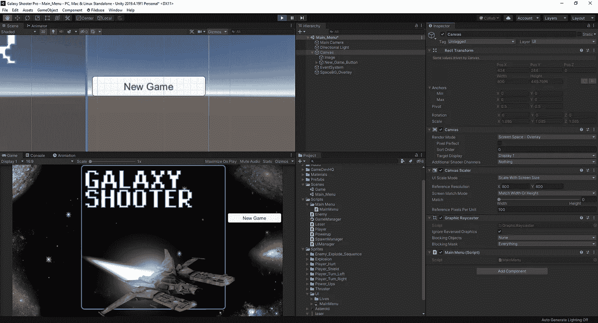

在我们新制作的脚本中，我们必须添加 UnityEngine。场景管理在顶部，然后我们可以创造一个新的公共空间:

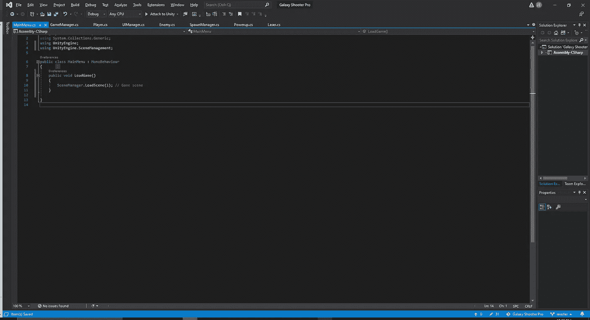

我们需要确保将它命名为 Public，这样我们就可以将它附加到按钮中的 onclick 事件，如下所示:

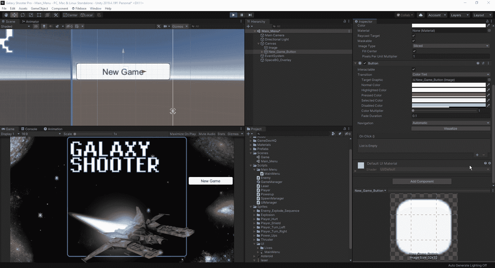

现在我们已经设置好了，我们可以检查一下它是如何工作的:

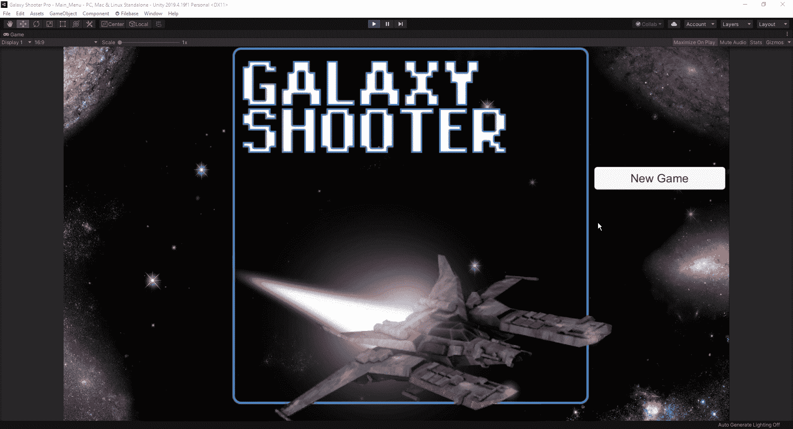

现在我们已经有了一个正常运行的主菜单，是时候回到我们的游戏中，添加一些 VFX，并对边缘进行一些修饰。