# 贷款违约预测案例研究

> 原文：<https://medium.com/nerd-for-tech/loan-defaulter-predication-case-study-a4cd457273be?source=collection_archive---------1----------------------->

新加坡海湾花园的图像

众所周知，当前银行体系中最普遍、最重要的问题是不良资产问题。每天我们都会看到个人或组织拖欠贷款的新闻。这个问题主要是由于在执行适当的验证之前向实体支付贷款而引起的。但是，为了改进这一过程，银行需要大量的劳动力，这可能会对银行的利润产生一些影响，因为在验证过程中会涉及部分资金，如工资、办公基础设施等。那么，我们该如何处理这个问题呢？

问题的解决方案是这个博客。在这里，我们将借助机器学习的方法来预测申请人是否在过程的早期阶段违约。因此，这将有助于我们减少开支，使银行系统更有效率。现在，我们将直接跳到我们如何做到这一点的解决方案。

# 目录:

**A .简介**

**B. ML 配方**

**C .业务目标和限制**

**D .数据集分析**

**E .第一次切割方法**

**F .性能矩阵**

**G. EDA**

**H .特征编码**

**我**。**建模**

**J .总结**

**K .模型的生产化**

**L .未来的工作**

**M. Profile**

**参考文献**

# A.简介:

在这个案例研究中，我们将建立一个模型来帮助我们预测这个人是否违约。

# B.毫升配方:

在本案例研究中，我们可以使用带有二元分类的监督学习模型，因为我们必须确定客户是否违约。

# C.业务目标和约束:

**a)目标:**

主要目的是根据给定的申请人数据确定潜在违约者。

分类概率至关重要，因为当我们将某人归类为非违约者时，我们希望非常确定，因为犯错的成本对公司来说可能非常高。

**b)约束:**

可解释性对于是否将某人归类为违约者是部分重要的。

没有严格的延迟限制，因为目标更多的是做出正确的决策，而不是快速决策。如果模型只需要几秒钟就能做出预测，这是可以接受的。

犯错的代价可能非常高。这是因为每笔贷款都涉及大量资金。我们不希望模型遗漏潜在的违约者，这可能给组织带来巨大的财务损失。

# D.数据集分析:

从 Kaggle 上的贷款违约者挑战中获取数据

https://www . ka ggle . com/datasets/gauravduttakiit/loan-defaulter 包含两张表，分别是申请数据和以前的申请数据

csv 文件的详细信息如下:

1)申请数据:在这个文件中我们有申请人的数据。它总共包含 122 列和 307511 行。

3)以前的申请:在这个文件中，我们有以前申请过贷款的申请人数据。

它总共包含 37 列和 1670214 行。

参考:【https://www.kaggle.com/gauravduttakiit/loan-defaulter 

# E.首次切割方法:

1)这里我们有两个数据集，即应用程序数据和以前的应用程序数据。因此，首先我们将对数据集进行 EDA，以获得对数据集的清晰了解。

EDA 之后，我们将连接两个数据集中的要素。

3)一旦我们有了最终数据集。我们将对所有特征进行特征编码，以使它们为模型做好准备。

4)现在，在建模部分，我们将尝试不同的 NLP 模型并检查它们的性能。

5)最后，我们将选择性能最佳的型号。

# F.绩效矩阵:

1)当公司收到贷款申请时，公司必须根据申请人的资料决定是否批准贷款。

2)为了避免违约，我们需要正确预测违约方，因此可能有两种情况需要我们处理:

A}如果我们预测非违约者为违约者→这种情况很好，我们将进一步将这些案例分配给业务团队进行重新验证。如果申请人是真实的，那么我们可以继续他的申请。

b)如果我们预测违约者为非违约者→我们需要尽可能少的违约，因为这是我们业务的损失。

因此，要实现这一点，我们需要高召回分数。

3) AUC 分数:AUC 越高，模型区分阳性和阴性类别的性能越好。

4)准确率评分:但首先我们需要平衡数据集。

## 导入重要的库:

# G.EDA:

数据集的探索性数据分析有点耗时，因为它有近 150 个要素。因此，这里我们将只分析一些重要的功能，其余功能的详细分析将在笔记本中提供。

这里我们有两个数据集。一个是申请数据，另一个是以前的申请数据。

这里我们有两个数据表，一个是应用数据，另一个是以前的应用数据

申请数据包含新的贷款申请人数据，以前的申请数据包含以前申请过贷款或拒绝过贷款的申请人的记录等。

分析后，我们知道应用程序数据总共有 122 个特性，而以前的应用程序数据有 37 个特性

SK_ID_CURR 是两个数据集之间的共同特征。因此，我们可以使用它来合并两个数据集，根据未来的需要。

目标特征作为因变量。这有助于了解申请人是否违约

现在，我们将看到两个数据集中的要素列表

A}应用数据:

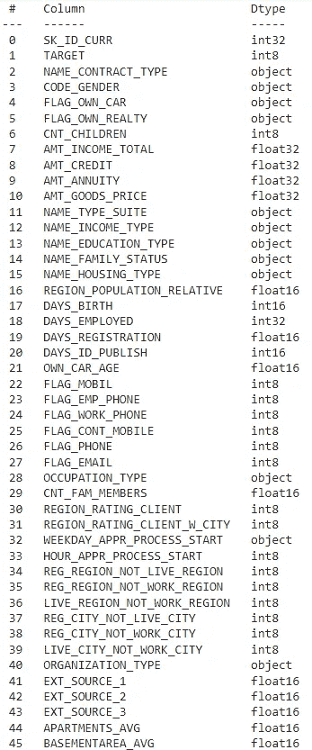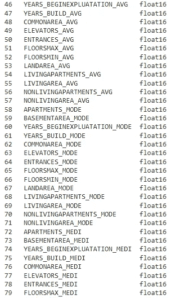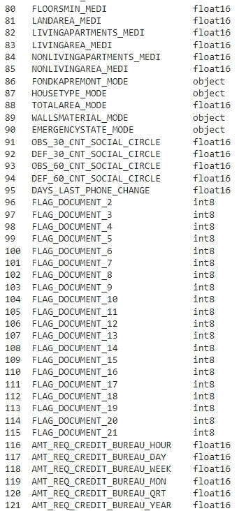

总共有 122 个特征。

b)以前的申请数据:

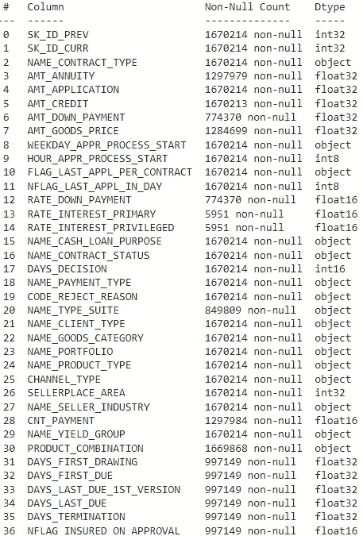

总共有 37 个特征

## 数据分析:

**在数据分析中，我们将分析找出以下内容:**

缺少值

所有的数字变量

分类变量

分类变量的基数

极端值

独立特征和从属特征(目标)之间的关系

我们将首先开始分析应用程序数据，然后我们将浏览以前的应用程序数据。

## A}应用数据:

我们创建了一些有助于数据分析的函数，如下所示:

1.  missingdata_percentage:它将计算要素的空值百分比。

2.value _ wise _ defaulter _ percentage:它将计算每个类别的默认百分比。它在分类特征的情况下最有用。

***空值分析:***

首先，我们将从应用程序数据中找出包含大于 40%的空值百分比的特征。

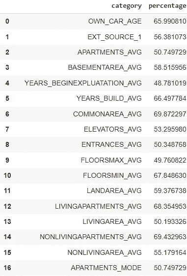

总共有 49 个特征包含大于等于 40%的空值。我们将删除此功能，因为这些功能中缺失值的百分比非常高。所以，这个特征对预测没有多大用处。

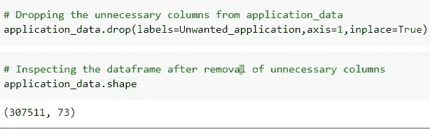

现在总共有 73 个特征，去除特征后包含的缺失值> 40%。

这里，首先我们将把特征分成数字特征和分类特征。然后考虑每个特性进行分析。

## 数字特征:

我们会发现如下数字特征:

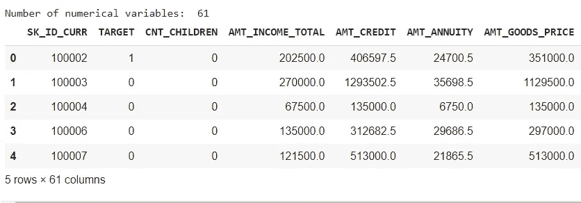

所以，总共有 61 个数字特征。

## 标志功能:

这些都是类别为[0，1]的分类特征。标志功能集包含下述功能:

我们在结果中得到的特征如下:

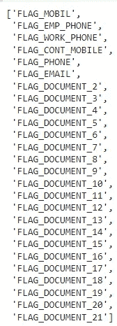

使用热图可视化所有特征如下:

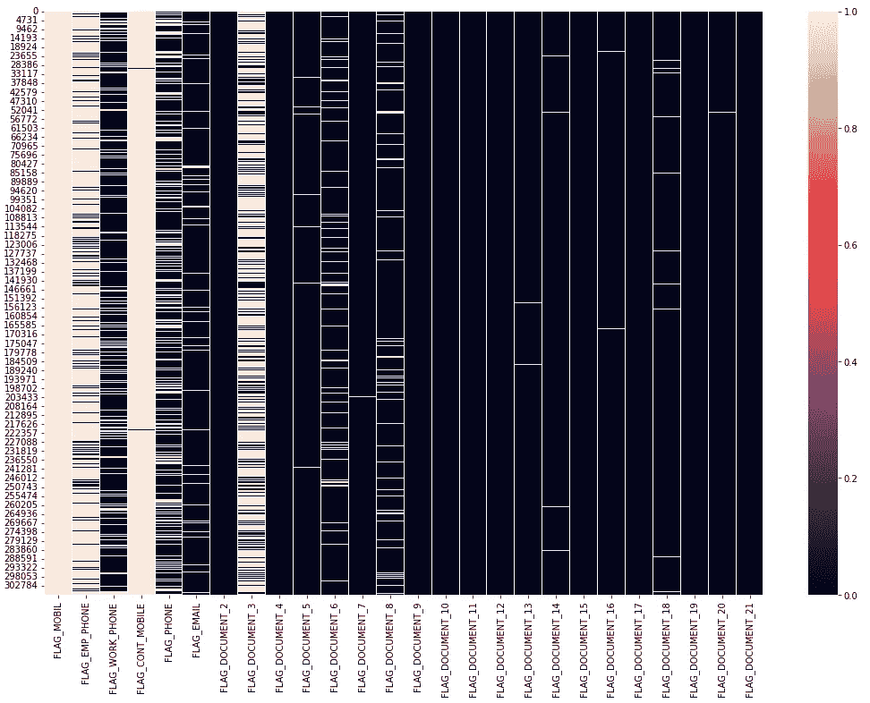

在分析了所有的标志特征后，我们知道所有的特征都是严重不平衡的，对于目标预测来说不是有用的区分器。所以，我们可以放弃这个功能。

现在数据集形状是

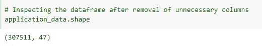

## 区域相关特征:

首先，我们将找出如下的区域相关特征:

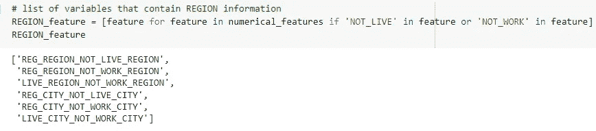

现在，我们将绘制所有这些特性的关联热图:

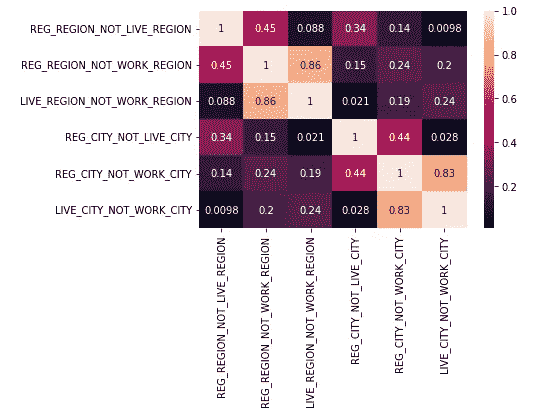

经过分析，我们了解到:

1) REG_REGION_NOT_LIVE_REGION 特性高度不平衡，因此我们将删除它。

2) REG_REGION_NOT_WORK_REGION 和 LIVE_REGION_NOT_WORK_REGION 高度相关，因此我们可以删除其中一个。由于不平衡问题，主要是居住地区而不是工作地区。

3) REG_CITY_NOT_WORK_CITY 和 LIVE_CITY_NOT_WORK_CITY 高度相关，因此我们可以删除其中一个。

## 社交圈相关功能:

现在我们将分析 SOCIAL_CIRCLE 的相关特性:

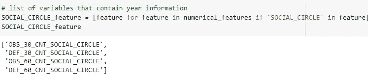

我们将绘制所有这些特征的关联热图:

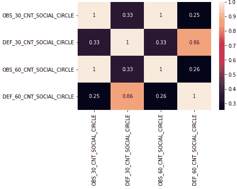

经过分析，我们了解到:

1)OBS_30_CNT_SOCIAL_CIRCLE 和 OBS_60_CNT_SOCIAL_CIRCLE 特征高度相关。因此，这些功能是相同的，我们可以跳过任何一个功能。

2) DEF_30_CNT_SOCIAL_CIRCLE 和 DEF_60_CNT_SOCIAL_CIRCLE 特征高度相关。因此，这些功能是相同的功能，我们可以跳过任何一个功能

## 天数相关功能:

现在我们将分析与天相关的特性:

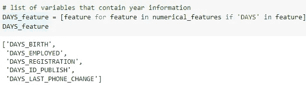

所有这些特征都包含日期，但我们希望通过将其转换为以下年份来进行特征工程:

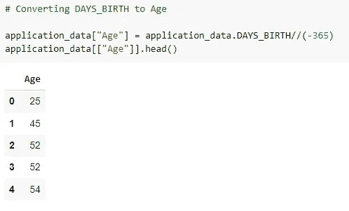

将出生天数转换为年龄

同样，我们也转换了其他日子的功能:

就业天数→就业年份

天 _ 注册→年 _ 注册

天数 _ ID _ 发布→年份 _ ID _ 发布

天数 _ 最后 _ 电话 _ 更改→年份 _ 最后 _ 电话 _ 更改

最后，我们将用相应的年特性替换日特性。

现在，我们将逐一查看并分析每个特性。现在，我们有了 application_data 数据集的 42 个特性。

## 数字特征:

首先，我们将浏览以下数字特征:

现在我们有 30 个数字特征。因此我们将它进一步分为离散数值特征和连续数值特征。

## 离散数字特征:

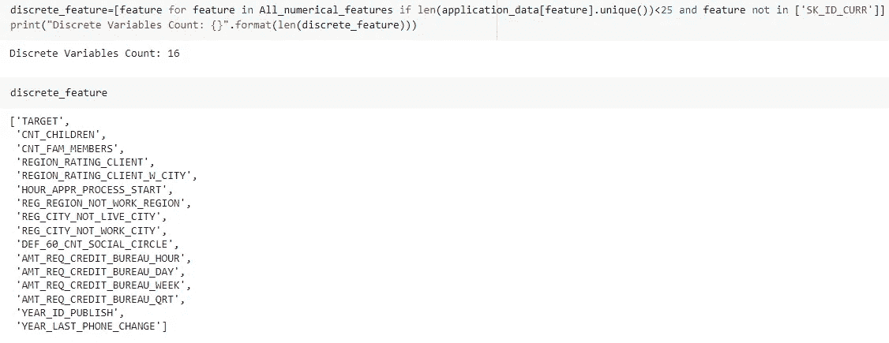

离散数字特征

**目标:**

目标是数据集的因变量。所以，现在我们将对它做一些分析。

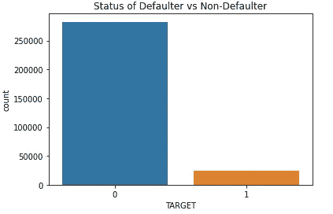

目标特征分析

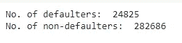

从上述分析中，我们了解到违约者的比例非常小(大约。8%)。所以数据集是高度不平衡的。

**年份 _ ID _ 发布和年份 _ 姓氏 _ 电话 _ 变更:**

现在，我们将分析 YEAR_ID_PUBLISH 和 YEAR_LAST_PHONE_CHANGE 功能。

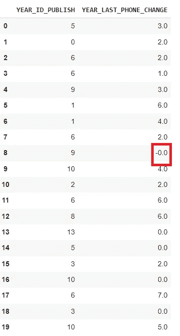

后分析一些值，我们知道，在 YEAR_LAST_PHONE_CHANGE 中，年值为-0.0，这是不可能的。所以我们用 0.0 来代替它。

此外，YEAR_LAST_PHONE_CHANGE 中缺少 1 值。因此，我们将它替换为中间值，如下所示:

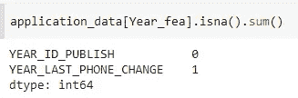

用中值替换空值

现在，我们将检查出现频率最高的类别以及违约率最高的类别。

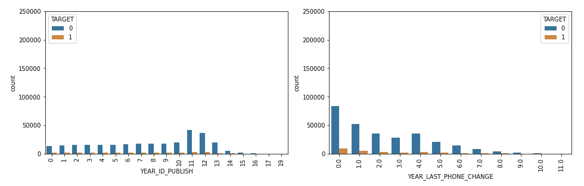

每个类别的计数

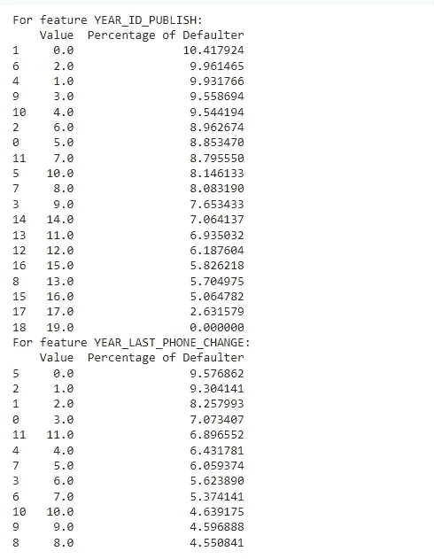

违约百分比

经过分析，我们了解到:

1)大多数申请人的 YEAR_ID_PUBLISH 和 YEAR_LAST_PHONE_CHANGE 分别为 11 和 0 年。

2)年份为 0 的申请人在 YEAR_ID_PUBLISH 和 YEAR_LAST_PHONE_CHANGE 中的默认百分比最高。

## 连续数字特征:

现在我们将找到连续的数字特征，并从中分析一些重要的特征。

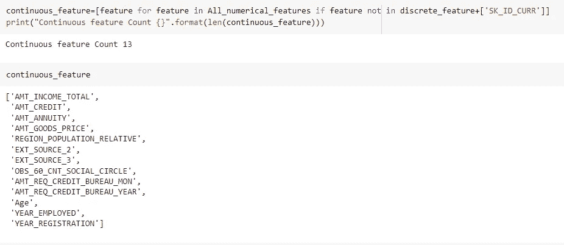

## **金额 _ 货物 _ 价格:**

现在我们将看到特性 AMT_GOODS_PRICE 数据的分布:

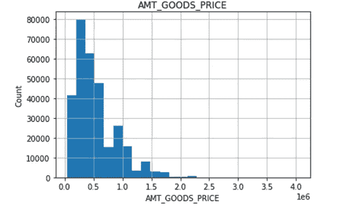

从图中我们知道数据是右偏的，不是正态分布的。

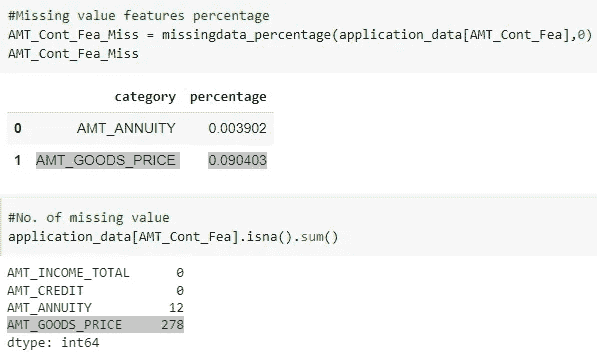

AMT_GOODS_PRICE 功能缺少 9%的值。AMT_GOODS_PRICE 中缺少 278 个值。

因此，现在我们将用中值替换缺失值，如下所示:

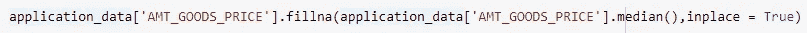

现在，我们将检查特征的箱线图

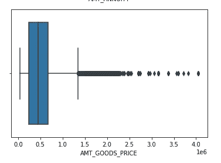

箱线图显示了异常值的特征，很少有条目的商品价格比其他条目的价格高。考虑到这个条目会误导整个人口的平均收入和进一步的分析。所以排除 99%以外的值。

现在，我们将绘制金额 _ 商品 _ 价格之间的 kdeplot

目标如下:

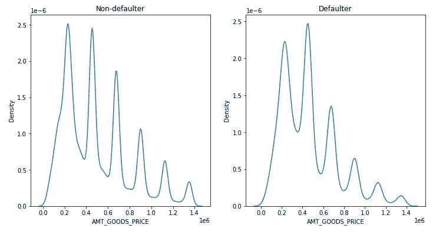

在“金额 _ 商品 _ 价格”中，为了避免离群值的影响，我们只考虑了最高 99%的值。

**‘金额 _ 商品 _ 价格’对于违约者和非违约者遵循相同的分布。**

**现在，我们将尝试绘制 AMT_CREDIT 和 AMT_GOODS_PRICE 功能之间的散点图。**

**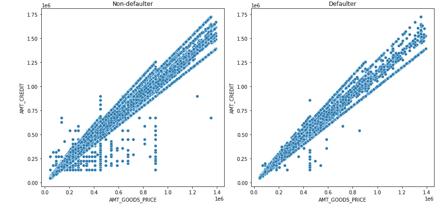**

**违约和非违约情况下，金额 _ 信用和金额 _ 货物 _ 价格均为线性关系。此外，曲线图显示，在较低的范围内，违约者的数量较少。**

****外部 _ 源 _2** 和**外部 _ 源 _3:****

**首先，我们将检查一些功能细节:**

**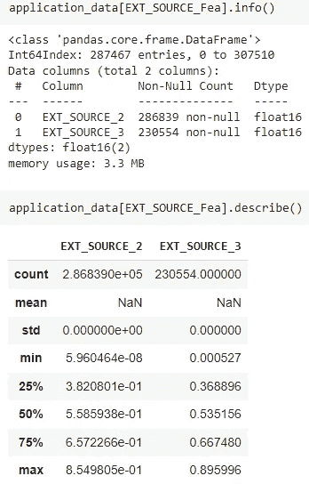**

**从上面的结果我们知道，两个特征的计数是不同的，并且两个特征都包含一些空值。因此，现在我们将检查空值的计数。**

**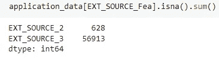**

**现在。我们将用中值()替换空值。**

**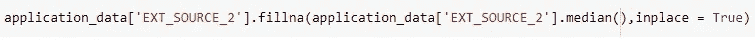**

**我们将尝试绘制给定数据的箱线图。**

**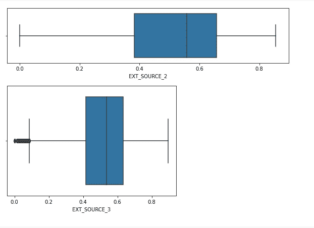**

**在特征 EXT_SOURCE_2 中没有太多异常值，但是我们可以在特征 EXT_SOURCE_3 的箱线图中观察到一些异常值，因此，我们将从特征中移除最后 1 个百分点值。**

**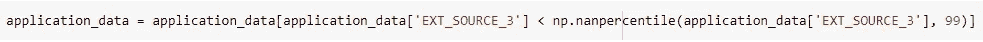**

**现在，我们将检查 PDF 中的两个功能和目标功能，如下所示:**

**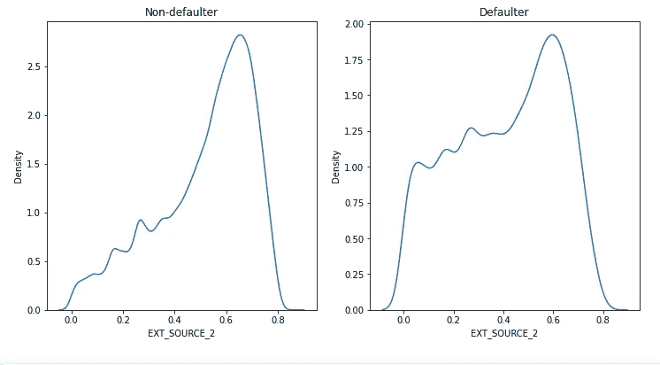****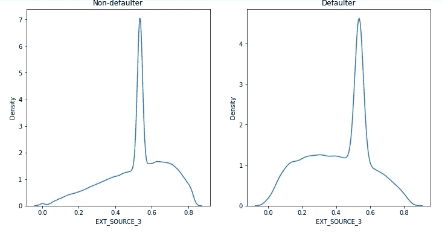**

**在 EXT_SOURCE_3 和 EXT_SOURCE_2 中，为了避免异常值的影响，我们只考虑了高达 99%的值。**

**外部 _ 源 _3 和外部 _ 源 _2 对于违约者和非违约者都遵循不同的分布。**

## **年龄、就业年份和注册年份:**

**现在，我们将分析如下特性:**

**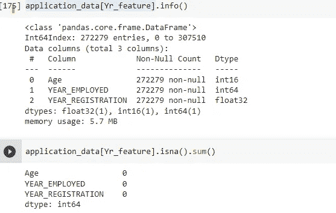**

**从上面的分析中，我们知道在所有的特性中没有观察到空值。**

**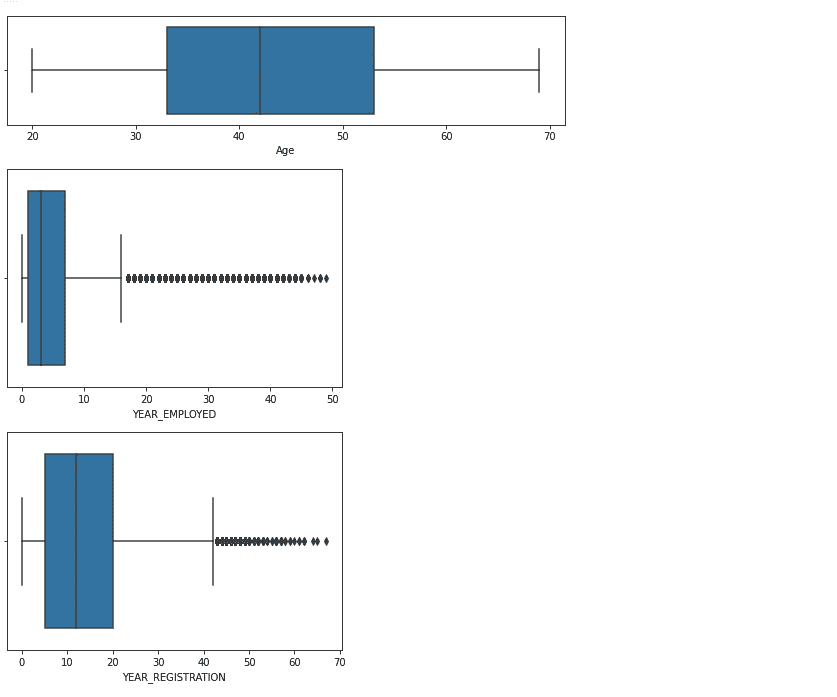**

**箱线图显示在 YEAR _ EMPLOYED 和 YEAR_REGISTRATION 特征中存在一些异常值。因此，我们将从特征中移除 1%的值。**

**现在，我们将绘制所有特性的 PDF:**

**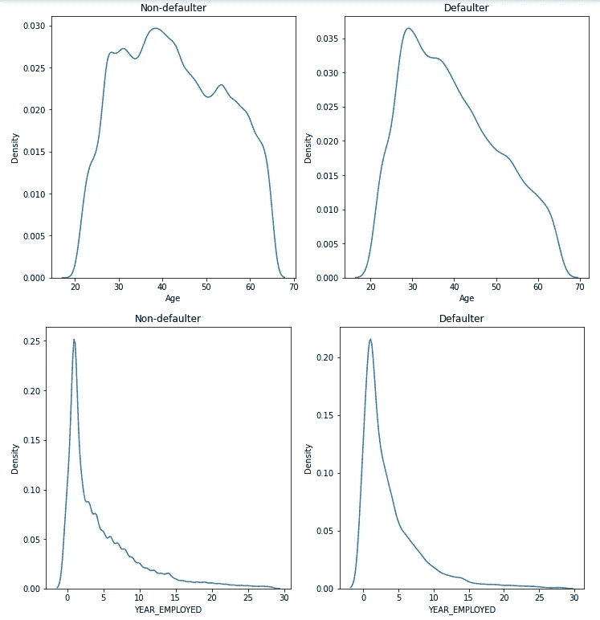****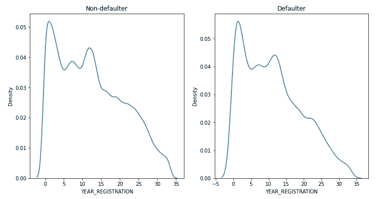**

**从上面的图中，我们知道除了年龄，其他特征对于违约者和非违约者都遵循相同的分布。**

****分类特征:****

**现在，我们来看看 all 的一些重要分类特征。**

**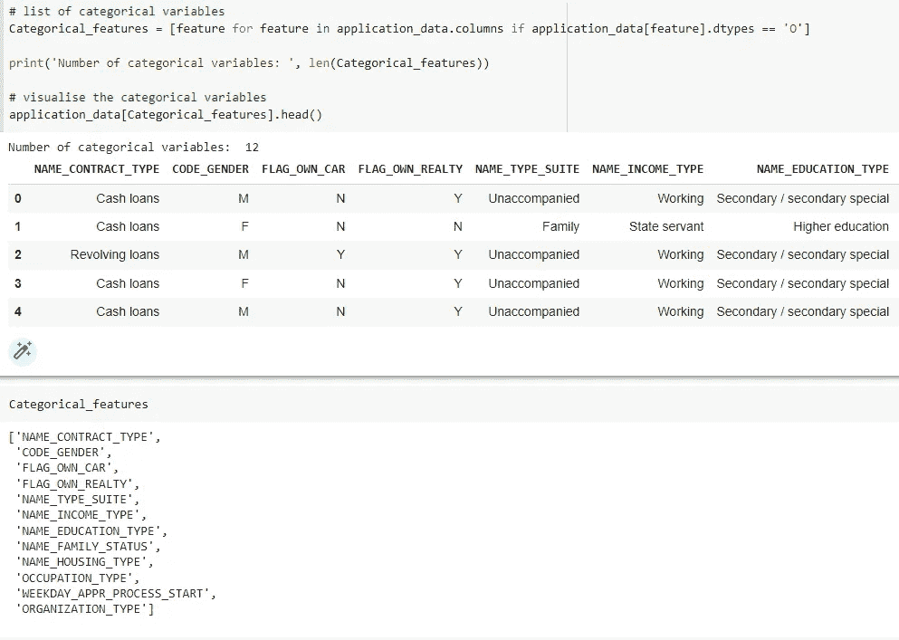**

**如上述结果所示，共有 12 个分类特征。所以现在我们就来分析其中的一些。**

**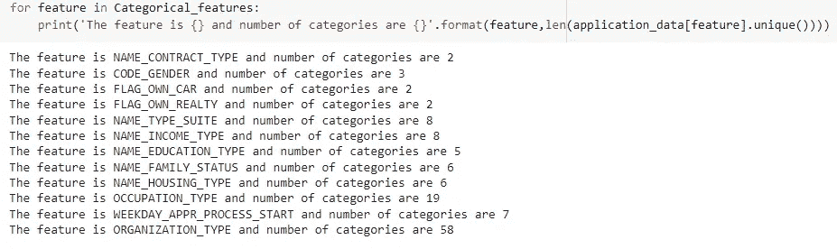**

**如果我们观察所有特征的不同类别，我们已经观察到 ORGANIZATION_TYPE 和 OCCUPATION_TYPE 具有最高的类别，并且可能一些类别出现的频率非常低。我们也会在某个时候处理那件事。**

**现在，我们将首先分析一些重要的分类特征。**

## **名称 _ 类型 _ 套件、名称 _ 合同 _ 类型和工作日 _ TYPE _ 流程 _ 开始:**

**首先，我们将检查每个功能的不同类别的计数，如下所示:**

**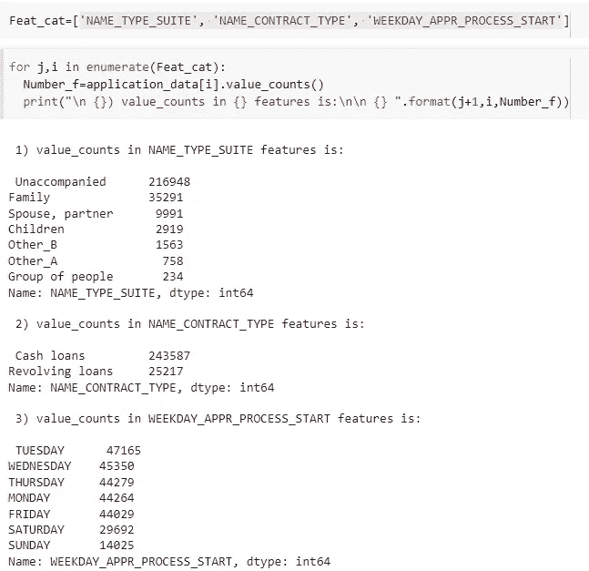**

**现在，我们将检查所有要素中缺失的值。**

**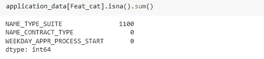**

**结果显示 NAME_TYPE_SUITE 显示其中存在 1100 个缺失值。**

**因此，现在我们将用最频繁出现的类别来填充缺失值，如下所示:**

**接下来，我们将检查特性中的类别默认百分比。**

**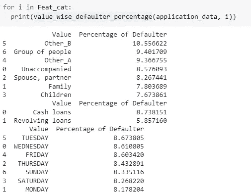**

**从上面结果中，我们知道了对于特征名称 _ 类型 _ 套件、名称 _ 合同 _ 类型和工作日 _ TYPE _ 过程 _ 开始具有高默认百分比的类别。**

**NAME_TYPE_SUITE → Other_B 具有最高的默认比率，但此类别中的计数数量较少。根据统计，无人陪伴申请人的违约率最高。**

**NAME_CONTRACT_TYPE →现金贷款类别的申请人违约百分比最高。**

**工作日 _ APPR _ 流程 _ 开始→所有的日子都有相同的默认百分比。**

**现在，我们还将绘制具有目标值的每个特性类别，如下所示:**

**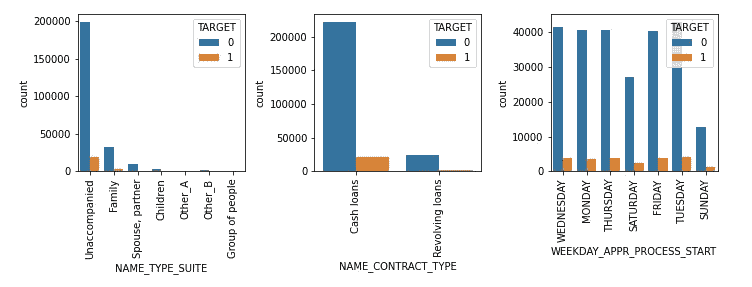**

**因此，从上述所有分析中得出的主要观察结果是:**

*   **大多数申请贷款的人都是孤身一人。但这一类别的违约者人数也很高。**
*   **与循环贷款相比，现金贷款的比例更高。但这一类别的违约者人数也很高。**
*   **与周末(周六和周日)相比，大多数申请人更喜欢在工作日申请。**

**这些是我在博客中解释的一些特征分析，如果你想详细分析申请数据和以前申请数据的所有特征，请查看 jupyter 笔记本。**

**张贴所有的分析，并在采取重要行动后，如空值分析，功能工程。等等。然后，我们将连接应用程序数据和以前的应用程序数据中的特征。**

# **连接应用程序数据和以前的应用程序数据:**

**我们将合并具有共同特征 SK_ID_CURR 的数据集，如下所示:**

**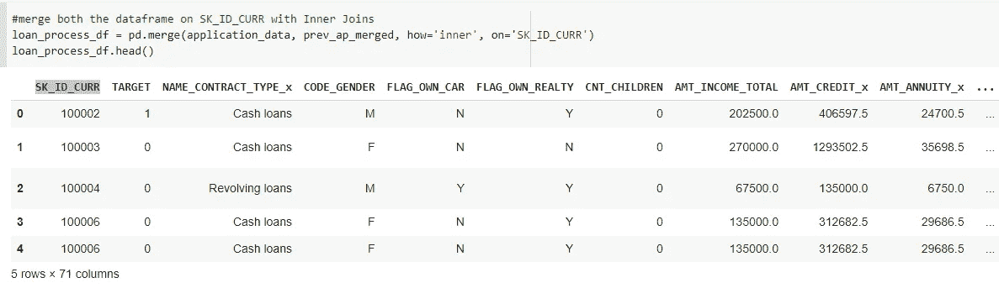**

**所以现在我们总共有 71 个特征。新数据集的形状如下:**

**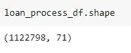**

# **处理罕见的分类特征:**

**现在，我们将处理类别特性中的稀有类别。下面提到的是串联后的分类特征。**

**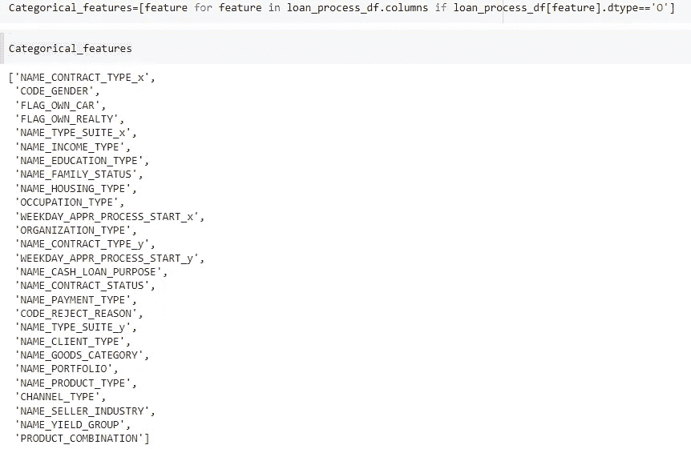**

**现在，我们将删除值小于 1%的类别。**

# **H.特征编码:**

**这里我们将使用下面提到的方法进行编码:**

*   **Onehot 编码**
*   **列标准化**

**首先，我们将对分类特征进行一次性编码，如下所示:**

**Post onehot 编码功能将反映如下:**

**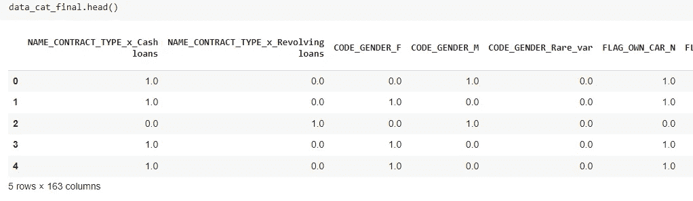**

**现在，我们将对以下数字特征进行标准化:**

**标准化后，我们将反映如下特性:**

**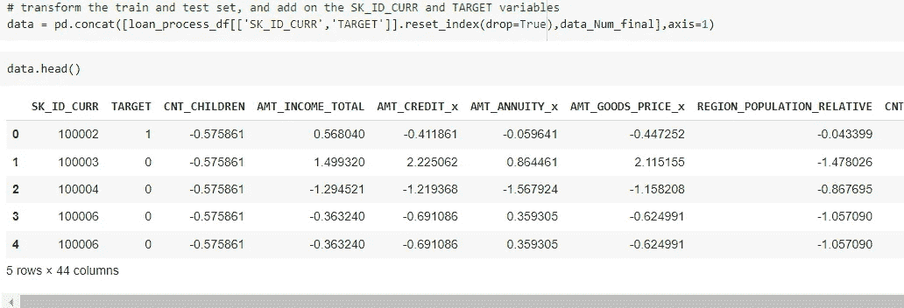**

**嵌入后，我们将结合分类和数字特征如下:**

**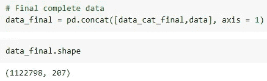**

# **一、建模:**

**在继续建模之前，我们将从数据集中删除 SK_ID_CURR，如下所示:**

**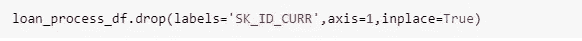**

**现在我们有了最终的数据集。因此，我们将根据它创建自变量和因变量，如下所示:**

**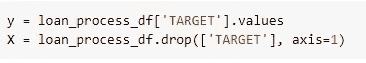**

**接下来，我们将从 X 和 y 变量执行训练和测试分割，如下所示:**

**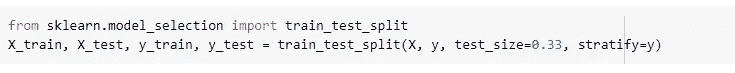**

**现在，我们将使用该数据集检查基线模型，以检查它的性能，我们得到了下面提到的结果。**

**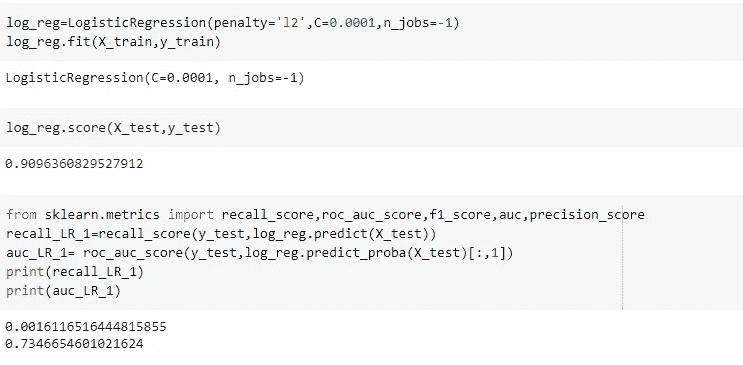**

**从上述结果可知，该模型具有较高的准确率和 AUC 值，但召回率极低。因此，现在我们将检查如何提高该模型的召回值。**

**首先，我们将检查降维是否对我们有帮助。因此，我们将使用主成分分析(PCA)进行如下特征选择:**

**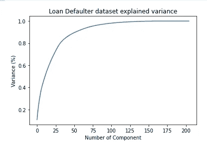**

**从图中我们知道，150 个特征将保持大约 95%的方差。因此，现在我们将使用新的 X_train post PCA 训练我们的模型，并检查该模型的召回值。**

**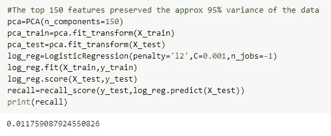**

**从以上结果可以看出，该模型的召回率仍然很低。可能是后 PCA 我们失去了一些重要的功能，这将影响模型的性能。**

**所以，我们必须采取另一种方法。有一点我们已经知道，我们的数据集是高度不平衡的。检查下面提到的结果:**

****

**因此，我们将尝试平衡数据集，然后使用平衡数据检查模型的性能。**

**这里，我们将执行欠采样，因为过采样会导致过拟合。**

**因此，现在我们将使用采样中的新数据来检查模型。**

**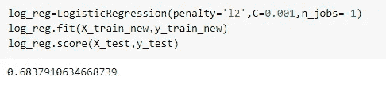**

**该模型给出了 68%的准确度，这与先前的模型相比是相当低的。**

**现在，我们将检查该模型的 AUC 分数和召回值。**

**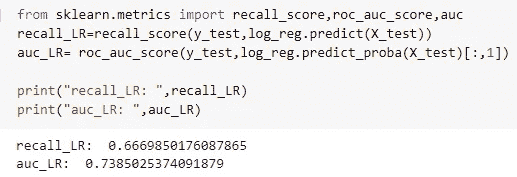**

**结果表明，召回率从 0.01%提高到 66%。因此，现在我们将使用相同的数据集检查另一个模型的性能，看它们是否有助于我们提高召回值。**

**下面提到的是所有型号的性能结果**

**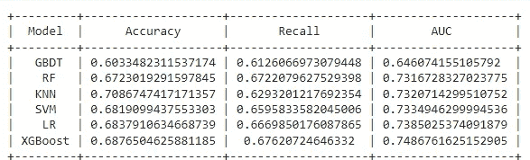**

# ****J .总结:****

**从结果中，我们得知**随机森林**和 **XGBoost** 的性能是所有模型中最好的。**

# **K.模型的生产:**

**模型的生产在下面提到的视频中进行了解释:**

**贷款违约模型产品化演示**

# **长度未来工作:**

*   **目前，我们已经尝试实现了重要的 NLP 算法，但我们也可以使用 DL 方法来检查模型的性能，如:
    1) MLP
    2) LSTM
    3) GRE**

# **米（meter 的缩写））个人资料:**

**感谢阅读！请鼓掌感谢我的辛勤工作。我总是乐于接受建设性的反馈——如果你对这个分析有后续想法，请在下面发表评论或通过 LinkedIn 联系[。](http://linkedin.com/in/shubham-d-3ba232b7)**

# **名词（noun 的缩写）参考资料:**

1.  **[https://www . ka ggle . com/competitions/home-credit-default-risk/discussion](https://www.kaggle.com/competitions/home-credit-default-risk/discussion)**
2.  **EDA 分析走查:【https://www.youtube.com/watch?v=AYalukmWroY **
3.  **[https://www . ka ggle . com/datasets/gauravduttakiit/loan-defaulter/code](https://www.kaggle.com/datasets/gauravduttakiit/loan-defaulter/code)**
4.  **[https://machine learning mastery . com/under sampling-algorithms-for-unbalanced-class ification/](https://machinelearningmastery.com/undersampling-algorithms-for-imbalanced-classification/)**

**由于 ipynb 文件巨大，我无法通过 Github 分享。
评论到这里，我可以直接分享给你。**