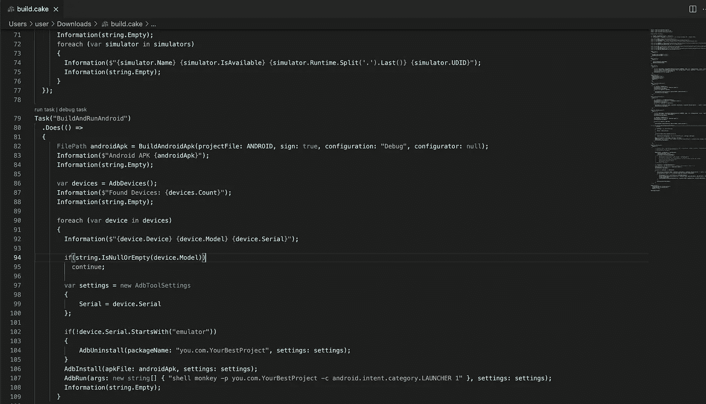
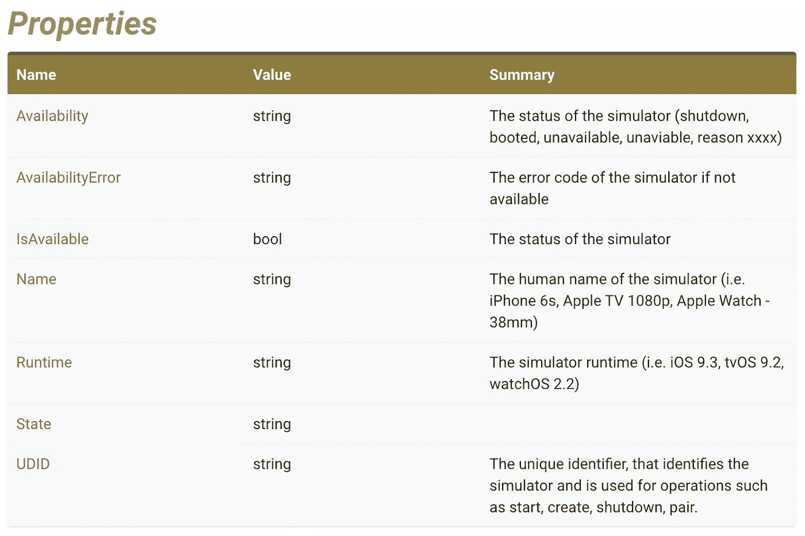

# 使用 Cake 本地部署到多个仿真器和模拟器

> 原文：<https://medium.com/nerd-for-tech/local-deploy-to-multiple-emulators-and-simulators-with-cake-5d3258e7a4c?source=collection_archive---------4----------------------->



## 如果您正在寻找一种简单的方法来测试 Xamarin。同时在几个 Android 模拟器和 iOS 模拟器中运行表单或 MAUI 应用程序——使用 Cake 脚本完成所有日常工作🙃 😉

嗨伙计们！！！🤪长话短说[这里是 GitHub Gist](https://gist.github.com/bbenetskyy/6fc8f9536bd39ad0faec5030748b53c0) 的完整脚本链接。

我的故事开始了——一年前，我看到了来自[达米安](https://twitter.com/D_Antonowicz)的一个可爱的演讲，我只是觉得不用 Bash 和 PowerShell 来制作脚本非常有趣。之后我什么也没做😱。

10 月，我再次读到了一篇关于这一切的博文:

[](https://damianantonowicz.pl/2021/10/02/creating-cake-script-for-building-and-deploying-xamarin-app-part-3-deployment/) [## 为构建和部署 Xamarin 应用程序创建蛋糕脚本:第 3 部分部署| Damian Antonowicz

### 在这篇文章中，你将学习如何使用 Cake 脚本将 Xamarin 应用程序部署到应用程序中心、Google Play 内部和测试…

damianantonowicz.pl](https://damianantonowicz.pl/2021/10/02/creating-cake-script-for-building-and-deploying-xamarin-app-part-3-deployment/) 

我认为我们可以用 Cake for Xamarin 进行一些 UI 测试或部署。表单应用程序。11 月底，我意识到我需要在两个 Android 模拟器(一个 RTL)和两个 iOS 模拟器(一个 RTL)上部署测试我开发的应用程序。别这样，骑马要花很多时间。我不需要调试它。我已经在我的主要 iOS 模拟器上测试过了。我只需要确保它在每个平台和设备上都好看。

是的，是的，我们可以为此进行 UI 测试，但事实是——不是每个项目都有这些测试，也不是每个项目都需要。

因此，我看看是否有可能建立，得到所有的仿真器和模拟器，部署和运行我的应用程序。该死的是啊🤩 🥳.

# 在开始之前

请你阅读[达米安](https://twitter.com/D_Antonowicz)博客，并在你的机器上安装[蛋糕](https://cakebuild.net/docs/running-builds/runners/dotnet-tool)好吗？我不会在这个博客里关注这个问题。我打算继续努力，展示我发现的对我自己有用的东西，希望对你也有用😇

# 脚本所需的设置

我现在只在一个项目中使用了它，而且我并没有把它作为一个完全模块化的脚本来完成，但是我会尽可能地让它变得灵活和易于修改。

只需用你的完整路径替换所有常量字符串，这就是你所需要的。我认为提供的评论解释了所有的深度😛。

# 清理并重新构建项目

同样，构建和清理`.Net`项目的代码非常简单，并且具有良好的代码可读性。

# 获取所有可用的 Android 设备

脚本的这一部分可以获得所有附加的调试 Android 设备(通过 USB 或 WiFi)和所有启动的仿真器，并打印到输出(终端)

# 获取所有 iOS 模拟器

这里有点棘手，因为脚本的这一部分显示了所有模拟器。不管它们是否启动！根据官方文档，我们可以用返回对象中的`Availability`和`IsAvailable`属性来标识模拟器状态。但是终端的输出告诉我`Availability`已经过时了，而`IsAvailable`一直是`True`(即使它没有启动)。但是这个脚本任务的输出仍然是有用的，因为它可以显示模拟器的正确名称，我们可以将这些名称放入`iosSimulators`参数中(在我们脚本的顶部)。



# 构建和运行 Android 应用程序

脚本的这一部分稍微复杂一些，但是，我想你可以理解那里发生了什么。这里有几个有趣的时刻我想提一下。

默认情况下，脚本与`BuildAndRunAndroid`和`BuildAndRuniOS` 一起工作，这就是为什么我们也在其中构建。是的，我们可以用`IsDependentOn`提前完成，但我不想那样做(我很懒，想在单独的任务中完成)

```
if(!device.Serial.StartsWith("emulator")){AdbUninstall(packageName: "you.com.YourBestProject", settings: settings);}
```

我发现只有在真正的 Android 设备上才需要在安装前卸载。

# 构建和运行 iOS

在我的脚本中，我只想构建 Xamarin。表单 app 在`Debug|iPhoneSimulators`模式下，这种情况并不常见🤨。经过不长时间的研究，我发现我们可以用`XBuildSettings`做到这一点:

但这并不适合我，因为我找不到输出 iOS 应用程序来部署到模拟器中😥。经过一些实验，我意识到我们可以使用标准的`MSBuild`来构建并输出 iOS 应用程序🤗

脚本中关于此任务的几句话:

*   我无法识别模拟器是否启动。
*   当我试图从脚本中启动模拟器时，它没有反应，无法启动。在开始一个脚本之前，我们需要开始所有自己需要的。
*   脚本会等到 Android 应用程序安装完毕，但不会等到 iOS 应用程序安装完毕。这就是我们在发射前等待 3s 的原因。

# 脚本结束

在脚本的最后，我们添加了一个`Default`任务，并运行请求的`Target`，其中 out target 是脚本顶部的一个参数，并预定义给`Default`任务。

感谢你阅读这篇文章。[GitHub Gist 上又出现了一个完整的脚本](https://gist.github.com/bbenetskyy/6fc8f9536bd39ad0faec5030748b53c0)