# Python 中基于虚拟势场的局部路径规划

> 原文：<https://medium.com/nerd-for-tech/local-path-planning-using-virtual-potential-field-in-python-ec0998f490af?source=collection_archive---------1----------------------->

在本文中，我将向您展示如何使用障碍和目标的势场来编写规划机器人路径的 python 代码。

 [## AslanDevbrat/机器人

### 本文的完整代码。通过创建一个……

github.com](https://github.com/AslanDevbrat/Robotics/blob/master/Assignment1/Robo_assign1.ipynb) 

# 介绍

机器人的自主导航依赖于机器人实现其目标、避开环境中的障碍物的能力。在某些情况下，机器人完全了解其环境，并基于此规划其运动。一般来说，机器人只有一个关于目标的想法，应该使用它的传感器收集关于环境的信息来达到目标。

本地路径规划应该实时执行，并且优先于高级规划。因此，有时也称为实时避障。

局部路径规划方法之一是势场法。这是一个有吸引力的方法，因为它的优雅和简单[1]。然而，使用这种方法，机器人很容易陷入局部最小值。因此，需要额外的努力来避免这种情况。

# **势场法**

势场的概念取自自然界。例如，一个带电粒子在磁场中穿行，或者一个小球在山上滚动。这个想法是，根据场的强度或山的坡度，粒子或球可以到达场的源，在这个例子中是磁体或山谷。

在机器人学中，我们可以通过创建一个人工势场来吸引机器人到达目标，从而模拟相同的效果。

通过设计一个适当的势场，我们可以使机器人表现出简单的行为。

例如，让我们假设环境中没有障碍，机器人应该寻找这个目标。在传统的规划中，应该计算机器人与目标的相对位置，然后施加合适的力将机器人驱动到目标。

在势场法中，我们在球门内创建一个吸引人的场。势场定义在整个自由空间，在每一个时间步中，我们计算机器人位置的势场，然后计算这个场产生的诱导力。然后机器人应该根据这个力移动。

下图说明了这一概念:

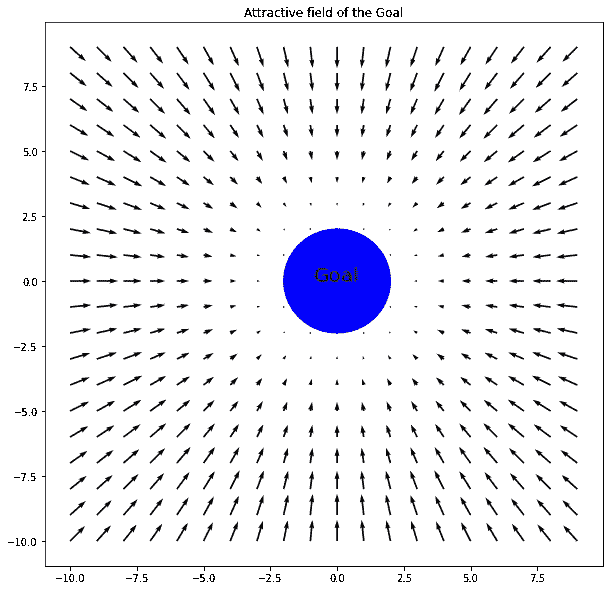

图 1:球门的势场

我们还可以定义另一种让机器人避开障碍物的行为。我们让每个障碍物在其周围产生一个排斥场。如果机器人接近障碍物，一个排斥力会作用在它身上，把它推离障碍物。

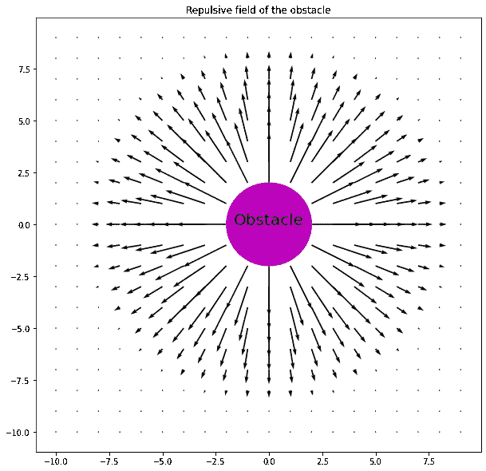

障碍物的势场

两种行为，寻求和回避，可以通过结合两个势场来结合；然后，机器人可以跟随由新的场引起的力到达目标，同时避开障碍物:

# 使用的公式:

对于目标的势场

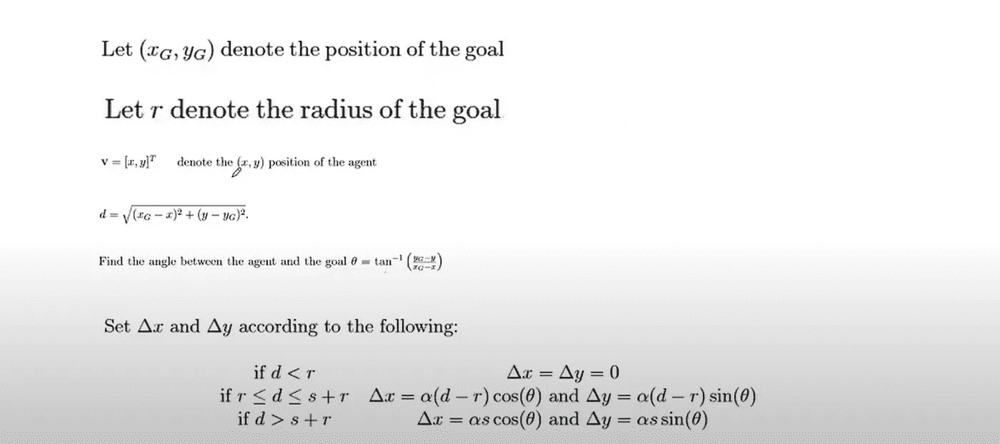

障碍物的势场

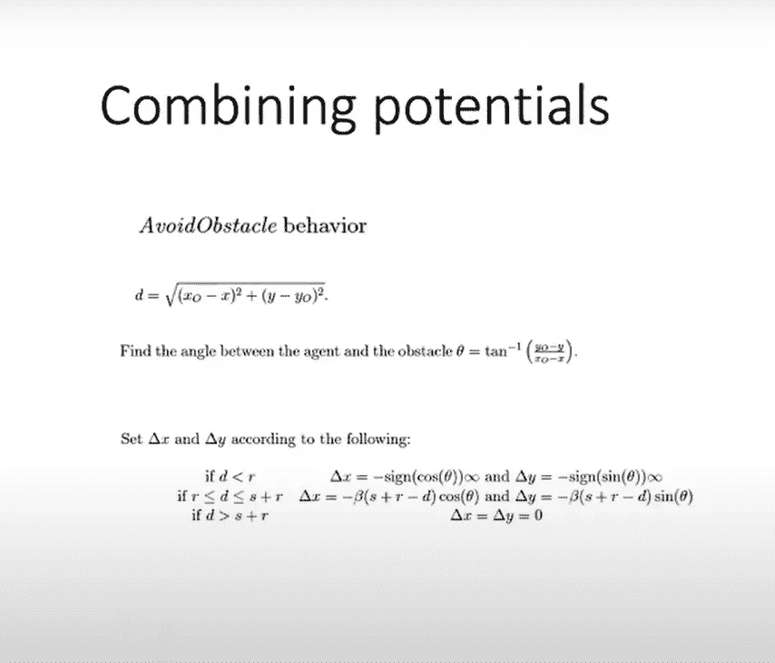

# 我们来编码吧。

绘制目标的潜在吸引力。

结果:

现在让我们画出障碍物的排斥势。

结果:

现在让我们结合目标和障碍的势场。首先，我将假设障碍和目标都在原点，以及它的场看起来如何。

结果是:

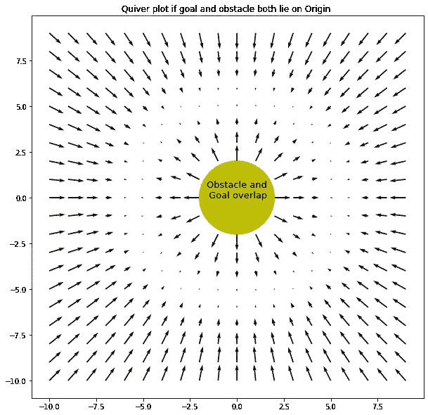

目标和障碍都是重叠的。

如果目标和障碍物在不同的位置，下面的代码将绘制势场:

结果:

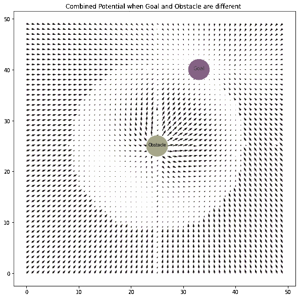

现在我们必须找到一条从起点到目标的路径，避开障碍物；为此，我使用了一个*流图*,并将起点设为(0，0)

结果:

现在让我们把极限推得更远；我现在要做的是将障碍的数量从 1 增加到 10。障碍物的大小和位置随机变化。

现在让我们看看情节。

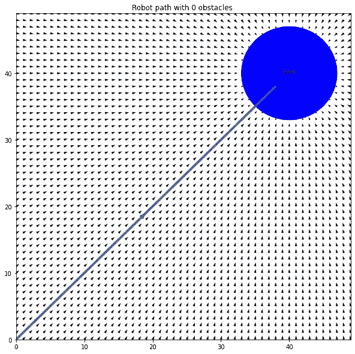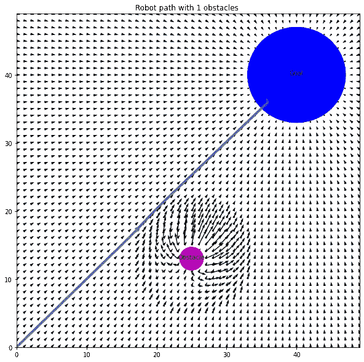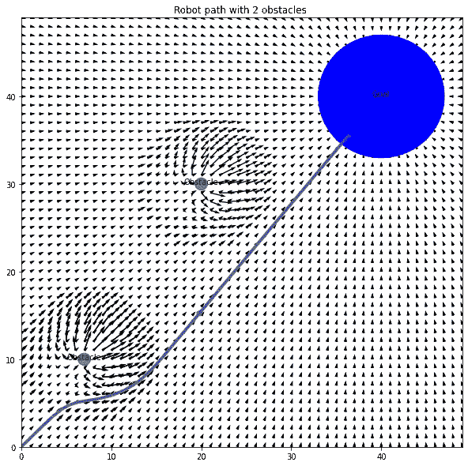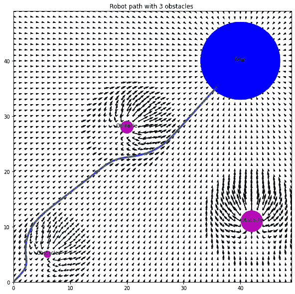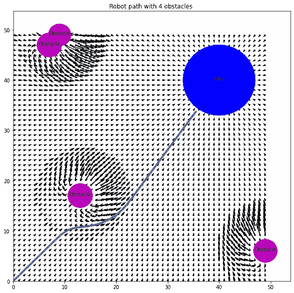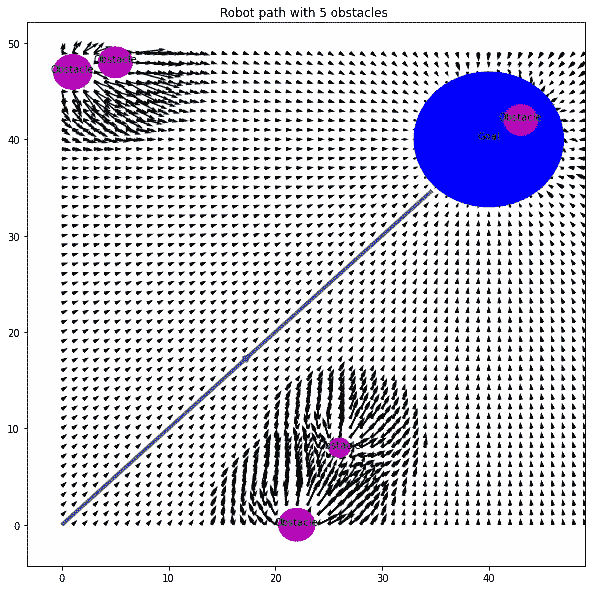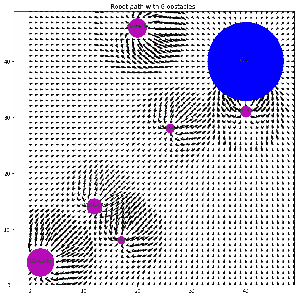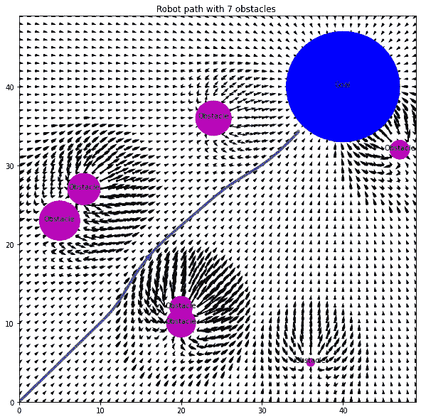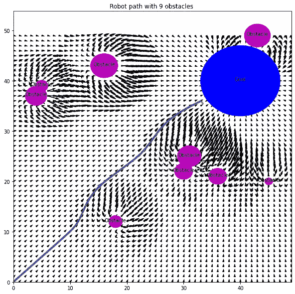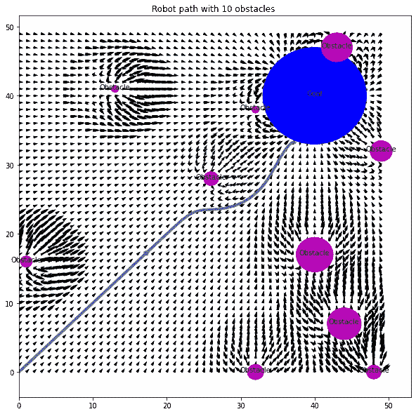

结果非常恰当；除了 *6 障碍情况外，我们的机器人非常高效地达到了避障的目的；*原因是，如果你仔细观察图形，你会发现在离原点很近的地方有一个障碍物，因为这个目标的引力场不足以抵消障碍物的排斥势，所以它被卡在原点。用数学术语来说，你可以说机器人陷入了局部极小值。

在这里找到完整的代码:

 [## AslanDevbrat/机器人

### 路径规划的完整代码。通过创建一个……

github.com](https://github.com/AslanDevbrat/Robotics/blob/master/Assignment1/Robo_assign1.ipynb)