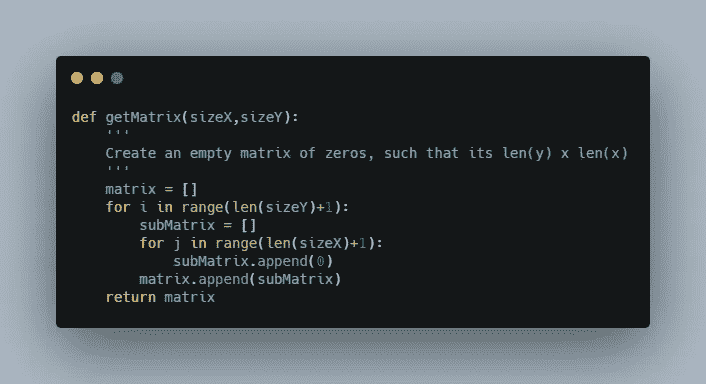
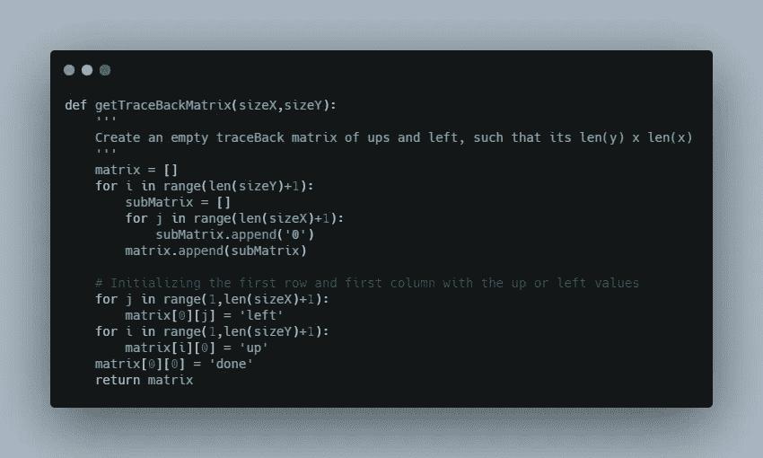
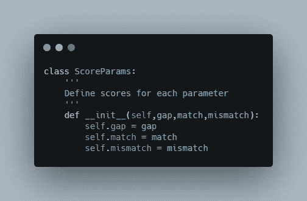
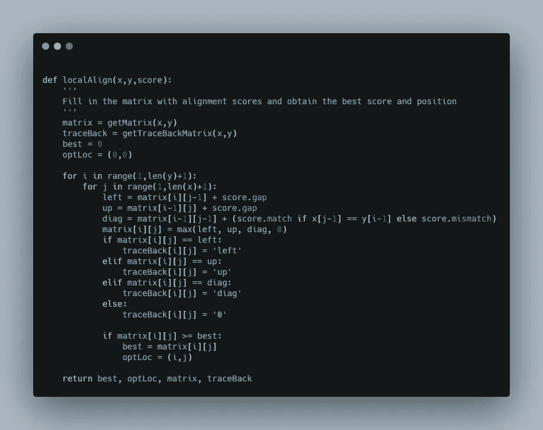
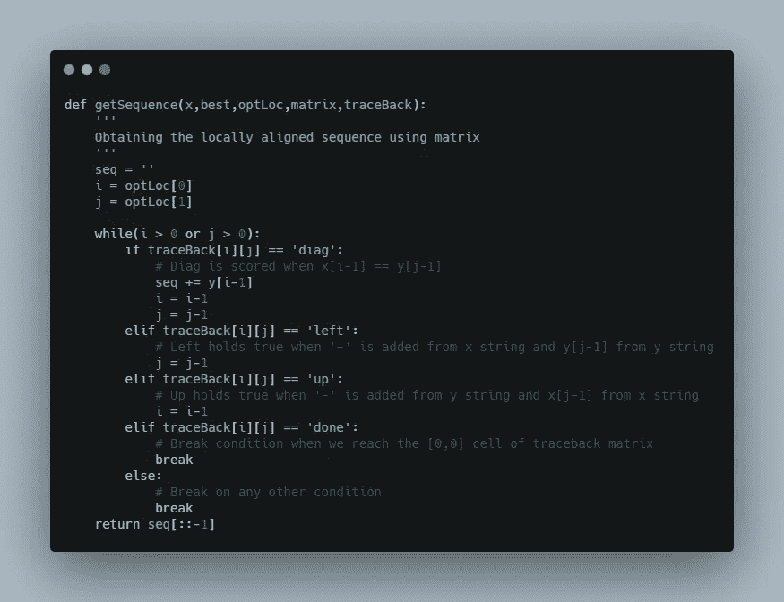

# 局部序列比对:从零开始用 Python 实现

> 原文：<https://medium.com/nerd-for-tech/local-sequence-alignment-implementation-in-python-from-scratch-bbcf0dd4cd11?source=collection_archive---------1----------------------->

在[之前的一篇文章](https://rishikagupta1999.medium.com/sequence-alignment-of-dna-4224e9d61cfa)中，我介绍了 DNA、RNA 或蛋白质序列比对的概念。在本文中，我们将从头开始用 python 实现局部序列比对。所以让我们开始吧！！！

局部序列比对旨在获得已知序列的子序列和未知(查询)序列的子序列之间的最佳比对。

为了实现，让我们考虑第一个序列为 x，第二个序列为 y，其中:

> x = '猫狗鱼'
> y = '狗'

首先也是最重要的，让我们获得一个初始矩阵，在零中填充 z。序列应该这样放置，x 矩阵的字符占据列，y 矩阵的字符占据行。

你可以在这里参考我关于全球序列比对[的文章，了解缺口、匹配和错配的概念。](https://python.plainenglish.io/global-sequence-alignment-implementation-in-python-from-scratch-5a8a611dbb1e)

为了适应序列中的差异，我们遵循评分模式，其中我们为特定的一组代码选择缺口分数、匹配分数以及错配分数。这里，在这种情况下:

> *差距得分= -7
> 匹配= 10
> 不匹配= -5*



getMatrix:获取一个用零填充的初始矩阵

在用这个函数初始化一个矩阵时，我们得到的输出是:

```
Printing the initial score matrix:
[0, 0, 0, 0, 0, 0, 0, 0, 0, 0, 0]
[0, 0, 0, 0, 0, 0, 0, 0, 0, 0, 0]
[0, 0, 0, 0, 0, 0, 0, 0, 0, 0, 0]
[0, 0, 0, 0, 0, 0, 0, 0, 0, 0, 0]
```

就像我们初始化空的分数矩阵一样，我们还初始化了一个回溯矩阵，它记录了每个细胞中哪个分数占主导地位，从而引导我们在比对后得到最终的序列集。这里，我们指定:

> *第一个单元格= 'done'
> 第一行除第一个以外的所有单元格= 'left'
> 第一列除第一个以外的所有单元格= 'up'
> 其他地方= '0'*



traceBackMatrix:获取一个初始回溯矩阵，在第一列和第一行中分别填充 up 和 down 值，在其他位置填充 string(“0”)

在初始化追溯矩阵时，我们获得以下输出:

```
Printing the trace back matrix:
['done', 'left', 'left', 'left', 'left', 'left', 'left', 'left', 'left', 'left', 'left']
['up', '0', '0', '0', '0', '0', '0', '0', '0', '0', '0']
['up', '0', '0', '0', '0', '0', '0', '0', '0', '0', '0']
['up', '0', '0', '0', '0', '0', '0', '0', '0', '0', '0']
```

现在，让我们定义一个 score 类，它将在调用一个对象时分配差距、匹配和不匹配的分数。



ScoreParams 类:将 gap、match 和 mismatch 分值初始化为其对象，并在匹配字符时返回匹配或不匹配分值

继续吧，人们，我们的框架代码就要完成了，我们准备好填充我们的矩阵，然后获得最终的答案。

接下来，我们将填写分数和追溯矩阵。

```
matrix[i][j] = max (          
        matrix[i][j-1] + gap,
        matrix[i-1][j] + gap,
        matrix[i-1][j-1] + match(i,j)
        0
)
```

上面提到的片段是帮助我们填充所有矩阵单元格的指导规则。

因为，

```
left = matrix[i][j-1] + gap
up = matrix[i-1][j] + gap
diag = matrix[i-1][j-1] + match(i,j)
```

上面的最大值也有助于我们填充追溯矩阵。



localAlign:用分数填充全局比对矩阵，用方向填充回溯矩阵

在填写分数矩阵并将其打印出来后，我们获得的输出如下:

```
Printing the Score Matrix:
[0, 0, 0, 0, 0, 0, 0, 0, 0, 0, 0]
[0, 0, 0, 0, 10, 3, 0, 0, 0, 0, 0]
[0, 0, 0, 0, 3, 20, 13, 6, 0, 0, 0]
[0, 0, 0, 0, 0, 13, 30, 23, 16, 9, 2]Printing the TraceBack Matrix:
['done', 'left', 'left', 'left', 'left', 'left', 'left', 'left', 'left', 'left', 'left']
['up', '0', '0', '0', 'diag', 'left', '0', '0', '0', '0', '0']
['up', '0', '0', '0', 'up', 'diag', 'left', 'left', '0', '0', '0']
['up', '0', '0', '0', '0', 'up', 'diag', 'left', 'left', 'left', 'left']
```

现在，我们到了获得比对序列的最后一步。对于对角线为' **diagonal** '的 traceBackMatrix 单元格，两个序列都有匹配的字符，因此 y 序列中的字符被附加到结果序列中。

当 traceBackMatrix 单元格表示“**左**”时，这意味着我们停留在同一行，并向后移动一列。类似地，当 traceBackMatrix 单元格表示“**向上**”时，这意味着我们停留在同一列并向上移动一行。在这两种情况下，字符都不会添加到结果序列中。

当我们到达' **done** '单元格时，或者当我们的矩阵迭代器耗尽(负移入)时，或者当回溯循环值为' 0 '时，这个回溯循环中断。

遵循这些规则，我们编写了下面的函数，



getSequence:在局部对齐后获得最终序列

在打印输出时，我们看到:

```
The best score obtained is: 30
The best locally aligned sequence is from index 3 to index 6 of the string: catdogfish
The sequence thus obtained: dog
The sequence obtained via traceback is: dog
```

恭喜读者！我们已经成功地从零开始在 Python 中本地比对了我们的序列。

您可以在以下网址查看完整代码:

[](https://github.com/risg99/Local-And-Global-Sequence-Alignment-Python-Scratch/blob/main/LocalAlignment.py) [## risg 99/局部和全局序列比对-Python-Scratch

### 该库包含 Python 中局部序列比对和全局序列比对的实现，来自…

github.com](https://github.com/risg99/Local-And-Global-Sequence-Alignment-Python-Scratch/blob/main/LocalAlignment.py) 

*感谢阅读！*