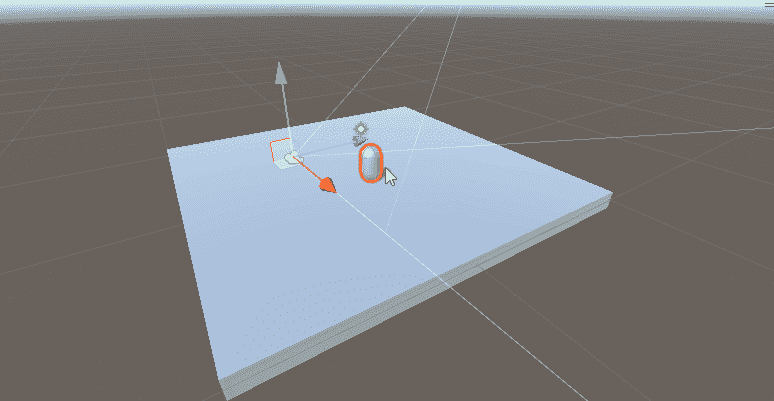
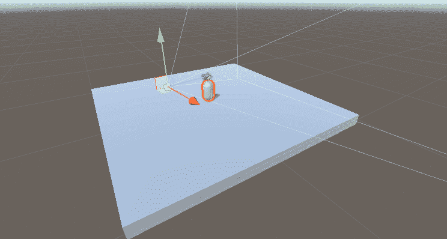

# 统一中的局部空间与世界空间

> 原文：<https://medium.com/nerd-for-tech/local-space-vs-world-space-in-unity-56ccc27dd73e?source=collection_archive---------7----------------------->

## Unity 游戏开发

## //确定要继续前进的平面。

左边的图像在局部空间移动，而右边的图像在世界空间移动

在 3D 游戏开发中，你必须考虑世界的背景和本地物体的背景。这就是局部空间 vs 世界空间的思想来源。在上面的图像中，我们看到胶囊在左边的局部空间和右边的世界空间中移动。