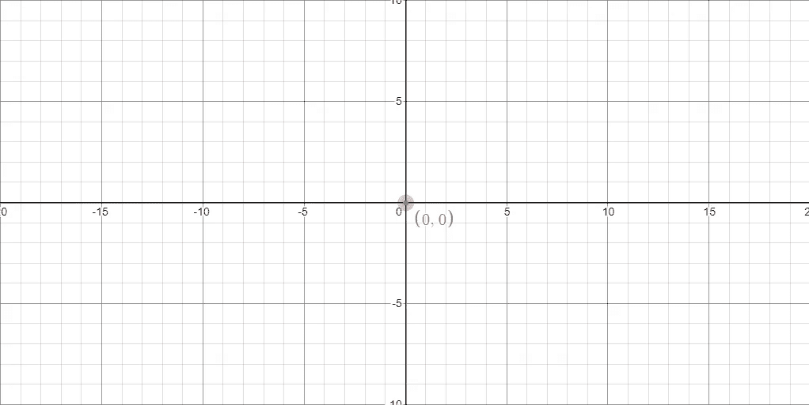
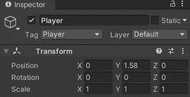
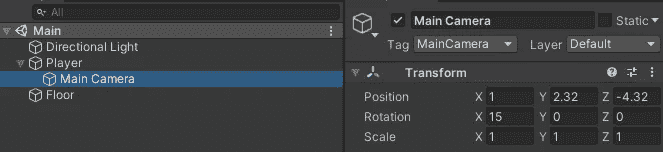
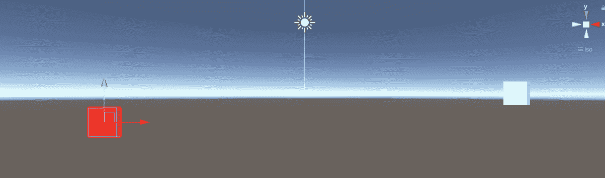

# 统一中的局部空间与世界空间

> 原文：<https://medium.com/nerd-for-tech/local-space-vs-world-space-in-unity-6a9944470478?source=collection_archive---------0----------------------->

在 unity 中，你会发现你将与本地空间或世界空间一起工作。

世界空间是一个物体在整体统一空间中的位置。想想当你在 unity 中添加一个游戏对象到你的场景中。该游戏对象将使用世界空间。如果你把它的位置归零，它将会在场景的中心。

局部空间是一个物体相对于另一个物体的位置。想想当你把一个游戏对象作为另一个的父对象时。您将为该对象使用本地空间。如果您将子对象的位置归零，它将转到父对象的位置，而不是场景的中心。

示例:

世界空间运动

局部空间运动