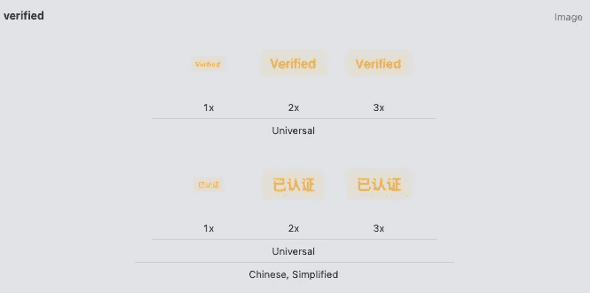
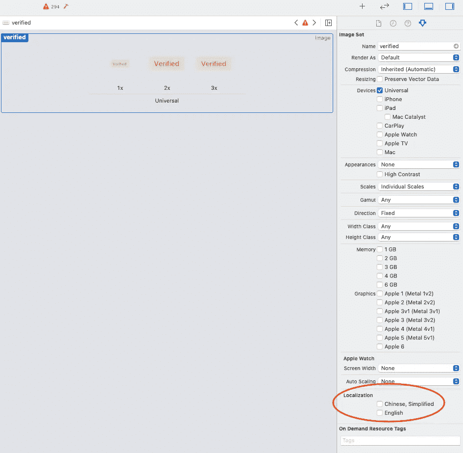
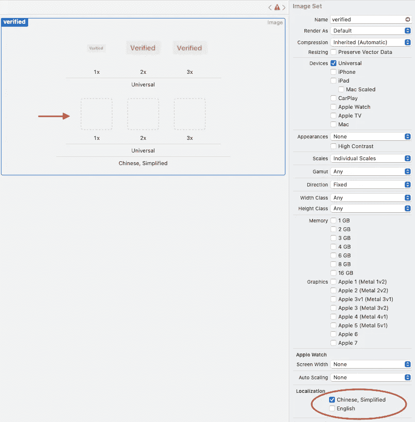
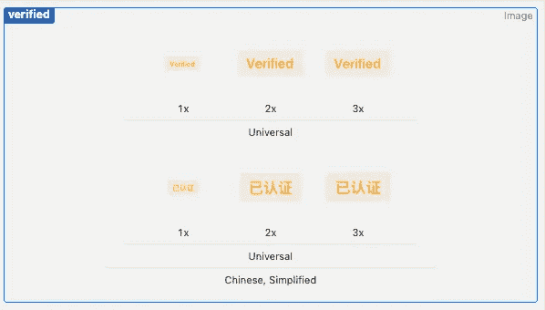

# 在 Xcode 中本地化图像资源

> 原文：<https://medium.com/nerd-for-tech/localize-image-assets-in-xcode-c8d63bf43087?source=collection_archive---------14----------------------->

## 了解如何使用 Xcode 的图形界面来管理本地化的图像资源

本地化图像资产界面

Xcode 的图形界面提供了一种方便而强大的方式来管理图像资源，如果您曾经在应用程序中包含图像，您应该已经熟悉它的使用方式。

事实证明，它不仅允许您管理图像资产，还允许您通过为不同的地区提供不同的图像来本地化图像资产。您所需要做的就是定义资产应该用于哪些地区，并为每个地区提供正确的本地化图像。

这是针对每个图像资产进行的，以便您可以选择仅本地化那些值得本地化的图像资产。

通过将本地化图像添加为完全独立的图像集，可以以编程方式实现相同的本地化效果。例如，命名以地区名称`image_en`和`image_zh_CN`结尾的图像，然后在代码中用`Locale.current`显式检查当前地区，提取地区标识符，并相应地返回图像。

这种方法需要大量的设置，并且您必须遵循一个非常特定的模式来命名您的图像。不仅如此，你最终会得到一个很长的图像资产列表，并且很难维护。如果您不再需要某个图像，您必须记住删除它的本地化副本。

## 正确的方法

现在我将带你通过 Xcode 的图形界面来实现这个目标。让我们从一个典型的图像资产开始。

1.  **开始添加图像集**

支持一种语言环境的资产

目前只有一组资产。无论语言环境如何，都将使用相同的图像。

**2。将焦点放在图像资源上，并在右侧检查器面板中找到向下的本地化选项。**您可以在这里指定要支持的语言环境。

在检查器面板中找到本地化选项

单击您想要支持的区域设置。当您进行选择时，图像资源的用户界面会相应地改变。

选择要本地化的语言环境

红色箭头所指的空资源是 Xcode 创建的。

**3。用适当的本地化版本填充图像**

选择要本地化的语言环境