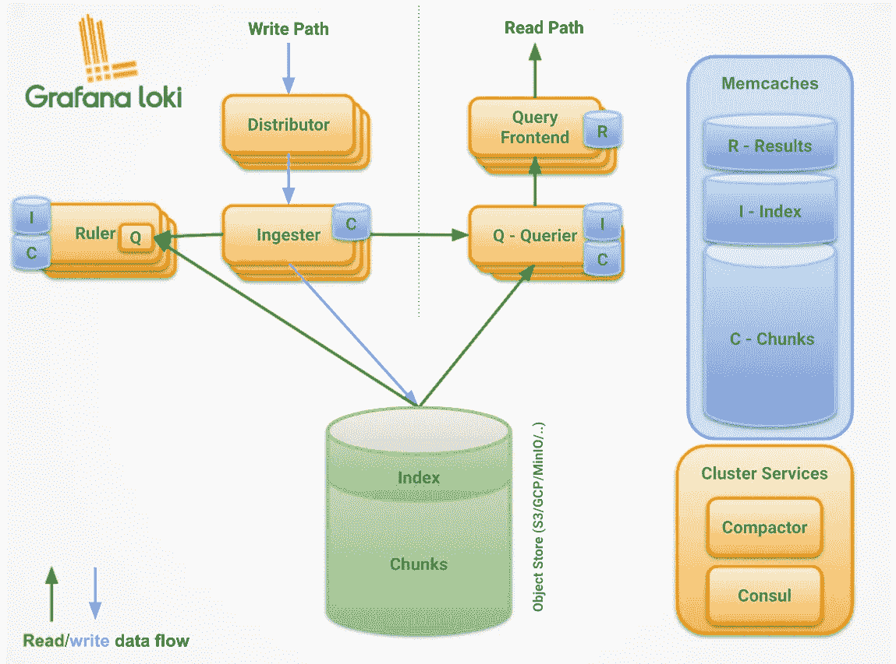
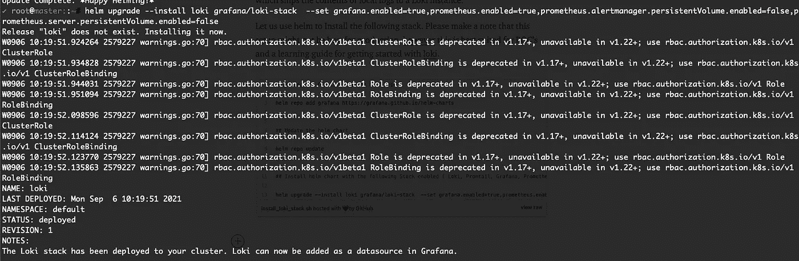
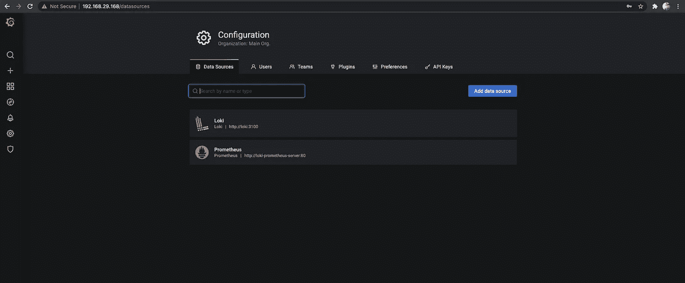
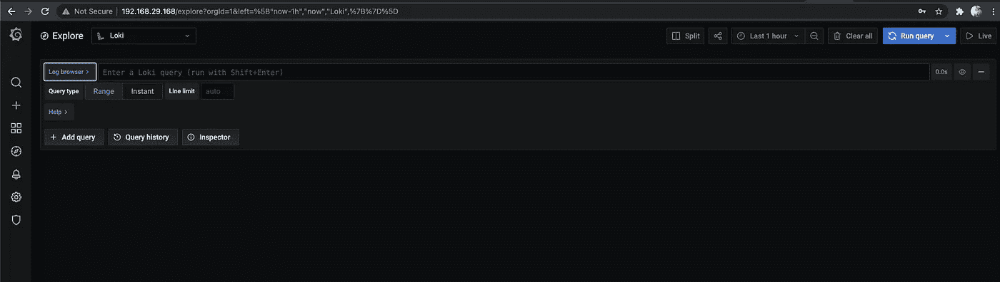
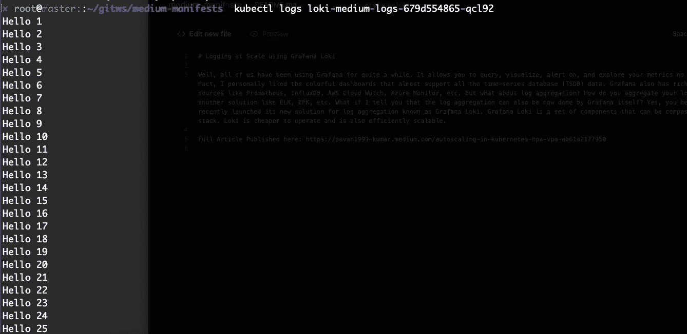
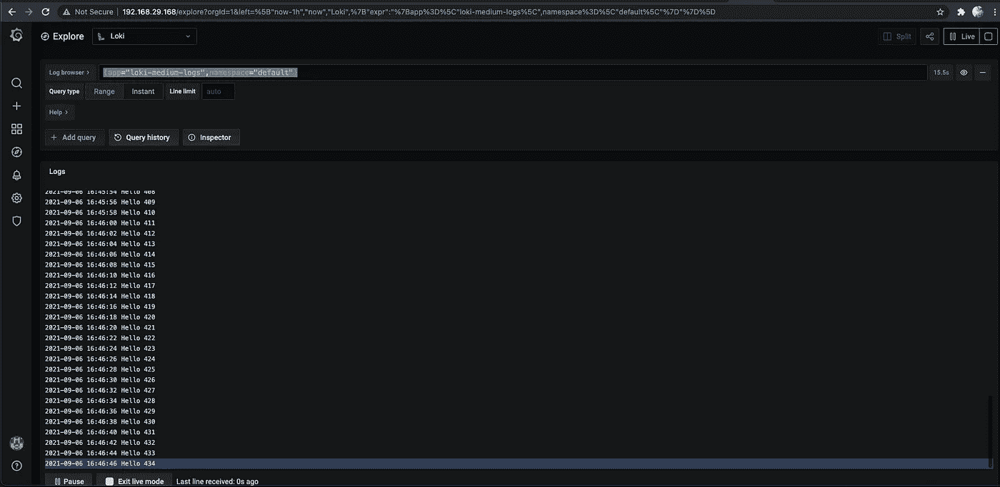
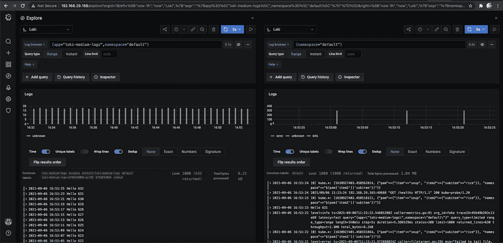

# 使用 Grafana Loki 在 Kubernetes 进行大规模伐木

> 原文：<https://medium.com/nerd-for-tech/logging-at-scale-in-kubernetes-using-grafana-loki-3bb2eb0c0872?source=collection_archive---------0----------------------->

使用 Grafana Loki 在 Kubernetes 中进行日志聚合

嗯，我们所有人使用 Grafana 已经有一段时间了。它允许您查询、可视化、提醒和探索您的指标，无论它们存储在哪里。事实上，我个人喜欢彩色的仪表板，它几乎支持所有的时间序列数据库(TSDB)数据。Grafana 还对各种输入源提供了丰富的支持，如 Prometheus、InfluxDB、AWS Cloud Watch、Azure Monitor 等。但是日志聚合呢？如何从应用程序中聚合日志？使用另一种解决方案，如埃尔克、EFK 等。如果我告诉你，日志聚合现在也可以由 Grafana 自己完成，会怎么样？是的，你没听错。Grafana Labs 最近推出了新的日志聚合解决方案 Grafana Loki。Grafana Loki 是一组组件，可以组成一个功能齐全的日志堆栈。Loki 的运营成本更低，并且可高效扩展。


图片来源:[格拉夫纳实验室](https://grafana.com/docs/loki/latest/)

# 整个故事是关于什么的？(TLDR)

1.  了解 Grafana Loki 的架构和概念。
2.  使用官方舵图在 Kubernetes 集群上设置 Loki。

# 先决条件

1.  Kubernetes 集群(可以是本地、AKS、EKS、GKE、Kind)。
2.  头盔，已安装 kubectl。

# 这篇文章没有涉及到什么

1.  如何设置基于生产的 Loki 集群？
2.  如何用 Loki 设置 HA 日志架构？
3.  如何编写 LogQL 查询？

# 故事资源

1.  GitHub 链接:【https://github.com/pavan-kumar-99/medium-manifests 
2.  GitHub 分支:[格拉夫纳-洛基](https://github.com/pavan-kumar-99/medium-manifests/tree/grafana-loki)

## Grafana Loki 的架构和组件



格拉法纳氏洛基弓和组件

让我们先了解一下 Grafana Loki 的各个组成部分

**分发器:**分发器处理日志处理器和转发客户端写入的日志。您可以在这里 找到所有支持的客户端 [**列表。当分发服务器从客户端接收到数据流时，首先验证它们的正确性，将其分成几批，然后发送到多个入口。
**示例客户端:**
a)提示性
b)流畅性
c)流畅性位
b)日志存储等..**](https://grafana.com/docs/loki/latest/clients/)

in gester:in gester 服务负责将大块数据发送到长期存储后端，如 S3、GCS 等。摄取者验证接收到的每条测井线的时间戳，保持严格的排序。当持久性存储提供程序发生刷新时，块将根据其租户、标签和内容进行哈希处理。这意味着具有相同数据副本的多个吸入器不会将相同的数据写入后备存储器两次。

**组块存储:**组块存储是洛基的长期数据存储。区块存储包含以下数据。

1.  块的索引。
2.  区块数据本身的键值(KV)存储。

支持的块存储列表可以在 [**这里**](https://grafana.com/docs/loki/latest/architecture/#chunk-store) 找到。一组模式用于将块存储的读写操作中使用的匹配器和标签集映射到索引的适当操作中。

**查询者:**查询者处理客户端的 **LogQL** 查询。Loki 自带查询语言 LogQL。LogQL 可以被认为是一个聚合日志源的分布式 grep。这将从摄取器和长期存储中获取日志。在对后端存储运行相同的查询之前，query er 会查询所有的 ingesters 中的内存数据。querier 在内部对具有相同纳秒时间戳、标签集和日志消息的数据进行重复数据消除。

**查询前端:**查询前端是提供查询者 API 端点的可选服务，可用于加速读取路径。为了执行实际的查询，集群中仍然需要 querier 服务。查询前端将较大的查询拆分成多个较小的查询，在下游的查询机上并行执行这些查询，并将结果重新拼接在一起。查询前端还支持缓存指标查询结果，并在后续查询中重用它们。缓存存储在 Loki 缓存后端(目前是 Memcached、Redis 和一个内存缓存)。

## 洛基的运作模式

Loki 带有一个单一进程模式，在一个进程中运行所有需要的微服务。对于水平可伸缩性，Loki 的微服务也可以分解成单独的进程，允许它们彼此独立地伸缩。在本文的范围内，我们将了解如何用**单进程模式**设置 Loki。

## 安装洛基，Promtail，普罗米修斯操作员

我们将使用官方的舵图来安装洛基。洛基堆栈舵图支持安装各种组件，如 promtail、fluentd、Prometheus 和 Grafana。然而，你可能已经在使用 Prometheus Operator 或者已经安装了 Grafana。您可能只想追加 Grafana 数据源。对于日志处理器和转发客户端，您可能已经安装了 fluentd、fluentbit。为了改变，让我们在本文的范围内使用 Promtail。Promtail 是一个代理，它将本地日志的内容发送到一个 Loki 实例。

让我们使用 helm 来安装下面的堆栈。请注意，这种设置可能不是生产的最佳选择，但是，它最适合 POC，是 Loki 入门的学习指南。

现在，您应该看到集群中安装了 Loki 堆栈。随着堆栈的安装，您应该会发现集群中存在以下组件。

a)洛基实例

b)普罗米修斯警报管理器

c)普罗米修斯节点导出器

d)普罗米修斯推动网关

e)普罗米修斯服务器

f)提示



正在 k8s 集群中安装 Loki 堆栈

现在，您可以执行上面的命令(1 和 2)将 Loki 的 Grafana 服务类型从 ClusterIP 修补到 LoadBalancer，并获取 LoadBalancer 的 IP。

现在让我们从 Loki 创建的秘密中获取管理员用户名和密码(命令 3)。现在，让我们打开浏览器并提供管理员凭据。



格拉夫纳的数据来源

你应该已经注意到 Loki 已经被添加到 Grafana 的数据源中了。我们现在都很高兴看到 Grafana 中的新日志控制台。激动吗？现在就和我一起探索吧。

在 Grafana 控制台的 explore 部分下，您必须将 Datasource 更改为 Loki，以获得如下所示的日志浏览器控制台



洛基日志浏览器

在我们探索日志之前，我们应该首先了解 LogQL。LogQL 是 Loki 受 PromQL 启发的查询语言。查询的行为就好像它们被分发到聚合日志源一样。LogQL 使用标签和操作符进行过滤。示例 LogQL 查询

```
{container="query-frontend",namespace="loki-dev"} |= "metrics.go" | logfmt | duration > 10s and throughput_mb < 500
```

现在让我们创建一个样例部署，它将在一个循环中回显“Hello”字符串。



样本盒中的日志

现在让我们回到 Loki 日志浏览器，给出这个 LogQL 查询。

```
{app="loki-medium-logs",namespace="default"}
```

其中，app 是部署的标签之一，namespace 是命名空间的名称。



Grafana 用户界面中显示的日志

好啊，您还可以选择从同一个 Grafana 控制台查看多个 LogQL 查询。



将日志浏览器拆分为多个窗口

现在，您应该可以看到集群中所有名称空间和集群中所有 pod 的日志。您可以使用各种 LogQL 查询来聚合数据，还可以从日志查看器控制台实时传输数据。


用于未来记录的 ATB

# 清除

```
$ helm delete loki $ kubectl delete deploy loki-medium-logs 
```

我希望这篇文章涵盖了如何开始使用 Grafana Loki，以及如何将日志保存到 Grafana 日志查看器控制台。请随时评论您的想法和您在尝试 Grafana Loki 时的最佳体验。

再次感谢您阅读我的文章。希望你喜欢它。以下是我的一些其他文章，你可能会感兴趣。

直到下次……..

[](/nerd-for-tech/running-apache-spark-on-eks-with-aws-spot-instances-f8ce91d319b9) [## 使用 AWS Spot 实例在 EKS 上运行 Apache Spark

### 通过 AWS Spot 实例为 EKS 上的 Apache Spark 工作负载有效节约成本

medium.com](/nerd-for-tech/running-apache-spark-on-eks-with-aws-spot-instances-f8ce91d319b9) [](/nerd-for-tech/going-serverless-in-kubernetes-using-kubeless-8ef83b3f2f89) [## 使用 Kubeless 在 Kubernetes 中实现无服务器

### 使用 Kubeless 的 Kubernetes 中的无服务器

使用 Kubelessmedium.com 的 Kubernetes 无服务器](/nerd-for-tech/going-serverless-in-kubernetes-using-kubeless-8ef83b3f2f89) [](/nerd-for-tech/deep-dive-into-thanos-part-i-f72ecba39f76) [## 深入灭霸——第一部分

### 使用灭霸和普罗米修斯操作员监控 Kubernetes 的工作负载

medium.com](/nerd-for-tech/deep-dive-into-thanos-part-i-f72ecba39f76) [](/nerd-for-tech/network-policies-demystified-in-kubernetes-d57fc2548043) [## Kubernetes 揭秘网络政策

### 使用 Cilium 编辑器在 Kubernetes 中可视化网络策略

medium.com](/nerd-for-tech/network-policies-demystified-in-kubernetes-d57fc2548043)