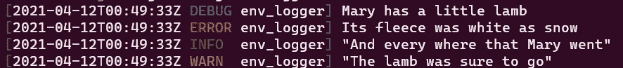
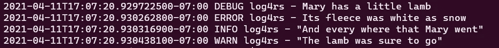

# 铁锈伐木

> 原文：<https://medium.com/nerd-for-tech/logging-in-rust-e529c241f92e?source=collection_archive---------0----------------------->

在本文中，我想谈谈 Rust 中的日志记录。有了一些背景信息，我将带您浏览两个日志库:env_logger 和 log4rs。最后分享一下我的推荐和 github for snippets。

# 背景

[log](https://docs.rs/log/) create 是 Rust 中事实上的日志 API。有五个日志级别:错误(最高优先级)、警告、信息、调试和跟踪(最低优先级)。要记录消息，可以使用相应的日志 marcos: error！，警告！等。这些马科斯表现得像 println！并且支持[格式的语法！](https://doc.rust-lang.org/std/fmt/)。也就是说，{}调用显示在一个对象上，{:？}对对象调用 debug，并且{:#？}漂亮地打印调试格式。(后面我们会看到一些例子。)

一个重要的注意事项是，log crate 只提供 API，不提供实现。您必须选择一个实现记录器的库。那么，Rust 中最常用的日志库是什么呢？

# 图书馆

## 环境记录器

到目前为止，Rust 中最常用的日志库是 [env_logger](https://docs.rs/env_logger/) crate。在 [crates.io](https://crates.io/crates/env_logger) 上，env_logger 的总下载量已经超过了 2300 万次。通过代码中的一行配置，`env_logger::init()`，这个简单的库将您的所有日志写到`stderr`(可配置为`stdout`)。顾名思义，env_logger 使用环境变量 RUST_LOG 来配置其日志级别。例如，`RUST_LOG=debug cargo run --bin env_logger`记录由`env_logger`二进制文件在调试级别或以上发出的所有内容，即除了跟踪之外的所有内容。

这个简单的 rust 程序将它们联系在一起:

```
use log::debug;
use log::error;
use log::info;
use log::warn;fn main() {
    env_logger::init();
    debug!("Mary has a little lamb");
    error!("{}", "Its fleece was white as snow");
    info!("{:?}", "And every where that Mary went");
    warn!("{:#?}", "The lamb was sure to go");
}
```

以下是输出:



此外，还有其他一些构建在 env_logger 之上的库。例如， [pretty_env_logger](https://docs.rs/pretty_env_logger) 和 [json_env_logger](https://docs.rs/json_env_logger) 板条箱。如果你想把你的日志打印出来或者把你的消息记录成 json 而不是文本，你会发现它们很有用。

## log4rs

这个 [log4rs](https://docs.rs/log4rs) 机箱是仿照 Java 的 [log4j](https://logging.apache.org/log4j/2.x/) 库设计的。要开始日志记录，您必须创建一个 appender，它告诉日志到哪里:控制台、文件或 syslog。在生产系统中，您几乎总是希望使用滚动文件附加器。滚动文件附加器根据时间生成一个新的日志文件，比如每小时。这很自然地按时间组织你的日志文件，让你跳过任何不感兴趣的时间段，比如说，当你只想看发生在 4 月 15 日晚上 7 点的事情时。

然后，您需要配置要在系统中保留多少日志文件，通常是按存储大小(保留 300GB)或按保留时间(保留 30 天)。

这个 rust 程序将它结合在一起:(正如您所看到的，配置更加详细)

```
use log::error;
use log::info;
use log::warn;
use log::{debug, LevelFilter};
use log4rs::append::console::ConsoleAppender;
use log4rs::config::{Appender, Root};
use log4rs::Config;fn main() {
    let stdout = ConsoleAppender::builder().build(); let config = Config::builder()
        .appender(Appender::builder().build("stdout", Box::new(stdout)))
        .build(Root::builder().appender("stdout").build(LevelFilter::Trace))
        .unwrap(); let _handle = log4rs::init_config(config).unwrap(); debug!("Mary has a little lamb");
    error!("{}", "Its fleece was white as snow");
    info!("{:?}", "And every where that Mary went");
    warn!("{:#?}", "The lamb was sure to go");
}
```

以下是输出:



# 结论

我的建议是从简单的开始— [env_logger](https://docs.rs/env_logger) 。如果你对你的业余项目越来越认真，切换到 [log4rs](https://docs.rs/log4rs) 以获得更好的解决问题的能力。

我把这些例子放在 github 的 [rust-logging-samples](https://github.com/j4ckcyw/rust-logging-samples) 下。请随时向我发送添加更多库的请求。如果你对这个话题感兴趣，也可以在 [twitter](https://twitter.com/jackchan_1) 上关注我。