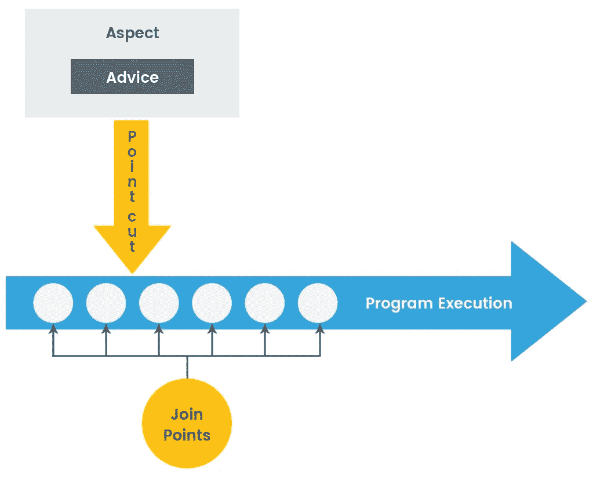

# 伐木变得容易

> 原文：<https://medium.com/nerd-for-tech/logging-made-easy-30bd10effa65?source=collection_archive---------1----------------------->

日志已经成为任何应用程序不可或缺的一部分，无论是 web 服务还是独立的应用程序。适当的日志语句是调试器和程序员的金矿，他们会研究由其他开发人员开发的代码。

有许多使用日志的情况，但是日志的主要用途如下:

*   它有助于跟踪错误，从而节省了修复错误的时间。
*   当一个程序突然终止时(这不是一个理想的用例，但还是会发生！)，基于日志语句，我们可以看到在应用程序关闭之前执行了哪个方法或类。
*   通过记录处理整个方法所需的时间来分析任何方法的性能。

错误日志是最常用的日志，它们大多写在 catch 块中。这些包含导致应用程序终止的错误消息。

现在对于场景**二**和**三**开发人员通常在方法/块的开始写一个日志语句，然后在方法结束时结束。这个过程对类中出现的几乎所有方法都重复。如果我说我们使用 Spring AOP(**A**SPECT**O**oriented**P**programming)有一个更简单的解决方案呢？。

*Spring 的面向方面编程*提供了一种简单的方法来包装方法或类的功能，从而充当拦截器(为了便于解释，我们称之为拦截器)，它在方法执行之前/之后实现自己。



Spring AOP 术语

*   **建议**——指拦截器需要实现的功能
*   **点截**——指拦截器需要被调用的点。
*   **连接点**——指特定方法或逻辑的执行发生变化的点。从而充当两个不同执行之间的连接点，因此命名为“连接点”。

所以现在让我们实现一个简单的 Spring Boot Web 服务，它使用 AOP 创建用户定义的注释来打印带有和不带有方法参数的入口/出口日志程序。

> ***第一步***

首先，我们需要添加 AOP 依赖。我使用的是 Gradle 项目，相应的依赖关系可以在网上找到[这里](https://mvnrepository.com/artifact/org.springframework.boot/spring-boot-starter-aop/2.2.6.RELEASE)

> ***第二步***

```
@Target(ElementType.*METHOD*)
@Retention(RetentionPolicy.*RUNTIME*)
public @interface SimpleLogger {
}
```

*   我们需要定义一个用户定义的注释。
*   使用这个注释，我们可以指定哪个方法需要一个入口/出口记录器。

> ***第三步***

```
@Around("@annotation(com.medium.example.logger.SimpleLogger)")
public Object entryExitLog(ProceedingJoinPoint proceedingJoinPoint) throws Throwable {
    final Logger logger = LoggerFactory.*getLogger*(ServiceAspect.class.getName());
    logger.info(">>> Enter {} {} ", proceedingJoinPoint.getSignature().getDeclaringTypeName(), proceedingJoinPoint.getSignature().getName());
    Object proceed = proceedingJoinPoint.proceed();
    logger.info("<<< Exit {} {} ", proceedingJoinPoint.getSignature().getDeclaringTypeName(), proceedingJoinPoint.getSignature().getName());
    return proceed;
}
```

*   定义建议。这是指使用上面创建的注释时需要实现的逻辑
*   *'@Around'* 这里意味着我们需要在方法(将由 *simpleLogger 注释)、*执行开始时和方法执行结束前实现逻辑。因而*围绕*这个方法展开。
*   类似地，也实现了*参数化记录器*的逻辑。除了入口/出口记录器之外，这将打印传递给该方法的参数。
*   *proceedingJoinPoint* 对象包含已被注释的方法的细节，因此我们可以从 *proceedingJoinPoint 中存在的*签名对象*中导出类名(getDeclaringTypeName)和方法名(getName())。*
*   带注释的方法的方法参数也可以从 *proceedingJoinPoint 对象中提取。*

> ***第四步***

```
@Service
public class LoggerService {

    @SimpleLogger
    public void simpleLogging(){

    }

    @ParameterisedLogger
    public String parameterisedLogging(String name) {
        return "Hello "+name;
    }
}
```

*   我们使用自己创建的注释来注释这些方法。
*   这里我们有一个简单的服务类，它没有自己的日志记录语句，只有注释。

> R ***结果***

```
>>> Enter com.medium.example.service.LoggerService simpleLogging
<<< Exit com.medium.example.service.LoggerService simpleLogging
>>> Enter com.medium.example.service.LoggerService parameterisedLogging with parameters [medium]
<<< Exit com.medium.example.service.LoggerService parameterisedLogging
```

*   可以看到，我们为服务打印了日志记录语句。
*   简单日志记录器和参数化日志记录器都是可见的，并且作为入口/出口日志记录器工作，服务中不存在任何日志记录器语句。

> C ***结论***

因此，我们可以通过定义简单的注释来处理入口/出口日志，从而非常容易地减少代码行。这不仅会增强代码的可读性，还会提高效率，因为我们不需要在每个类中声明 logger 对象。

类似地，我们可以使用相同的概念来分析该方法的性能。我们可以声明一个单独的注释，并用它加入一个通知。因此，无论什么时候需要，我们都可以为我们想要的任何方法使用那个性能注释。