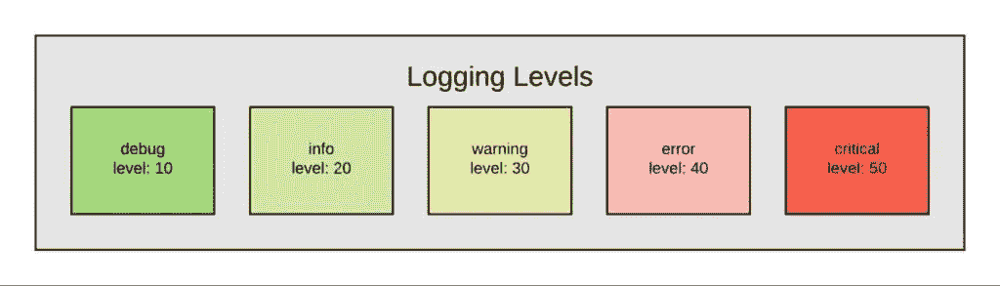
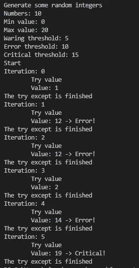
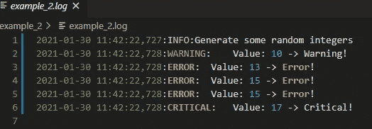
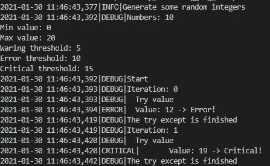

# 使用 Python 中的日志记录进行日志记录

> 原文：<https://medium.com/nerd-for-tech/logging-with-logging-in-python-d3d8eb9a155a?source=collection_archive---------2----------------------->

## 日志意味着跟踪你运行软件时发生的事件

[https://www . code motion . com/magazine/dev-hub/big-data-analyst/log-in-python-a-broad-gentle-introduction/](https://www.codemotion.com/magazine/dev-hub/big-data-analyst/logging-in-python-a-broad-gentle-introduction/)

在 Python 中，最简单的方法是在代码需要执行想要跟踪的动作时使用 print()语句。如果您需要一些更高级的日志记录(例如，将日志保存在文件或数据库表中)，最简单的方法是使用[日志记录](https://docs.python.org/3/library/logging.html)

另一个需要考虑的问题是:什么时候必须使用日志记录 vs 引发异常？简而言之，一如既往，这取决于你必须做什么。软件应该如何运行？错误是否严重到不能/不应该采取进一步措施？在这种情况下，例外是预期的行为。即使我们有任何错误，是否可以继续执行代码？好的，在这种情况下，让我们继续跟踪，我们得到了一些错误，但让我们继续执行代码。reddit 上关于这个[话题](https://www.reddit.com/r/learnpython/comments/9l0aqb/when_should_i_use_loggererror_vs_raise_exception/)的讨论非常有趣

本示例的设置:让我们生成随机整数，并假设生成的值必须符合某些阈值，这些阈值指示某个值是警告、错误还是严重错误

让我们考虑 3 个例子:

*   例 1:让我们使用 print()来记录代码中发生的事情
*   示例 2:以示例 1 为基础，让我们使用日志模块
*   示例 3:以示例 2 为基础，让我们以不同的方式跟踪不同的错误级别。在本例中，我还创建了 SQLiteHandler.py 来记录 SQL 表上的错误消息

示例 1

这是一个基本示例:我们使用 print()来记录控制台上代码的每一步

示例 1.py 执行

示例 2

在这个例子中，我们使用日志记录的基本配置将代码的步骤保存在一个文件中。消息有不同的级别(调试、信息、警告、错误和严重)。通过更改 basicConfig()中的级别，我们可以更改我们记录的起始级别

示例 2.log

示例 3

在这个例子中，我们为不同的日志记录级别设置了不同的处理程序，我们还使用模块 SQLiteHandler 在 SQL 表上记录从信息级别开始的消息

让我们来看看 SQLiteHandler 模块:它基于 Yarin Kessler 的 [sqlite_handler.py](https://gist.github.com/ykessler/2662203#file_sqlite_handler.py) 。使用一个**属性列表**我们可以选择我们想要记录的信息(它们将是日志表中的列)。在这个例子中，我使用的是 SQLite，但是对于我们想要使用的任何其他数据库，以同样的方式设置另一个处理程序是非常简单的

当然，如果您更改了**attribute _ list**，记得删除/创建该表，或者在数据库上做一些事情来管理这种更改，否则当您试图在日志表中保存一条记录时，会因为列不匹配而出现错误

例 _3.py 执行

如果我们检查日志表，我们将只看到信息、错误和关键消息；如果我们检查 **example_3_error.log** ，我们将只看到错误和关键消息；如果我们检查 **example_3_critical.log** ，我们将只看到关键消息

**注意:**代码可以在这个 github [仓库](https://github.com/simonerigoni/logging_examples)中找到