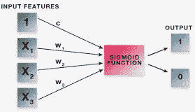
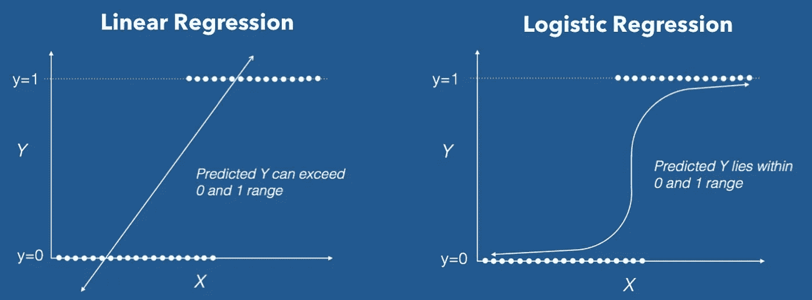
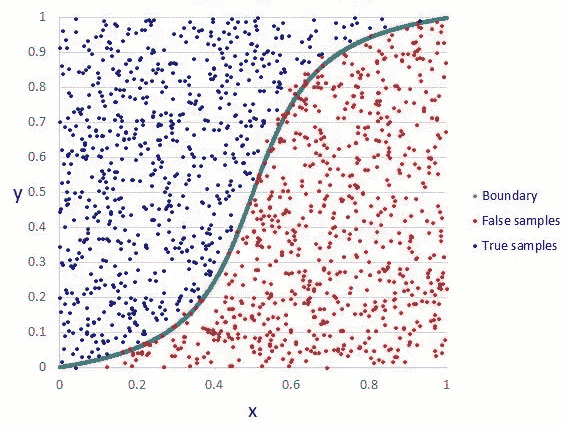

# 逻辑回归入门🤔

> 原文：<https://medium.com/nerd-for-tech/logistic-regression-18c126a94460?source=collection_archive---------2----------------------->

## 逻辑回归算法简介


卢克·切瑟在 [Unsplash](https://unsplash.com/s/photos/charts?utm_source=unsplash&utm_medium=referral&utm_content=creditCopyText) 上的照片

# 介绍

逻辑回归是一种**监督学习算法，广泛用于分类。**它用于**预测给定一组独立变量的二元结果(1/ 0，是/否，真/假)。**为了表示二元/分类结果，我们使用**虚拟变量。**

逻辑回归使用一个方程作为表示，非常像线性回归。它与线性回归没有太大的不同，除了在线性回归方程中拟合了一个***s 形*** **函数**。



逻辑回归

**一元线性和多元线性回归方程:**

```
y = b0 + b1x1 + b2x2 + ... + e
```

**乙状结肠功能:**

```
*p* = 1 / (1 + e ^ -(y))
```

**逻辑回归方程:**

```
p = 1 / (1 + e ^ -(b0 + b1x1 + b2x2 +... + e))
```

在哪里，

p 是**结果的概率**

y 是**预测输出**

b0 是**偏差或截距项**

输入数据中的每一列都有一个关联的 b **系数**(一个常量实值)，必须从训练数据中学习。

# **线性回归和逻辑回归的区别:**

*   在线性回归中，目标是一个**连续(实值)**变量，而在逻辑回归中，目标是一个**离散(二元或有序)**变量。
*   线性回归情况下的预测值是目标变量在输入变量给定值下的**平均值。而逻辑回归中的预测值是在输入变量的给定值下目标变量的特定水平的**概率**。**



# **逻辑回归的类型:**

1.**二元逻辑回归**:目标变量只有**两种可能的结果。**例如，将电子邮件分类为垃圾邮件或非垃圾邮件。

2.**多项逻辑回归:**目标变量有**三个或三个以上类别，没有排序。**例如，预测哪种食物更受欢迎(素食、非素食、纯素食)

3.**有序逻辑回归:**目标变量**有三个或三个以上有排序的类别。**例如，从 1 到 5 的电影分级。

# ***决定边界***

为了预测数据属于哪一类，可以设置一个**阈值**。基于该阈值，将所获得的估计概率分类。这个阈值被称为**决策边界**。

比如说，如果 predicted_value ≥ 0.5，那么将邮件归类为垃圾邮件，否则归类为非垃圾邮件。

**决策边界可以是线性的，也可以是非线性的。**多项式阶数可以增加，以得到复杂的决策边界。



逻辑回归中的决策边界

# **线性回归的优点:**

1.  它使得**没有关于类别**在特征空间中的分布的假设。
2.  **容易扩展到多个类**(多项式回归)。
3.  类别预测的自然概率观点。
4.  **训练快，对未知记录分类非常快。**
5.  对于许多简单的数据集具有良好的准确性。
6.  抗过度拟合。

# **逻辑回归的缺点:**

1.  它**不能处理连续变量**。
2.  如果自变量与目标变量不相关，那么逻辑回归不起作用。
3.  **需要大样本量**才能获得稳定的结果。

# **逻辑回归假设:**

1.  二元逻辑回归**要求因变量为二元**。
2.  因变量不是用比率来衡量的。
3.  应该只包括有意义的变量。
4.  **自变量应该是相互独立的。**也就是说，模型应该很少或没有多重共线性。
5.  逻辑回归**需要相当大的样本量。**