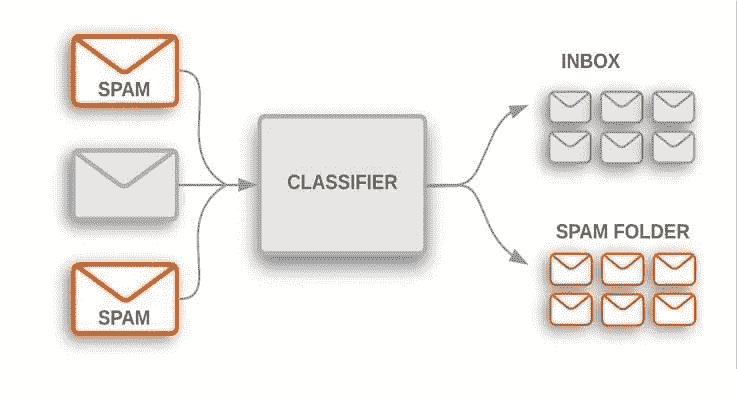
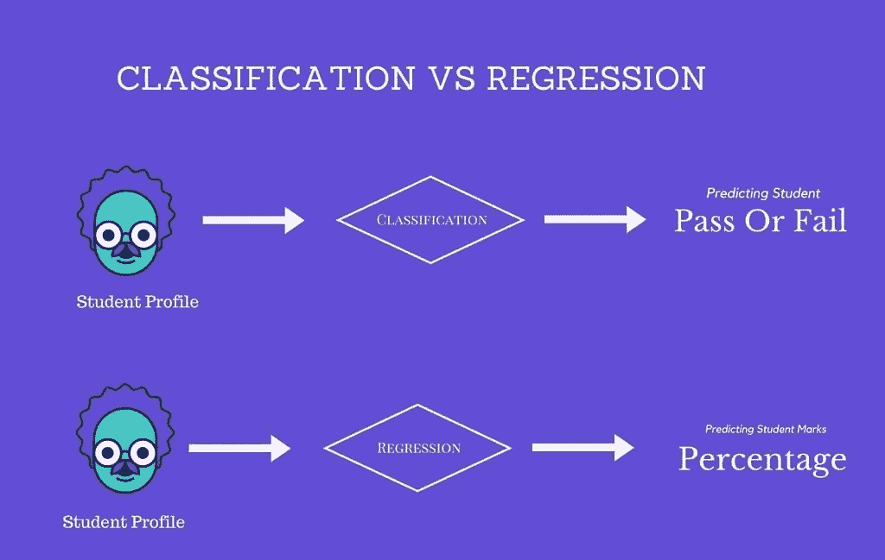
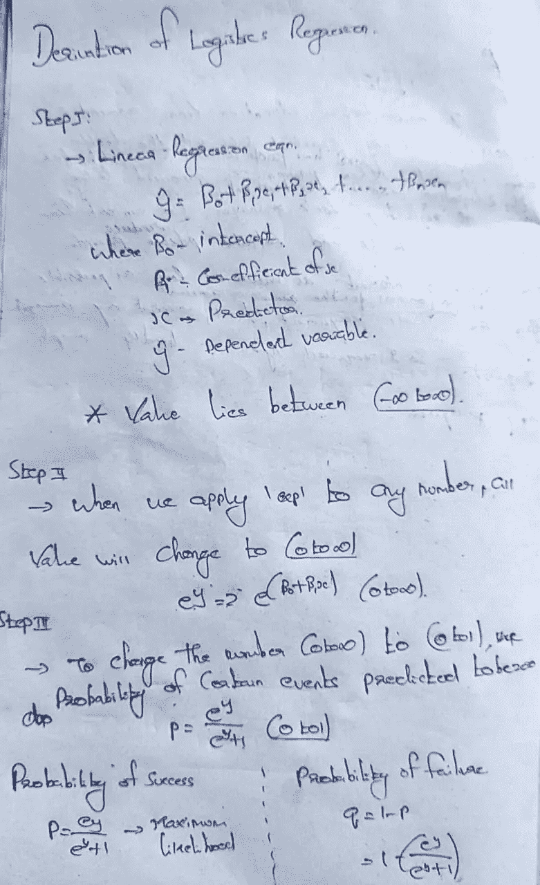
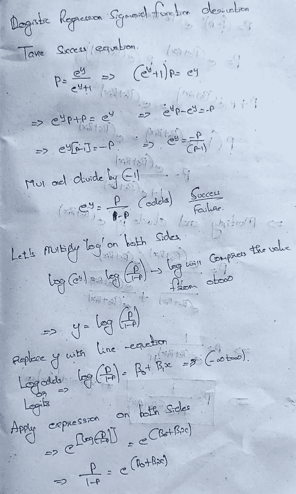
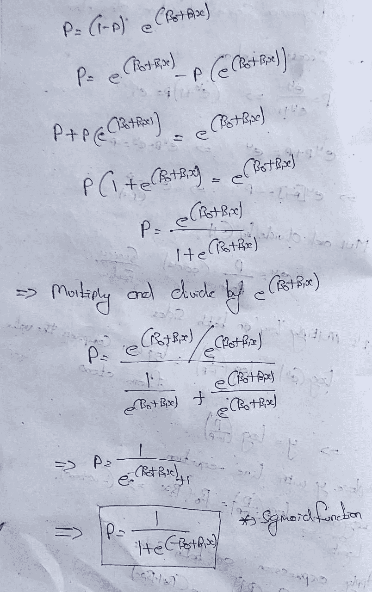
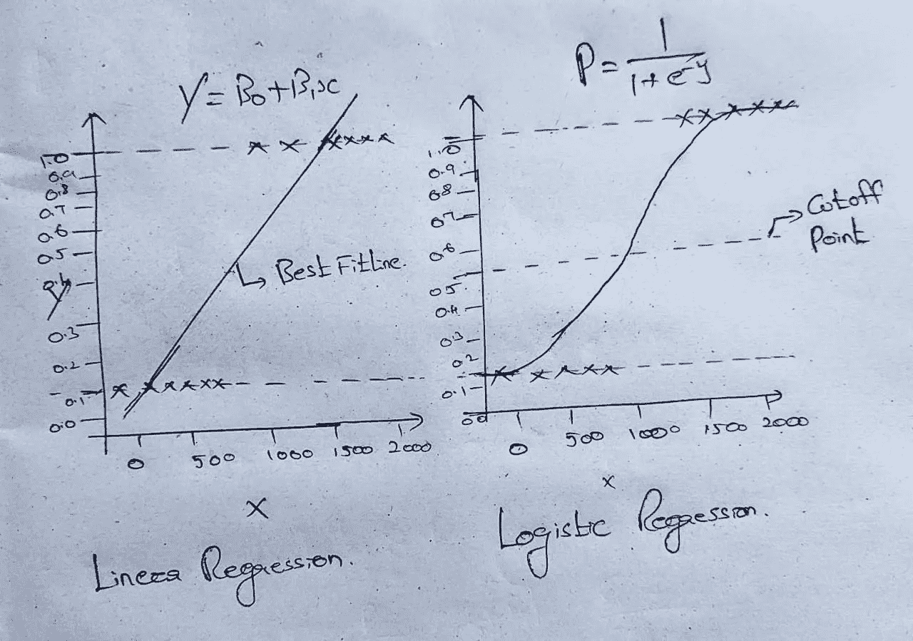

# 逻辑回归

> 原文：<https://medium.com/nerd-for-tech/logistic-regression-25d1f5eff4ab?source=collection_archive---------16----------------------->

图 1:分类算法

线性回归适用于连续变量预测。例:学生分数的预测。

逻辑回归适用于离散变量预测。预测学生的及格或不及格。

图 2:分类与回归

**当因变量(目标)为分类变量时，使用逻辑回归**。

例如:

→预测邮件是垃圾邮件(0)还是火腿(1)。

→预测在线交易欺诈(0)或不欺诈(1)。

→疾病诊断编号(0)或是(1)。

考虑一个场景，我们需要对一封电子邮件是否是垃圾邮件进行分类。如果我们对这个问题使用线性回归，就需要设置一个阈值，根据这个阈值可以进行分类。比方说，如果实际类别是恶性的，预测连续值为 0.4，阈值为 0.5，则数据点将被分类为非恶性的，这会导致实时的严重后果。

从这个例子可以推断，线性回归不适合分类问题。线性回归是无限的，这就带来了逻辑回归。它们的值严格地在 0 到 1 之间。

你可能会想，既然在分类问题中使用了回归这个名称，为什么它会出现在逻辑回归中呢？线性回归概念是逻辑回归的基础，它基于线性回归公式形成 sigmoid 函数，为分类任务设置阈值。

**推导 Sigmoid 函数:**

图 3:逻辑回归推导第 1 部分

图 4:逻辑回归推导第 2 部分

图 5:逻辑回归推导第 3 部分

图 6:线性回归与逻辑回归。

*   如果我们使用线性回归的最佳拟合线来解决分类问题，我们将得到不正确的值。所以我们应用 sigmoid 函数来预测离散值。
*   在 sigmoid 函数中，它有一个阈值。例如:将阈值指定为 0.5。如果最终值大于 0.5，将被归类为 1。如果该值低于 0.5，将被归类为 0。

例如:参考这个 GitHub 链接，获得逻辑回归的解决示例。

[https://github . com/rishikumar 04/Data-Science-Training/blob/main/class ification % 20 problems/02-logistics % 20 regression % 20 project . ipynb](https://github.com/Rishikumar04/Data-Science-Training/blob/main/Classification%20Problems/02-Logistic%20Regression%20Project.ipynb)