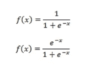
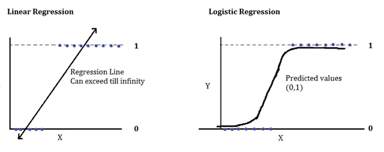
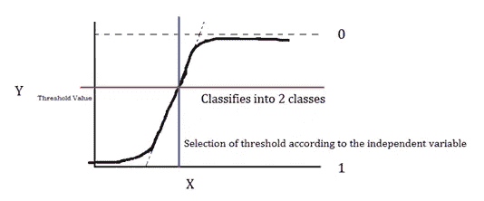
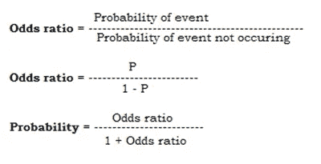
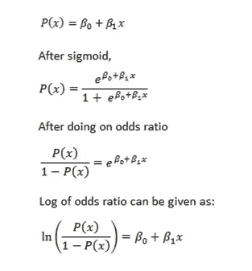
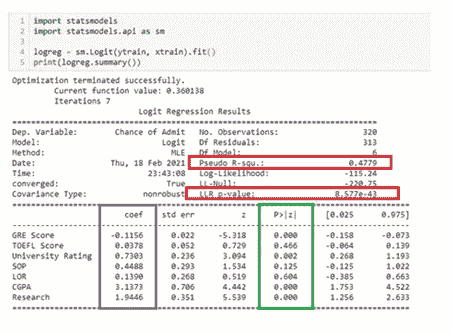

# 什么是逻辑回归？

> 原文：<https://medium.com/nerd-for-tech/logistic-regression-9a9112144da0?source=collection_archive---------14----------------------->

如果预测是“是/否”或“真/假”,我们通常使用这种算法，它最终声明为 1 或 0。最重要的是，我们看到了一个类优于另一个类的可能性。这里的经验法则是，逻辑回归不能用于具有两个以上类别的数据。

在线性回归中，预测是在范围(-无穷大，无穷大)内进行的，但是在逻辑回归的情况下，预测数被调整为位于(0，1)之间，这是通过使用 sigmoid 函数将回归线转换为 sigmoid 线来实现的。

上面的公式是 sigmoid 函数，其中线性回归线被转换为 sigmoid 线。

因此，我们得到的曲线为:

线性/逻辑回归

无穷大范围已变为 0–1。这里我们只预测是/否或真/假为 0/1，因此我说逻辑回归对超过 2 类的预测失败。并且通过适当的阈值来声明类别的划分。

分类阈值选择

两个类别是根据它们各自在 x 轴上的值具体划分的。蓝线显示 x 轴值，这有助于确定阈值范围，y 轴上的红线将类分类到分区中。精确度取决于 y 轴值，但最终对于线性数据，x 轴显示选择的方向。在逻辑回归中，有一些重要的因素，实际上是通过这些因素进行分析的。

**所有工作由 4 个独立的概念完成:**

1.概率:概率只不过是事件或类别发生的机会。而且概率肯定是受离群值影响的。我们得到的概率范围是(0，1)。要将值缩放到这个范围内，可以这样做，但较小的值将在非常低的小指数中急剧下降。它们将是不可理解的。为了解决这个问题，数学家们选择了比值比的方法。

2.比值比:那么比值比给出(0，无穷大)范围内的值。再次，无穷大使得数值有点不可理解，因此数学家再次决定对比值比做对数运算。

3.比值比的对数:该方法给出(0，无穷大)范围内的值。为了避免逻辑回归的类预测不正确，我们使用 Sigmoid 函数。

4.Sigmoid 函数:Sigmoid 函数将(-无穷大，+无穷大)范围内的所有值弯曲到(0，1)中。现在预测被精确地定义了。

这是逻辑回归背后的一点数学知识，对理解它的基础非常重要。我们正在精确地处理我们的回归线，因为我们可以看到方程中的 y 项。这就是逻辑回归的工作原理，它将任何类别分为 1 或 0。正如我们在简单线性回归中有模型汇总表一样，我们甚至在分类分析中也有相同的汇总表。我们只是在这里总结不同的推论。

模型汇总表

这里我们采用汇总表的推断，即伪 R-squ 证明了模型的准确性，其中 LLR p 值表明至少一个特征对模型有贡献，因为 p 值< 0.05, blue mark shows the impact of features into the model while green mark gives the explicit explanation of each feature’s contribution. The same way we predict here as well.

**优点:**

逻辑回归更容易实现

这种模型通常用于偶然的场景。

对班级进行分类是一种很快的方法。

当特征是线性可分的时，它是非常有效的，并且它避免了过度拟合。

如果我们修改算法，我们可以将其扩展到多类分类，这也称为多项式逻辑回归。

**缺点:**

对于高维数据，该算法可能会面临过拟合。

如果数据是非线性的，就不能使用逻辑回归。

如果自变量中存在多重共线性，情况就变得复杂了。

这是好的，因为它具有重要的、起作用的特征。包含不必要的特征可能会影响模型精度。

这个模型对异常值非常敏感。

为了预测一个好的结果，这个模型需要一个大的数据集来学习。

**应用:**

电子邮件:垃圾邮件/非垃圾邮件

网上信用卡交易:欺诈(是/否)