# 逻辑回归——历史、理论和数学

> 原文：<https://medium.com/nerd-for-tech/logistic-regression-the-history-the-theory-and-the-maths-c8d7a55b3729?source=collection_archive---------0----------------------->

欧文·比尔德在 [Unsplash](https://unsplash.com?utm_source=medium&utm_medium=referral) 上的照片

Logistic 回归是[广义线性模型](https://en.wikipedia.org/wiki/Generalized_linear_model#Linear_regression)的一个特例，与线性回归属于同一组。逻辑回归主要用于模拟结果的概率，而不是结果本身。

因为它可以模拟概率，我们也可以用它来分类事件，如通过/失败，癌症/非癌症等。在通过概率阈值(在二进制类的情况下通常为 0.5)之后，因此它也被称为分类算法

# 一点历史

逻辑回归的最早变体是罗纳德·费雪[的线性判别分析(LDA)](https://en.wikipedia.org/wiki/Ronald_Fisher)。

LDA，一种在[统计](https://en.wikipedia.org/wiki/Statistics)和其他领域中使用的方法，用于寻找特征的[线性组合](https://en.wikipedia.org/wiki/Linear_combination)，其表征或分离两类或更多类的对象或事件。

LDA 和逻辑回归之间的主要区别是假设独立变量是正态分布的，这是 LDA 的一个基本假设。

# 什么是逻辑回归？

逻辑回归算法基本上用于模拟结果的概率，即某事发生的可能性有多大。你会通过还是失败，某人是否患有癌症等等。，这样的事情可以根据数据给出一个 0 到 1 之间的概率值。

这也是逻辑回归方法与线性回归方法的主要区别。在前一种情况下，我们试图对可能是连续变量的结果进行建模，在后一种情况下，我们对总是在 0 和 1 之间的概率进行建模。

# **为什么不用线性回归？**

问题陈述:-我们有一个二元输出变量 Y(癌症是或否)，我们希望将概率(P)建模为 X(我们的输入，即肿瘤大小)的函数。

最明显的想法是让概率 Y=1，即癌症，是 X 的线性函数，就像线性回归一样。X 分量的每一个增量都会给概率增加或减少很多。

这是个坏主意，原因有二。一个是概率必须在 0 和 1 之间，但是我们的线性函数不一定遵守这一点，即使他们得到的所有观察到的 Y 不是 0 就是 1。另一个是，通过更明确地对概率建模，我们可能会更好地利用我们试图估计概率的事实。此外，在许多情况下，我们凭经验看到“收益递减”——当 p 已经很大(或很小)时，改变相同数量的概率(p)需要 x 有更大的变化。线性模型做不到这一点。

如果我们假设 x 的概率的对数是 x 的线性函数，这是不成立的，因为对数在两个方向上不是无界的，而我们的线性函数将是无界的。对此有一个解决方案

让我们假设 p 的对数几率是 x 的线性函数(对数几率在两个方向上都是无界的)

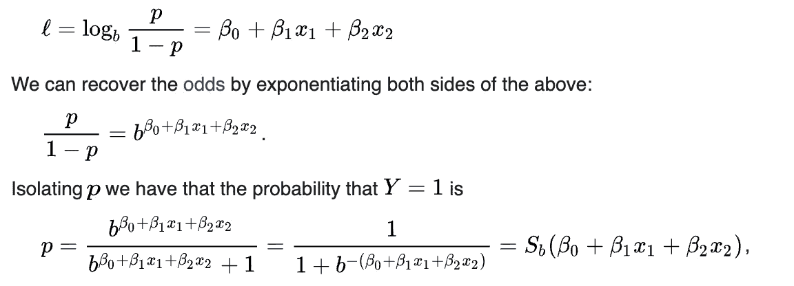

这是使用对数几率导出的**逻辑函数**(或臭名昭著的“S”曲线)，它将每个真实值压缩到 0 到 1 的范围内(非常适合模拟概率)

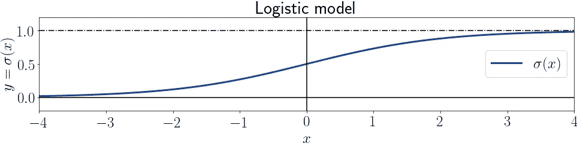

[https://www . Java point . com/linear-regression-vs-logistic-regression-in-machine-learning](https://www.javatpoint.com/linear-regression-vs-logistic-regression-in-machine-learning)

我们基本上要做的是，取一条直线，穿过我们的 sigmoid 激活函数。我们如何得到这个模型的参数我们将在后面学习

# **我们如何拟合曲线或者如何找到我们的参数？**

要回答这个问题，我们需要理解一些概念

a.概率分布

概率分布是描述获得随机变量可能取值的可能性的统计函数。换句话说，变量的值基于潜在的概率分布而变化。

1.正态分布/高斯分布

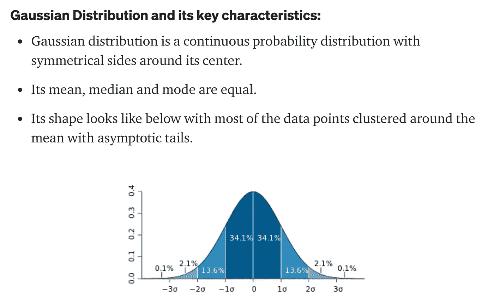

该分布有两个参数，SD(𝜎和 mean(𝜇

**释义:**

*   约 68%的正态分布值位于平均值的 1𝜎内
*   约 95%的正态分布值位于平均值的 2𝜎内
*   约 99.7%的正态分布值位于平均值的 3𝜎内

观察由高斯分布产生的单个数据点 *x* (给定 SD(𝜎)和*、*的概率密度由下式给出

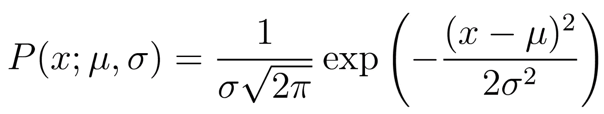

2.二项式分布

当试验正好有两个互斥结果时，使用二项分布(非常适合逻辑回归)。这些结果被恰当地标记为“成功”和“失败”。二项分布用于获得在 *N* 次试验中观察到 *x* 次成功的概率，单次试验的成功概率用 *p* 表示。二项式分布假设 *p* 对于所有试验都是固定的。下面是二项式分布的概率分布函数

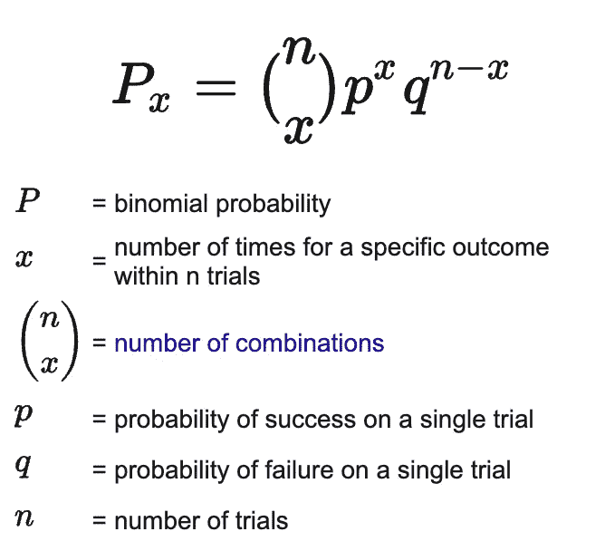

《出埃及记》假设你抛 5 个硬币，如果硬币是公平的，观察到 0 头像的概率是多少:- 5c0 * 0.5⁰ * 0.5⁵

b.最大似然估计([https://tinyurl.com/yckt66bt](https://tinyurl.com/yckt66bt))

在统计学中，最大似然估计是一种在给定一些观察数据的情况下估计假设概率分布的参数的方法。这是通过最大化似然函数来实现的，因此，在假设的统计模型下，观察到的数据是最可能的”

让我们继续高斯分布:-

给定具有 SD(𝜎和 mean(𝜇的高斯分布，我们有三个随机数 9、9.5 和 11。𝜎和𝜇的哪个值最大化随机数为 9、9.5 和 11 的概率？

让我们用概率密度函数来求随机数的联合概率。我们假设一个随机数的概率不影响其余数的概率。

这是在高斯分布中观察到 3 个数字的联合概率

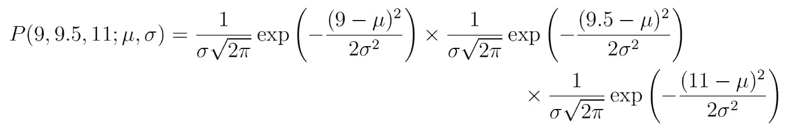

我们如何找到使概率最大化的参数？

差异化。我们可以找到最大值(或最小值)

为了便于区分，我们取两边的对数

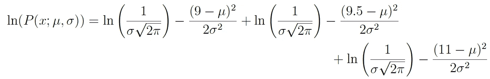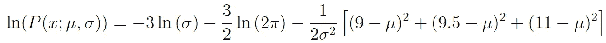

这个表达式可以求导以找到最大值。在这个例子中，我们将找到均值μ的极大似然估计。为此，我们取函数对μ的偏导数，给出

我们可以简单的把左边设为 0，求均值。我们可以为 SD 做同样的练习。

# **在逻辑回归的情况下，我们如何学习广义线性模型的参数？**

这通常通过[最大似然估计](https://en.wikipedia.org/wiki/Maximum_likelihood_estimation)来完成，我们通过[梯度上升](/p/e8333924b8a2)来进行。

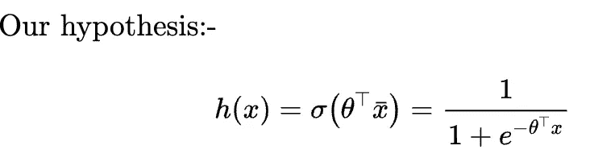

给定特定 X 作为输入，Y =1 的概率，模型参数 0:-

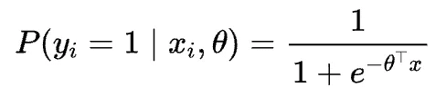

Y =0 的概率给定特定的 X 作为输入和模型参数 0(我们只是从 1 中减去它，因为一些概率是):-

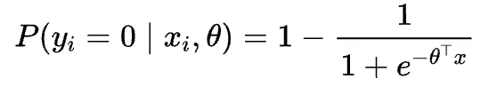

让我们结合这两种概率，下面的等式是伯努利分布的结果(伯努利分布是进行单次试验的[二项式分布](https://en.wikipedia.org/wiki/Binomial_distribution)的特例，因此对于这种二项式分布， *n* 将为 1)

给定特定 x 作为输入和模型参数∅:-时，y 的概率

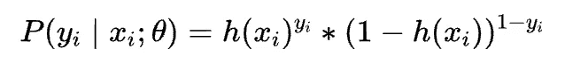

如你所见，如果 Y =1，等式的第二部分变为 1，我们得到 Y =1 的概率，即 h(x ),在 Y=0 的情况下，等式的第一部分变为 1，我们得到 Y =0 的概率，即 1- h(x)

让我们称所有的自变量为 X，所有的因变量为 Y，总观测值为 M，模型参数为θ，我们可以说:-

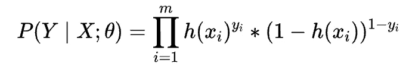

这就是著名的**似然函数或 L(θ)** 。为什么？因为我们在说，给定我们所有的数据点，参数为θ 的模型有多可信。

现在我们要做的是最大化似然函数。但是有一个问题，因为我们的 sigmoid 函数(我们通过它来乘以概率)并不总是凸的。解决方案是对数的，因为似然函数的对数总是凸的

所以我们能做的就是使用这个函数，做一个梯度上升来找到**最大似然估计**。为什么？似然函数是模型的似然性。如果我们直观地将它最大化，这意味着它是最合理的模型

让我们计算 L(θ)对θ的偏导数

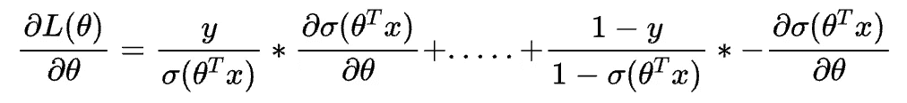

现在我们有一个共同的术语:—

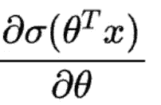

我们可以这样写:-

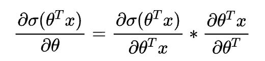

第一个术语相当于:-

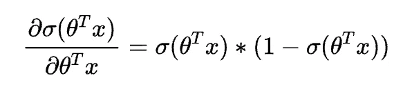

sigmoid 相对于其值的导数是 sigmoid 和 1- sigmoid 的乘积

第二项显然等于 x

如果你继续计算，你最终会得出:-

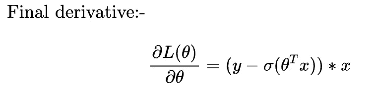

我们将使用这个方程来计算我们的[梯度上升](/p/e8333924b8a2)以找到参数θ，并且我们将得到我们的最佳逻辑回归模型

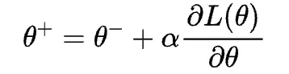

加号代表上升，alpha 是缩放参数

唷！很多数学，但我们现在完成了:)

# 逻辑回归假设:-

1:响应变量是二元的

2:观察值是独立的

3:解释变量和响应变量的 Logit 之间存在线性关系

与线性回归相比，逻辑回归不需要:

*   解释变量和响应变量之间的线性关系。
*   模型的残差服从正态分布。
*   具有恒定方差的残差，也称为[同方差](https://www.statology.org/heteroscedasticity-regression/)。

# 更多资源和引用:

1.  [https://www . stat . CMU . edu/~ cshalizi/uADA/12/lectures/ch12 . pdf](https://www.stat.cmu.edu/~cshalizi/uADA/12/lectures/ch12.pdf)
2.  [https://www . bael dung . com/cs/cost-function-logistic-regression-logarity-expr](https://www.baeldung.com/cs/cost-function-logistic-regression-logarithmic-expr)
3.  【https://www.youtube.com/watch?v=TM1lijyQnaI 
4.  [https://www . geo . fu-Berlin . de/en/v/soga/Basics-of-statistics/Logistic-Regression/The-Logit-Function/index . html](https://www.geo.fu-berlin.de/en/v/soga/Basics-of-statistics/Logistic-Regression/The-Logit-Function/index.html)

# 结束语:-

如果你想让我在下一篇文章中强调什么，请在评论中告诉我，也请随时通过 LinkedIn 联系我。如果你还有任何问题，我会尽力回复。

阅读我的其他文章:

1.  [https://medium . com/nerd-for-tech/a-primer-to-time-series-forecasting-58 bbd 91 CB 3 BD](/nerd-for-tech/a-primer-to-time-series-forecasting-58bbd91cb3bd)
2.  [https://medium . com/nerd-for-tech/从商业分析师到数据科学家-4720f536888d](/nerd-for-tech/from-a-business-analyst-to-a-data-scientist-4720f536888d)
3.  [https://faun . pub/a-primer-to-区块链和-the-crypto-world-964 e 48 ed 96 af](https://faun.pub/a-primer-to-blockchain-and-the-crypto-world-964e48ed96af)
4.  [https://medium . com/nerd-for-tech/linear-regression-the-history-the-theory-the-maths-e 8333924 b 8 a 2](/nerd-for-tech/linear-regression-the-history-the-theory-and-the-maths-e8333924b8a2)